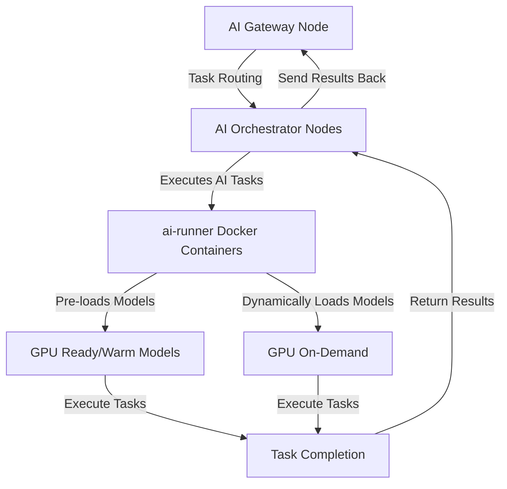

<Warning>
  The Livepeer _AI Video Subnet_ is in Alpha phase. Bugs or issues may be
  encountered. Contributions to improvement are appreciated - please report
  problems via the [issue
  tracker](https://github.com/livepeer/go-livepeer/issues/new/choose). Feedback
  is invaluable for enhancing the AI Subnet. Thank you for your contributions!
</Warning>

The new **AI Video Subnet**, henceforth referred to as the **AI Subnet**, is the
first step in bringing powerful AI video capabilities into the Livepeer network.
It enables video developers to add **generative AI features** such as
`text-to-image`, `image-to-image` and `image-to-video` conversions to their
applications, and allows node operators to **earn revenue by deploying their GPU
resources** for AI processing tasks. For an in-depth understanding of the AI
Subnet and its current capabilities, continue reading. Ready to dive in? Choose
one of the cards below to kickstart your journey with the AI Subnet.

## Kickstart Your Journey

<CardGroup cols={3}>
  <Card
    href="/ai/pipelines"
    title="AI Pipelines"
    icon="wand-magic-sparkles"
    iconType="duotone"
  >
    Explore the available AI pipelines.
  </Card>
  <Card title="Showcase" href="/ai/builders/showcase" icon="star">
    Explore projects built on the AI Subnet.
  </Card>
  <Card
    href="/ai/orchestrators/get-started"
    title="Set up AI Orchestrator"
    icon="robot"
    iconType="duotone"
  >
    Set up your AI Orchestrator node and earn fees from AI tasks.
  </Card>
  <Card
    href="/ai/gateways/get-started"
    title="Set up AI Gateway"
    icon="play"
    iconType="duotone"
  >
    Establish an AI Gateway to serve a broad customer base with AI tasks.
  </Card>
  <Card
    href="/ai/builders"
    title="Build your dApp"
    icon="screwdriver-wrench"
    iconType="duotone"
  >
    Develop your innovative dApp on the AI Subnet efficiently and at scale.
  </Card>
  {/* <Card
    href="/ai/contribute/overview"
    title="Contribute to AI Subnet"
    icon="heart"
    iconType="duotone"
  >
    Contribute to the AI Subnet and help shape the future of AI on Livepeer.
  </Card> */}
  <Card
    href="/ai/api-reference"
    title="AI API Reference"
    icon="rectangle-terminal"
    iconType="duotone"
  >
    Explore the AI Subnet API to integrate AI capabilities into your projects.
  </Card>

</CardGroup>

## Background on the AI Subnet

The AI Subnet, initially proposed in
[this SPE treasury proposal](https://explorer.livepeer.org/treasury/82843445347363563575858115586375001878287509193479217286690041153234635982713),
represents a significant evolution within the Livepeer ecosystem. This
**decentralized**, **open-source** framework seamlessly integrates a variety of
**generative AI inference** tasks, such as image and video generation and
upscaling, into the existing network infrastructure. These enhancements not only
strengthen the Livepeer Mainnet's transcoding services, celebrated for their
**low cost** and **high reliability**, but also pave the way for groundbreaking
applications across both emerging Web3 environments and established Web2
sectors.

Designed to revolutionize creative processes, the AI Subnet reflects Livepeer's
commitment to creating a **globally accessible open video infrastructure**. By
equipping video applications with advanced AI tools and diminishing reliance on
centralized computing resources, it extends **cutting-edge AI capabilities** to
a broader audience, fostering a more equitable digital landscape.

### Advantages of Livepeer's AI Subnet

- **Decentralization**: Enhances security and resilience by eliminating single
  points of failure.
- **Cost-Effectiveness:** Expected to provide AI inference capabilities at a
  significantly lower cost compared to traditional cloud services.
- **Scalability**: Easily scales in response to user demand, ensuring reliable
  service without interruptions.
- **Open-Source Innovation**: Encourages collaborative development, accelerating
  innovation and broadening the range of supported applications.

### How It Works

The AI Subnet, built on the established Livepeer network, leverages its
**decentralized payment infrastructure** for efficient AI inference task
execution. Here's a detailed overview of the system components and their
respective functions:

- **AI Orchestrator Nodes**: These nodes handle the execution of AI tasks. They
  keep AI models "warm" on their GPUs for immediate processing and can
  dynamically load models as tasks arrive, optimizing both response time and
  resource utilization.

- **AI Gateway Nodes**: These nodes manage the flow of tasks, directing them to
  the appropriate Orchestrator nodes based on capability and current load,
  ensuring efficient task allocation and system scalability.

The infrastructure is designed for **scalability**, enabling easy integration of
additional Orchestrator and Gateway nodes as demand increases. It relies on a
specialized [ai-runner Docker](https://hub.docker.com/r/livepeer/ai-runner)
Docker image to execute AI models, which simplifies the deployment and enhances
the scalability of new pipelines. Ongoing developments aim to enhance
**performance** and **broaden the container's capabilities** to support
increasingly complex AI models and custom user-defined pipelines. Below is a
streamlined diagram illustrating the AI inference pipeline within the Livepeer
AI Subnet:

This flow starts at the AI Gateway nodes, routing tasks to AI Orchestrator
nodes. These nodes execute tasks using ai-runner Docker Containers, which manage
AI models in two primary ways:

- **Pre-loaded Models**: Frequently used models remain 'warm' on GPUs, speeding
  up task processing.
- **Dynamically Loaded Models**: Other models are loaded on demand, allowing
  flexibility to handle various tasks.

After processing, results are returned to the Orchestrator nodes and sent back
through the Gateway nodes, completing the cycle. This architecture ensures the
AI Subnet is both **efficient** and **flexible**, ready to scale and adapt to
various AI applications.

### Explore Generative AI Pipelines

The AI Subnet hosts a variety of generative AI pipelines, each supporting
different models. Current offerings primarily utilize
[Diffusion models](https://huggingface.co/docs/diffusers/en/index). Plans are in
place to expand support to include other model types in future updates.

<Card
  href="/ai/pipelines"
  title="AI Pipelines"
  icon="wand-magic-sparkles"
  iconType="duotone"
>
  Dive into the [AI Pipelines](/ai/pipelines) page to learn more about each
  pipeline and the models they support.
</Card>

### Current Limitations and Future Directions

- **Alpha Phase**: The AI Subnet is currently in its Alpha phase, and users may
  encounter bugs or issues during this early stage. It is not yet meant to be
  used with high demand production workloads.
- **Supports Limited Set of Open-source Models**: The AI Subnet currently
  supports a limited set of AI models and pipelines that are open-source and
  available on [Hugging Face](https://huggingface.co/models). However, this
  range is gradually expanding with the goal of supporting any custom model in
  the future.
- **Only Higher VRAM GPUs Supported**: Currently, the AI Subnet requires GPUs
  with at least 16GB of VRAM to run AI inference tasks effectively. We are
  working to expand this support to lower VRAM GPUs in the future.

### AI Subnet Terminology

- **Mainnet Transcoding Network**: Comprises Orchestrator and Gateway nodes that
  perform or coordinate transcoding tasks.
- **AI Subnet (also known as AI Video Subnet)**: A specialized subnet within the
  Livepeer network designed for managing AI inference tasks.
- **Mainnet Transcoding Network Orchestrator**: A node that handles transcoding
  tasks within the Mainnet Transcoding Network. Often referred to as
  _Orchestrator_.
- **Mainnet Transcoding Network Gateway**: A node that routes transcoding tasks
  to the appropriate Orchestrator nodes. Often referred to as _Gateway_ and
  formerly known as Broadcaster.
- **AI Orchestrator**: A specialized node responsible for AI inference
  operations on the AI Subnet.
- **AI Gateway**: A specialized node that routes AI tasks to the appropriate AI
  Orchestrator nodes on the AI Subnet.
