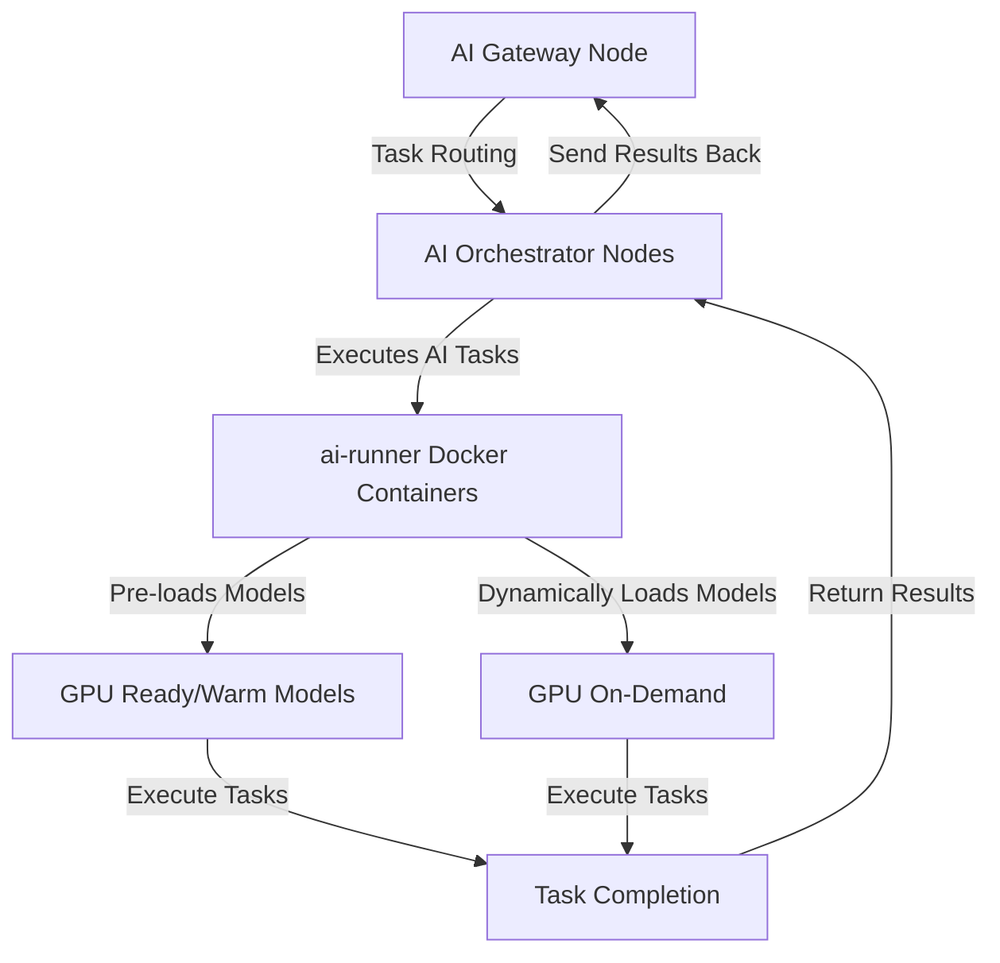

<Warning>
  **Notice:** The Livepeer AI Video Subnet is in Alpha phase. You may encounter
  bugs or issues. Please help us improve by reporting problems via our [issue
  tracker](https://github.com/livepeer/go-livepeer/issues/new/choose). Your
  feedback is invaluable as we enhance the AI Subnet. Thank you for your
  contributions!
</Warning>

The **AI Subnet** marks a pivotal expansion within the Livepeer ecosystem,
aligning perfectly with our mission to build the world's open video
infrastructure. Initially proposed in
[this SPE treasury proposal](https://explorer.livepeer.org/treasury/82843445347363563575858115586375001878287509193479217286690041153234635982713),
the AI Subnet introduces a **decentralized**, **open-source** framework that
facilitates the execution and of a diverse array of AI inference tasks. These
tasks integrated seamlessly within the Livepeer network include image and video
generation and upscaling. This innovative development not only leverages but
also extends the capabilities of the Livepeer Mainnet transcoding network, which
is renowned for its low cost and high reliability.

Equipping video applications with **cutting-edge AI tools**, the AI Subnet is
poised to transform creative processes in both the burgeoning web3 space and the
established web2 domains. Advancing towards our vision where all internet video
leverages Livepeer as an essential resource—akin to bandwidth or electricity—we
are committed to empowering developers and creators worldwide. This initiative
fosters the **cost-effective integration** of advanced AI tools into their
projects, reducing reliance on centralized compute providers and promoting
broader, more equitable access to AI capabilities.

### Kickstart Your Journey

<CardGroup cols={3}>
  <Card
    href="/ai/orchestrators/get-started"
    title="Setup AI Orchestrator"
    icon="robot"
    iconType="duotone"
  >
    Setup your AI Orchestrator and earn fees from AI tasks.
  </Card>
  <Card
    href="/ai/setup-gateway"
    title="Setup AI Gateway"
    icon="play"
    iconType="duotone"
  >
    Establish an AI Gateway to serve a broad customer base with AI tasks.
  </Card>
  <Card
    href="/ai/builders"
    title="Build your dApp"
    icon="screwdriver-wrench"
    iconType="duotone"
  >
    Develop your innovative dApp on the AI Subnet efficiently and at scale.
  </Card>
  <Card title="Showcase" href="/ai/build/showcase" icon="star">
    Explore projects built on the AI Subnet.
  </Card>
  <Card
    href="/ai/contribute/overview"
    title="Contribute to AI Subnet"
    icon="heart"
    iconType="duotone"
  >
    Contribute to the AI Subnet and help shape the future of AI on Livepeer.
  </Card>
  <Card
    href="/ai/api-reference"
    title="AI API Reference"
    icon="rectangle-terminal"
    iconType="duotone"
  >
    Explore the AI Subnet API to integrate AI capabilities into your projects.
  </Card>
</CardGroup>

### Advantages of Livepeer's AI Subnet

- **Decentralization**: Operating on a decentralized network, the AI Subnet
  enhances security, efficiency, and resilience by eliminating single points of
  failure. This robust infrastructure ensures seamless and reliable AI task
  processing across a distributed network.
- **Cost-Effectiveness**: By leveraging the decentralized architecture of the
  Livepeer network, the AI Subnet is poised to offer AI inference capabilities
  at a significantly lower cost than traditional cloud-based services. This
  affordability makes cutting-edge AI technologies accessible to a broader
  audience, democratizing advanced computing.
- **Scalability**: The AI Subnet is engineered to scale dynamically according to
  demand. It facilitates the seamless addition of new Orchestrators and
  Gateways, ensuring the network can adapt and grow as user needs evolve without
  service interruptions.
- **Open-Source Innovation**: Rooted in open-source principles, the AI Subnet
  fosters a collaborative environment that encourages innovation among
  developers. This community-driven development model speeds up enhancements and
  diversifies the applications and services the network can support.

### Current Limitations

- **Alpha Phase**: The AI Subnet is currently in its Alpha phase, and users may
  encounter bugs or issues during this early stage. It is not yet meant to be
  used with high demand production workloads.
- **Supports Limited Set of Open-source Models**: The AI Subnet currently
  supports a limited set of AI models and pipelines that are open-source and
  available on [Hugging Face](https://huggingface.co/models). This range is
  however slowely expanding with the aim to support any custom model in the
  future.
- **Only Higher VRAM GPUs Supported**: Currently the AI Subnet requires GPUs
  with at least 16GB of VRAM to run AI inference tasks effectively. We are
  working to expand this support to lower VRAM GPUs in the future.

### Available Generative Pipelines

The AI Subnet currently supports the following generative AI pipelines, all
employing [Diffusion models](https://huggingface.co/docs/diffusers/en/index):

- **Text-to-Image**: Converts textual descriptions into detailed images,
  leveraging the capabilities of
  [Diffusion models](https://huggingface.co/models?pipeline_tag=text-to-image).
- **Image-to-image**: This pipeline transforms images from one style to another,
  utilizing
  [Diffusion models](https://huggingface.co/models?pipeline_tag=image-to-image).
- **Image-to-video**: This pipeline generates short video clips from a text
  prompt or an initial image, employing
  [Diffusion models](https://huggingface.co/docs/diffusers/en/index).

Please refer to the [AI Subnet Pipelines](/ai/pipelines) page for additional
information on these pipelines and the supported diffusion models. Note that
while currently focused on Diffusion models, future expansions may include other
types of models to accommodate a broader range of tasks.

### How It Works

The AI Subnet operates seamlessly atop the established Livepeer network,
utilizing its robust, decentralized payment infrastructure to efficiently
facilitate AI inference tasks. Below is a streamlined overview of the system
components and their respective functions:

- **AI Orchestrator Nodes**: These nodes execute AI tasks and are tailored to
  support specific AI models. They maintain models "warm" on their GPUs for
  immediate processing or load them dynamically as tasks are received,
  optimizing response time and resource utilization.

- **AI Gateway Nodes**: These nodes manage the flow of tasks, directing them to
  the appropriate Orchestrators based on their capabilities and current load,
  ensuring efficient task allocation and system scalability.

The AI Subnet is designed for growth, seamlessly integrating additional
Orchestrators and Gateways as needed to meet increasing demand. The
infrastructure utilizes a specialized
[ai-runner Docker](https://hub.docker.com/r/livepeer/ai-runner) image to execute
AI models, simplifying the deployment and scalability of new pipelines and
models. Future enhancements will focus on improving the speed and expanding the
capabilities of this container to support more complex AI models and custom
user-defined pipelines.

Below is a streamlined diagram illustrating the AI inference pipeline within the
Livepeer AI Subnet:

This diagram succinctly visualizes the flow of tasks within the AI Subnet. Tasks
commence at the AI Gateway Nodes, where they are routed to the appropriate AI
Orchestrator Nodes. These nodes execute the tasks using ai-runner Docker
Containers, which manage AI models in two primary ways:

- **Pre-loaded Models:** Models that are frequently used remain 'warm' on the
  GPUs to expedite task processing.
- **Dynamically Loaded Models:** Other models are loaded as needed, providing
  flexibility to handle diverse task requirements.

After processing, the results are returned to the Orchestrator Nodes and sent
back through the Gateway Nodes, completing the cycle. This efficient and
flexible architecture ensures that the AI Subnet can scale and adapt to various
AI applications.

### AI Subnet Terminology

- **Mainnet Transcoding Network**: This network comprises Orchestrators and
  Gateways that perform or coordinate transcoding tasks on the mainnet.
- **AI Subnet**: A specialized subnet of the Livepeer network, consisting of AI
  Orchestrators and AI Gateways, engineered specifically for managing AI
  inference tasks on the mainnet.
- **Mainnet Transcoding Network Orchestrator**: A node that handles transcoding
  tasks within the _Mainnet Transcoding Network_. For simplicity, it's often
  referred to as _Orchestrator_ throughout the rest of the documentation.
- **Mainnet Transcoding Network Gateway**: A node that routes transcoding tasks
  to the correct Orchestrators for processing on the _Mainnet Transcoding
  Network_. For simplicity, it's often referred to as _Gateway_ throughout the
  rest of the documentation.
- **AI Orchestrator**: A specialized node tasked with carrying out AI inference
  operations on the _AI Subnet_.
- **AI Gateway**: A specialized node that routes AI tasks to the correct AI
  Orchestrators for processing on the _AI Subnet_.
