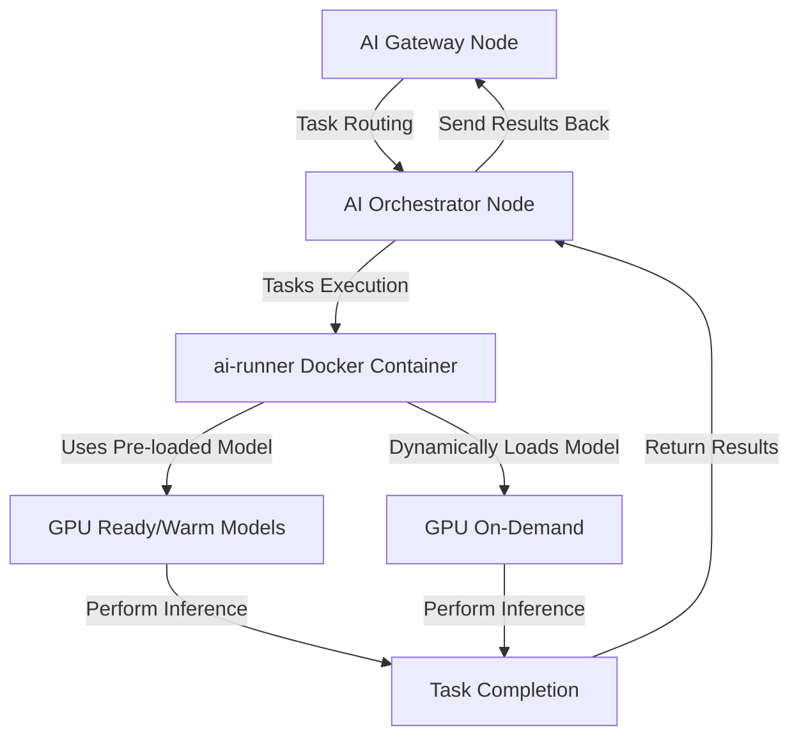

<Warning>
  The Livepeer AI network is in its **Beta** phase. Bugs or issues may be
  encountered. Contributions to improvement are appreciated - please report
  problems via the [issue
  tracker](https://github.com/livepeer/go-livepeer/issues/new/choose). Feedback
  is invaluable for enhancing the Livepeer AI network. Thank you for your
  contributions!
</Warning>

Livepeer AI, also known as the **Livepeer AI (Video) Network**, is the first step toward
bringing powerful AI video capabilities into the Livepeer network. It enables
video developers to add a rapidly growing suite of **generative AI features**
such as [text-to-image](/ai/pipelines/text-to-image),
[image-to-image](/ai/pipelines/image-to-image),
[image-to-video](/ai/pipelines/image-to-video), and
[upscaling](/ai/pipelines/upscale) to their applications. Livepeer Node
operators are able to **earn revenue by deploying their GPU resources** for AI
processing tasks. Ready to dive in? Choose one of the cards below to kickstart
your journey with the AI Subnet.

## Kickstart Your Journey

<CardGroup cols={3}>
  <Card
    href="/ai/pipelines"
    title="AI Pipelines"
    icon="wand-magic-sparkles"
    iconType="duotone"
  >
    Explore the available AI pipelines.
  </Card>
  <Card
    href="/ai/orchestrators/get-started"
    title="Set up AI Orchestrator"
    icon="robot"
    iconType="duotone"
  >
    Set up your AI Orchestrator node and earn fees from AI tasks.
  </Card>
  <Card
    href="/ai/gateways/get-started"
    title="Set up AI Gateway"
    icon="play"
    iconType="duotone"
  >
    Establish an AI Gateway to serve a broad customer base with AI tasks.
  </Card>
  <Card
    href="/ai/builders"
    title="Build Your App"
    icon="screwdriver-wrench"
    iconType="duotone"
  >
    Develop your innovative app on the AI Subnet efficiently and at scale.
  </Card>
  {/* <Card
    href="/ai/contribute/overview"
    title="Contribute to AI Subnet"
    icon="heart"
    iconType="duotone"
  >
    Contribute to the AI Subnet and help shape the future of AI on Livepeer.
  </Card> */}
  <Card title="Showcase" href="/ai/builders/showcase" icon="star">
    Discover projects built on the AI Subnet.
  </Card>
  <Card
    href="/ai/api-reference"
    title="AI API Reference"
    icon="rectangle-terminal"
    iconType="duotone"
  >
    Explore the AI Subnet API to integrate AI capabilities into your projects.
  </Card>
</CardGroup>

## Background on Livepeer AI

Livepeer AI, initially proposed in
[this SPE treasury proposal](https://explorer.livepeer.org/treasury/82843445347363563575858115586375001878287509193479217286690041153234635982713),
represents a significant evolution within the Livepeer ecosystem. This
**decentralized**, **open-source** framework seamlessly integrates a variety of
**generative image and video AI inference** tasks into the existing Livepeer
network infrastructure. These enhancements strengthen Livepeer's transcoding
services, celebrated for their **low cost** and **high reliability**, while also
paving the way for groundbreaking applications across both emerging Web3
environments and established Web2 sectors.

Designed to revolutionize creative processes, Livepeer AI reflects Livepeer's
commitment to creating a **globally accessible open video infrastructure**. By
striving to **democratize AI**, Livepeer AI empowers users to leverage any form
of image and video compute with advanced AI tools. By equipping video
applications with these tools and reducing reliance on centralized computing
resources, we are dedicated to extending **cutting-edge AI capabilities** to a
broader audience, fostering a more equitable digital landscape. Additionally, we
are committed to
[supporting open-source research](https://livepeer.notion.site/Livepeer-Grants-Program-f91071b5030d4c31ad4dd08e7c026526)
by funding researchers who develop in the open, further driving innovation and
collaboration within the community.

### Advantages of Livepeer AI

- **Decentralization**: Enhances security and resilience by eliminating single
  points of failure.
- **Cost-Effectiveness**: Provides AI inference capabilities at a significantly
  lower cost compared to traditional cloud services.
- **Scalability**: Easily scales in response to user demand, ensuring reliable
  service without interruptions.
- **Open-Source Innovation**: Encourages collaborative development, accelerating
  innovation and broadening the range of supported applications.

### How It Works

Livepeer AI, built on the established Livepeer network, leverages a
**decentralized payment infrastructure** for compensating AI orchestrator nodes
for performing AI inference tasks. The network consists of two primary actors:

- **AI Gateway Nodes**: These nodes manage the flow of AI tasks from
  applications and users, directing them to the appropriate Orchestrator nodes
  based on capability and current load, ensuring efficient task allocation and
  system scalability.

- **AI Orchestrator Nodes**: These nodes manage the execution of AI tasks. They
  can perform AI inference tasks on GPUs located on the same machine or be
  connected to multiple machines with multiple GPUs, known as **AI Worker
  Nodes**. The orchestrator or its worker nodes keep AI models
  [warm](/ai/pipelines/overview#warm-models) on their GPUs for immediate
  processing and can
  [dynamically load models](/ai/pipelines/overview#on-demand-models) as tasks
  arrive, optimizing both response time and resource utilization.

This architecture is designed for **scalability**, enabling easy integration of
additional Orchestrator and Gateway nodes as demand increases. Under the hood,
it relies on a specialized
[ai-runner Docker](https://hub.docker.com/r/livepeer/ai-runner) image to execute
inference requests on AI models, simplifying deployment and enhancing the
scalability of new pipelines. Ongoing developments aim to enhance
**performance** and **broaden the container's capabilities** to support
increasingly complex AI models and custom user-defined pipelines.

Below is a simplified diagram illustrating the **complete AI inference
pipeline** within Livepeer AI. Only one AI Orchestrator with one GPU on the same
machine is shown for clarity. In reality, the AI Gateway is connected to
multiple Orchestrators, each of which can have multiple worker nodes with
various GPUs attached.

This flow starts at the AI Gateway nodes, which route tasks from applications or
users to an appropriate AI Orchestrator node. The selection of the AI
Orchestrator node is based on factors such as the speed of previous inference
requests, orchestrator stake, advertised price, and more. The AI Orchestrator
node then executes the task in the ai-runner Docker Container. In this
container, the AI Orchestrator can either:

- **Pre-load a model**: Orchestrators keep frequently used models
  [warm](ai/pipelines/overview#warm-models) on GPUs, speeding up task
  processing.
- **Dynamically load a model**: Orchestrators can
  [load models on demand](ai/pipelines/overview#on-demand-models), allowing
  flexibility to handle various tasks.

During the selection process, to ensure quick response times, Gateways first
check if there are any Orchestrators available with the requested model 'warm'
on their GPU. If not, they route the task to an Orchestrator that can
dynamically load the model. Once the model is loaded, the task is executed on
the GPU, and the results are returned to the Orchestrator node, which then sends
them back to the Gateway node and finally to the application or user that
requested the task. This architecture ensures Livepeer AI is both **efficient**
and **flexible**, ready to scale and adapt to various AI applications.

### Explore AI Pipelines

Livepeer AI hosts a variety of generative AI pipelines, each supporting
different models. Current offerings primarily utilize
[Diffusion models](https://huggingface.co/docs/diffusers/en/index). Plans are in
place to expand support to include other model types in future updates.

<Card
  href="/ai/pipelines"
  title="AI Pipelines"
  icon="wand-magic-sparkles"
  iconType="duotone"
>
  Explore the [AI Pipelines](/ai/pipelines) page to learn more about each
  pipeline and the models they support.
</Card>

### Current Limitations and Future Directions

- **Beta Phase**: Livepeer AI is currently in its **Beta** phase, and users may
  encounter bugs or issues during this early stage. It is not yet intended for
  high-demand production workloads.
- **Limited Set of Open-source Models Supported**: Livepeer AI currently
  supports a limited set of open-source AI models and pipelines available on
  [Hugging Face](https://huggingface.co/models). However, this range is
  gradually expanding with the goal of supporting custom models in the future.
- **High VRAM GPUs Required for Most Pipelines**: Currently, Livepeer AI
  requires GPUs with at least 16GB of VRAM to run most AI inference tasks
  effectively. For optimal performance and a higher chance of being selected for
  jobs, 30/40 series GPUs or comparable models are recommended. The exact GPU
  requirements can be found in the documentation for each pipeline on the
  [AI Pipelines](/ai/pipelines) page.

### Livepeer AI Terminology

- **Mainnet Transcoding Network**: Comprises **Orchestrator** and **Gateway**
  nodes that perform or coordinate transcoding tasks. The **Orchestrator**
  handles the supply-side operations, while the **Gateway** handles the
  demand-side.
- **Livepeer AI Network**: A specialized subnet within the Livepeer network
  designed for managing AI inference tasks, connecting **Providers**,
  **Gateways**, **Orchestrators**, and **Workers** in a decentralized manner.
- **Mainnet Transcoding Network Orchestrator**: A node responsible for handling
  transcoding jobs within the Mainnet Transcoding Network. The **Orchestrator**
  is a supply-side node that coordinates and ensures the completion of
  transcoding tasks. This term is distinct from the **Worker**, which executes
  the actual compute jobs.
- **Mainnet Transcoding Network Gateway**: A node that acts as the
  **clearinghouse** or middleware, responsible for routing transcoding tasks to
  the appropriate **Orchestrator** nodes within the Mainnet Transcoding Network.
  Often referred to as the **Gateway** (formerly **Broadcaster**), it remains
  **stateless**, ensuring it only holds essential information for task routing
  and job verification.
- **Provider**: An entity that operates one or more **Gateways**, potentially
  with additional services or developer experience (DevX) abstractions layered
  on top. **Providers** facilitate demand-side tasks in both the **Mainnet
  Transcoding Network** and the **Livepeer AI Network**.
- **Worker**: Formerly referred to as the **Transcoder**, the **Worker** is a
  node that executes compute jobs. This can be running on the same machine as
  the **Orchestrator** or remotely. In the **Livepeer AI Network**, **Workers**
  execute AI inference tasks, while in the **Mainnet Transcoding Network**, they
  handle transcoding jobs.
- **AI Orchestrator**: A specialized node within the **Livepeer AI Network**,
  responsible for executing AI inference tasks. The **AI Orchestrator** runs the
  required software and handles compute jobs for AI tasks, coordinating with
  **Workers** when needed.
- **AI Gateway**: A demand-side node within the **Livepeer AI Network**
  responsible for directing AI-related tasks to the appropriate **AI
  Orchestrator** nodes. Similar to the **Mainnet Gateway**, it does not manage
  developer-related tasks (e.g., DevX persistence) and primarily handles job
  instruction and verification for AI inference.
