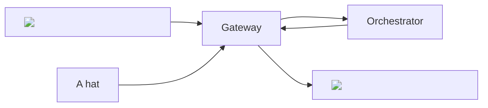

## Overview

The `image-to-image` pipeline of the AI subnet enables **advanced image
manipulations** including style transfer, image enhancement, and more. This
pipeline leverages cutting-edge diffusion models from the HuggingFace
[image-to-image](https://huggingface.co/models?pipeline_tag=image-to-image)
pipeline.

<div align="center">



</div>

## Models

### Warm Models

During the **Alpha** phase of the AI Video Subnet, Orchestrators are encouraged
to maintain at least **one model** per pipeline in an active state on their GPUs
(known as "warm models"). This practice is designed to provide quicker response
times for **early builders** on the Subnet. We're working to optimize GPU model
loading/unloading to relax this requirement The current warm model requested for
the `image-to-image` pipeline is:

- [ByteDance/SDXL-Lightning](https://huggingface.co/ByteDance/SDXL-Lightning): A
  high-performance diffusion model developed by ByteDance.

<Tip>
  For faster responses with a different
  [image-to-image](https://huggingface.co/models?pipeline_tag=image-to-image)
  diffusion model, ask Orchestrators to load it on their GPU via our `ai-video`
  channel in [Our Discord Server](https://discord.gg/livepeer).
</Tip>

### On-Demand Models

In addition to warm models, orchestrators can **load** any
[image-to-image](https://huggingface.co/models?pipeline_tag=image-to-image)
diffusion model from [Hugging Face](https://huggingface.co/) on-demand upon
receiving a specific model's inference request. This approach efficiently
manages GPU resources by loading models only when necessary. Although the subnet
can theoretically support **any** image-to-image model from Hugging Face, in the
**Alpha** phase,orchestrators must first download a model before it can be used.
Below are the currently tested and verified diffusion models for the
`image-to-image` pipeline:

<Note>
  If you wish to use a specific model not listed here, please submit a [feature
  request](https://github.com/livepeer/ai-worker/issues/new?assignees=&labels=enhancement%2Cmodel&projects=&template=model_request.yml)
  on our GitHub. We will verify the model and add it to the list.
</Note>

<Accordion title="Tested and Verified Diffusion Models">
  - [sd-turbo](https://huggingface.co/stabilityai/sd-turbo): A robust diffusion
  model by Stability AI, designed for efficient and high-quality image
  generation. - [sdxl-turbo](https://huggingface.co/stabilityai/sdxl-turbo): An
  extended version of the sd-turbo model, offering enhanced performance for
  larger and more complex tasks. -
  [ByteDance/SDXL-Lightning](https://huggingface.co/ByteDance/SDXL-Lightning): A
  lightning-fast diffusion model by ByteDance, optimized for high-speed
  image-to-image transformations.
</Accordion>

## Basic Usage Instructions

<Tip>
  For an in-depth understanding of the `image-to-image` endpoint, as well as an
  interactive playground to experiment with the API, please visit the [AI Subnet
  API](/ai/api-reference/image-to-image) documentation.
</Tip>

To request an image generation task using the `image-to-image` pipeline, you
need to send a `POST` request to the `image-to-image` API endpoint of the
Gateway:

```bash
curl -X POST 0.0.0.0:8937/image-to-image \
    -F model_id="ByteDance/SDXL-Lightning" \
    -F image=@<PATH_TO_IMAGE>/cool-cat.png0 \
    -F prompt="a hat"
```

In the above command:

- Replace `<gateway-ip>` with the IP address of your AI Gateway.
- The `model_id` field identifies the diffusion model used for image generation.
- The `image` field holds the **absolute** path to the image file to be
  transformed.
- The `prompt` field holds the text description for the image to be generated.

Additional parameters availble for the `image-to-image` pipeline are
**optional** and can be found in the
[AI Subnet API](/ai/api-reference/image-to-image) documentation. Upon successful
execution, the AI subnet directs your request to the appropriate Orchestrator.
Upon successful execution, the Gateway routes your request to the Orchestrator
for processing and then receives it back to generate a response in this format:

```json
{
  "images": [
    {
      "seed": 280278971,
      "url": "https://<STORAGE_ENDPOINT>/stream/974b2a98/0c4c5807.png"
    }
  ]
}
```

The `url` field in the response provides the URL of the generated image. To
download the image, use the following command:

```bash
curl -O "https://<STORAGE_ENDPOINT>/stream/974b2a98/0c4c5807.png"
```
