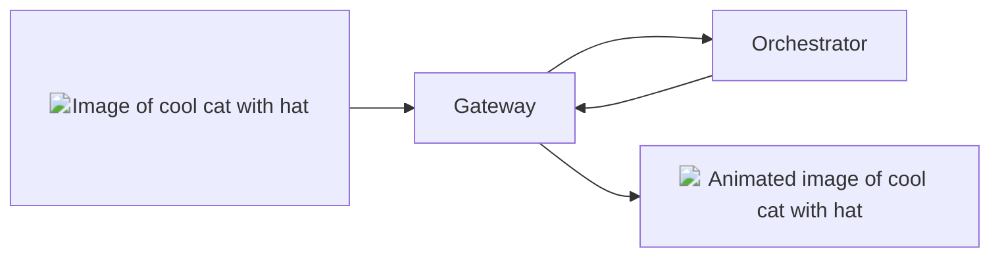

## Overview

The `image-to-video` pipeline of the Livepeer AI network allows you to generate
animated **high-quality** videos from images. This pipeline is powered by the
latest diffusion models in the HuggingFace
[image-to-video](https://huggingface.co/models?pipeline_tag=image-to-video)
pipeline.

{/* TODO: Replace with relative url when mintlify fixed issue. */}

<div align="center">



</div>

## Models

### Warm Models

The current warm model requested for the `image-to-video` pipeline is:

- [stabilityai/stable-video-diffusion-img2vid-xt-1-1](https://huggingface.co/stabilityai/stable-video-diffusion-img2vid-xt-1-1):
  An updated version of the stable-video-diffusion-img2vid-xt model with
  enhanced performance
  ([limited-commercial use license](https://stability.ai/license)).

<Tip>
  For faster responses with different
  [image-to-video](https://huggingface.co/models?pipeline_tag=image-to-video)
  diffusion models, ask Orchestrators to load it on their GPU via the `ai-video`
  channel in [Discord Server](https://discord.gg/livepeer).
</Tip>

### On-Demand Models

The following models have been tested and verified for the `image-to-video`
pipeline:

<Note>
  If a specific model you wish to use is not listed, please submit a [feature
  request](https://github.com/livepeer/ai-worker/issues/new?assignees=&labels=enhancement%2Cmodel&projects=&template=model_request.yml)
  on GitHub to get the model verified and added to the list.
</Note>

{/* prettier-ignore */}
<Accordion title="Tested and Verified Diffusion Models">
- [stable-video-diffusion-img2vid-xt](https://huggingface.co/stabilityai/stable-video-diffusion-img2vid-xt):
  A model by Stability AI designed for stable video diffusion from images ([limited-commercial use license](https://stability.ai/license)).
- [stabilityai/stable-video-diffusion-img2vid-xt-1-1](https://huggingface.co/stabilityai/stable-video-diffusion-img2vid-xt-1-1):
  An updated version of the stable-video-diffusion-img2vid-xt model with enhanced performance ([limited-commercial use license](https://stability.ai/license)).
</Accordion>

## Basic Usage Instructions

<Tip>
  For a detailed understanding of the `image-to-video` endpoint and to
  experiment with the API, see the [Livepeer AI API
  Reference](/ai/api-reference/image-to-video).
</Tip>

To generate a video with the `image-to-video` pipeline, send a `POST` request to
the Gateway's `image-to-video` API endpoint:

```bash
curl -X POST "https://<GATEWAY_IP>/image-to-video" \
    -F model_id=stabilityai/stable-video-diffusion-img2vid-xt-1-1 \
    -F image=@<PATH_TO_IMAGE>
```

In this command:

- `<GATEWAY_IP>` should be replaced with your AI Gateway's IP address.
- `model_id` is the diffusion model for video generation.
- The `image` field holds the **absolute** path to the image file to be
  transformed.

For additional optional parameters, refer to the
[Livepeer AI API Reference](/ai/api-reference/image-to-video).

After execution, the Orchestrator processes the request and returns the response
to the Gateway:

```json
{
  "images": [
    {
      "nsfw": false,
      "seed": 1914955328,
      "url": "/stream/2b835716/01c0e9a6.mp4"
    }
  ]
}
```

The `url` in the response is the URL of the generated video. Download the video
with:

```bash
curl -O "https://<STORAGE_ENDPOINT>/stream/2b835716/01c0e9a6.mp4"
```

## Orchestrator Configuration

To configure your Orchestrator to serve the `image-to-video` pipeline, refer to
the [Orchestrator Configuration](/ai/orchestrators/get-started) guide.

### System Requirements

The following system requirements are recommended for optimal performance:

- [NVIDIA GPU](https://developer.nvidia.com/cuda-gpus) with **at least 24GB** of
  VRAM.

## Recommended Pipeline Pricing

<Note>We are planning to simplify the pricing in the future so orchestrators can set 
one AI price per compute unit and have the system automatically scale based on the 
model's compute requirements.</Note>

The pricing for the `image-to-video` pipeline is based on competitor pricing. However, 
we strongly encourage orchestrators to set their own pricing based on their costs and 
requirements. Setting a competitive price will help attract more jobs, as Gateways can 
set their maximum price for a job. The currently recommended pricing for this pipeline 
is  `1.3563368e-08USD` (per output pixel `heightxwidthxframes`).

## API Reference

<Card
  title="API Reference"
  icon="rectangle-terminal"
  href="/ai/api-reference/image-to-video"
>
  Explore the `image-to-video` endpoint and experiment with the API in the
  Livepeer AI API Reference.
</Card>
