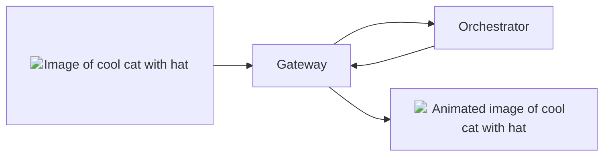

## Overview

The `image-to-video` pipeline of the AI Subnet allows you to generate animated
**high-quality** videos from images. This pipeline is powered by the latest
diffusion models in the HugginFace
[image-to-video](https://huggingface.co/models?pipeline_tag=image-to-video)
pipeline.

{/* TODO: Replace with relative url when mintlify fixed issue. */}

<div align="center">



</div>

## Models

### Warm Models

The current warm model requested for the `image-to-video` pipeline is:

- [stabilityai/stable-video-diffusion-img2vid-xt-1-1](https://huggingface.co/stabilityai/stable-video-diffusion-img2vid-xt-1-1):
  An updated version of the stable-video-diffusion-img2vid-xt model with
  enhanced performance.

<Tip>
  For faster responses with different
  [image-to-video](https://huggingface.co/models?pipeline_tag=image-to-video)
  diffusion models, ask Orchestrators to load it on their GPU via the `ai-video`
  channel in [Discord Server](https://discord.gg/livepeer).
</Tip>

### On-Demand Models

The following models have been tested and verified for the `image-to-video`
pipeline:

<Note>
  If a specific model you wish to use is not listed, please submit a [feature
  request](https://github.com/livepeer/ai-worker/issues/new?assignees=&labels=enhancement%2Cmodel&projects=&template=model_request.yml)
  on GitHub to get the model verified and added to the list.
</Note>

{/* prettier-ignore */}
<Accordion title="Tested and Verified Diffusion Models">
- [stable-video-diffusion-img2vid-xt](https://huggingface.co/stabilityai/stable-video-diffusion-img2vid-xt):
  A model by Stability AI designed for stable video diffusion from images.
- [stabilityai/stable-video-diffusion-img2vid-xt-1-1](https://huggingface.co/stabilityai/stable-video-diffusion-img2vid-xt-1-1):
  An updated version of the stable-video-diffusion-img2vid-xt model with
  enhanced performance.
</Accordion>

## Basic Usage Instructions

<Tip>
  For a detailed understanding of the `image-to-video` endpoint and to
  experiment with the API, see the [AI Subnet API
  Reference](/ai/api-reference/image-to-video).
</Tip>

To generate an image with the `image-to-video` pipeline, send a `POST` request
to the Gateway's `image-to-video` API endpoint:

```bash
curl -X POST "https://<gateway-ip>/image-to-video" \
    -F model_id=stabilityai/stable-video-diffusion-img2vid-xt-1-1 \
    -F image=@<PATH_TO_IMAGE>
```

In this command:

- `<gateway-ip>` should be replaced with your AI Gateway's IP address.
- `model_id` is the diffusion model for image generation.
- The `image` field holds the **absolute** path to the image file to be
  transformed.

For additional optional parameters, refer to the
[AI Subnet API Reference](/ai/api-reference/image-to-video).

After execution, the Orchestrator processes the request and returns the response
to the Gateway:

```json
{
  "images": [
    {
      "nsfw": false,
      "seed": 1914955328,
      "url": "/stream/2b835716/01c0e9a6.mp4"
    }
  ]
}
```

The `url` in the response is the URL of the generated image. Download the image
with:

```bash
curl -O "https://<STORAGE_ENDPOINT>/stream/2b835716/01c0e9a6.mp4"
```

## API Reference

<Card
  title="API Reference"
  icon="rectangle-terminal"
  href="/ai/api-reference/image-to-video"
>
  Explore the `image-to-video` endpoint and experiment with the API in the AI
  Subnet API Reference.
</Card>
