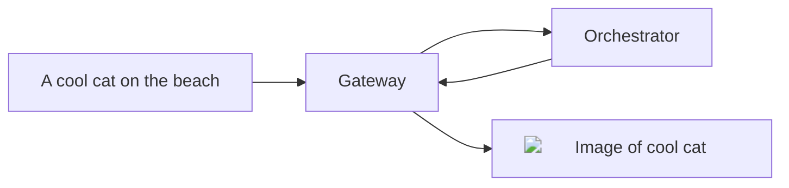

## Overview

The `text-to-image` pipeline of the AI Subnet allows you to generate
**high-quality** images from text descriptions. This pipeline is powered by the
latest diffusion models in the HugginFace
[text-to-image](https://huggingface.co/models?pipeline_tag=text-to-image)
pipeline.

{/* TODO: Replace with relative url when mintlify fixed issue. */}

<div align="center">



</div>

## Models

### Warm Models

The current warm model requested for the `text-to-image` pipeline is:

- [ByteDance/SDXL-Lightning](https://huggingface.co/ByteDance/SDXL-Lightning): A
  high-performance diffusion model developed by ByteDance.

Furthermore, several Orchestrators are currently maintaining the following model
in a ready state:

- [SG161222/RealVisXL_V4.0_Lightning](https://huggingface.co/SG161222/RealVisXL_V4.0_Lightning):
  A streamlined version of RealVisXL_V4.0, designed for faster inference while
  still aiming for photorealism.

<Tip>
  For faster responses with different
  [text-to-video](https://huggingface.co/models?pipeline_tag=text-to-video)
  diffusion models, ask Orchestrators to load it on their GPU via the `ai-video`
  channel in [Discord Server](https://discord.gg/livepeer).
</Tip>

### On-Demand Models

The following models have been tested and verified for the `text-to-image`
pipeline:

<Note>
  If a specific model you wish to use is not listed, please submit a [feature
  request](https://github.com/livepeer/ai-worker/issues/new?assignees=&labels=enhancement%2Cmodel&projects=&template=model_request.yml)
  on GitHub to get the model verified and added to the list.
</Note>

{/* prettier-ignore */}
<Accordion title="Tested and Verified Diffusion Models">
- [sd-turbo](https://huggingface.co/stabilityai/sd-turbo): A high-performance
  diffusion model by Stability AI.
- [sdxl-turbo](https://huggingface.co/stabilityai/sdxl-turbo): An extended
  version of sd-turbo with enhanced capabilities.
- [stable-diffusion-v1-5](https://huggingface.co/runwayml/stable-diffusion-v1-5):
  A stable diffusion model by Runway ML.
- [stable-diffusion-xl-base-1.0](https://huggingface.co/stabilityai/stable-diffusion-xl-base-1.0):
  A base model for stable diffusion by Stability AI.
- [openjourney-v4](https://huggingface.co/prompthero/openjourney-v4): A model by
  Prompthero for open-ended journey generation.
- [ByteDance/SDXL-Lightning](https://huggingface.co/ByteDance/SDXL-Lightning): A
  lightning-fast diffusion model by ByteDance.
- [SG161222/RealVisXL_V4.0](https://huggingface.co/SG161222/RealVisXL_V4.0): A diffusion model that excels in generating high-quality, photorealistic images.
- [SG161222/RealVisXL_V4.0_Lightning](https://huggingface.co/SG161222/RealVisXL_V4.0_Lightning): A streamlined version of RealVisXL_V4.0, designed for faster inference while still aiming for photorealism.
</Accordion>

## Basic Usage Instructions

<Tip>
  For a detailed understanding of the `text-to-image` endpoint and to experiment
  with the API, see the [AI Subnet API
  Reference](/ai/api-reference/text-to-image).
</Tip>

To generate an image with the `text-to-image` pipeline, send a `POST` request to
the Gateway's `text-to-image` API endpoint:

```bash
curl -X POST "https://<gateway-ip>/text-to-image" \
    -H "Content-Type: application/json" \
    -d '{
        "model_id":"ByteDance/SDXL-Lightning",
        "prompt":"A cool cat on the beach",
        "width": 1024,
        "height": 1024
    }'
```

In this command:

- `<gateway-ip>` should be replaced with your AI Gateway's IP address.
- `model_id` is the diffusion model for image generation.
- `prompt` is the text description for the image.

For additional optional parameters, refer to the
[AI Subnet API Reference](/ai/api-reference/text-to-image).

After execution, the Orchestrator processes the request and returns the response
to the Gateway:

```json
{
  "images": [
    {
      "seed": 2562822894,
      "url": "https://<gateway-ip>/stream/d0fc1fc6/8fdf5a94.png"
    }
  ]
}
```

The `url` in the response is the URL of the generated image. Download the image
with:

```bash
curl -O "https://<gateway-ip>/stream/d0fc1fc6/8fdf5a94.png"
```

## API Reference

<Card
  title="API Reference"
  icon="rectangle-terminal"
  href="/ai/api-reference/text-to-image"
>
  Explore the `text-to-image` endpoint and experiment with the API in the AI
  Subnet API Reference.
</Card>
