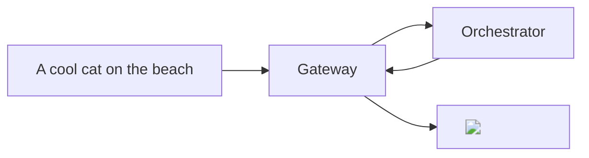

## Overview

The `text-to-image` pipeline of the AI subnet allows you to generate **high-quality** images from text descriptions. This pipeline is powered by the latest diffusion models in the HugginFace [text-to-image](https://huggingface.co/models?pipeline_tag=text-to-image) pipeline.



## Models

### Warm Models

During the **Alpha** phase of the AI Video Subnet, Orchestrators are encouraged to maintain at least **one model** per pipeline in an active state on their GPUs (known as "warm models"). This practice is designed to provide quicker response times for **early builders** on the Subnet. We're working to optimize GPU model loading/unloading to relax this requirement The current warm model requested for the `text-to-image` pipeline is:

- [ByteDance/SDXL-Lightning](https://huggingface.co/ByteDance/SDXL-Lightning): A high-performance diffusion model developed by ByteDance.

<Tip>For faster responses with a different [text-to-image](https://huggingface.co/models?pipeline_tag=text-to-image) diffusion model, ask Orchestrators to load it on their GPU via our `ai-video` channel in [Our Discord Server](https://discord.gg/livepeer).</Tip>

### On-Demand Models

In addition to warm models, orchestrators can **load** any [text-to-image](https://huggingface.co/models?pipeline_tag=text-to-image) diffusion model from [Hugging Face](https://huggingface.co/) on-demand upon receiving a specific model's inference request. This approach efficiently manages GPU resources by loading models only when necessary. Although the subnet can theoretically support **any** text-to-image model from Hugging Face, in the **Alpha** phase,orchestrators must first download a model before it can be used. Below are the currently tested and verified diffusion models for the `text-to-image` pipeline:

<Note>If you wish to use a specific model not listed here, please submit a [feature request](https://github.com/livepeer/ai-worker/issues/new?assignees=&labels=enhancement%2Cmodel&projects=&template=model_request.yml) on our GitHub. We will verify the model and add it to the list.</Note>

<Accordion title="Tested and Verified Diffusion Models">
- [sd-turbo](https://huggingface.co/stabilityai/sd-turbo): A high-performance diffusion model by Stability AI.
- [sdxl-turbo](https://huggingface.co/stabilityai/sdxl-turbo): An extended version of sd-turbo with enhanced capabilities.
- [stable-diffusion-v1-5](https://huggingface.co/runwayml/stable-diffusion-v1-5): A stable diffusion model by Runway ML.
- [stable-diffusion-xl-base-1.0](https://huggingface.co/stabilityai/stable-diffusion-xl-base-1.0): A base model for stable diffusion by Stability AI.
- [openjourney-v4](https://huggingface.co/prompthero/openjourney-v4): A model by Prompthero for open-ended journey generation.
- [ByteDance/SDXL-Lightning](https://huggingface.co/ByteDance/SDXL-Lightning): A lightning-fast diffusion model by ByteDance.
- [SG161222/RealVisXL_V4.0](https://huggingface.co/SG161222/RealVisXL_V4.0/tree/main): A high-quality diffusion model aimed at photorealism.
</Accordion>

## Basic Usage Instructions

<Tip>For an in-depth understanding of the `text-to-image` endpoint, as well as an interactive playground to experiment with the API, please visit the [AI Subnet API](/ai/api-reference/text-to-image) documentation.</Tip>

To request an image generation task using the `text-to-image` pipeline, you need to send a `POST` request to the `text-to-image` API endpoint of the Gateway:

```bash
curl -X POST "https://<gateway-ip>/ai/text-to-image" \
    -H "Content-Type: application/json" \
    -d '{
        "model_id":"ByteDance/SDXL-Lightning",
        "prompt":"A cool cat on the beach",
        "width": 1024,
        "height": 1024
    }'
```

In the above command:

- Replace `<gateway-ip>` with the IP address of your AI Gateway.
- The `model_id` field identifies the diffusion model used for image generation.
- The `prompt` field holds the text description for the image to be generated.
- The `width` and `height` fields define the dimensions of the output image.

Additional parameters availble for the `text-to-image` pipeline are **optional** and can be found in the [AI Subnet API](/ai/api-reference/text-to-image) documentation. Upon successful execution, the AI subnet directs your request to the appropriate Orchestrator. Upon successful execution, the Gateway routes your request to the Orchestrator for processing and then receives it back to generate a response in this format:

```json
{"images":[{"seed":280278971,"url":"https://<STORAGE_ENDPOINT>/stream/34937c31/dc88c7c9.png"}]}
```

The `url` field in the response provides the URL of the generated image. To download the image, use the following command:

```bash
curl -O "https://<STORAGE_ENDPOINT>/stream/34937c31/dc88c7c9.png"
```
