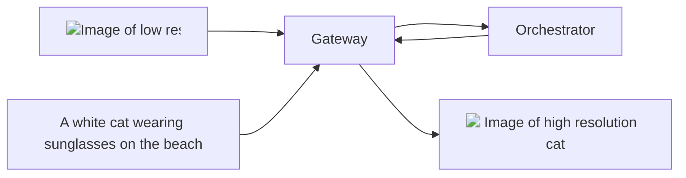

## Overview

The Livepeer AI network's `upscale` pipeline provides **advanced image
upscaling**. Powered by the latest diffusion models in HuggingFace's
[super-resolution](https://huggingface.co/docs/diffusers/en/api/pipelines/stable_diffusion/upscale)
pipeline, it enhances the resolution of input images by a factor of 4.

<div align="center">

{/* TODO: Replace with relative url when mintlify fixed issue. */}



</div>

## Models

### Warm Models

The current warm model requested for the `upscale` pipeline is:

- [stabilityai/stable-diffusion-x4-upscaler](https://huggingface.co/stabilityai/stable-diffusion-x4-upscaler):  
  A text-guided upscaling diffusion model trained on large LAION images,
  offering enhanced resolution and controlled noise addition.

<Tip>
  For faster responses with different
  [upscale](https://huggingface.co/docs/diffusers/en/api/pipelines/stable_diffusion/upscale)
  compatible diffusion models, ask Orchestrators to load it on their GPU via the
  `ai-video` channel in [Discord Server](https://discord.gg/livepeer).
</Tip>

### On-Demand Models

The following models have been tested and verified for the `upscale` pipeline:

<Note>
  If a specific model you wish to use is not listed, please submit a [feature
  request](https://github.com/livepeer/ai-worker/issues/new?assignees=&labels=enhancement%2Cmodel&projects=&template=model_request.yml)
  on GitHub to get the model verified and added to the list.
</Note>

{/* prettier-ignore */}
<Accordion title="Tested and Verified Diffusion Models">
- [stabilityai/stable-diffusion-x4-upscaler](https://huggingface.co/stabilityai/stable-diffusion-x4-upscaler):
  A text-guided upscaling diffusion model trained on large LAION images,
  offering enhanced resolution and controlled noise addition.
</Accordion>

## Basic Usage Instructions

<Tip>
  For a detailed understanding of the `upscale` endpoint and to experiment with
  the API, see the [Livepeer AI API Reference](/ai/api-reference/upscale).
</Tip>

To generate an image with the `upscale` pipeline, send a `POST` request to the
Gateway's `upscale` API endpoint:

```bash
curl -X POST https://<GATEWAY_IP>/upscale \
    -F model_id="stabilityai/stable-diffusion-x4-upscaler" \
    -F image=@<PATH_TO_IMAGE>/low_res_cat.png \
    -F prompt="A white cat"
```

In this command:

- `<GATEWAY_IP>` should be replaced with your AI Gateway's IP address.
- `model_id` is the diffusion model for image generation.
- The `image` field holds the **absolute** path to the image file to be
  upscaled.
- `prompt` is a descriptive text that provides context about the content of the
  image.

For additional optional parameters, refer to the
[Livepeer AI API Reference](/ai/api-reference/upscale).

After execution, the Orchestrator processes the request and returns the response
to the Gateway:

```json
{
  "images": [
    {
      "nsfw": false,
      "seed": 3197613440,
      "url": "https://<GATEWAY_IP>/stream/dd5ad78d/7adde483.png"
    }
  ]
}
```

The `url` in the response is the URL of the generated image. Download the image
with:

```bash
curl -O "https://<GATEWAY_IP>/stream/dd5ad78d/7adde483.png"
```

## Orchestrator Configuration

To configure your Orchestrator to serve the `upscale` pipeline, refer to the
[Orchestrator Configuration](/ai/orchestrators/get-started) guide.

### System Requirements

The following system requirements are recommended for optimal performance:

- [NVIDIA GPU](https://developer.nvidia.com/cuda-gpus) with **at least 24GB** of
  VRAM.

## API Reference

<Card
  title="API Reference"
  icon="rectangle-terminal"
  href="/ai/api-reference/upscale"
>
  Explore the `upscale` endpoint and experiment with the API in the Livepeer AI
  API Reference.
</Card>
