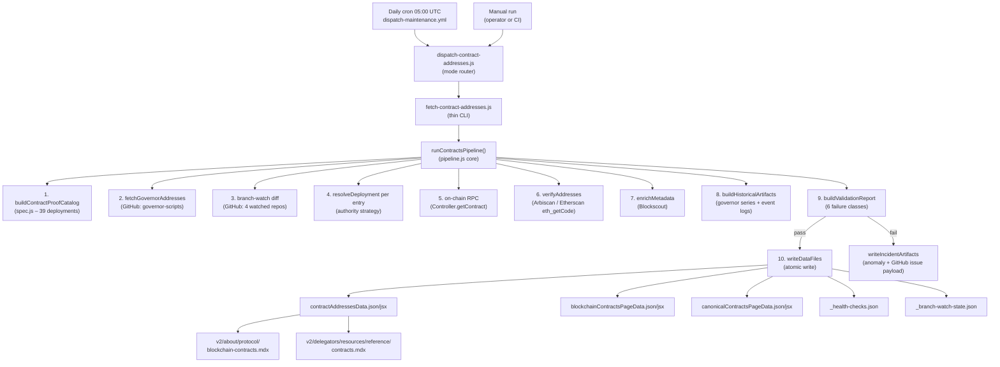
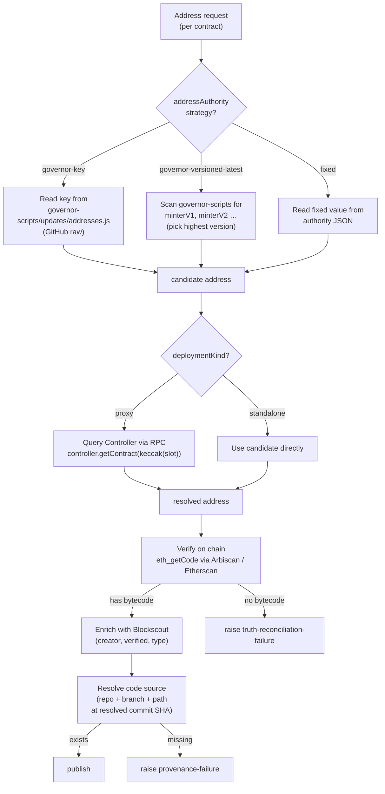
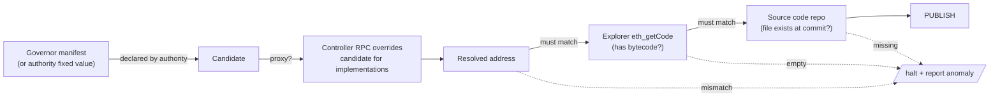

# Contracts Pipeline

> **Gate:** P5 (scheduled) and manual dispatch
> **Trigger:** Daily cron (`0 5 * * *` UTC), repository_dispatch, workflow_dispatch
> **Workflow:** [`.github/workflows/dispatch-maintenance.yml`](/.github/workflows/dispatch-maintenance.yml)
> **Entry point:** [`operations/scripts/integrators/maintenance/contracts/fetch-contract-addresses.js`](/operations/scripts/integrators/maintenance/contracts/fetch-contract-addresses.js)

<Info>
**TL;DR.** Every day at 05:00 UTC, the pipeline pulls Livepeer's canonical address manifest from `livepeer/governor-scripts`, resolves the live address of all 39 tracked contracts using on-chain RPC calls to the Controller, verifies each one has bytecode and a matching code path on GitHub, and writes the result to `snippets/data/contract-addresses/`. Two MDX pages (`v2/about/protocol/blockchain-contracts.mdx` and the delegators contracts reference) read from those files. If verification fails for any contract, the pipeline halts, writes an anomaly report, and emits a GitHub issue payload.
</Info>

---

## What this pipeline solves

Contract addresses change. Implementations get upgraded behind proxies. Bridges add new versions. New L2 services launch. If the docs hard-code these addresses, they drift the moment an upgrade ships, and readers send transactions to dead addresses.

This pipeline removes that risk. Instead of trusting what's written in the repo, it asks the Controller on chain "what address is the BondingManager pointing at right now?", asks Arbiscan "does that address actually have bytecode?", and asks GitHub "does the source file we link to actually exist at the commit we name?". Only when all three agree does an address get published.

It is the gold-standard "Pattern A integrator" in the docs system: chain-first, verified at every step, fail-closed.

---

## What it tracks

The pipeline tracks **39 contract deployments** across two chains. The full catalogue lives in [`operations/scripts/config/dep-contract-addresses-authority.json`](/operations/scripts/config/dep-contract-addresses-authority.json).

### Arbitrum One (19 deployments)

| Contract | Category | Kind | Lifecycle | Address |
|---|---|---|---|---|
| Controller | core | standalone | active | `0xD8E83285…06ee4` |
| LivepeerToken | token | standalone | active | `0x289ba170…a839` |
| Minter | core | standalone | active | `0xc20de371…7252` |
| BondingManager | core | proxy | active | `0x35bcf3c3…3e40` |
| TicketBroker | core | proxy | active | `0xa8bb618b…e41b` |
| RoundsManager | core | proxy | active | `0xdd6f56dc…c39f` |
| ServiceRegistry | core | proxy | active | `0xc92d3a36…7431` |
| AIServiceRegistry | core | standalone | active | `0x04C0b249…F34C5` |
| Governor | governance | standalone | active | `0xD9dEd6f9…736a6` |
| BondingVotes | governance | proxy | active | `0x0b9c2548…8169a` |
| LivepeerGovernor | governance | proxy | active | `0xcfe4e287…6aa0` |
| Treasury | governance | standalone | active | `0xf82c1ff4…e8c4` |
| L2LPTGateway | bridge | standalone | active | `0x6D2457a4…D318` |
| L2LPTDataCache | bridge | standalone | active | `0xd78b6bd0…b0b1` |
| L2Migrator | migration | proxy | migration_residual | `0x148d5b6b…2085` |
| DelegatorPool | migration | standalone | migration_residual | _on-chain only_ |
| MerkleSnapshot | migration | standalone | migration_residual | `0x10736fac…57f7` |
| PollCreator | governance | standalone | legacy_operational | _on-chain only_ |
| SortedDoublyLL | utility | standalone | legacy_operational | _on-chain only_ |

### Ethereum Mainnet (20 deployments)

| Contract | Category | Kind | Lifecycle | Address |
|---|---|---|---|---|
| Controller | core | standalone | paused | `0xf96d54e4…b69b3` |
| Minter | core | standalone | paused | `0x8dddb96c…b405` |
| LivepeerToken | token | standalone | active | `0x58b6a8a3…b239` |
| BridgeMinter | bridge | standalone | active | `0x8dDDB96C…FAB405` |
| L1LPTGateway | bridge | standalone | active | `0x6142f1C8…0676` |
| L1Escrow | bridge | standalone | active | `0x6A23F494…210A` |
| L1LPTDataCache | bridge | standalone | legacy_operational | `0x1d24838b…23D7` |
| L1Migrator | migration | standalone | migration_residual | `0x21146B87…A89A` |
| BondingManager | core | proxy | paused | `0x511bc455…ea2e` |
| TicketBroker | core | proxy | paused | `0x5b1ce829…f5d2` |
| RoundsManager | core | proxy | paused | `0x3984fc4c…40dc3` |
| ServiceRegistry | core | proxy | paused | `0x406a112f…1366` |
| Governor | governance | standalone | legacy_operational | _on-chain only_ |
| PollCreator | governance | standalone | legacy_operational | _on-chain only_ |
| MerkleSnapshot | migration | standalone | migration_residual | _on-chain only_ |
| GenesisManager | utility | standalone | legacy_operational | _on-chain only_ |
| MerkleMine | utility | standalone | legacy_operational | _on-chain only_ |
| MultiMerkleMine | utility | standalone | legacy_operational | _on-chain only_ |
| SortedDoublyLL | utility | standalone | legacy_operational | _on-chain only_ |
| Refunder | utility | standalone | legacy_operational | _on-chain only_ |

<Note>
Entries marked **_on-chain only_** are tracked in the authority catalogue but their resolved address is fetched at run time from on-chain state rather than published as plain text in the table above. Run the pipeline locally to see the live values, or read [`contractAddressesData.json`](/snippets/data/contract-addresses/contractAddressesData.json) after a fresh run.
</Note>

### Lifecycle states

| State | Meaning | Published? |
|---|---|---|
| `active` | Currently in use on chain. | Yes |
| `paused` | Deployed and recognised, no longer accepting writes (typical of legacy Ethereum core after Arbitrum migration). | Yes |
| `migration_residual` | Left over from a historical migration, still queryable. | Yes |
| `legacy_operational` | Old utilities and helpers retained for reference. | Yes |
| `historical` | Past implementation behind a proxy. Surfaced as history, not current. | Yes |

All five states render in the published data files. Only one extra state, `active`, is treated as "currently primary" by downstream rendering logic.

---

## End to end at a glance



---

## Where each address comes from

Every published address travels through the same five-layer fetch tree. Different contracts source from different layers depending on their authority strategy.



### The five layers in plain language

1. **Governor manifest.** [`livepeer/governor-scripts/updates/addresses.js`](https://github.com/livepeer/governor-scripts/blob/master/updates/addresses.js) is Livepeer's canonical source of truth. It's the file the protocol team updates when a deployment changes. The pipeline reads this through the GitHub API.
2. **Authority catalogue.** [`dep-contract-addresses-authority.json`](/operations/scripts/config/dep-contract-addresses-authority.json) tells the pipeline _how_ to resolve each contract: which strategy applies, which controller slot to query, where the source code lives. It does not contain truth, only resolution rules.
3. **On-chain Controller.** For every proxy contract, the pipeline calls `controller.getContract(keccak256("ContractName"))` directly against an RPC. This is the only place that knows the live implementation address right now.
4. **Block explorer (Arbiscan / Etherscan).** The pipeline calls `eth_getCode` on the resolved address to confirm bytecode exists. No bytecode means a dead address, which is treated as a hard failure.
5. **Source repo (GitHub).** Each contract has a `codeAuthority` pointing at a repo, branch, and Solidity file. The pipeline resolves the branch to a commit SHA and confirms the file exists at that commit. Broken paths or unverifiable commits are treated as a provenance failure.

<Warning>
**The supplement file is deprecated.** [`contract-addresses-supplement.json`](/operations/scripts/config/contract-addresses-supplement.json) is an empty legacy appendix retained only for audit history. The authority catalogue is the only resolution source the pipeline reads.
</Warning>

---

## Authority order

When sources disagree, the pipeline arbitrates in this order:



In plain words: the authority and governor file _propose_ an address, the Controller _confirms_ it for proxies, the explorer _proves_ it exists, and GitHub _backs_ the code. All four must agree. The pipeline never publishes a "best guess".

---

## Pipeline stages in detail

The core driver is `runContractsPipeline()` in [`pipeline.js`](/operations/scripts/integrators/content/data/contracts/pipeline.js). It runs the following stages in order. Failure at any stage with publishable consequences halts the run and triggers the incident path.

<Steps>
  <Step title="Build the proof catalogue">
    `buildContractProofCatalog()` materialises the 39 deployment definitions from [`spec.js`](/operations/scripts/integrators/content/data/contracts/spec.js) using three deployment shapes: `controllerDeployment`, `bridgeDeployment`, and `detachedDeployment`. Each carries an `addressAuthority`, `runtimeAuthority`, and `codeAuthority` triple.
  </Step>
  <Step title="Fetch the governor manifest">
    `fetchGovernorAddresses()` reads `livepeer/governor-scripts/updates/addresses.js` via the GitHub API and extracts the canonical `ADDRESSES` object. The resolved commit SHA gets stamped into output metadata for traceability.
  </Step>
  <Step title="Branch-watch diff">
    `loadBranchWatchState()` reads the previous branch inventory from `_branch-watch-state.json`. `diffBranchWatchState()` compares with the live inventory from the four watched repos (`livepeer/protocol`, `livepeer/arbitrum-lpt-bridge`, `livepeer/go-livepeer`, `livepeer/governor-scripts`). Anomalies in this diff (`new-repo-watch`, `default-branch-change`, `new-branch`, `missing-branch`) block the run.
  </Step>
  <Step title="Resolve every deployment">
    For each catalogue entry, `resolveDeployment()` applies the address strategy (`governor-key`, `governor-versioned-latest`, or `fixed`), then resolves the code source (`repo@branch` → commit SHA → file existence check).
  </Step>
  <Step title="Verify addresses on chain">
    `verifyAddresses()` calls `eth_getCode` via Arbiscan or Etherscan to confirm each address has bytecode. The Etherscan API key falls back to `ETHERSCAN_API_KEY_2` if the primary is missing. Rate limits are respected.
  </Step>
  <Step title="Enrich with explorer metadata">
    `enrichMetadata()` queries Blockscout for the creator address, verified status, contract type, and compiler version. This is read-only and additive; failures here downgrade to warnings rather than halting.
  </Step>
  <Step title="Resolve proxy implementations">
    For every proxy contract, `buildImplementationEntries()` calls the Controller's `getContract(keccak256(slot))` selector via RPC to fetch the live implementation address. This is the authoritative answer for "what code is BondingManager actually running today".
  </Step>
  <Step title="Fetch historical event logs">
    `fetchControllerSetContractInfoLogs()` pulls `SetContractInfo` events from the Controller, decodes them with `decodeSetContractInfoLog()`, and feeds them into `buildHistoricalArtifacts()` together with governor-series patterns (e.g. `minterV1`, `minterV2`, `minterV3`). This yields the "previous implementations" surface that powers the historical sections of the published pages.
  </Step>
  <Step title="Build the chain payload">
    `buildChainPayload()` and `buildBlockchainContractsPageData()` assemble the per-chain output (active set, proxy map, historical groups) into the shapes that the consumer MDX pages expect.
  </Step>
  <Step title="Validate everything">
    `buildValidationReport()` runs the six failure classes (see below) across every entry: published lifecycle, active/target separation, provenance presence, explorer-link validity, controller reconciliation, proxy runtime metadata, output-contract invariants. Any failure produces a `failures[]` entry with a stable fingerprint.
  </Step>
  <Step title="Write data files (or escalate)">
    If validation passes, `writeDataFiles()` atomically writes all five output files in `snippets/data/contract-addresses/` and the new branch-watch state. If validation fails, `writeIncidentArtifacts()` writes the anomaly JSON, the human-readable MD, and the GitHub issue payload, then throws to halt the pipeline.
  </Step>
</Steps>

---

## Output files

All paths are defined in [`constants.js`](/operations/scripts/integrators/content/data/contracts/constants.js#L17-L64).

### Published data: [`snippets/data/contract-addresses/`](/snippets/data/contract-addresses/)

| File | Purpose | Consumed by |
|---|---|---|
| `contractAddressesData.json` | Canonical address truth, machine-readable. | tests, agents |
| `contractAddressesData.jsx` | JSX export of the same data. | delegators reference, bridge guide |
| `blockchainContractsPageData.json` | Page model for the public blockchain contracts page. | tests |
| `blockchainContractsPageData.jsx` | JSX export of the blockchain page model. | `v2/about/protocol/blockchain-contracts.mdx` |
| `canonicalContractsPageData.json` | Canonical contracts page model. | tests |
| `canonicalContractsPageData.jsx` | JSX export of the canonical page model. | future consumer |
| `_health-checks.json` | Per-endpoint health and freshness. | health audit pipeline |
| `_branch-watch-state.json` | Last-seen branches and default branch per watched repo. | next run's diff baseline |

<Note>
`view-model.jsx` in the same directory is hand-authored and is **not** written by the pipeline. It defines the transformation between the published JSON and the rendered tables.
</Note>

### Operational reports: [`workspace/reports/contracts/`](/workspace/reports/contracts/)

These only appear when the pipeline detects an anomaly.

| File | Purpose |
|---|---|
| `contract-pipeline-anomaly-report.json` | Structured failure list with stable fingerprints. |
| `contract-pipeline-anomaly-report.md` | Human-readable summary of the same. |
| `contract-pipeline-issue-payload.json` | Pre-built GitHub issue body, title, and labels for auto-escalation. |

---

## Failure classes

From [`constants.js:147-154`](/operations/scripts/integrators/content/data/contracts/constants.js#L147-L154). Every failure carries a fingerprint computed from class + chain + contract + endpoint + detail, so recurring failures dedupe cleanly across runs.

| Class | Code | Typical cause |
|---|---|---|
| RPC | `rpc-failure` | Controller history fetch failed across all configured RPCs. |
| Truth | `truth-reconciliation-failure` | Authority-resolved address mismatches Controller, or proxy missing implementation. |
| Provenance | `provenance-failure` | Code path missing at the resolved commit, or commit could not be resolved. |
| Explorer link | `explorer-link-failure` | The constructed `blockchainHref` for an explorer is malformed. |
| Branch | `branch-watch-anomaly` | A watched repo gained or lost a tracked branch, or its default branch changed. |
| Output | `output-contract-failure` | Output payload violates an internal invariant (e.g. unsupported lifecycle, active leaking into history). |

Failure classes are not warnings. Any failure halts the pipeline. Warnings are tracked separately and surface in `_health-checks.json`.

---

## Scheduling

The pipeline runs through the maintenance dispatcher.

| Trigger | Source | Mode |
|---|---|---|
| Scheduled | `dispatch-maintenance.yml` cron `0 5 * * *` UTC daily | `scheduled` |
| Pull request | `dispatch-maintenance.yml` on PRs touching `snippets/data/**`, `snippets/components/**`, `docs.json` | `pr` (check-only) |
| Push to `docs-v2` | `dispatch-maintenance.yml` on push to the live branch | `post-merge` |
| Manual | `workflow_dispatch` with `mode` and `dry_run` inputs, or local CLI | `manual` |

Concurrency: `dispatch-maintenance-${{ github.ref }}` with cancel-in-progress on PRs prevents parallel runs on the same ref.

A separate **shadow dispatcher** at [`dispatch-contract-shadow.js`](/operations/scripts/dispatch/content/maintenance/dispatch-contract-shadow.js) runs the same stages against a shadow dataset on a `30 2 * * *` schedule (offset 30 minutes from the main run). It exists to catch drift between production data and a parallel reference dataset before the next live run lands.

---

## Running it manually

<Steps>
  <Step title="Set the required environment variables">
    The dispatcher exits cleanly with `degraded: required secret missing locally – pipeline skipped` if a secret it considers required is absent. At minimum you want:

    ```bash
    export ETHERSCAN_API_KEY="…"        # for Ethereum bytecode verification
    export ARBISCAN_API_KEY="…"          # for Arbitrum bytecode verification
    export GITHUB_TOKEN="…"              # for governor-scripts and watched repos
    # Optional: private RPC endpoints, otherwise public fallbacks are used.
    export ETHEREUM_RPC_URL="…"
    export ARBITRUM_RPC_URL="…"
    ```
  </Step>
  <Step title="Run a dry run first">
    ```bash
    node operations/scripts/integrators/maintenance/contracts/fetch-contract-addresses.js --dry-run
    ```
    This executes the full fetch, verification, and validation path without writing any files. Inspect the console output for failures.
  </Step>
  <Step title="Inspect anomalies (only if the dry run failed)">
    ```bash
    cat workspace/reports/contracts/contract-pipeline-anomaly-report.md
    ```
    The report lists every failure with class, chain, contract, endpoint, and a stable fingerprint.
  </Step>
  <Step title="Write outputs">
    ```bash
    node operations/scripts/integrators/maintenance/contracts/fetch-contract-addresses.js
    ```
    No flag writes all eight published files. Add `--skip-verify` to skip the post-write verification pass if you have a reason.
  </Step>
  <Step title="Or run via the dispatcher (matches CI behaviour)">
    ```bash
    node operations/scripts/dispatch/content/maintenance/dispatch-contract-addresses.js \
      --mode manual --write --verify
    ```
    The dispatcher applies CI-equivalent mode handling: `pr` runs check-only, `scheduled --write` writes if all gates pass, `manual --write` writes unconditionally after the same verification.
  </Step>
  <Step title="Verify renders">
    After writing, re-render the two consumer pages locally to confirm the table data loads:

    ```bash
    node operations/tests/integration/mdx-component-runtime-smoke.js \
      --routes /v2/about/protocol/blockchain-contracts \
      --routes /v2/delegators/resources/reference/contracts
    ```
  </Step>
</Steps>

### CLI flags

| Flag | Effect |
|---|---|
| _(none)_ | Writes all outputs. |
| `--dry-run` | Runs the full fetch but does not write. Mutually exclusive with `--check`. |
| `--check` | Verify-only. Fails if outputs would change. Use in CI to detect drift. |
| `--skip-verify` | Skip the post-write verification pass. |

---

## Local environment

| Variable | Purpose | Fallback behaviour |
|---|---|---|
| `ETHEREUM_RPC_URL` | Primary Ethereum Mainnet RPC. | Falls back to `eth.llamarpc.com`, `ethereum-rpc.publicnode.com`, `eth.drpc.org`. |
| `ETHEREUM_RPC_FALLBACK_URL` | Secondary Ethereum RPC. | As above. |
| `ARBITRUM_RPC_URL` | Primary Arbitrum One RPC. | Falls back to `arb1.arbitrum.io/rpc`, `arbitrum-one-rpc.publicnode.com`, `arbitrum.drpc.org`. |
| `ARBITRUM_RPC_FALLBACK_URL` | Secondary Arbitrum RPC. | As above. |
| `ETHERSCAN_API_KEY` or `ETHERSCAN_API_KEY_2` | Etherscan API access for bytecode and provenance. | None. Provenance verification fails without a key. |
| `ARBISCAN_API_KEY` | Arbiscan API access. | None. Provenance verification fails without a key. |
| `GITHUB_TOKEN` | Reads from `livepeer/protocol`, `livepeer/arbitrum-lpt-bridge`, `livepeer/go-livepeer`, `livepeer/governor-scripts`. | Unauthenticated, low rate limit. |
| `CONTRACTS_HTTP_TIMEOUT_MS` | HTTP timeout per request. | `15000` ms. |

Public RPC fallbacks let the pipeline run without your own RPC keys. The block explorer and GitHub tokens are needed to clear provenance and truth checks.

---

## Consumers

Two MDX pages currently read from the published data files. Both import directly from the `.jsx` exports.

| Page | Imports | Renders |
|---|---|---|
| [`v2/about/protocol/blockchain-contracts.mdx`](/v2/about/protocol/blockchain-contracts.mdx) | `blockchainContractsPageData.jsx` | Per-chain active sets, proxy map with implementation history, bridge contracts, governance contracts, legacy operational contracts. |
| [`v2/delegators/resources/reference/contracts.mdx`](/v2/delegators/resources/reference/contracts.mdx) | `contractAddressesData.jsx` | Quick address lookup table for delegators. |
| [`v2/delegators/delegation/bridge-lpt-to-arbitrum.mdx`](/v2/delegators/delegation/bridge-lpt-to-arbitrum.mdx) | `contractAddressesData.jsx` | Bridge contract addresses inline in the delegation guide. |

The `view-model.jsx` in `snippets/data/contract-addresses/` defines the transformation from the raw published JSON to the row shapes the tables render.

---

## Tests

| Test | Location | Covers |
|---|---|---|
| `contracts-addresses-pipeline.test.js` | `operations/tests/unit/` | Proof catalogue invariants, generated output shape, blocking anomalies, workflow cadence, consumer route freshness. |
| `contract-verifier.test.js` | `operations/scripts/integrators/content/data/test/` | `buildContractVerifierChainData`, lookup eligibility (proxy preferred over standalone), active-only filtering, Controller registration eligibility. |
| `fetch-contract-addresses.test.js` | `operations/scripts/integrators/content/data/test/` | Fetch and resolution logic for the CLI entry point. |
| `contract-address-routes.test.js` | `operations/scripts/integrators/content/data/test/` | Consumer routes still reference the published data and have not silently desynchronised. |
| `contracts-view-model.test.js` | `operations/tests/unit/` | View-model transformations: `activeTableItems`, `proxyTableItems`, `historicalCategories`. |

---

## Files at a glance

```
operations/scripts/
├── config/
│   ├── dep-contract-addresses-authority.json    # 39 deployments + resolution rules
│   └── contract-addresses-supplement.json       # deprecated legacy appendix
├── dispatch/content/maintenance/
│   ├── dispatch-contract-addresses.js           # main dispatcher (mode router)
│   └── dispatch-contract-shadow.js              # shadow dispatcher (drift check)
├── integrators/maintenance/contracts/
│   └── fetch-contract-addresses.js              # CLI entry point (thin)
└── integrators/content/data/contracts/
    ├── pipeline.js                              # core driver (~2400 lines)
    ├── constants.js                             # paths, env, controllers, classes
    ├── spec.js                                  # deployment shape definitions
    ├── catalog-config.js                        # per-contract resolution config
    ├── blockchain-page-spec.js                  # consumer page shape
    ├── solidity-parser.js                       # Solidity source parser
    ├── branch-watch.js                          # repo branch inventory diff
    └── incidents.js                             # anomaly report + issue payload

snippets/data/contract-addresses/                 # published outputs (8 files)
workspace/reports/contracts/                      # incident reports (3 files)
.github/workflows/dispatch-maintenance.yml        # CI dispatcher
```

---

## Related

- [Data Integration Pipeline](/v2/resources/documentation-guide/docs-library/pipelines/data-integration) – the parent pipeline category. Contracts is the gold-standard Pattern A integrator inside it.
- [Manual run reference](/workspace/thread-outputs/contracts/run-pipeline-manual.md) – operator quick reference for local runs.
- [`livepeer/governor-scripts/updates/addresses.js`](https://github.com/livepeer/governor-scripts/blob/master/updates/addresses.js) – the canonical upstream manifest the pipeline reads.
- [Blockchain Contracts page](/v2/about/protocol/blockchain-contracts) – the primary consumer surface.
