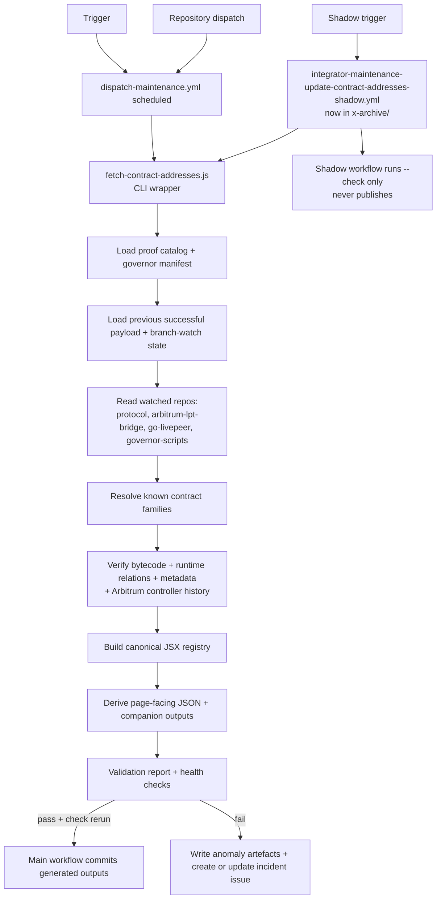

# Data Integrations

Anywhere a number, address, release tag, configuration flag, or forum post would otherwise rot into staleness in MDX, an integrator script pulls fresh truth from an external authority, runs a validation pass, and writes a deterministic JSX or JSON dataset under `snippets/data/`. MDX pages import the dataset and render through shared components. **No author hand-types an address or a release tag in a published page** – when they try, the source-of-truth policy and the canonical contracts pipeline catch it.

The pattern repeats for every data family: fetch script under `operations/scripts/integrators/` → transform → deterministic output under `snippets/data/<family>/` → validator → scheduled workflow → MDX consumer importing the dataset.

**Pre-fix state (2026-05-23) – now resolved 2026-05-25:** every Pattern A integrator that depends on cron writes had been silently broken by the [cron-is-dry-run bug](./automations.mdx#cron-is-dry-run-by-default-bug-fixed-2026-05-25) in the dispatch workflows. The contracts pipeline ran daily (`_health-checks.json` mtime 2026-05-22) but the data files had not been written since 2026-05-04 (19 days stale at the time of audit). Same root cause for `llms.txt` + `sitemap-ai.xml` 47-day staleness. Fix shipped in commit `e42946cdf` on `docs-v2-dev-draft`; the next scheduled cron after merge to `docs-v2` should unblock all 6 affected data families.

---

## 11 integration families

| # | Family | Status (2026-05-23) | Fetch script | Output | Workflow | Pattern |
| --- | --- | --- | --- | --- | --- | --- |
| 1 | **Contracts pipeline** | Production – gold-standard (see [§Contracts deep dive](#contracts-pipeline-deep-dive)) | `operations/scripts/integrators/maintenance/contracts/pipeline.js` | `snippets/data/contract-addresses/*` (12 files) | `dispatch-maintenance.yml` (daily 05:00 UTC) + shadow workflow | A (Integrate) |
| 2 | **OpenAPI specs** | **Stale 67 days – P0 weakest link** | `operations/scripts/integrators/content/data/fetching/fetch-openapi-specs.sh` (covers 2 of 5 specs) | `api/openapi.yaml`, `api/openapi.json`, `api/studio.yaml`, `api/gateway.openapi.yaml`, `api/ai-worker.yaml`, `api/cli-http.yaml` | **No scheduled workflow exists** | A (broken) |
| 3 | **Release + gateway globals** | Production for release; partial for gateway version | `operations/scripts/integrators/maintenance/release/update-livepeer-release.js`, `operations/scripts/integrators/maintenance/data-feeds/fetch-config-flags.js` | `snippets/data/globals/latestRelease.jsx`, `snippets/data/gateways/version.jsx`, `snippets/data/gateways/configuration-flags.jsx` | `integrator-maintenance-update-release-version.yml`, `integrator-maintenance-update-config-flags.yml` (now archived as `.archived` files under `.github/workflows/x-archive/`) | A |
| 4 | **Exchange data** | Production | `operations/scripts/integrators/maintenance/data-feeds/fetch-exchanges-data.js` | `snippets/data/exchanges/exchangesData.jsx`, `snippets/data/snapshots/coingecko-livepeer.json` | folded into `dispatch-maintenance.yml` | A |
| 5 | **Social + community feeds** | Mixed – 5 production, 1 stale (Luma), 1 partial (RSS) | 7 fetchers under `operations/scripts/integrators/copy/social-feeds/` | `snippets/data/social-feeds/*.jsx` | `dispatch-copy.yml` (daily 03:00 UTC) | A |
| 6 | **Showcase pipeline** | Production for pipeline; partial for data (2 parallel files) | `operations/scripts/integrators/copy/showcase/project-showcase-sync.js` | `snippets/data/showcase-feed/showcaseData.jsx`, `showcaseDataPopulated.jsx` | `integrator-copy-update-showcase-submissions.yml` (archived; now folded into `dispatch-copy.yml`) | A |
| 7 | **Glossary generator** | Partial – "manual – not yet in pipeline" | `operations/scripts/generators/content/reference/generate-glossary.js`, `generate-glossary-companions.js` | `snippets/data/references/glossaryBadges.jsx`, `snippets/data/glossary-badges.jsx`, `snippets/data/reference-maps/badge-map.jsx` | None scheduled | B (Generate) – manual only |
| 8 | **Reference maps** | Production but hand-maintained | n/a | `snippets/data/reference-maps/badge-map.jsx` (mtime 2026-04-08), `icon-map.jsx` (mtime 2026-04-13, 56 KB) | None | n/a (curated) |
| 9 | **Generated API reference pages** | Partial – manual only | `operations/scripts/generators/content/reference/generate-api-docs.sh` | API reference MDX trees under `v2/.../api-reference/` | None scheduled | B – manual only |
| 10 | **Snapshot artefacts** | Partial – placeholders unfilled | n/a (cached output of fetchers) | `snippets/data/snapshots/*.json` (4 files: 2 real, 2 placeholders) | n/a | n/a |
| 11 | **Solution-scoped feeds** | Production for structure; per-product refresh unverified | per-product fetchers (path varies) | `snippets/data/social-feed-solutions/{daydream,embody,frameworks,livepeer-studio,streamplace}/` | folded into `dispatch-copy.yml` | A |

---

## Contracts pipeline (deep dive)

This is the gold-standard integrator. The full architecture is the reference implementation for Pattern A every other integrator should aspire to.

### What the pipeline guarantees

1. **Trigger.** Main workflow runs daily at 02:00 UTC (cron); supports manual dispatch with `dry_run` / `skip_verify` / `use_test_branch`; can be triggered by `repository_dispatch` from `livepeer/protocol`, `livepeer/arbitrum-lpt-bridge`, `livepeer/go-livepeer`, `livepeer/governor-scripts`.
2. **Entrypoint.** `operations/scripts/integrators/maintenance/contracts/fetch-contract-addresses.js` is a thin CLI wrapper that runs `runContractsPipeline()` and enforces the `--dry-run` versus `--check` contract.
3. **Source loading.** Loads the proof catalog from `operations/scripts/integrators/content/data/contracts/spec.js`; fetches the governor addresses manifest; loads the previous successful contracts payload + the previous branch-watch snapshot.
4. **Repo + provenance checks.** Fetches branch inventory for 4 watched repos; diffs vs the previous successful run; carries blocking branch anomalies into validation.
5. **Resolution + verification.** Resolves every catalog deployment; verifies bytecode on Arbitrum One + Ethereum Mainnet; enriches metadata + proxy/controller state; builds implementation rows; rebuilds Arbitrum historical seed entries from controller `SetContractInfo` logs.
6. **Output build.** Assembles per-chain payloads, root historical data, blockchain-page companion data, and one canonical repo dataset at `snippets/data/contract-addresses/contractAddressesData.jsx`.
7. **Publish or fail.** Writes health checks for every run; throws on blocking failures; writes anomaly artefacts + incident payloads on failure; **only allows the main workflow to commit refreshed generated outputs after a successful generation run followed by a successful `--check` rerun.**

### Trust model

- The contracts page is backed by generated data, not a hand-maintained address list.
- The main workflow does not publish anything until generation succeeds AND the follow-up `--check` pass succeeds against the same sources.
- The shadow workflow reruns the verification path in check-only mode so failures are surfaced without changing published data.
- Failure runs still write `_health-checks.json`, branch-watch state, anomaly reports, and issue payloads – there's an audit trail rather than a silent no-op.
- The canonical persisted repo data source is `snippets/data/contract-addresses/contractAddressesData.jsx`. JSON outputs and page-facing companion data are derived from that file.

### Current limits

- Live implementation resolves the proof catalog defined in `spec.js`; it does not yet perform open-ended contract-family discovery from repo diffs.
- Watched repos are used for provenance + branch-anomaly detection, not as a generic discovery queue.
- Arbitrum historical entries are rebuilt from controller logs. **Ethereum historical is not rebuilt through the same controller-log path** in the current implementation.

### The "FAIL" semantics in `_health-checks.json`

`snippets/data/contract-addresses/_health-checks.json` reports `FAIL` entries on 2026-05-22. **These are branch-watch state changes (new dependabot branches appearing, old branches disappearing from `go-livepeer`) – NOT pipeline failures.** The pipeline ran correctly, detected upstream branch inventory changes, flagged them per design. The 18 "FAIL" entries on 2026-05-22 are 6 new dependabot branches + 12 disappeared/renamed branches. This is the pipeline working as designed.

**Pre-fix note (2026-05-23 audit, resolved 2026-05-25):** the data files in `snippets/data/contract-addresses/` had not been written since **2026-05-04** (19 days stale at audit time). The verification check ran daily; the publish gate had not fired in 19 days. Root cause was the [cron-is-dry-run bug](./automations.mdx#cron-is-dry-run-by-default-bug-fixed-2026-05-25) – `dispatch-maintenance.yml` scheduled job ran with empty `FLAGS=""` because cron cannot pass `inputs.dry_run = false`, so the script ran in dry-run by default. Fix shipped 2026-05-25 in commit `e42946cdf` on `docs-v2-dev-draft`. The post-merge job DOES write (`--write` hardcoded) but only fires on push to `docs-v2` touching `snippets/components/`, `snippets/data/`, or `docs.json` – not on changes to upstream protocol repos. The scheduled job now writes as well.

---

## OpenAPI specifications

The `api/` root holds 5 active OpenAPI specs + 1 workspace subtree:

| File | Source repo | Mtime | Status |
| --- | --- | --- | --- |
| `api/openapi.yaml` | livepeer Studio API | 2026-03-18 | **67 days stale** |
| `api/openapi.json` | derived from `openapi.yaml` | 2026-03-18 | **67 days stale** |
| `api/studio.yaml` | Studio | 2026-03-18 | **67 days stale** |
| `api/gateway.openapi.yaml` | Self-hosted gateway | 2026-03-18 | **67 days stale** |
| `api/ai-worker.yaml` | `livepeer/ai-runner` | 2026-03-18 | **67 days stale** |
| `api/cli-http.yaml` | `go-livepeer` CLI HTTP surface | 2026-03-18 | **67 days stale** |

The fetcher `operations/scripts/integrators/content/data/fetching/fetch-openapi-specs.sh` currently **only pulls AI Runner and AI Gateway specs** from `livepeer/ai-runner`. The other 3 (Studio, CLI, main `openapi.yaml`) are not refreshed by the script. **There is no scheduled workflow that runs the OpenAPI fetcher.**

**Validation tool:** `operations/tests/integration/openapi-reference-audit.js` catches reference drift between MDX endpoint pages and the spec. Run: `node operations/tests/integration/openapi-reference-audit.js --full --strict`.

**Generator:** `operations/scripts/generators/content/reference/generate-api-docs.sh` turns an OpenAPI spec into a landing page + per-endpoint MDX pages + navigation JSON. Manual only – no scheduled workflow.

**Compare to contracts:** the contracts pipeline has daily cron + shadow verification + bytecode auth against 2 chains + branch-watch + incident issue creation. OpenAPI has a one-shot shell fetcher covering 40% of specs + no schedule + no validator gate.

---

## Social + community feeds

Seven independent integrators aggregate community content under `snippets/data/social-feeds/`:

| Feed | Output | Mtime | Status |
| --- | --- | --- | --- |
| Forum (Discourse) | `forumData.jsx` (968 KB) | 2026-04-14 | Production |
| Ghost blog | `ghostBlogData.jsx` | 2026-04-14 | Production |
| GitHub | `githubData.jsx` | 2026-04-14 | Production |
| Discord | `discordAnnouncementsData.jsx` | 2026-04-14 | Production |
| RSS | partial via `convert-rss-to-mdx.js` | 2026-04-14 | Partial |
| YouTube | `youtubeData.jsx` | 2026-04-14 | Production (73 bytes – essentially empty; investigate fetcher) |
| Luma | `lumaEventsData.jsx` | **2026-03-18** | **Silently dead 67 days** |

All 6 active feeds refreshed together on 2026-04-14 – they share a workflow run. **Luma has not refreshed since its initial commit on 2026-03-18.** Either the upstream Luma API contract changed or the workflow trigger fails silently. Diagnose.

`lastUpdated.jsx` provides a UX signal showing when feeds last refreshed (mtime 2026-04-14).

---

## Structured data outputs

| Output path | Consumer type | Notes |
| --- | --- | --- |
| `snippets/data/contract-addresses/` | Contracts page + components | 12 files: `.jsx`, `.json`, `_health-checks.json`, `_branch-watch-state.json`, `blockchainContractsPageData.*`, `canonicalContractsPageData.*`, `view-model.jsx`, `index.jsx`. **18-day staleness in publish gate.** |
| `snippets/data/globals/` | Latest release + global values | `latestRelease.jsx`, deprecated `dep-*` files |
| `snippets/data/gateways/` | Gateway config + version | `configuration-flags.jsx`, `version.jsx`, `notes.mdx` (mis-placed – should move to docs-guide) |
| `snippets/data/exchanges/` | LPT exchange data | `exchangesData.jsx` from CoinGecko |
| `snippets/data/social-feeds/` | Community feed integrator components | See [Social feeds](#social--community-feeds) table |
| `snippets/data/showcase-feed/` | Project showcase pages | `showcaseData.jsx` + `showcaseDataPopulated.jsx` – **2 parallel files, no documented role split** |
| `snippets/data/social-feed-solutions/` | Product-scoped feeds | 5 product folders: daydream / embody / frameworks / livepeer-studio / streamplace – undocumented in prior page |
| `snippets/data/references/` | Reference components | `glossaryBadges.jsx`, `chainlist.jsx` |
| `snippets/data/reference-maps/` | UI/content mapping | `badge-map.jsx` (mtime 2026-04-08), `icon-map.jsx` (56 KB, mtime 2026-04-13) |
| `snippets/data/snapshots/` | Cached upstream API responses | 4 files: `coingecko-livepeer.json` (real), `coingecko-arbitrum.json` (real), `CoinGeckoExchanges.json` (178-byte **placeholder**), `SolidityEmbed.json` (170-byte **placeholder**) |
| `snippets/data/changelogs/contractAddressesData.jsx` | **Legacy duplicate** | Orphan dump from 2026-04-03; live pipeline writes to `snippets/data/contract-addresses/contractAddressesData.jsx` instead. Delete. |

---

## Validation + repair

| Concern | Check command | Repair path |
| --- | --- | --- |
| OpenAPI reference integrity | `node operations/tests/integration/openapi-reference-audit.js --full --strict` | Update spec mapping + affected MDX endpoint references together |
| Contract address data | `operations/scripts/integrators/content/data/test/fetch-contract-addresses.test.js` | Re-run fetch + transform scripts, then verify outputs against `_health-checks.json` |
| External feed freshness | `dispatch-copy.yml` PR check (`dispatch-copy-check.js --staged`) | Run matching fetcher under `operations/scripts/integrators/copy/social-feeds/` |
| Generated catalog drift | catalog validators in `operations/scripts/validators/governance/catalogs/` | Regenerate via `generate-docs-guide-indexes.js`, `generate-pages-index.js`, etc. |
| Glossary drift (no validator yet) | n/a | Manual until generator wired into a workflow |
| AI sitemap data | `lpd ai-sitemap --check` | `lpd ai-sitemap --write` (but cron-dry-run blocks scheduled regen) |

---

## Data integration rules

- **Keep source data, transform code, and rendered outputs separate.** No fetch logic inside MDX pages.
- **Generated data is read-only.** Do not hand-edit `snippets/data/<family>/*` without documenting why generation cannot repair it.
- **Secrets in GitHub Actions or documented secret surfaces** – never committed data files. `.env` files exist in some workspace plans but are gitignored and never committed.
- **Write deterministic outputs** so diffs are reviewable. The contracts pipeline JSX is sorted + stable-keyed for this reason.
- **Treat snapshots and reports as retention-bound** – not permanent active content.
- **Every integration declares:** upstream authority, scheduled refresh, validator, deterministic output, owner. Items without all 5 are advisory until promoted.

---

## Known gaps

### OpenAPI is the weakest link (P0)

- All 5 specs in `api/` last touched 2026-03-18 (67 days stale as of 2026-05-23)
- Fetcher covers 2 of 5 specs only
- No scheduled workflow exists
- No publish gate

**Fix:** expand `fetch-openapi-specs.sh` to cover all 5 specs; create `integrator-maintenance-update-openapi-specs.yml` or fold into `dispatch-maintenance.yml`; gate publishing through `openapi-reference-audit.js --full --strict`.

### Luma social feed silently dead since 2026-03-18

`lumaEventsData.jsx` hasn't refreshed since the initial commit. Other 6 social feeds refreshed together 2026-04-14. **Diagnose:** check fetcher logs for upstream API contract changes or workflow trigger failures.

### Contracts publish gate stale 19 days

`_health-checks.json` runs daily; data files last written 2026-05-04 at audit time. Root cause was the [cron-is-dry-run bug](./automations.mdx#cron-is-dry-run-by-default-bug-fixed-2026-05-25). **Fix shipped 2026-05-25** in commit `e42946cdf` on `docs-v2-dev-draft` – inverted FLAGS pattern in `dispatch-maintenance.yml` scheduled job (and 5 sibling dispatchers).

### Glossary generator not wired

`generate-glossary.js` exists and produces a valid dataset. The page itself is flagged `manual – not yet in pipeline`. **Fix:** schedule `dispatch-maintenance.yml` to invoke it weekly (after cron-dry-run is fixed); add a drift validator that fails CI when MDX uses a term absent from the glossary.

### Generated API reference pages manual-only

`generate-api-docs.sh` is wired but the workflow that triggers it on upstream OpenAPI spec changes doesn't exist. **Fix:** webhook from upstream repos OR schedule alongside the OpenAPI fetcher.

### Legacy duplicate `snippets/data/changelogs/contractAddressesData.jsx`

Orphan from 2026-04-03; the live pipeline writes to `snippets/data/contract-addresses/contractAddressesData.jsx` instead. **Action:** delete (after confirming no consumers reference the legacy path).

### Two showcase data files with no role split

`showcaseData.jsx` and `showcaseDataPopulated.jsx` coexist. The pipeline writes both. Which is canonical for which consumer is undocumented. **Action:** declare one canonical; the other becomes a derived/legacy file with a documented role OR delete.

### `gateways/version.jsx` duplicates `globals/latestRelease.jsx`

`gateways/version.jsx` is a 100-byte hand-edited file that duplicates the release tag from `latestRelease.jsx`. **Action:** converge to one canonical release file; the other becomes a re-export or is removed.

### `snippets/data/snapshots/*` placeholders

`CoinGeckoExchanges.json` (178 bytes) and `SolidityEmbed.json` (170 bytes) are placeholder files with `_note: "Placeholder - populate with real snapshot data from the API source"`. **Action:** either wire them into the relevant fetcher (with real retention policy) or delete.

### `snippets/data/social-feed-solutions/` undocumented

5 product subfolders (daydream / embody / frameworks / livepeer-studio / streamplace) exist with active data. **Action:** document the fetcher pairing per product; audit each for last-write timestamp.

### `gateways/notes.mdx` is documentation in a data folder

`snippets/data/gateways/notes.mdx` (mtime 2026-03-18) is prose, not data. **Action:** move to a docs-guide location or under v2/.

### `docs-guide/features/contracts-pipeline.mdx` orphan

The standalone deep-dive page `docs-guide/features/contracts-pipeline.mdx` is **not in `docs.json` navigation.** Its content is folded into the [Contracts pipeline (deep dive)](#contracts-pipeline-deep-dive) section of this page. **Action:** retire the orphan file (replace with a thin redirect notice pointing here, same pattern as voice-rules.mdx + dev-tools.mdx retirement this session).

### `icon-map.jsx` size and content drift

56 KB hand-maintained reference map. Risk: icons referenced in MDX but missing from the map, or icons in the map but used nowhere. **Action:** validator that scans `v2/**/*.mdx` for icon usage and cross-checks against the map.

### YouTube feed essentially empty

`youtubeData.jsx` is 73 bytes – fetcher is presumably running but producing no useful data. Investigate.

### `forumData.jsx` is 968 KB

The forum-feed output is the largest single JSX file in `snippets/data/`. Consider chunking or pre-rendering for build performance.

---

## Related

- **[Automations](./automations.mdx)** – the dispatch architecture + the cron-is-dry-run bug (fixed 2026-05-25 in commit `e42946cdf`; was the root cause of every cron-driven integrator stalling)
- **[Source-of-Truth Policy](../policies/source-of-truth-policy.mdx)** – canonical boundaries: code/tests = runtime; this docs-guide section = repo features; v2/ = public docs; generators = read-only outputs
- **[Solutions secrets policy](../repo-ops/secrets/solutions-secrets.mdx)** – where secrets live + the SOLUTIONS-SOCIAL-DATA `.env` lifecycle
- **[Script Framework](../frameworks/script-framework.mdx)** – 11-tag JSDoc spec for integrator scripts
- **[Generated-Artifact + Hook Governance](../policies/generated-artifact-and-hook-governance.mdx)** – 3 artefact classes (committed_authoritative / committed_derived_scoped / ephemeral_local) + commit/hook/CI policies
- **`operations/scripts/integrators/`** – all integrator source
- **`operations/scripts/generators/content/reference/`** – generator source (API docs, glossary)
- **`snippets/data/`** – all generated data outputs
- **`workspace/thread-outputs/repo-consolidation-deep/SLICE-04-data-integrations-audit.md`** – full data-integration audit (244 lines, 11 features)
