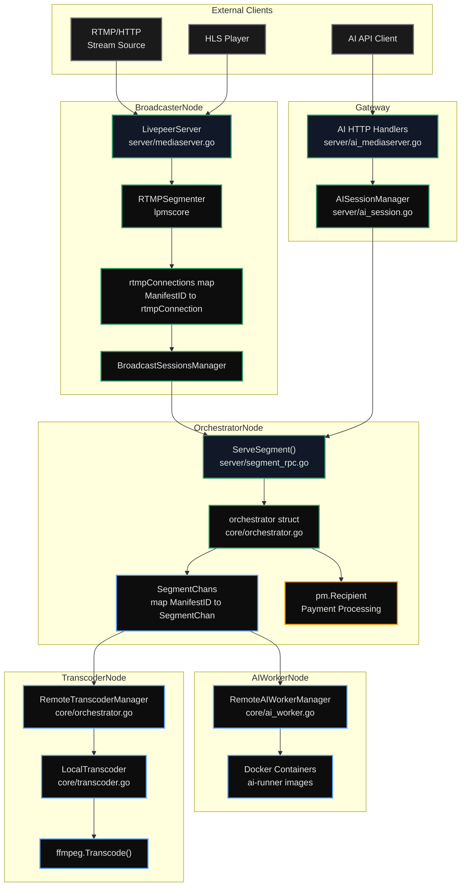

import { CustomDivider } from '/snippets/components/elements/spacing/Divider.jsx'
import { CustomCardTitle, Subtitle } from '/snippets/components/elements/text/Text.jsx'
import { ScrollableDiagram } from '/snippets/components/displays/diagrams/ScrollableDiagram.jsx'
import { QuadGrid } from '/snippets/components/displays/grids/Grids.jsx'
import { DynamicTableV2 } from '/snippets/components/displays/tables/Tables.jsx'
import { Quote } from '/snippets/components/displays/quotes/Quote.jsx'
import { BorderedBox, CenteredContainer } from "/snippets/components/wrappers/containers/Containers.jsx";

<CenteredContainer width="60%" minWidth="400px">
    <Card icon="github" title="Go-Livepeer Codebase" arrow href="https://github.com/livepeer/go-livepeer" horizontal />
</CenteredContainer>

<CustomDivider style={{ margin: '-1rem 0 -2rem 0' }} />

## Network Actors

<Tip>
The actors are the participants that run the off-chain layer and interact with the on-chain Protocol to coordinate, settle, and earn.
</Tip>

The protocol defines three core actors, and implements mechanisms to coordinate their interactions and align incentives for the desired network outcomes:
<AccordionGroup>
  <Accordion title="Gateways" icon="route">
    **Function:** Ingests source video or AI inference requests from end users and routes the work to Orchestrators.

    **Purpose:** Connects demand-side applications and users to the Livepeer Network.

    **Economics:** Pays for transcoding services using ETH through the ticket system.

    **Technical role.** Probably the most demanding integration work of the three. Run Gateway software, ingest video or AI requests from end users, handle Orchestrator discovery and selection, manage payment channels and ticket issuance, deal with failover, and bridge the protocol to whatever application is actually consuming the work. This is where most of the engineering surface area lives.

    **Economic role.** They're the demand side and the only source of external revenue. They fund deposits and reserves to back probabilistic tickets, set their own quality/price tradeoffs by selecting Orchestrators, and ultimately decide whether the network's pricing is competitive against centralised alternatives. If Gateways aren't economically satisfied, no one else gets paid.

    **Community role.** Historically the quietest of the three, but increasingly important. Gateway operators are often building products on top – streaming platforms, AI apps, developer tools – and their feedback drives what capabilities Orchestrators add and what the protocol prioritises. The Livepeer AI subnet exists in large part because Gateway-side demand pulled it into existence.
  </Accordion>

  <Accordion title="Delegators" icon="user-check">
    **Function:** Bonds LPT to Orchestrators without running infrastructure directly.

    **Purpose:** Secures the network by delegating stake to Orchestrators.

    **Economics:** Earns rewards by sharing in the fees and inflationary rewards of the Orchestrator they delegate to.

    **Technical role.** Light but real – they need to evaluate Orchestrators (uptime, performance, fee history, reliability), manage their own wallet security, and periodically claim earnings or move stake. No infrastructure, but non-trivial diligence if they're doing it well.

    **Economic role.** Capital allocators. They route LPT toward Orchestrators they believe will earn the most fees and rewards relative to risk, and away from underperformers. In aggregate this is the price signal that shapes the Active Set. They also bear the opportunity cost of locked stake and unbonding periods.

    **Community role.** Lower visibility than Orchestrators but real influence – they're the constituency Orchestrators are courting. Active Delegators participate in governance polls, weigh in on Orchestrator behaviour, and (especially the larger ones) shape sentiment about which Orchestrators are trustworthy. They're the network's accountability layer.
  </Accordion>

  <Accordion title="Orchestrators" icon="microchip">
    **Function:** Runs the hardware that performs transcoding and AI inference work.

    **Purpose:** Registers on-chain, stakes LPT, and bids for work. The top-ranked subset by total stake forms the Active Set, which is eligible to receive jobs in a given round.

    **Economics:** Earns rewards and fees for performing work, after the Orchestrator's configured fee share and Reward Cut are applied.

    **Technical role.** Operate the infrastructure. Run go-livepeer, manage transcoders and GPUs, maintain uptime, keep model containers current for AI work, advertise capabilities, and actually perform jobs. This is the only role in the protocol that requires running hardware.

    **Economic role.** Price the work (`pricePerUnit`), set the split with Delegators (`feeShare`, `rewardCut`), bond self-stake as collateral, redeem winning tickets, and call reward each round. They're a small business inside the network – capex on hardware, opex on power and bandwidth, revenue in ETH and LPT.

    **Community role.** They're the most visible public face of the network. Reputation matters because Delegators are choosing them – so Orchestrators run websites, publish stats, show up on Discord, write guides, help newer operators, and participate in governance discussions. The serious ones are effectively brands.
  </Accordion>
</AccordionGroup>

A fourth _**worker**_ actor also contributes to the network's overall Video and AI capabilities:
- **Transcoders** and **AI Workers** are specialised nodes that execute video transcoding and AI inference tasks in Docker containers or as external endpoints, and are often co-located on the same hardware as Orchestrators.

<QuadGrid icon="arrows-spin" iconSize={50} gap="0.5rem">
  <Card title="Orchestrators" icon="microchip" cta="Go to Orchestrators" href="/v2/orchestrators/portal">
    GPU nodes that perform transcoding and AI inference work, earn fees and staking rewards, and participate in governance

    **Roles**: Perform Compute Operations, participate in governance
  </Card>
  <Card title="Gateways" icon="torii-gate" cta="Go to Gateways" href="/v2/gateways/portal">
    Also known as Broadcasters, Gateways submit video and AI jobs to the network, route work, manage payment flows, and connect to Orchestrators
    {/* Clients submitting jobs (video or AI) into the network. The users and builders of the network. */}

    **Roles**: Submit jobs, route work, manage payment flows, connect to orchestrators
    {/* **Types**: Video Gateway, AI Gateway, Hybrid Gateway */}
  </Card>
  <Card title="Delegators" icon="coins" cta="Go to Delegators" href="/v2/delegators/portal">
    LPT token holders who stake to an orchestrator to secure the network and earn rewards, and participate in governance and voting

    **Roles**: Stake LPT, earn rewards, participate in governance and voting
  </Card>
  <Card title="Transcoders & AI Workers" icon="laptop-code" cta="Go to Developers" href="/v2/developers/portal">
    Specialised nodes that execute AI inference or video transcoding tasks

    **Roles**: Execute AI inference or video transcodingtasks, ensure correctness & veracity
  </Card>
</QuadGrid>

## Node Types and Network Architecture

The Network nodes that perform work and interact with the on-chain protocol are implemented by `go-livepeer` as different Node Types, which conditionally enable different functionality and components within the same codebase. A node can operate in multiple roles simultaneously by having multiple flags set during startup.

<ScrollableDiagram title="go-livepeer Node Type Architecture" maxHeight="900px">



</ScrollableDiagram>

<Card title={<CustomCardTitle icon="diagram-project" title="Network Architecture" />} href="/v2/about/network/architecture" horizontal arrow > The Network's three-layer topology in detail. </Card>

<CustomDivider style={{ margin: '0 0 -2rem 0' }} />

## Node Type Details

A node can operate in multiple roles simultaneously by having multiple flags set during startup.

<BorderedBox variant="accent">
The codebase defines node types as an enumerated integer type with corresponding string representations in [core/livepeernode.go](https://github.com/livepeer/go-livepeer/blob/main/core/livepeernode.go).

```
DefaultNode      = 0  "default"
BroadcasterNode  = 1  "broadcaster"
OrchestratorNode = 2  "orchestrator"
TranscoderNode   = 3  "transcoder"
RedeemerNode     = 4  "redeemer"
AIWorkerNode     = 5  "aiworker"
```

</BorderedBox>

### Node Type Details
<AccordionGroup>
    <Accordion title="Orchestrator Node" icon="microchip">
        **Purpose**:
        The OrchestratorNode coordinates transcoding work, manages payments, and serves as the intermediary between broadcasters and transcoders.

        **Key Components**

        | Component | Location | Purpose |
        |---|---|---|
        | `orchestrator struct` | `core/orchestrator.go` | Main orchestrator implementation |
        | `Recipient` | `core/livepeernode.go` | Probabilistic micropayment recipient |
        | `SegmentChans` | `core/livepeernode.go` | Map of segment channels per manifest |
        | `Balances` | `core/livepeernode.go` | Track broadcaster balances per session |
        | `lphttp` | `server/segment_rpc.go` | HTTP/RPC handler for segment transcoding |

        The Orchestrator node type is responsible for performing transcoding and AI inference work. Orchestrators claim jobs, execute them, and earn fees and rewards.

        **Payment Processing**
        Orchestrators validate and process probabilistic micropayments using the ticket system, which involves:
        - Receiving payment information via Livepeer-Payment header
        - Validating tickets with ProcessPayment
        - Crediting balances for the broadcaster session
        - Redeeming winning tickets with the TicketBroker on-chain
        - Managing deposits and reserves to ensure solvency

        **Capacity Management**
        Orchestrators track capacity and reject work when at maximum sessions:

        - Maximum sessions controlled by MaxSessions variable
        - CheckCapacity verifies if manifest already has a channel or if capacity is available
        - Sessions tracked in SegmentChans map keyed by ManifestID

        **Segment Transcoding RPC**
        The HTTP RPC endpoint for segment transcoding is implemented in ServeSegment:

        - Parse Headers: Extract payment and segment data from Livepeer-Payment and Livepeer-Segment headers
        - Process Payment: Call ProcessPayment to validate and credit tickets
        - Submit to Transcoder: Route segment to transcoder via TranscodeSeg
        - Return Results: Encode transcoded data in response
    </Accordion>
    <Accordion title="Broadcaster Node" icon="video-camera">
        **Purpose**:
        The `BroadcasterNode` is responsible for ingesting live video streams and serving content to viewers.
        It acts as the entry point for content producers and coordinates with orchestrators for transcoding.

        **Key Components**

        | Component | Location | Purpose |
        |---|---|---|
        | `LivepeerServer` | `server/mediaserver.go` | Main media server handling RTMP/HTTP ingestion and HLS playback |
        | `RTMPSegmenter` | `server/mediaserver.go` | Segments RTMP streams into HLS |
        | `rtmpConnections` | `server/mediaserver.go` | Map of active stream connections |
        | `BroadcastSessionsManager` | `server/broadcast.go` | Manages sessions with orchestrators |
        | `SessionPool` | `server/broadcast.go` | Pool of available orchestrator sessions |

        **Initialisation Flow**

        <ScrollableDiagram title="Gateway Node Initialisation and Stream Processing Pipeline" maxHeight="400px">
        ```mermaid
        %%{init: {'theme': 'base', 'themeVariables': { 'primaryColor': '#1a1a1a', 'primaryTextColor': '#E0E4E0', 'primaryBorderColor': '#2b9a66', 'lineColor': '#2b9a66', 'secondaryColor': '#0d0d0d', 'tertiaryColor': '#1a1a1a', 'background': '#0d0d0d', 'fontFamily': "Inter, 'Inter Fallback', -apple-system, system-ui" }}}%%
        flowchart TD
            classDef init fill:#1a1a1a,color:#E0E4E0,stroke:#71717a,stroke-width:2px
            classDef stage fill:#1a1a1a,color:#E0E4E0,stroke:#2b9a66,stroke-width:2px

            subgraph Init["Initialisation"]
                direction TB
                I1["Set NodeType = BroadcasterNode"]:::init
                I2["Configure LivepeerServer<br/>RtmpDisabled = false"]:::init
                I3["Register HTTPMux handlers<br/>/live/ ingest, /stream/ playback"]:::init
                I1 --> I2 --> I3
            end

            subgraph Pipeline["Stream Processing Pipeline"]
                direction TB
                S1["1. Stream Authentication<br/>createRTMPStreamIDHandler<br/>validates via AuthWebhookURL"]:::stage
                S2["2. Connection Registration<br/>registerConnection creates rtmpConnection<br/>and initialises BroadcastSessionsManager"]:::stage
                S3["3. Segmentation<br/>SegmentRTMPToHLS<br/>converts stream to HLS segments"]:::stage
                S4["4. Processing<br/>processSegment sends each segment<br/>to orchestrators for transcoding"]:::stage
                S5["5. Playlist Management<br/>results saved to storage<br/>and playlists updated"]:::stage
                S1 --> S2 --> S3 --> S4 --> S5
            end

            Init -.->|Ready| S1
        ```
        </ScrollableDiagram>

        **HTTP Push Support**
        Broadcasters can also accept HTTP push ingestion when started with `-httpIngest` flag:

        - Handler: HandlePush at /live/ endpoint in `server/segment_rpc.go`
        - Supports multipart responses for transcoded renditions
        - Implements watchdog timer to clean up inactive sessions after httpPushTimeout (60s)
    </Accordion>
    <Accordion title="Transcoder Node" icon="laptop-code">
        **Purpose**:
        The Transcoder node type is responsible for executing video transcoding tasks.

        **Key Components**

        | Component | Location | Purpose |
        |---|---|---|
        | `RemoteTranscoderManager` | `core/orchestrator.go` | Manages the pool of remote transcoders |
        | `LocalTranscoder` | `core/transcoder.go` | Performs local ffmpeg-based transcoding |
        | `Transcoder` interface | `core/transcoder.go` | Abstracts transcoding operations |
        | `liveTranscoder` | `core/orchestrator.go` | Wraps remote transcoder RPC calls |

        **Transcoder Registration**
        Remote transcoders register with an orchestrator using the RegisterTranscoder RPC:

        The RemoteTranscoderManager maintains two data structures:
        - liveTranscoders (map for lookup) and
        - transcoders (slice for round-robin selection).
        Each liveTranscoder wraps a gRPC stream with channels for segment distribution (SegmentChan) and result collection (ResultChan).

        **Transcoding Workflow**

        1. Orchestrator receives segment transcoding request via ServeSegment
        2. Orchestrator selects a liveTranscoder from the pool
        3. Segment sent to liveTranscoder's SegmentChan
        4. Transcoder executes ffmpeg transcoding (local or remote)
        5. Transcoded result sent back via ResultChan
        6. Orchestrator returns transcoded segment to broadcaster

        **Hardware Acceleration**
        Transcoders support hardware-accelerated transcoding through:

        - Nvidia GPUs: Enabled via -nvidia flag with device IDs
        - Netint VPUs: Enabled via -netint flag

        The capabilities are reported during registration and used for session compatibility checking.

    </Accordion>
    <Accordion title="Gateway Node" icon="user-robot">
        **Purpose**:

        The Gateway role (enabled via -gateway flag) adds AI inference capabilities to a broadcaster node, allowing it to accept AI requests and coordinate with AI-capable orchestrators.

        **Key Components**

        | Component | Location | Purpose |
        |---|---|---|
        | `AISessionManager` | `server/mediaserver.go:117` | Manages AI orchestrator sessions |
        | `AIMediaServer` handlers | `server/ai_mediaserver.go:63-132` | Exposes HTTP endpoints for AI requests |
        | `AISession` | `server/rpc.go` | Represents a session with an AI-capable orchestrator |

        The Gateway node type extends the Broadcaster functionality to support AI inference workloads. It manages sessions with AI-capable orchestrators and exposes HTTP endpoints for AI requests, allowing it to route both video and AI work through the same infrastructure.

        **AI Session Selection**

        The AISessionManager selects orchestrators for AI jobs using capability-based filtering:

        <ScrollableDiagram title="AI Session Selection" maxHeight="360px">

        ```mermaid
        %%{init: {'theme': 'base', 'themeVariables': { 'primaryColor': '#1a1a1a', 'primaryTextColor': '#E0E4E0', 'primaryBorderColor': '#2b9a66', 'lineColor': '#2b9a66', 'secondaryColor': '#0d0d0d', 'tertiaryColor': '#1a1a1a', 'background': '#0d0d0d', 'fontFamily': "Inter, 'Inter Fallback', -apple-system, system-ui" }}}%%
        flowchart LR
            classDef request fill:#1a1a1a,color:#E0E4E0,stroke:#71717a,stroke-width:2px
            classDef selector fill:#111827,color:#E0E4E0,stroke:#2b9a66,stroke-width:2px
            classDef result fill:#0d0d0d,color:#E0E4E0,stroke:#60a5fa,stroke-width:2px
            classDef chosen fill:#0d0d0d,color:#E0E4E0,stroke:#2b9a66,stroke-width:2px
            classDef candidate fill:#0d0d0d,color:#E0E4E0,stroke:#71717a,stroke-width:2px,stroke-dasharray:4 4

            Request["AI Request<br/>model_id, pipeline"]:::request
            Manager["AISessionManager"]:::selector
            Pool["Orchestrator Pool"]:::selector
            Filter["Capability Filter<br/>model, pipeline"]:::selector
            MinLS["MinLSSelector<br/>latency-based"]:::selector
            Session["AISession"]:::result
            OrchA["Orchestrator A<br/>LatencyScore: 0.05"]:::chosen
            OrchB["Orchestrator B<br/>LatencyScore: 0.12"]:::candidate

            Request --> Manager --> Pool --> Filter --> MinLS --> Session
            Session --> OrchA
            Session -.-> OrchB
        ```

        </ScrollableDiagram>

        The selection algorithm prioritizes orchestrators with:

        1. Compatible capabilities (correct pipeline and model)
        2. Available capacity
        3. Lowest latency score from previous requests

        **Live Video AI Processing**

        Gateway nodes can process live video streams through AI pipelines using the MediaMTX integration:
        1. Stream arrives at MediaMTX (via RTMP/WebRTC)
        2. MediaMTX calls gateway's /live/video-to-video/{stream}/start endpoint
        3. Gateway selects orchestrator with live AI capabilities
        4. Segments published to orchestrator via trickle protocol
        5. Processed segments written to output destination
    </Accordion>
    <Accordion title="AI Worker Node" icon="laptop-code">
        **Purpose**:
        The AI Worker node type executes AI inference tasks, either in Docker containers or by routing to external endpoints.

        **Key Components**

        | Component | Location | Purpose |
        |---|---|---|
        | `RemoteAIWorkerManager` | `core/livepeernode.go` | Manages the pool of remote AI workers |
        | `AIWorker` interface | `core/livepeernode.go` | Abstracts AI inference operations |
        | Docker containers | External | Model-specific inference runners |

        **Worker Registration**

        AI workers register with an orchestrator similar to transcoders:
        - The RemoteAIWorkerManager tracks workers in liveAIWorkers (map by worker ID) and aiWorkers (slice for selection).
        - Each liveAIWorker maintains a taskChans map keyed by request ID, allowing concurrent requests to the same worker.

        **Docker Container Management**

        Orchestrators with AI worker capability manage Docker containers for model inference:

        1. Container Lifecycle: Containers started on-demand when jobs arrive
        2. GPU Allocation: Orchestrator assigns GPU devices to containers
        3. Health Monitoring: Containers checked for responsiveness
        4. Capacity Tracking: Available/busy container slots tracked per model

        The container stop timeout is configurable via aiWorkerContainerStopTimeout (default 5s) to allow in-flight requests to complete before forcefully terminating.
    </Accordion>
</AccordionGroup>

{/* To add: https://deepwiki.com/livepeer/go-livepeer/1.2-node-types */}

<CustomDivider />

## Related Pages
