import { DynamicTable } from '/snippets/components/layout/table.jsx'
import { ScrollableDiagram } from '/snippets/components/display/zoomable-diagram.jsx'

The Livepeer Marketplace is not a website or a public listing — it is a programmatic discovery and routing layer. Orchestrators advertise capabilities and prices on-chain and off-chain. Your gateway discovers them, matches jobs to the best available option, and manages the payment relationship session-by-session.

**Your gateway acts as the active agent in this system.** It does not wait for orchestrators to find it — it queries available orchestrators, scores them against your requirements, and selects the best match for each job.

```mermaid
%%{init: {'theme': 'base', 'themeVariables': { 'primaryColor': '#1a1a1a', 'primaryTextColor': '#fff', 'primaryBorderColor': '#2d9a67', 'lineColor': '#2d9a67', 'secondaryColor': '#0d0d0d', 'tertiaryColor': '#1a1a1a', 'background': '#0d0d0d', 'fontFamily': 'system-ui' }}}%%
flowchart TB
    subgraph App["Application"]
        A["Video stream or AI inference request"]
    end
    subgraph GW["Gateway (Your Node)"]
        G1["Job Intake"]
        G2["Capability Match"]
        G3["Price Check"]
        G4["Select & Dispatch"]
        G5["Session Management"]
    end
    subgraph Market["Livepeer Marketplace"]
        M1["Orchestrator A<br/>capabilities · price · latency"]
        M2["Orchestrator B<br/>capabilities · price · latency"]
        M3["Orchestrator C<br/>capabilities · price · latency"]
    end
    A --> G1
    G1 --> G2
    G2 --> G3
    G3 --> G4
    G4 --> G5
    G2 -.->|Discovery query| Market
    G4 -->|Dispatch| M1
    M1 -->|Result| G5
    G5 -->|Response| A
    style App fill:#0d0d0d,stroke:#2d9a67
    style GW fill:#0d0d0d,stroke:#2d9a67
    style Market fill:#0d0d0d,stroke:#2d9a67
    style A fill:#1a1a1a,stroke:#2d9a67
    style G1 fill:#1a1a1a,stroke:#2d9a67
    style G2 fill:#1a1a1a,stroke:#2d9a67
    style G3 fill:#1a1a1a,stroke:#2d9a67
    style G4 fill:#1a1a1a,stroke:#2d9a67
    style G5 fill:#1a1a1a,stroke:#2d9a67
    style M1 fill:#1a1a1a,stroke:#2d9a67
    style M2 fill:#1a1a1a,stroke:#2d9a67
    style M3 fill:#1a1a1a,stroke:#2d9a67
```

<ScrollableDiagram title="Livepeer Marketplace Flow">

</ScrollableDiagram>

---

## How discovery works

Your gateway discovers orchestrators through one of three methods, depending on your configuration:

### 1. Direct address (off-chain and on-chain)

Specify orchestrator addresses explicitly. The gateway connects directly to these endpoints and skips the network registry:

```bash
-orchAddr https://orch1.example.com:8935,https://orch2.example.com:8935
```

Use this for: off-chain development, private networks, or when you have a preferred set of orchestrators you trust.

### 2. On-chain registry discovery

Omit `-orchAddr` and set `-network=arbitrum-one-mainnet`. The gateway queries the Arbitrum contract registry for active, staked orchestrators and discovers their service URIs automatically.

For AI workloads: add `-aiServiceRegistry` to query the AI network registry instead of the transcoding registry.

### 3. Webhook-based discovery

Point to an external discovery service that returns orchestrator lists dynamically:

```bash
-orchWebhookUrl https://discovery.example.com/orchestrators
```

Use this for custom routing logic, geography-based selection, or curated orchestrator pools.

---

## What orchestrators advertise

Each orchestrator publishes a structured offering. Your gateway reads these during discovery to determine eligibility for each job:

<DynamicTable
  headerList={['Field', 'Type', 'What your gateway uses it for']}
  itemsList={[
    {
      Field: 'transcoder / serviceURI',
      Type: 'string',
      'What your gateway uses it for': 'The endpoint to connect to for job dispatch',
    },
    {
      Field: 'price_info',
      Type: 'wei per unit',
      'What your gateway uses it for': 'Compared against your maxPricePerUnit ceiling',
    },
    {
      Field: 'capabilities',
      Type: 'bitmask + list',
      'What your gateway uses it for': 'Matched against the job type requested (video profiles, AI pipeline)',
    },
    {
      Field: 'capabilities_prices',
      Type: 'array',
      'What your gateway uses it for': 'Per-pipeline/model price, matched against your maxPricePerCapability',
    },
    {
      Field: 'hardware',
      Type: 'array',
      'What your gateway uses it for': 'GPU type and capacity information (informational)',
    },
    {
      Field: 'ticket_params',
      Type: 'object',
      'What your gateway uses it for': 'Payment ticket parameters used to generate valid payment tickets',
    },
  ]}
  monospaceColumns={[0, 1]}
/>

---

## Inspect available orchestrators

Use the CLI HTTP API to see what orchestrators your gateway currently knows about:

```bash
# All registered orchestrators and their capabilities
curl http://localhost:5935/registeredOrchestrators | jq

# Network capabilities — what pipelines and models are available across the network
curl http://localhost:5935/getNetworkCapabilities | jq
```

**Useful jq filters:**

```bash
# See just addresses and pricing
curl http://localhost:5935/registeredOrchestrators | jq '.[] | {address: .address, price: .priceInfo}'

# See AI capabilities only
curl http://localhost:5935/registeredOrchestrators | jq '.[] | select(.capabilities_prices != null) | {address: .address, ai: .capabilities_prices}'
```

---

## How your gateway selects an orchestrator

For each incoming job, the gateway scores eligible orchestrators using these factors in order:

1. **Capability match** — the orchestrator must support the requested job type (video profile, AI pipeline + model ID). Non-matching orchestrators are excluded entirely.

2. **Price constraint** — the orchestrator's price must be at or below your `maxPricePerUnit` or `maxPricePerCapability` ceiling. Orchestrators above your ceiling are excluded (unless `-ignoreMaxPriceIfNeeded=true`).

3. **Historical performance** — the gateway tracks per-orchestrator success rates and latency from past sessions. Higher-performing orchestrators get preferential routing.

4. **Latency scoring** — the gateway periodically probes orchestrator response times and factors this into selection.

5. **Randomisation factor** — a small random component prevents all traffic concentrating on a single orchestrator. Controlled by `-selectRandFreq`.

### Connect to specific orchestrators vs open discovery

```bash
# Use specific trusted orchestrators (bypasses open network scoring)
-orchAddr https://orch1.example.com:8935,https://orch2.example.com:8935

# Open network discovery — gateway selects from all eligible registered orchestrators
# (omit -orchAddr, set -network=arbitrum-one-mainnet)
```

For production AI gateways, using a curated list of high-performing orchestrators via `-orchAddr` often outperforms open network routing during the network's current growth phase.

---

## Adjust price ceilings at runtime

You do not need to restart to change your price ceiling. Use the CLI HTTP API:

```bash
# Update broadcast config (video transcoding price ceiling)
curl -X POST http://localhost:5935/setBroadcastConfig \
  -d "maxPricePerUnit=1000&pixelsPerUnit=1"

# Update per-capability AI price ceiling
curl -X POST http://localhost:5935/setMaxPriceForCapability \
  -H "Content-Type: application/json" \
  -d '{
    "capabilities_prices": [
      {
        "pipeline": "text-to-image",
        "model_id": "ByteDance/SDXL-Lightning",
        "price_per_unit": 6000000
      }
    ]
  }'

# Check current broadcast config
curl http://localhost:5935/getBroadcastConfig
```

---

## What orchestrators see about your gateway

Orchestrators can query public Livepeer gateway logs via the Loki API to understand gateway selection behaviour. This is a public transparency feature — you can use the same API to understand how public gateway infrastructure selects orchestrators:

```bash
curl -G -s https://loki.livepeer.report/loki/api/v1/query \
  --data-urlencode 'query={region=~".+"}' | jq
```

See [Monitor & Optimise](/v2/gateways/run-a-gateway/monitor/monitor-and-optimise#gateway-introspection-via-loki) for full Loki API usage.

---

## Related pages

<CardGroup cols={2}>
  <Card
    title="Discover Offerings"
    icon="magnifying-glass"
    href="/v2/gateways/run-a-gateway/connect/discover-offerings"
    arrow
  >
    Browse and evaluate specific orchestrator offerings
  </Card>
  <Card
    title="Pricing Configuration"
    icon="sliders"
    href="/v2/gateways/run-a-gateway/configure/pricing-configuration"
    arrow
  >
    Full pricing flag reference and ticket parameter configuration
  </Card>
  <Card
    title="Monitor & Optimise"
    icon="chart-line"
    href="/v2/gateways/run-a-gateway/monitor/monitor-and-optimise"
    arrow
  >
    Track selection quality via Prometheus metrics and Loki logs
  </Card>
  <Card
    title="Orchestrator Offerings Reference"
    icon="list"
    href="/v2/gateways/references/orchestrator-offerings"
    arrow
  >
    Technical reference for the OrchestratorInfo data structure
  </Card>
</CardGroup>
