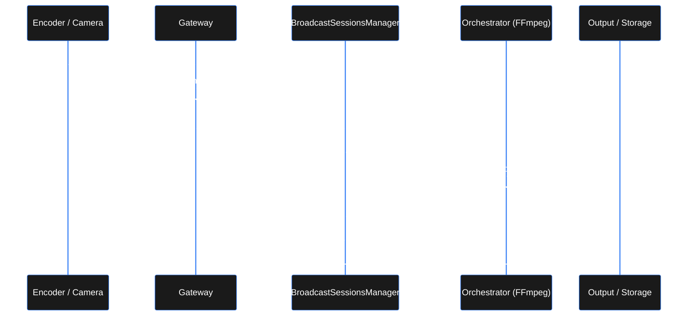
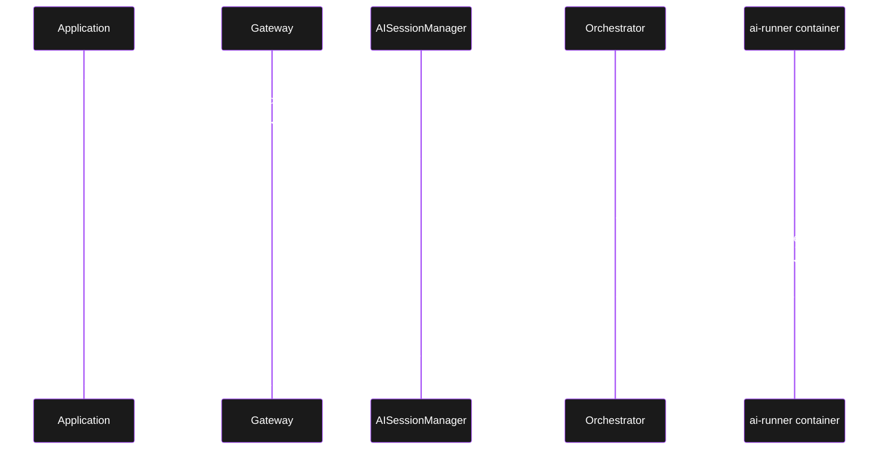

import { DynamicTable } from '/snippets/components/layout/table.jsx'
import { ScrollableDiagram } from '/snippets/components/display/zoomable-diagram.jsx'
import { DoubleIconLink } from '/snippets/components/primitives/links.jsx'

The gateway architecture is defined in the go-livepeer core codebase:

<Card
  title="livepeer/go-livepeer/core/livepeernode.go"
  href="https://github.com/livepeer/go-livepeer/blob/master/core/livepeernode.go"
  icon="github"
  arrow
  horizontal
/>

---

## Dual-mode architecture overview

A single gateway binary handles both video transcoding and AI inference simultaneously. The two pipelines share common infrastructure for job intake, payment, and result delivery, but use separate session managers for routing and dispatching.

```mermaid
%%{init: {'theme': 'base', 'themeVariables': { 'primaryColor': '#1a1a1a', 'primaryTextColor': '#fff', 'primaryBorderColor': '#2d9a67', 'lineColor': '#2d9a67', 'secondaryColor': '#0d0d0d', 'tertiaryColor': '#1a1a1a', 'background': '#0d0d0d', 'fontFamily': 'system-ui' }}}%%
flowchart TB
    subgraph INPUT["Input Sources"]
        direction LR
        RTMP["RTMP Stream<br/>(port 1935)"]
        HTTP["HTTP Upload<br/>(port 8935)"]
        AI_REQ["AI Inference Request<br/>(port 8937)"]
    end

    GATEWAY["Gateway Node<br/>LivepeerNode"]
    INPUT --> GATEWAY

    subgraph MANAGERS["Session Managers"]
        direction LR
        BSM["BroadcastSessionsManager<br/>Video Transcoding"]
        ASM["AISessionManager<br/>AI Processing"]
    end

    GATEWAY --> BSM
    GATEWAY --> ASM

    subgraph VIDEO["Video Pipeline"]
        SEG["Segment Processing"]
        ORCH_V["Orchestrators<br/>(FFmpeg Transcoder)"]
        HLS["HLS / DASH Output"]
    end

    subgraph AI["AI Pipeline"]
        PROC["AI Request Handling"]
        ORCH_AI["Orchestrators<br/>(ai-runner container)"]
        OUT_AI["AI Output<br/>(image / text / audio)"]
    end

    BSM --> SEG --> ORCH_V --> HLS
    ASM --> PROC --> ORCH_AI --> OUT_AI

    subgraph PAYMENT["Payment (Arbitrum)"]
        direction LR
        PAY_SEG["Per segment<br/>probabilistic tickets"]
        PAY_PIX["Per unit<br/>probabilistic tickets"]
    end

    ORCH_V --> PAY_SEG
    ORCH_AI --> PAY_PIX

    classDef default fill:#1a1a1a,color:#fff,stroke:#2d9a67,stroke-width:2px
    classDef video fill:#1a1a1a,color:#fff,stroke:#3b82f6,stroke-width:2px
    classDef ai fill:#1a1a1a,color:#fff,stroke:#a855f7,stroke-width:2px
    class RTMP,HTTP,BSM,SEG,ORCH_V,HLS,PAY_SEG video
    class AI_REQ,ASM,PROC,ORCH_AI,OUT_AI,PAY_PIX ai
    style INPUT fill:#0d0d0d,stroke:#2d9a67,stroke-width:1px
    style MANAGERS fill:#0d0d0d,stroke:#2d9a67,stroke-width:1px
    style VIDEO fill:#0d0d0d,stroke:#3b82f6,stroke-width:1px
    style AI fill:#0d0d0d,stroke:#a855f7,stroke-width:1px
    style PAYMENT fill:#0d0d0d,stroke:#2d9a67,stroke-width:1px
```

<ScrollableDiagram title="Dual Gateway Architecture: Video & AI Pipelines">

</ScrollableDiagram>

---

## Video transcoding pathway

The video pipeline handles RTMP live streams and HTTP-uploaded video.

### Job flow



### Payment unit

Video transcoding is paid **per segment**. Each segment (~2 seconds of source video) triggers a probabilistic payment ticket. The ticket face value is calculated from pixels transcoded (width × height × output renditions).

---

## AI inference pathway

The AI pipeline handles discrete HTTP inference requests routed to orchestrators running specialised ai-runner containers.

### Job flow



### Payment unit

AI inference is paid **per unit**, where the unit varies by pipeline (pixels for image pipelines, tokens for LLM, etc). Payment tickets are issued after each successful inference request.

For live AI video (`live-video-to-video`), payments are issued at a fixed interval (`-livePaymentInterval`, default 5s) rather than per-result.

---

## Video vs AI: lifecycle comparison

<DynamicTable
  headerList={['Property', 'Video transcoding', 'AI inference']}
  itemsList={[
    {
      Property: 'Ingest protocol',
      'Video transcoding': 'RTMP (live) / HTTP (file upload)',
      'AI inference': 'HTTP POST',
    },
    {
      Property: 'Job unit',
      'Video transcoding': 'Segment (~2s of video)',
      'AI inference': 'Inference request',
    },
    {
      Property: 'Session manager',
      'Video transcoding': 'BroadcastSessionsManager',
      'AI inference': 'AISessionManager',
    },
    {
      Property: 'Orchestrator component',
      'Video transcoding': 'FFmpeg transcoder process',
      'AI inference': 'ai-runner Docker container',
    },
    {
      Property: 'Payment basis',
      'Video transcoding': 'Per segment (pixels transcoded)',
      'AI inference': 'Per unit (pixels, tokens — varies by pipeline)',
    },
    {
      Property: 'Payment mechanism',
      'Video transcoding': 'Probabilistic ticket per segment',
      'AI inference': 'Probabilistic ticket per request (or interval for live AI)',
    },
    {
      Property: 'Output format',
      'Video transcoding': 'HLS manifest + .ts segments',
      'AI inference': 'Pipeline-specific (image URL, text, audio file)',
    },
    {
      Property: 'Enabling flag',
      'Video transcoding': '-gateway (default pipeline)',
      'AI inference': '-httpIngest (required)',
    },
    {
      Property: 'Registry (on-chain)',
      'Video transcoding': 'Transcoding network registry',
      'AI inference': '-aiServiceRegistry (separate AI registry)',
    },
  ]}
  monospaceColumns={[0]}
/>

---

## Running both simultaneously (dual mode)

Dual mode is the default when you add `-httpIngest` to a gateway that is already handling video. No additional binary or process is required.

```bash
livepeer -gateway \
  -httpIngest \             # Enables AI inference endpoints alongside video
  -rtmpAddr 0.0.0.0:1935 \ # Video ingest continues on RTMP
  -httpAddr 0.0.0.0:8935 \ # Video HTTP on 8935
  ...
```

<Note>
  AI inference is often configured on port 8937 to make the two pipelines visually distinct in configuration. Both can share port 8935 — the gateway routes based on the URL path, not the port. Using separate ports is a convention, not a requirement.
</Note>

The two session managers operate independently: a surge in AI inference requests does not delay video segment processing, and a slow transcoding session does not block AI jobs. Resource contention is at the hardware level (GPU, network bandwidth) — the gateway software does not arbitrate between them.

---

## Payment architecture

Both pipelines use the same probabilistic micropayment system on Arbitrum, but with different payment events:

```mermaid
%%{init: {'theme': 'base', 'themeVariables': { 'primaryColor': '#1a1a1a', 'primaryTextColor': '#fff', 'primaryBorderColor': '#2d9a67', 'lineColor': '#2d9a67', 'secondaryColor': '#0d0d0d', 'tertiaryColor': '#1a1a1a', 'background': '#0d0d0d', 'fontFamily': 'system-ui' }}}%%
flowchart LR
    subgraph GW["Gateway"]
        DEP["ETH Deposit<br/>(TicketBroker)"]
        TICKET["Issue payment ticket<br/>(off-chain, signed)"]
    end
    subgraph ORCH["Orchestrator"]
        RECV["Receive ticket<br/>with job"]
        WIN["Winning ticket?<br/>(probabilistic check)"]
        REDEEM["Redeem on Arbitrum<br/>(RedeemWinningTicket)"]
    end
    DEP --> TICKET
    TICKET --> RECV
    RECV --> WIN
    WIN -->|Yes ~1%| REDEEM
    WIN -->|No ~99%| RECV
    REDEEM --> DEP

    style GW fill:#0d0d0d,stroke:#2d9a67
    style ORCH fill:#0d0d0d,stroke:#2d9a67
    style DEP fill:#1a1a1a,stroke:#2d9a67
    style TICKET fill:#1a1a1a,stroke:#2d9a67
    style RECV fill:#1a1a1a,stroke:#2d9a67
    style WIN fill:#1a1a1a,stroke:#2d9a67
    style REDEEM fill:#1a1a1a,stroke:#2d9a67
```

<ScrollableDiagram title="Payment Flow">

</ScrollableDiagram>

The gateway maintains a deposit and reserve in the `TicketBroker` contract on Arbitrum. Tickets are issued and transmitted off-chain with each job. Orchestrators check for winning tickets and submit them on-chain for ETH redemption. This achieves ~99% reduction in on-chain transactions compared to per-segment payments while maintaining fair expected value for orchestrators.

See [Gateway Economics](/v2/gateways/about-gateways/gateway-economics) for deposit and payment parameter details.

---

## Related pages

<CardGroup cols={2}>
  <Card
    title="Dual Configuration"
    icon="layer-group"
    href="/v2/gateways/run-a-gateway/configure/dual-configuration"
    arrow
  >
    Startup commands for running video and AI simultaneously
  </Card>
  <Card
    title="Gateway Economics"
    icon="hand-holding-dollar"
    href="/v2/gateways/about-gateways/gateway-economics"
    arrow
  >
    Deposit model, payment tickets, and how orchestrators get paid
  </Card>
  <Card
    title="AI Configuration"
    icon="microchip-ai"
    href="/v2/gateways/run-a-gateway/configure/ai-configuration"
    arrow
  >
    Full AI gateway startup flags and verification
  </Card>
  <Card
    title="Technical Architecture Reference"
    icon="diagram-project"
    href="/v2/gateways/references/technical-architecture"
    arrow
  >
    Deeper technical diagrams and routing path breakdown
  </Card>
</CardGroup>
