import { GotoCard, GotoLink } from '/snippets/components/primitives/links.jsx'
import { DynamicTable } from '/snippets/components/layout/table.jsx'

A gateway is the routing and payment layer between applications and the Livepeer compute network. When your application sends a video stream or an AI inference request, a gateway receives it, discovers which orchestrators can handle the job, dispatches it, and manages the payment relationship — all without doing the compute itself. Gateways are the access point to the network: without one, there is no way to reach the orchestrators that do the actual transcoding and inference work.

<Note>
  In earlier Livepeer documentation, gateways were referred to as **broadcasters**. The role is the same — the name changed as the network expanded beyond video transcoding into AI inference.
</Note>

## Choose your path

<CardGroup cols={2}>
  <Card
    title="Run a Gateway"
    icon="server"
    href="/v2/gateways/run-a-gateway/why-run-a-gateway"
    arrow
  >
    Operate gateway infrastructure. Get direct network access, control your own pricing, and build products on top of the Livepeer network.
  </Card>
  <Card
    title="Use a Gateway"
    icon="plug"
    href="/v2/gateways/using-gateways/choosing-a-gateway"
    arrow
  >
    Access Livepeer compute via an existing hosted gateway. No infrastructure required — just an API key and your first request.
  </Card>
</CardGroup>

---

## How a gateway fits into the network

The Livepeer network has three layers: the protocol (Arbitrum), the compute layer (orchestrators with GPUs), and the access layer (gateways). Gateways sit between your application and the orchestrators.

```mermaid
%%{init: {'theme': 'base', 'themeVariables': { 'primaryColor': '#1a1a1a', 'primaryTextColor': '#fff', 'primaryBorderColor': '#2d9a67', 'lineColor': '#2d9a67', 'secondaryColor': '#0d0d0d', 'tertiaryColor': '#1a1a1a', 'background': '#0d0d0d', 'fontFamily': 'system-ui' }}}%%
flowchart LR
    subgraph APP["Your Application"]
        A["Video stream<br/>AI inference request"]
    end
    subgraph GW["Gateway"]
        B["Job routing<br/>Capability matching<br/>Payment tickets<br/>Session management"]
    end
    subgraph ORCH["Orchestrators"]
        C["GPU compute<br/>Transcoding<br/>AI inference"]
    end
    subgraph PROTO["Arbitrum Protocol"]
        D["Staking<br/>Payments<br/>Rewards"]
    end
    A -->|Request| B
    B -->|Dispatch| C
    C -->|Result| B
    B -->|Response| A
    C <-->|Settlement| D

    classDef default fill:#1a1a1a,color:#fff,stroke:#2d9a67,stroke-width:2px
    style APP fill:#0d0d0d,stroke:#2d9a67,stroke-width:1px
    style GW fill:#0d0d0d,stroke:#2d9a67,stroke-width:1px
    style ORCH fill:#0d0d0d,stroke:#2d9a67,stroke-width:1px
    style PROTO fill:#0d0d0d,stroke:#2d9a67,stroke-width:1px
```



A gateway's responsibilities are:

- **Job intake** — accepting video streams (RTMP) and AI inference requests (HTTP)
- **Capability discovery** — finding orchestrators that support the requested job type, model, and price
- **Routing and dispatch** — sending the job to the best available orchestrator
- **Payment management** — issuing probabilistic payment tickets for work done
- **Session management** — handling retries, failover, and result delivery

Gateways do not do the compute. That is the orchestrator's job.

---

## Mental model: what kind of system is this?

<AccordionGroup>
  <Accordion title="Coming from cloud infrastructure" icon="cloud">
    Running a gateway is similar to operating an **API gateway or L7 load balancer** in cloud computing — it ingests traffic, routes workloads to backend GPU nodes, and manages session flow without doing the heavy compute itself.

    The orchestrators are your auto-scaling GPU fleet. The gateway is the control plane. The Arbitrum protocol is the billing and settlement layer.

    <ScrollableDiagram title="Gateway as Cloud Infrastructure">
    ```mermaid
    %%{init: {'theme': 'base', 'themeVariables': { 'primaryColor': '#1a1a1a', 'primaryTextColor': '#fff', 'primaryBorderColor': '#2d9a67', 'lineColor': '#2d9a67', 'secondaryColor': '#0d0d0d', 'tertiaryColor': '#1a1a1a', 'background': '#0d0d0d', 'fontFamily': 'system-ui' }}}%%
    flowchart LR
        subgraph Clients["Client / Application Layer"]
            A["Apps & SDKs<br/>Video Ingest · AI Inference · WebRTC / HTTP"]
        end
        subgraph Gateway["Gateway Layer"]
            B["Gateway Node<br/><br/>• Auth & rate limiting<br/>• Stream segmentation<br/>• Job routing & dispatch<br/>• Health checks & retry<br/>• Payment tickets"]
        end
        subgraph Compute["Compute Layer"]
            C["Orchestrators<br/>GPU Workers<br/><br/>Auto-scaling GPU fleet<br/>Managed inference pool"]
        end
        subgraph Settlement["Settlement"]
            D["Arbitrum<br/><br/>Payments · Accounting · Security"]
        end
        A -->|Requests| B
        B -->|Dispatch| C
        C -->|Results| B
        B -->|Response| A
        C -->|Usage & proof| D
        classDef default fill:#1a1a1a,color:#fff,stroke:#2d9a67,stroke-width:2px
        style Clients fill:#0d0d0d,stroke:#2d9a67,stroke-width:1px
        style Gateway fill:#0d0d0d,stroke:#2d9a67,stroke-width:1px
        style Compute fill:#0d0d0d,stroke:#2d9a67,stroke-width:1px
        style Settlement fill:#0d0d0d,stroke:#2d9a67,stroke-width:1px
    ```
    </ScrollableDiagram>
  </Accordion>

  <Accordion title="Coming from Ethereum / Web3" icon="coin">
    A gateway is **not** like running a validator. Validators participate in consensus and earn block rewards. Gateways route compute jobs and earn margin on the services they provide.

    The clearest analogy is a **relayer or RPC node** — it's the access layer sitting above the base protocol. It handles off-chain coordination (job routing, capability matching, session state) that would be too expensive or too slow to do on-chain. Payments are settled via probabilistic tickets on Arbitrum, but the actual job routing happens off-chain.

    Key differences from running a validator:
    - Gateways do **not** require staked LPT (that's for orchestrators)
    - Gateways require an **ETH deposit** as collateral for payments
    - Gateway rewards come from **margin on compute fees**, not protocol inflation

    The on-chain footprint of a gateway is minimal: deposit into the `TicketBroker` contract, then operate entirely off-chain until a payment ticket is redeemed.
  </Accordion>

  <Accordion title="Coming from media / broadcast" icon="film">
    Think of a gateway as a **managed origin server or ingest point** — the component that receives live video, segments it, and dispatches the segments to a transcode farm. In traditional broadcast infrastructure, you'd call this the packager or the origin. The orchestrators are your transcode farm.

    The key difference is that the transcode farm is a decentralised, competitive marketplace rather than your own infrastructure. Your gateway discovers available workers, selects based on price and performance, and manages the session — but you don't own or operate the transcoders.

    For AI workloads, extend the analogy: the gateway is the inference proxy that routes requests to GPU workers, each of which has different model support, latency, and pricing.
  </Accordion>
</AccordionGroup>

---

## What's in this section

<CardGroup cols={2}>
  <Card
    title="Architecture"
    icon="diagram-project"
    href="/v2/gateways/about-gateways/gateway-architecture"
    arrow
  >
    How job routing works technically — video and AI pathways, payment flow, and the orchestrator relationship.
  </Card>
  <Card
    title="Economics"
    icon="hand-holding-dollar"
    href="/v2/gateways/about-gateways/gateway-economics"
    arrow
  >
    How gateway operators earn, what costs to expect, and how the margin model works.
  </Card>
  <Card
    title="Functions & Services"
    icon="gears"
    href="/v2/gateways/about-gateways/gateway-functions"
    arrow
  >
    Capability discovery, dynamic pricing, performance competition, and BYOC integration — the marketplace primitives.
  </Card>
  <Card
    title="Why Run a Gateway?"
    icon="circle-question"
    href="/v2/gateways/run-a-gateway/why-run-a-gateway"
    arrow
  >
    The operator opportunity: direct network access, margin on compute, and building products on top.
  </Card>
</CardGroup>
