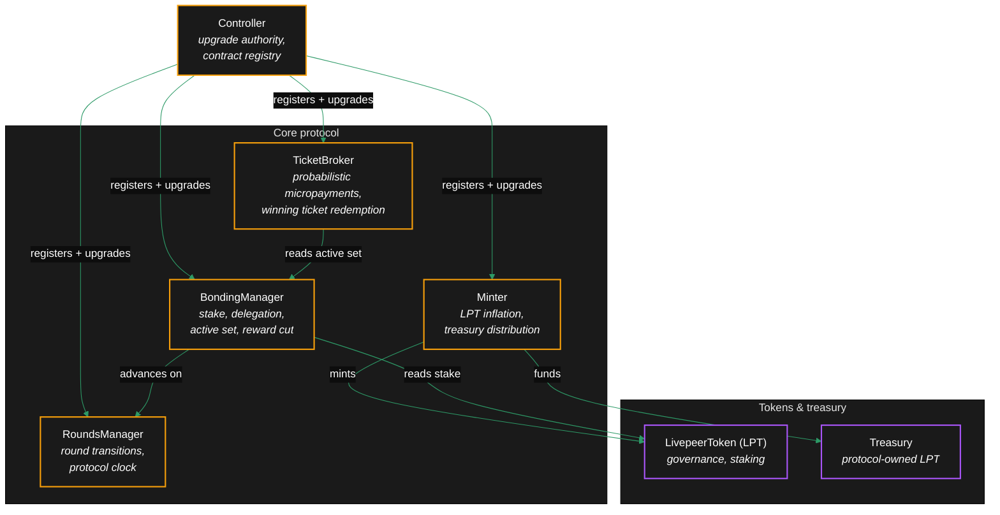
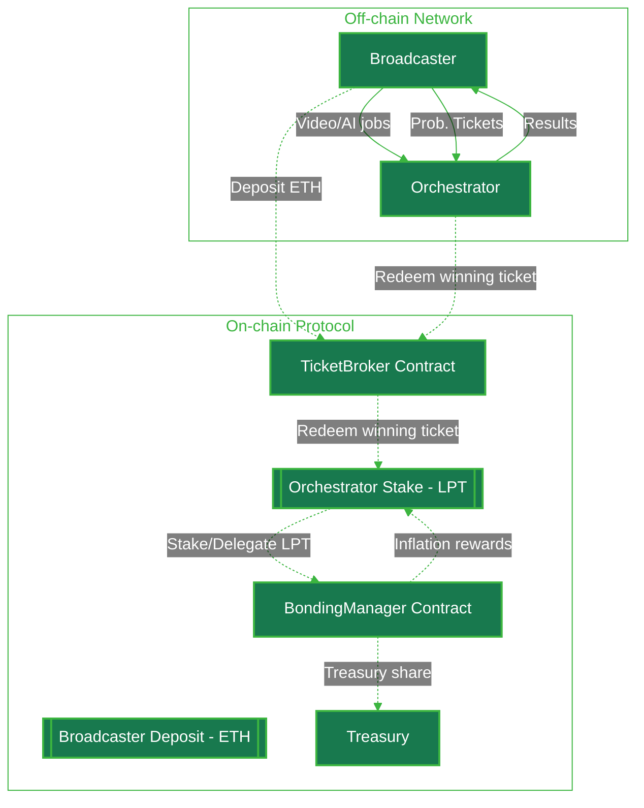
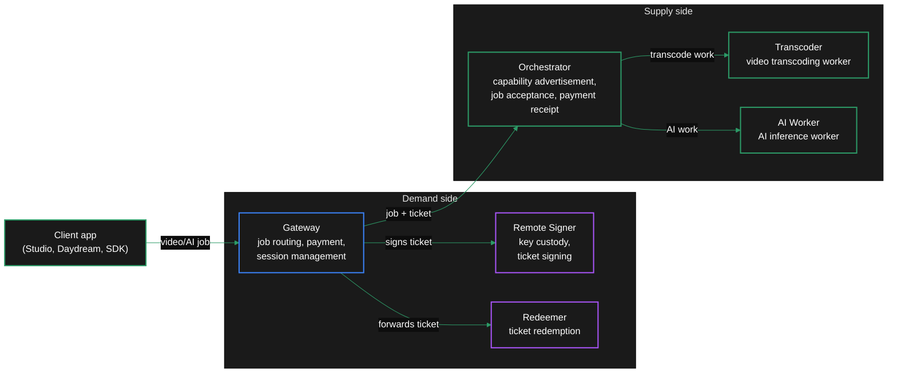
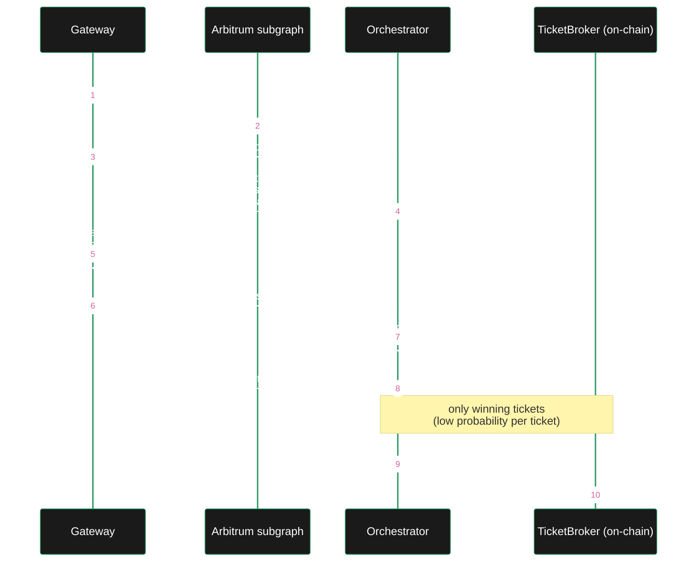
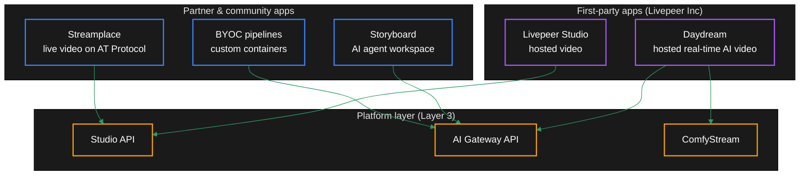
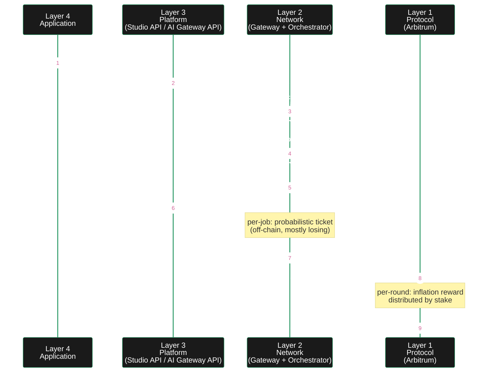

import { CustomDivider } from '/snippets/components/elements/spacing/Divider.jsx'
import { Image } from '/snippets/components/elements/images/Image.jsx'
import { DynamicTableV2 } from '/snippets/components/displays/tables/Tables.jsx'
import { QuadGrid } from '/snippets/components/displays/grids/Grids.jsx'
import { Quote } from '/snippets/components/displays/quotes/Quote.jsx'
import { BorderedBox, CenteredContainer } from '/snippets/components/wrappers/containers/Containers.jsx'
import { BadgeWrapper } from '/snippets/components/wrappers/badges/Badges.jsx'
import { layerBadges } from '../data/badges.jsx'
import { LinkArrow } from "/snippets/components/elements/links/Links.jsx";
import { ScrollableDiagram } from '/snippets/components/displays/diagrams/ScrollableDiagram.jsx'
import { CustomCardTitle } from "/snippets/components/elements/text/Text.jsx";

{/* SCOPE: the layered architecture of Livepeer as a single mental model. Diagram-led. Each layer gets a short description and a link to its deep-dive home. */}

{/* OPENING PARAGRAPH: the stack as a frame. Bottom layer is the protocol (immutable rules); top layer is applications (Studio, Daydream, partners). Everything between is how the rules become work. */}

{/* Diagram: 5-layer stack. Image component or Mermaid. */}

{/* ## Livepeer Infrastructure Layers */}
Livepeer is a decentralised serverless GPU fabric with a cryptoeconomic control plane, where services are exposed through a set of developer-friendly products and applications, enabling real-time compute infrastructure.
{/* Livepeer is akin to how you would access and build on traditional cloud providers, for example, social media is powered by on an underlying infrastructure, which you access through a set of products and applications (e.g. Twitter, Instagram, Facebook). */}

<QuadGrid gap="var(--lp-spacing-6)">
    <BorderedBox variant="accent">
        **Protocol**
        <BadgeWrapper badges={[layerBadges.protocol]} />
        The **Protocol** provides trust, coordination and payment mechanisms.
        Using crypto‑economic primitives, the protocol implements the incentives, staking, governance, and payments rails of the decentralised network.
        <br/>
        <LinkArrow href="/v2/about/protocol/design" label="Livepeer Protocol" />
    </BorderedBox>

    <BorderedBox variant="accent">
        **Network**
        <BadgeWrapper badges={[layerBadges.orchestrator, layerBadges.gateway]} />
        The **Network** supplies compute, job routing, and verification.
        Orchestrators provide a global GPU network that performs the actual compute work, while Gateways handle job routing and verification.
        <br/>
        <LinkArrow href="/v2/about/network/design" label="Livepeer Network" />
    </BorderedBox>

    <BorderedBox variant="accent">
        **Platforms**
        <BadgeWrapper badges={[layerBadges.gateway, layerBadges.platform]} />
        **Platforms** provide a set of developer‑facing tools and platforms (APIs, SDKs, platforms) which expose the network's capabilities for developers to build on and integrate with, without requiring deep knowledge of the underlying infrastructure.
        <br/>
        <LinkArrow href="/v2/developers/" label="Livepeer for Developers" />
    </BorderedBox>

    <BorderedBox variant="accent">
        **Applications**
        <BadgeWrapper badges={[layerBadges.application, layerBadges.solution]} />
        **Applications** are the products and solutions built on top of the network. They are the end-user experiences that leverage the underlying infrastructure to provide AI and video capabilities for user products.
        <br/>
        <br/>
        <LinkArrow href="/v2/solutions/" label="Livepeer Solutions" />
    </BorderedBox>
</QuadGrid>

<br/>
_**Protocol vs Network vs Platform**_

<DynamicTableV2
  headerList={['Concern', 'Lives Where', 'Examples']}
  itemsList={[
    {
      Concern: 'Security & incentives',
      'Lives Where': 'Protocol',
      Examples: 'LPT, staking, inflation',
    },
    {
      Concern: 'Performance & routing',
      'Lives Where': 'Network',
      Examples: 'Orchestrators, fees',
    },
    {
      Concern: 'UX & onboarding',
      'Lives Where': 'Platform',
      Examples: 'APIs, dashboards',
    },
    {
      Concern: 'Creativity & apps',
      'Lives Where': 'Application',
      Examples: 'Daydream, studios',
    },
  ]}
/>

The **protocol** provides trust, coordination and payment mechanisms, the **network** supplies compute, routing, and verification, and **platforms** expose the network's capabilities in a usable way.

## Infrastructure Layers
Livepeer is a decentralised serverless GPU fabric with a cryptoeconomic control plane, where services are exposed through a set of developer-friendly products and applications, enabling real-time compute infrastructure.
{/* Livepeer is akin to how you would access and build on traditional cloud providers, for example, social media is powered by on an underlying infrastructure, which you access through a set of products and applications (e.g. Twitter, Instagram, Facebook). */}

Livepeer's crypto-economic primitives and decentralised compute mesh provide additional benefits to the system such as censorship resistance, economic security, and trustless coordination.

{/* One sub-section per layer. Each: 2-3 sentences. What it is, who runs it, where it lives in the codebase, link to the section that covers it in depth. */}

<DynamicTableV2
  headerList={["Layer", "Role"]}
  itemsList={[
    { "Layer": "Client Layer", "Role": "Streams or submits jobs via Application Layer (eg. CLI, SDK, API)" },
    { "Layer": "Gateway Layer", "Role": "Receives jobs, initiates session routing" },
    { "Layer": "Orchestrator Layer", "Role": "Bids on sessions, runs compute nodes" },
    { "Layer": "Worker Layer", "Role": "Performs transcoding / AI inference" },
    { "Layer": "Off-chain Manager", "Role": "Handles bonding sync, ticket validation" },
    { "Layer": "L2 Contracts (ARB)", "Role": "TicketBroker, BondingManager, Delegator claims, reward withdrawal" },
    { "Layer": "L1 Contracts (ETH)", "Role": "LivepeerToken, BridgeMinter - token issuance & bridging only" },
  ]}
/>

# Livepeer Protocol and Network Architecture

Livepeer's crypto-economic primitives and decentralised compute mesh provide additional benefits to the system such as censorship resistance, economic security, and trustless coordination.

<Image src="/snippets/assets/media/diagrams/livepeer_network_protocol_layperson.svg" alt="Livepeer Network Protocol Layperson" caption="Livepeer Protocol and Network Layers" />

<Image src="/snippets/assets/media/diagrams/livepeer_network_protocol_technical.svg" alt="Livepeer Network Protocol Technical" caption="Livepeer Protocol and Network Architecture" />

### Protocol contracts
{/* BondingManager, TicketBroker, RoundsManager, Minter, Controller. Live on Arbitrum One. Link → Protocol → Architecture. */}

The Livepeer protocol is a set of Solidity contracts deployed to Arbitrum One. Five contracts carry the load: `BondingManager` tracks stake and delegation, `TicketBroker` issues and redeems probabilistic micropayment tickets, `RoundsManager` advances the protocol clock, `Minter` issues LPT inflation, and `Controller` is the upgrade authority that registers all the others.

<ScrollableDiagram title="Protocol Contracts on Arbitrum One" maxHeight="600px">



</ScrollableDiagram>

These contracts run unchanged across every node in the network. An orchestrator earns by redeeming winning tickets at `TicketBroker` and reward calls at `BondingManager`; a delegator earns by bonding LPT through `BondingManager`. See [Protocol Architecture](/v2/about/protocol/architecture) for contract addresses and ABIs.

{/* <ScrollableDiagram title="Livepeer Protocol System Diagram" maxHeight="600px">



</ScrollableDiagram> */}

<Card title={<CustomCardTitle title="See full contract details" icon="file-code"/>} href="/v2/developers/protocol/architecture" arrow />

### Network nodes

{/* go-livepeer binary running as orchestrator, transcoder, gateway. Link → Network → Architecture. */}
The network layer is a single binary, `go-livepeer`, run in different modes. One mode is the gateway: it accepts video and AI jobs from clients, selects an orchestrator, and settles payment in tickets. Another is the orchestrator: it advertises capabilities, receives jobs, runs them, and redeems winning tickets on-chain. The transcoder mode is a worker that an orchestrator can split off onto a separate machine to scale horizontally. Newer modes — redeemer and remote signer — separate ticket redemption and key custody from the live job path so that gateway implementations in other languages can integrate.

<ScrollableDiagram title="go-livepeer Node Modes" maxHeight="600px">



</ScrollableDiagram>

A small operator runs a single binary that fills both gateway and orchestrator roles. A larger operator splits the modes onto separate machines: orchestrator on the network edge, transcoders or AI workers behind it on a private subnet. See [Network Architecture](/v2/network/architecture) for the deployment topology.

### Off-chain coordination

{/* Discovery, capabilities advertisement, off-chain payment ticketing. Link → Network → Marketplace. */}

Most of what happens on the network never touches a contract. Gateways discover orchestrators through the on-chain subgraph, direct configuration, a webhook, or the Network Capabilities API. Orchestrators advertise capabilities and prices in `OrchestratorInfo` messages. Payment runs in probabilistic micropayment tickets that batch off-chain until a winning ticket triggers an on-chain redemption. This off-chain layer is what makes per-frame, per-pixel pricing economical.

<ScrollableDiagram title="Off-Chain Coordination Loop" maxHeight="600px">



</ScrollableDiagram>

The off-chain loop is what scales the network: thousands of jobs and tickets per second between gateway and orchestrator, with on-chain settlement only when a ticket wins. See [Marketplace and Discovery](/v2/network/marketplace) for the full discovery and selection algorithm.

### AI Runtime

{/* ai-worker (Go) + ai-runner (Python) for model inference. Link → Network → Capabilities. */}

The AI runtime sits inside the orchestrator. `ai-worker` is a Go subsystem in `go-livepeer` that owns the orchestrator-side job lifecycle: it receives an AI job from the gateway, picks a registered pipeline, starts or wakes the corresponding container, and streams frames in and out. Each pipeline runs as a separate `ai-runner` Python container, isolated by GPU and model. The transport between `ai-worker` and `ai-runner` for real-time work is the trickle protocol; for batch work it is a request/response HTTP API. ComfyStream is one such container, offering a ComfyUI-graph runtime for real-time video-to-video pipelines.

<ScrollableDiagram title="AI Runtime — ai-worker and ai-runner" maxHeight="600px">

    ```mermaid
    %%{init: {'theme': 'base', 'themeVariables': { 'primaryColor': '#1a1a1a', 'primaryTextColor': '#fff', 'primaryBorderColor': '#2d9a67', 'lineColor': '#2d9a67', 'secondaryColor': '#0d0d0d', 'tertiaryColor': '#1a1a1a', 'background': '#0d0d0d', 'fontFamily': 'system-ui' }}}%%
    flowchart TB
        classDef default fill:#1a1a1a,color:#fff,stroke:#2d9a67,stroke-width:2px
        classDef goproc fill:#1a1a1a,color:#fff,stroke:#2d9a67,stroke-width:2px
        classDef py fill:#1a1a1a,color:#fff,stroke:#a855f7,stroke-width:2px
        classDef cfg fill:#1a1a1a,color:#fff,stroke:#f59e0b,stroke-width:2px

        Gateway["Gateway<br/>(remote)"]:::default

        subgraph Orchestrator["Orchestrator host"]
            Orch["go-livepeer<br/>orchestrator process"]:::goproc
            AIWorker["ai-worker subsystem<br/>job dispatch, container<br/>lifecycle, payment"]:::goproc

            subgraph Containers["ai-runner containers"]
                Batch["Batch pipelines<br/>text-to-image,<br/>image-to-video,<br/>audio-to-text…"]:::py
                Realtime["Real-time pipelines<br/>live-video-to-video,<br/>ComfyStream"]:::py
            end

            AIModels["aiModels.json<br/><i>configured pipelines<br/>+ pricing</i>"]:::cfg
        end

        Gateway -->|AI job| Orch
        Orch -->|dispatch| AIWorker
        AIWorker -->|HTTP request/response| Batch
        AIWorker -->|trickle protocol<br/>(WebRTC frames)| Realtime
        AIModels -->|loaded at start| AIWorker
    ```

</ScrollableDiagram>

An orchestrator declares which pipelines it serves through `aiModels.json`, which sets per-pipeline pricing and warm-model strategy. See [AI Capabilities](/v2/network/capabilities) for the pipeline catalogue and pricing units.

### Applications and integrations

{/* Studio, Daydream, partner integrations, BYOC. Link → Solutions tab. */}

Applications are the products built on the layers below. Livepeer Studio is the hosted video product run by Livepeer Inc — streaming, VOD, transcoding, and the embeddable player behind an API key. Daydream is the hosted real-time AI video product, built on ComfyStream and the AI Gateway API. Storyboard is an AI agent workspace that uses Daydream as its inference backend. Streamplace is the live-video product for the AT Protocol and Bluesky. BYOC ("bring your own container") is the path for a partner to plug a custom AI pipeline into the network as an orchestrator-side container.

<ScrollableDiagram title="Applications and Their Layer Position" maxHeight="600px">



</ScrollableDiagram>

A reader choosing where to build picks the highest layer that meets their needs. Studio for managed video, Daydream for managed AI video, the AI Gateway API for direct network calls, ComfyStream for custom real-time pipelines, BYOC for new pipeline types. See [Solutions](/v2/solutions) for the full product catalogue.

## How the layers interact

{/* One paragraph: a job flows top-down, payment flows bottom-up, governance flows across. */}

A job is the test: it touches every layer in one round trip. The job descends from an application call to platform routing to network compute, then settles back up in payment to the operator and a small redemption fee on-chain. Governance acts across, not through, the live job path.

<ScrollableDiagram title="One Job Through the Stack" maxHeight="700px">



</ScrollableDiagram>

The protocol does not see most jobs — it only sees the ones whose tickets win and the per-round inflation distribution. That is the design that makes per-pixel and per-token pricing viable on Arbitrum.

{/* ## The stack at a glance

From a **marketplace** perspective, Livepeer has:
<BorderedBox variant="accent">
A **demand-side** agent
- An app, platform, or operator: requests video or AI jobs;

A **supply-side** agent
- Orchestrators and their GPU capacity, (optionally backed by separate worker processes): performs compute and other work;

A **platform** aggregator
- The Protocol: provides the governance, payment primitives and reward system to coordinate open participation and make the market viable at scale.
</BorderedBox>

From a **systems engineering** perspective, Livepeer has:
<BorderedBox variant="accent">
- A **hardware layer** of GPU nodes (Orchestrators) that perform the compute work
- A **network layer** of `go-livepeer` nodes that handle job routing, verification and payment;
- A **software layer** of services built on top of the network layer (e.g. Studio, Daydream, ComfyStream) that provide additional functionality and services to the network.
- A **protocol layer** of smart contracts that enforce the rules of the network.
- An **economics layer** of tokenomics and game theory that aligns incentives.
</BorderedBox>

### Mental Model
<CenteredContainer preset="readable90">
  <Quote>
  Livepeer is a crypto-economic coordination protocol that secures a global, on-demand GPU network optimised for low-latency video and AI, exposed through developer-friendly platforms and applications.
  {/* <Note> image would be good </Note> */}
  {/* It includes a protocol layer that implements the economic incentives and rules of the system, a network layer of independently operated nodes that perform the compute work, and a growing ecosystem of platforms and applications that expose the network's capabilities in usable ways. */}
  {/* </Quote>
</CenteredContainer>

See Livepeer as an [OSI Stack Model](/v2/developers/) for a more detailed mental model of how the layers interact and relate to each other.

<CustomDivider margin="medium" /> */}
