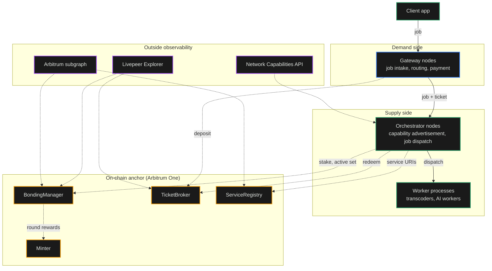
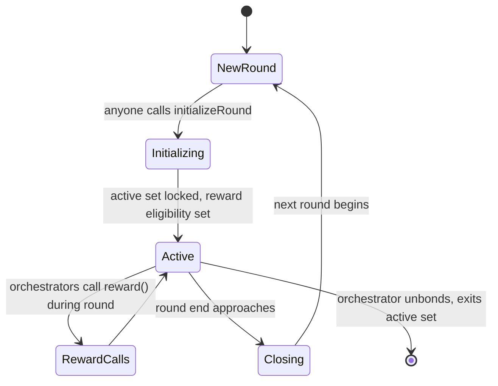

import { CustomCardTitle, Subtitle } from '/snippets/components/elements/text/Text.jsx'
import { Quote } from '/snippets/components/displays/quotes/Quote.jsx'
import { CustomDivider } from '/snippets/components/elements/spacing/Divider.jsx'
import { LinkArrow } from '/snippets/components/elements/links/Links.jsx'
import { DynamicTableV2 } from '/snippets/components/displays/tables/Tables.jsx'
import { ScrollableDiagram } from '/snippets/components/displays/diagrams/ScrollableDiagram.jsx'
import { BorderedBox } from '/snippets/components/wrappers/containers/Containers.jsx'

<Quote>
The Network is a population of `go-livepeer` nodes coordinating off-chain, anchored to four protocol contracts on Arbitrum One. The Network is observable from outside through the Explorer, the subgraph, and the Network Capabilities API.
</Quote>

<CustomDivider style={{ margin: 0, marginBottom: '-2rem' }} />

## Architectural Layers

<DynamicTableV2
  headerList={['Layer', 'What it is', 'What it answers', 'Rate of change']}
  itemsList={[
    {
      Layer: <Subtitle variant="changelog">**Node population**</Subtitle>,
      'What it is': 'The running `go-livepeer` processes operated by Gateways, Orchestrators, and their attached workers',
      'What it answers': 'What nodes are running, what role each plays, how they connect to clients and to each other',
      'Rate of change': 'Continuous (release-cadence weekly)',
    },
    {
      Layer: <Subtitle variant="changelog">**Off-chain coordination**</Subtitle>,
      'What it is': 'Direct Gateway-to-Orchestrator traffic: capability advertisement, job dispatch, ticket exchange, real-time frame transport',
      'What it answers': 'How nodes find each other, agree on price, exchange work, and pay for it without touching the chain',
      'Rate of change': 'Per-session and per-job',
    },
    {
      Layer: <Subtitle variant="changelog">**On-chain anchor**</Subtitle>,
      'What it is': 'Four protocol contracts on Arbitrum One that the off-chain layer reads and writes against',
      'What it answers': 'What the Network commits to permanently, where stake and settlement live, what is publicly auditable',
      'Rate of change': 'Per round (~21 hours), per winning ticket',
    },
  ]}
/>

<CustomDivider style={{ margin: '-1rem 0 -2rem 0' }} />

## Network Topology

The Network is operated by independent participants. Orchestrators run GPU nodes and any workers attached to them. Gateways run routing and payment infrastructure. Both run the same `go-livepeer` binary in different modes. A small operator runs one process; a large operator splits the modes across separate hosts on a private subnet, with the Orchestrator on the network edge.

<ScrollableDiagram title="Network Topology and the Boundary it Anchors To" maxHeight="700px">

</ScrollableDiagram>

Solid arrows are off-chain traffic at job rate. Dashed arrows from the nodes to the chain are settlement and registration, at lower frequency. Dashed arrows from the observability surfaces are read-only data flows that let outside readers see what the Network is doing without operating any of it.

<CustomDivider style={{ margin: '-1rem 0 -2rem 0' }} />

## Traffic Planes

Inside the Network, four distinct kinds of traffic move on different transports at different rates. Separating them clarifies what scales, what bottlenecks, and what an outside observer can see.

<DynamicTableV2
  headerList={['Plane', 'What flows', 'Transport', 'Cadence']}
  itemsList={[
    {
      Plane: <Subtitle variant="changelog">**Control**</Subtitle>,
      'What flows': 'Capability advertisement, discovery queries, session establishment',
      Transport: 'gRPC and HTTP between Gateway and Orchestrator',
      Cadence: 'Per-session (seconds to minutes)',
    },
    {
      Plane: <Subtitle variant="changelog">**Data**</Subtitle>,
      'What flows': 'Video segments, AI inference inputs and outputs, real-time frames',
      Transport: 'HTTP for batch jobs; trickle for real-time AI; RTMP/WHIP for live ingest',
      Cadence: 'Per-segment or per-frame (sub-second to seconds)',
    },
    {
      Plane: <Subtitle variant="changelog">**Payment**</Subtitle>,
      'What flows': 'Probabilistic micropayment tickets, winning ticket redemptions',
      Transport: 'Off-chain ticket exchange in HTTP headers; on-chain redemption to `TicketBroker`',
      Cadence: 'Per-segment off-chain; per-winning-ticket on-chain',
    },
    {
      Plane: <Subtitle variant="changelog">**Observability**</Subtitle>,
      'What flows': 'Round state, stake changes, ticket events, service URI updates, governance votes',
      Transport: 'Subgraph indexer, Explorer front-end, leaderboard API',
      Cadence: 'Continuous read; updates per round and per on-chain event',
    },
  ]}
/>

The control and data planes are sized for production volume. The payment plane uses probabilistic settlement so the on-chain layer never sees per-segment traffic. The observability plane is read-only and decoupled from job execution.

<CustomDivider style={{ margin: '-1rem 0 -2rem 0' }} />

## Round Lifecycle

The on-chain layer advances in **rounds** of approximately 21 hours each (~5,760 Arbitrum L2 blocks). The Active Set, which Orchestrators are eligible for video work, locks at the start of each round. Per-round inflation rewards distribute through `BondingManager`. The round is the cadence at which the protocol meets the Network.

<ScrollableDiagram title="Round Lifecycle" maxHeight="400px">

</ScrollableDiagram>

Mid-round, capability advertisement and pricing can change. Eligibility cannot. An Orchestrator that wants to enter the Active Set bonds during a round; eligibility takes effect at the next round boundary.

<CustomDivider style={{ margin: '-1rem 0 -2rem 0' }} />

## Off-Chain Coordination

The off-chain layer is what the Network is sized for. Discovery, capability advertisement, price agreement, job dispatch, and ticket exchange all happen here, between Gateway and Orchestrator, over standard transports. The chain stays out of the hot path.

Four communication patterns run continuously across the off-chain layer:

<DynamicTableV2
  headerList={['Pattern', 'Who participates', 'What flows']}
  itemsList={[
    {
      Pattern: <Subtitle variant="changelog">**Capability advertisement**</Subtitle>,
      'Who participates': 'Orchestrator publishes; Gateways read',
      'What flows': '`OrchestratorInfo` messages: capability set, price-per-unit, ticket parameters',
    },
    {
      Pattern: <Subtitle variant="changelog">**Discovery and selection**</Subtitle>,
      'Who participates': 'Gateway queries; protocol contracts and Orchestrators respond',
      'What flows': 'Candidate lists from `ServiceRegistry` (often via subgraph), then per-candidate `OrchestratorInfo`',
    },
    {
      Pattern: <Subtitle variant="changelog">**Job dispatch and result return**</Subtitle>,
      'Who participates': 'Gateway and Orchestrator',
      'What flows': 'Segments and frames in; transcoded or generated output back; tickets attached to each segment',
    },
    {
      Pattern: <Subtitle variant="changelog">**Real-time frame transport**</Subtitle>,
      'Who participates': 'Gateway and Orchestrator AI worker',
      'What flows': 'Live video frames over the trickle protocol for sub-second AI pipelines',
    },
  ]}
/>

<Tip>
The Active Set, which Orchestrators are eligible for video work, locks at the start of each round. Capability advertisement and pricing can change mid-round; eligibility cannot.
</Tip>

<CustomDivider style={{ margin: '-1rem 0 -2rem 0' }} />

## On-Chain Anchor Contracts

The Network reads from and writes to four contracts on Arbitrum One. These are the surfaces the off-chain layer relies on for ground truth.

<DynamicTableV2
  headerList={['Contract', 'What the Network uses it for']}
  itemsList={[
    {
      Contract: <Subtitle variant="changelog">**`BondingManager`**</Subtitle>,
      'What the Network uses it for': 'Source of truth for Orchestrator stake, active-set membership, and reward-cut configuration. Read by Gateways during selection; written by Orchestrators when calling `reward` each round.',
    },
    {
      Contract: <Subtitle variant="changelog">**`TicketBroker`**</Subtitle>,
      'What the Network uses it for': 'Holds Gateway deposits and reserves. Receives winning ticket redemptions. Settles ETH from the Gateway side to the Orchestrator side.',
    },
    {
      Contract: <Subtitle variant="changelog">**`ServiceRegistry`**</Subtitle>,
      'What the Network uses it for': 'Holds the service URI each Orchestrator publishes. Read by Gateways during discovery to know where each Orchestrator is reachable.',
    },
    {
      Contract: <Subtitle variant="changelog">**`Minter`**</Subtitle>,
      'What the Network uses it for': 'Mints LPT inflation per round. Distributed to bonded stake when Orchestrators call `reward`. The reward stream that runs in parallel to job-fee settlement.',
    },
  ]}
/>

<Card title={<CustomCardTitle icon="file-code" title="Blockchain Contracts" />} href="/v2/about/protocol/blockchain-contracts" horizontal arrow > Full contract addresses, ABIs, and reference. </Card>

<CustomDivider style={{ margin: '-1rem 0 -2rem 0' }} />

## External Observability

The Network is observable from outside through three surfaces. Researchers, evaluators, and integrators do not need to operate any node to see what the Network is doing.

<DynamicTableV2
  headerList={['Surface', 'What it exposes', 'Who uses it']}
  itemsList={[
    {
      Surface: <Subtitle variant="changelog">**Livepeer Explorer**</Subtitle>,
      'What it exposes': 'Active Orchestrators, bonded supply, Active Set, round state, treasury balance, governance proposals',
      'Who uses it': 'Delegators choosing Orchestrators; researchers citing network state; operators monitoring round status',
    },
    {
      Surface: <Subtitle variant="changelog">**Arbitrum subgraph**</Subtitle>,
      'What it exposes': 'Indexed view of all on-chain events: stake changes, ticket redemptions, reward calls, governance votes',
      'Who uses it': 'Gateways during discovery; data products and dashboards; researchers running historical queries',
    },
    {
      Surface: <Subtitle variant="changelog">**Network Capabilities API**</Subtitle>,
      'What it exposes': 'Aggregated Orchestrator capability data across the network: which AI pipelines, which transcoding profiles, which BYOC containers',
      'Who uses it': 'Gateways needing capability filtering richer than `ServiceRegistry` alone; integrators evaluating coverage',
    },
  ]}
/>

The three surfaces share a property: they let an outside reader build a real picture of the Network's state without trusting any single operator. Each surface reads ground truth from the chain or from operator-published data, not from a central authority.

<Card title={<CustomCardTitle icon="chart-line" title="Observability" />} href="/v2/about/network/observability" horizontal arrow > How to read the Network state from outside. </Card>

<CustomDivider />

## Related Pages

<Columns cols={2}>
  <Card title={<CustomCardTitle icon="circle-nodes" title="Network Design" />} href="/v2/about/network/design" horizontal arrow>
    Purpose, properties, actors.
  </Card>
  <Card title={<CustomCardTitle icon="store" title="Marketplace Model" />} href="/v2/about/network/marketplace-model" horizontal arrow>
    Market shape, settlement, verification.
  </Card>
  <Card title={<CustomCardTitle icon="plug" title="Network Interfaces" />} href="/v2/about/network/interfaces" horizontal arrow>
    Reachable surfaces and entry points.
  </Card>
  <Card title={<CustomCardTitle icon="diagram-project" title="Infrastructure Stack" />} href="/v2/about/concepts/livepeer-stack" horizontal arrow>
    The four-layer Livepeer stack.
  </Card>
</Columns>
