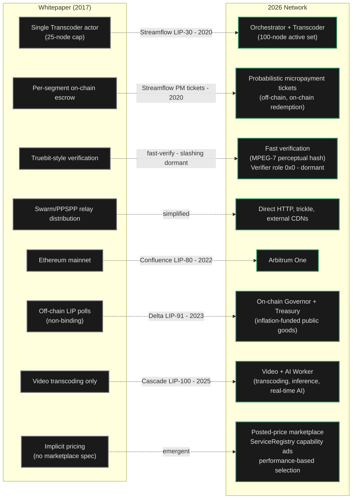

import { CardTitleTextWithArrow, CustomCardTitle, Subtitle } from '/snippets/components/elements/text/Text.jsx'
import { Quote, FrameQuote } from '/snippets/components/displays/quotes/Quote.jsx'
import { CustomDivider } from '/snippets/components/elements/spacing/Divider.jsx'
import { LinkArrow } from '/snippets/components/elements/links/Links.jsx'
import { DynamicTableV2 } from '/snippets/components/displays/tables/Tables.jsx'
import { StyledSteps, StyledStep } from '/snippets/components/displays/steps/Steps.jsx'
import { ScrollableDiagram } from '/snippets/components/displays/diagrams/ScrollableDiagram.jsx'
import { BorderedBox } from '/snippets/components/wrappers/containers/Containers.jsx'
import { QuadGrid } from '/snippets/components/displays/grids/Grids.jsx'

<Quote>
    The Network is the **off-chain execution layer** responsible for _running the work_, _routing jobs to the right operators_, and _settling payment_ at production volume. The Protocol enforces the rules; the Network does the work.
</Quote>

<CustomDivider style={{ margin: 0, marginBottom: '-2rem' }} />

## Network Role

The Network was designed to deliver real-time video and AI compute at production volume on a permissionless, open marketplace.

The Network provides the **off-chain** execution layer for Livepeer with GPU operators accepting jobs, gateways routing demand, and payments settling continuously off-chain.

The **Livepeer Network** is implemented by nodes running [`go-livepeer`](https://github.com/livepeer/go-livepeer) that accept jobs, perform compute, transcoding and AI inference, exchange off-chain payments, and then settle on-chain.

<Card title={<CustomCardTitle icon="cubes" title="Network Implementation, Actors & Node Mechanisms" />} arrow href="/v2/about/network/actors" />

## Network Design Principles

The 2017 whitepaper specified core design principles for the Livepeer video broadcasting network:

<StyledSteps iconColor="var(--accent)" titleColor="var(--accent)">
  <StyledStep title="Protocol Boundary" icon="scale-balanced">
    The chain enforces; the Network executes. The Protocol records stake, settles winning tickets, distributes inflation. The Network handles every job that does not touch the chain. The split is what lets execution change quickly while the rules stay slow.
  </StyledStep>
  <StyledStep title="Permissionless Participation" icon="door-open">
    Anyone with compatible hardware can register an orchestrator and start receiving jobs. Anyone can run a gateway and route demand. No application process, no vendor relationship, no gatekeeper. Capacity grows whenever a new operator joins.
  </StyledStep>
  <StyledStep title="Off-Chain Settlement" icon="bolt">
    Jobs are paid through probabilistic micropayment tickets exchanged off-chain. Only winning tickets touch the chain. This is what makes per-pixel and per-token pricing economical at production volume; on-chain settlement per job would cost more than the work itself.
  </StyledStep>
  <StyledStep title="Workload-Agnostic Runtime" icon="cubes">
    The same `go-livepeer` binary runs video transcoding, batch AI inference, and real-time live video-to-video. New capabilities ship as new pipelines, not as forks or hard upgrades. The Network expands by capability, not by replacement.
  </StyledStep>
  <StyledStep title="Open Coordination" icon="signal-stream">
    Discovery, capability advertisement, and price are all public. Gateways query orchestrators directly; orchestrators publish what they can do and what they charge. Price competition is visible. The marketplace is a marketplace, not a queue.
  </StyledStep>
  <StyledStep title="Stake-Anchored Trust" icon="shield-halved">
    Orchestrators bond LPT to participate. Their stake is the economic exposure that backs their work; misbehaviour or downtime costs them. The Network is trustworthy without a central operator because stake makes it costly to behave otherwise.
  </StyledStep>
  <StyledStep title="Anchor in the Protocol" icon="link">
    Every off-chain interaction resolves against on-chain truth: stake on `BondingManager`, deposits on `TicketBroker`, capabilities advertised through `ServiceRegistry`. The off-chain layer scales freely; the on-chain layer settles authoritatively.
  </StyledStep>
</StyledSteps>

## Design Decisions

The Network's design reflects deliberate choices made to preserve the seven properties at scale.

- **Single binary, multiple modes**: `go-livepeer` runs as gateway, orchestrator, or worker. One codebase, one upgrade path. A new operator does not pick between products; they pick a mode.
- **Probabilistic micropayments off-chain**: Tickets accumulate off-chain; only winning tickets are submitted to the on-chain `TicketBroker`. Per-pixel video and per-token AI become economical because on-chain settlement per job would exceed the price of the work.
- **Posted prices, not auctions**: Orchestrators publish a price-per-unit; gateways accept or reject. No bidding round. The market runs continuously; price competition is visible; gateways route work without per-job coordination.
- **Stake gates the active set**: Bonded LPT determines which orchestrators are eligible for video work each round. The reliability of the Network is anchored in the economic exposure of its operators.
- **Pipelines, not protocol upgrades**: New AI capabilities ship as new pipelines an orchestrator chooses to run. Adding capacity for a new workload does not require a hard fork or a governance vote.

<Tip>
Slashing exists in the Protocol but is currently dormant: the on-chain Verifier role is set to `0x0`. Honest work is enforced today through stake exposure, fast verification, and marketplace selection, not active on-chain slashing.
</Tip>

<CustomDivider style={{ margin: '-1rem 0 -2rem 0' }} />

## Network Evolution

<FrameQuote author="Livepeer Whitepaper (2017)" href="/v2/about/resources/knowledge-hub/livepeer-whitepaper">
The Livepeer protocol described an **open, decentralised network** for live video transmission, where **transcoding capacity is provided by node operators in exchange for fees**, and where the system can scale to meet demand without requiring permission from any central authority.
</FrameQuote>

The design principles and mechanisms outlined in the whitepaper have been preserved and expanded upon in the real-world implementation of the Livepeer Network, which has evolved to meet the demands of production workloads while adhering to the core tenets of decentralisation, permissionless participation, and economic security.

The Network's design continues to reflect the original vision of an open, decentralised marketplace for video and AI compute, while incorporating new features and optimisations that have emerged through real-world usage and community feedback over time.

<ScrollableDiagram title="Livepeer Network Evolution" maxHeight="600px">

</ScrollableDiagram>

<CustomDivider style={{ margin: '-1rem 0 -2rem 0' }} />

## Network Participants

<DynamicTableV2
  headerList={['Actor', 'What they run', 'What they take on', 'What they earn']}
  itemsList={[
    {
      Actor: <Subtitle variant="changelog">**Orchestrator**</Subtitle>,
      'What they run': '`go-livepeer` in orchestrator mode plus attached transcoders and AI workers',
      'What they take on': 'GPU hardware, bonded LPT, operational uptime',
      'What they earn': 'ETH fees from jobs, LPT inflation rewards each round',
    },
    {
      Actor: <Subtitle variant="changelog">**Gateway**</Subtitle>,
      'What they run': '`go-livepeer` in gateway mode, optionally with redeemer and remote signer',
      'What they take on': 'ETH deposit and reserve, routing infrastructure, client-facing service',
      'What they earn': 'Margin between price paid to orchestrators and price charged to clients',
    },
    {
      Actor: <Subtitle variant="changelog">**Delegator**</Subtitle>,
      'What they run': 'No node. Bonds LPT to one orchestrator through the Explorer',
      'What they take on': "Capital exposure to LPT and to the chosen orchestrator's performance",
      'What they earn': "Share of the orchestrator's ETH fees and LPT inflation, by stake share",
    },
    {
      Actor: <Subtitle variant="changelog">**Client**</Subtitle>,
      'What they run': 'An application that calls a gateway API or SDK',
      'What they take on': 'No network role. Pays for jobs through a gateway.',
      'What they earn': 'The transcoded video or AI output the job produced',
    },
  ]}
/>

## Related Pages

<Columns cols={2}>
  <Card title={<CustomCardTitle icon="cube" title="Protocol Design" />} href="/v2/about/protocol/design" horizontal arrow>
    The on-chain layer that anchors the Network.
  </Card>
  <Card title={<CustomCardTitle icon="diagram-project" title="Infrastructure Stack" />} href="/v2/about/concepts/livepeer-stack" horizontal arrow>
    The four-layer Livepeer stack.
  </Card>
  <Card title={<CustomCardTitle icon="users" title="Actors and Capabilities" />} href="/v2/about/concepts/actors-and-capabilities" horizontal arrow>
    Who participates and why.
  </Card>
  <Card title={<CustomCardTitle icon="people-group" title="Participation and SPEs" />} href="/v2/about/network/participation" horizontal arrow>
    How to extend the Network beyond running a node.
  </Card>
</Columns>
