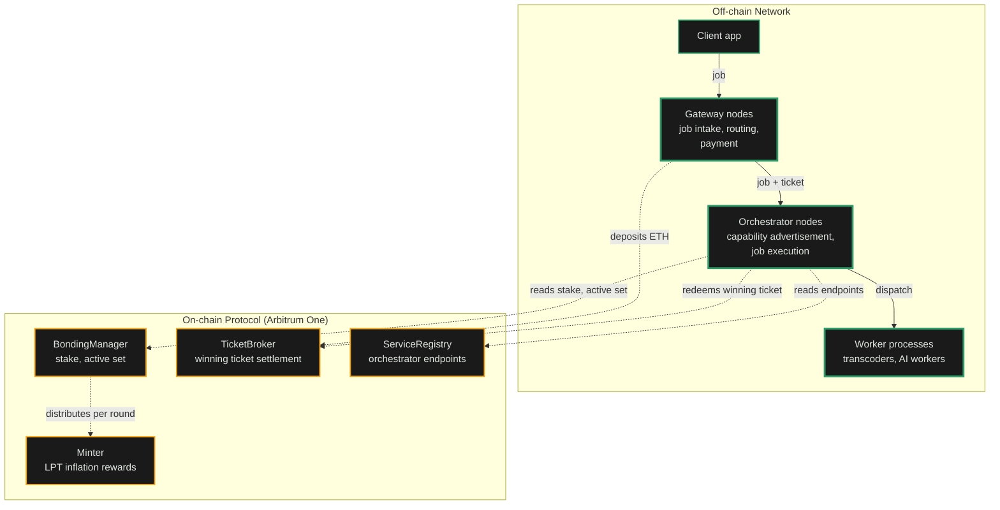

import { CardTitleTextWithArrow, CustomCardTitle, Subtitle } from '/snippets/components/elements/text/Text.jsx'
import { Quote, FrameQuote } from '/snippets/components/displays/quotes/Quote.jsx'
import { CustomDivider } from '/snippets/components/elements/spacing/Divider.jsx'
import { LinkArrow } from '/snippets/components/elements/links/Links.jsx'
import { DynamicTableV2 } from '/snippets/components/displays/tables/Tables.jsx'
import { StyledSteps, StyledStep } from '/snippets/components/displays/steps/Steps.jsx'
import { ScrollableDiagram } from '/snippets/components/displays/diagrams/ScrollableDiagram.jsx'
import { BorderedBox } from '/snippets/components/wrappers/containers/Containers.jsx'

<Quote>
The Network is the **off-chain execution layer** responsible for _running the work_, _routing jobs to the right operators_, and _settling payment_ at production volume. The Protocol enforces the rules; the Network does the work.
</Quote>

<CustomDivider style={{ margin: 0, marginBottom: '-2rem' }} />

## Network Purpose

The Network was designed to deliver real-time video and AI compute at production volume on a permissionless, open marketplace. Where the Protocol provides the rules, the Network provides the running system: GPU operators accepting jobs, gateways routing demand, payments settling continuously off-chain.

The **Livepeer Network** is the running fleet of `go-livepeer` nodes that accept jobs, perform transcoding and AI inference, exchange off-chain payments, and settle on-chain only when a probabilistic ticket wins. Most of what a user experiences as "Livepeer" happens in the Network.

<FrameQuote author="Livepeer Whitepaper (2017)" href="/v2/about/resources/knowledge-hub/livepeer-whitepaper">
The Livepeer protocol describes an **open, decentralised network** for live video transmission, where **transcoding capacity is provided by node operators in exchange for fees**, and where the system can scale to meet demand without requiring permission from any central authority.
</FrameQuote>

<CustomDivider style={{ margin: '-1rem 0 -2rem 0' }} />

## Network Design

The Network's design preserves seven properties. Together they explain why Livepeer's running system can do what a centralised compute API cannot.

<StyledSteps iconColor="var(--accent)" titleColor="var(--accent)">
  <StyledStep title="Protocol Boundary" icon="scale-balanced">
    The chain enforces; the Network executes. The Protocol records stake, settles winning tickets, and distributes inflation. The Network handles every job that does not touch the chain. This split is what lets the system change quickly at the execution layer while the rules stay slow.
  </StyledStep>
  <StyledStep title="Permissionless Participation" icon="door-open">
    Anyone with compatible hardware can register an orchestrator and start receiving jobs. Anyone can run a gateway and route demand. There is no application process, no vendor relationship, no gatekeeper. Capacity grows whenever a new operator joins.
  </StyledStep>
  <StyledStep title="Off-Chain Settlement" icon="bolt">
    Jobs are paid through probabilistic micropayment tickets exchanged off-chain. Only winning tickets touch the chain. This is what makes per-pixel and per-token pricing economical at production volume; on-chain settlement per job would cost more than the work itself.
  </StyledStep>
  <StyledStep title="Workload-Agnostic Runtime" icon="cubes">
    The same `go-livepeer` binary runs video transcoding, batch AI inference, and real-time live video-to-video. New capabilities ship as new pipelines, not as forks or hard upgrades. The Network expands by capability, not by replacement.
  </StyledStep>
  <StyledStep title="Open Coordination" icon="signal-stream">
    Discovery, capability advertisement, and price are all public. Gateways query orchestrators directly; orchestrators publish what they can do and what they charge. Price competition is visible. The marketplace is a marketplace, not a queue.
  </StyledStep>
  <StyledStep title="Stake-Anchored Trust" icon="shield-halved">
    Orchestrators bond LPT to participate. Their stake is the economic skin in the game; misbehaviour or downtime costs them. The Network is trustworthy without a central operator because stake makes it costly to behave otherwise.
  </StyledStep>
  <StyledStep title="Anchor in the Protocol" icon="link">
    Every off-chain interaction resolves against on-chain truth: stake on `BondingManager`, deposits on `TicketBroker`, capabilities advertised through `ServiceRegistry`. The off-chain layer scales freely; the on-chain layer settles authoritatively.
  </StyledStep>
</StyledSteps>

<Card title={<CustomCardTitle icon="cogs" title="Protocol Mechanisms" />} href="/v2/about/protocol/mechanisms" horizontal arrow > How the Protocol enforces the rules the Network executes against. </Card>

<CustomDivider style={{ margin: '-1rem 0 -2rem 0' }} />

## Design Decisions

The Network's design reflects deliberate choices made to preserve the seven properties at scale.

<DynamicTableV2
  headerList={['Decision', 'What it means', 'Why it matters']}
  itemsList={[
    {
      Decision: <Subtitle variant="changelog">**Single binary, multiple modes**</Subtitle>,
      'What it means': '`go-livepeer` runs as gateway, orchestrator, or worker. One codebase, one upgrade path.',
      'Why it matters': 'A new operator does not pick between products; they pick a mode. The runtime is the same everywhere.',
    },
    {
      Decision: <Subtitle variant="changelog">**Probabilistic micropayments off-chain**</Subtitle>,
      'What it means': 'Tickets accumulate off-chain; only winning tickets are submitted to the on-chain `TicketBroker`.',
      'Why it matters': 'Per-pixel video and per-token AI become economical. On-chain settlement per job would exceed the price of the work.',
    },
    {
      Decision: <Subtitle variant="changelog">**Posted prices, not auctions**</Subtitle>,
      'What it means': 'Orchestrators publish a price-per-unit; gateways accept or reject. No bidding round.',
      'Why it matters': 'The market runs continuously. Price competition is visible. Gateways route work without per-job coordination.',
    },
    {
      Decision: <Subtitle variant="changelog">**Stake gates the active set**</Subtitle>,
      'What it means': 'Bonded LPT determines which orchestrators are eligible for video work each round.',
      'Why it matters': 'The reliability of the Network is anchored in the economic exposure of its operators.',
    },
    {
      Decision: <Subtitle variant="changelog">**Pipelines, not protocol upgrades**</Subtitle>,
      'What it means': 'New AI capabilities ship as new pipelines an orchestrator chooses to run, declared through `aiModels.json`.',
      'Why it matters': 'Adding capacity for a new workload does not require a hard fork or a governance vote.',
    },
  ]}
/>

<CustomDivider style={{ margin: '-1rem 0 -2rem 0' }} />

## Design Implementation

The Network is implemented as a fleet of `go-livepeer` nodes communicating off-chain, anchored to four protocol contracts on Arbitrum One. Off-chain traffic carries jobs, capability advertisement, and tickets. On-chain settlement carries deposits, winning tickets, and per-round rewards.

<ScrollableDiagram title="Off-Chain Execution Anchored On-Chain" maxHeight="600px">

</ScrollableDiagram>

The diagram is the boundary diagram. Solid arrows are continuous off-chain traffic; dashed arrows are the few on-chain interactions per session. Most jobs never produce a dashed arrow. The Network is sized for the solid lines.

<Card title={<CustomCardTitle icon="diagram-project" title="Infrastructure Stack" />} href="/v2/about/concepts/livepeer-stack" horizontal arrow > How the Network sits in the four-layer Livepeer stack. </Card>

<CustomDivider style={{ margin: '-1rem 0 -2rem 0' }} />

## Network Actors

<Tip>
The Network does not enforce the rules; the Protocol does. The actors below are the participants that run the off-chain layer and interact with the on-chain Protocol to coordinate, settle, and earn.
</Tip>

The Network is operated by four kinds of participant. Each runs different software, takes a different risk, and earns differently.

<DynamicTableV2
  headerList={['Actor', 'What they run', 'What they take on', 'What they earn']}
  itemsList={[
    {
      Actor: <Subtitle variant="changelog">**Orchestrator**</Subtitle>,
      'What they run': '`go-livepeer` in orchestrator mode plus attached transcoders and AI workers',
      'What they take on': 'GPU hardware, bonded LPT, operational uptime',
      'What they earn': 'ETH fees from jobs, LPT inflation rewards each round',
    },
    {
      Actor: <Subtitle variant="changelog">**Gateway**</Subtitle>,
      'What they run': '`go-livepeer` in gateway mode, optionally with redeemer and remote signer',
      'What they take on': 'ETH deposit and reserve, routing infrastructure, client-facing service',
      'What they earn': 'Margin between price paid to orchestrators and price charged to clients',
    },
    {
      Actor: <Subtitle variant="changelog">**Delegator**</Subtitle>,
      'What they run': 'No node. Bonds LPT to one orchestrator through the Explorer',
      'What they take on': 'Capital exposure to LPT and to the chosen orchestrator\'s performance',
      'What they earn': 'Share of the orchestrator\'s ETH fees and LPT inflation, by stake share',
    },
    {
      Actor: <Subtitle variant="changelog">**Client**</Subtitle>,
      'What they run': 'An application that calls a gateway API or SDK',
      'What they take on': 'No network role. Pays for jobs through a gateway.',
      'What they earn': 'The transcoded video or AI output the job produced',
    },
  ]}
/>

<CustomDivider />

## Where to go next

Pick the path that matches what you came to do.

<Columns cols={2}>
  <Card title={<CustomCardTitle icon="microchip" title="Run an Orchestrator" />} href="/v2/orchestrators/portal" horizontal arrow>
    GPU hardware, staking, earnings, operations.
  </Card>
  <Card title={<CustomCardTitle icon="torii-gate" title="Run a Gateway" />} href="/v2/gateways/portal" horizontal arrow>
    Routing infrastructure, deposits, pricing.
  </Card>
  <Card title={<CustomCardTitle icon="hand-holding-dollar" title="Delegate LPT" />} href="/v2/delegators/portal" horizontal arrow>
    Stake, choose orchestrators, earn rewards.
  </Card>
  <Card title={<CustomCardTitle icon="display-code" title="Build on Livepeer" />} href="/v2/developers/portal" horizontal arrow>
    APIs, SDKs, integration paths.
  </Card>
</Columns>

## Related Pages

<Columns cols={2}>
  <Card title={<CustomCardTitle icon="cube" title="Protocol Design" />} href="/v2/about/protocol/design" horizontal arrow>
    The on-chain layer that anchors the Network.
  </Card>
  <Card title={<CustomCardTitle icon="diagram-project" title="Infrastructure Stack" />} href="/v2/about/concepts/livepeer-stack" horizontal arrow>
    The four-layer Livepeer stack.
  </Card>
  <Card title={<CustomCardTitle icon="users" title="Actors and Capabilities" />} href="/v2/about/concepts/actors-and-capabilities" horizontal arrow>
    Who participates and why.
  </Card>
  <Card title={<CustomCardTitle icon="cogs" title="Protocol Mechanisms" />} href="/v2/about/protocol/mechanisms" horizontal arrow>
    Staking, rewards, settlement, rounds.
  </Card>
</Columns>

{/* ---
title: Livepeer Network Overview
sidebarTitle: Network Design
description: An overview of the Livepeer network and its components.
lifecycleStage: discover
complexity: beginner
keywords:
  - livepeer
  - about
  - livepeer network
  - network overview
  - network
  - overview
'og:image': /snippets/assets/media/og-images/fallback.png
'og:image:alt': Livepeer Docs social preview image
'og:image:type': image/png
'og:image:width': 1200
'og:image:height': 630
pageType: overview
audience: general
lastVerified: 2026-03-17T00:00:00.000Z
purpose: overview
---
Overview page:

This page explains how the network expands the protocol and the interplay between the on-chain protocol and off-chain network. It provides a high-level overview of the network architecture, components, and actors that make up the Livepeer ecosystem. The network is the execution layer of the system, where real-time video and AI workloads are processed by a distributed set of nodes that interact with the protocol to coordinate incentives, payments, and governance.

---

Livepeer’s core protocol defines the conditions for the network to provide real-time video and AI compute services. The network is the execution layer. It is the actual running system of machines performing work to execute the product vision.
- Gateways (broadcasters) submit jobs (video or AI) into the network from applications or services
- Orchestrator nodes (stakers) process and compute the work, and
- Delegators stake tokens to support governance and security of the network

## Network Components

### Node Types
The protocol implementation defines multiple node roles (not all are formal network actors) that cooperatively execute on the protocol to provide the desired network functions.

- **Broadcaster Node**: Centers on LivepeerServer managing rtmpConnections and BroadcastSessionsManager
- **Gateway Node**: Adds AISessionManager and AI HTTP handlers on top of broadcaster functionality
- **Orchestrator Node**: Uses the orchestrator struct with SegmentChans for job distribution and Recipient for payments
- **Transcoder Node**: RemoteTranscoderManager coordinates local or remote transcoding via LocalTranscoder
- **AI Worker Node**: RemoteAIWorkerManager manages Docker containers running AI models

### Core Components
- LivepeerNode: An interface node implemented by all other node types in the network (gateway/broadcaster, orchestrator, transcoder)
- Media Server (`LivpeerServer`): The LivepeerServer manages media processing and serves HTTP/RTMP endpoints, providing
    - RTMP ingestion for live streams
    - HTTP push for video segments
    - HLS playback endpoints
    - Management of active connections
- Broadcast Sessions Manager:
- Orchestrator
- Transcoder
- AI Gateway
- AI Workers
 */}
