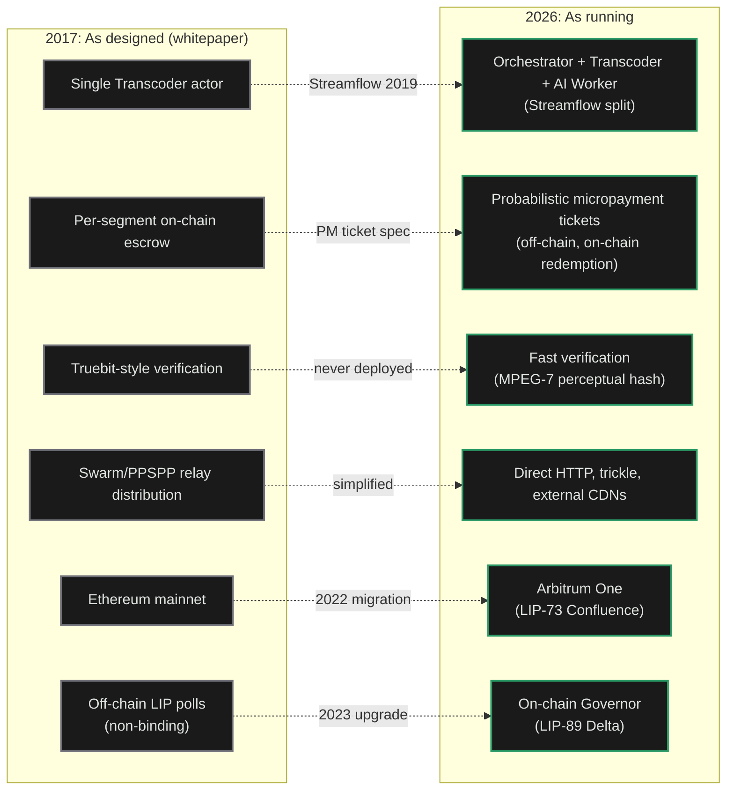
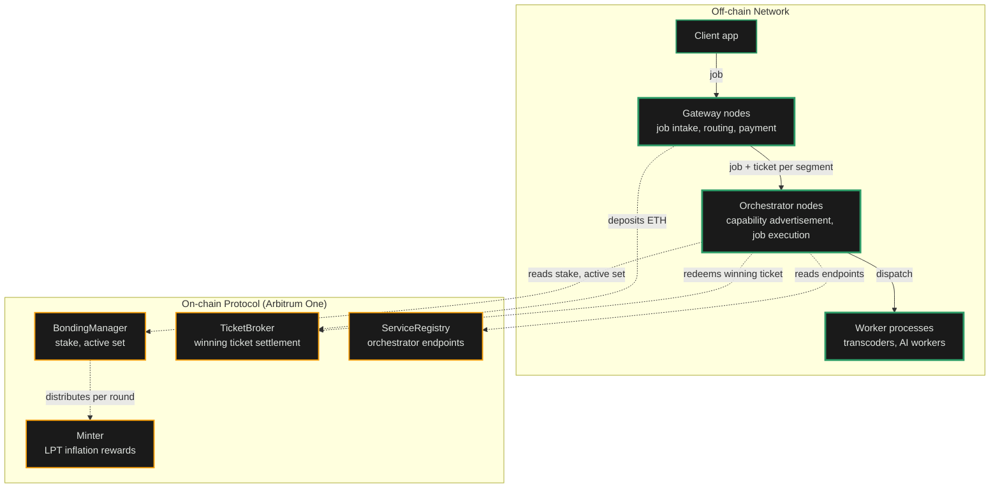

import { CardTitleTextWithArrow, CustomCardTitle, Subtitle } from '/snippets/components/elements/text/Text.jsx'
import { Quote, FrameQuote } from '/snippets/components/displays/quotes/Quote.jsx'
import { CustomDivider } from '/snippets/components/elements/spacing/Divider.jsx'
import { LinkArrow } from '/snippets/components/elements/links/Links.jsx'
import { DynamicTableV2 } from '/snippets/components/displays/tables/Tables.jsx'
import { StyledSteps, StyledStep } from '/snippets/components/displays/steps/Steps.jsx'
import { ScrollableDiagram } from '/snippets/components/displays/diagrams/ScrollableDiagram.jsx'
import { BorderedBox } from '/snippets/components/wrappers/containers/Containers.jsx'

<Quote>
    The Network is the **off-chain execution layer** responsible for _running the work_, _routing jobs to the right operators_, and _settling payment_ at production volume. The Protocol enforces the rules; the Network does the work.
</Quote>

<CustomDivider style={{ margin: 0, marginBottom: '-2rem' }} />

## Network Role

The Network was designed to deliver real-time video and AI compute at production volume on a permissionless, open marketplace. Where the Protocol provides the rules, the Network provides the execution: GPU operators accepting jobs, gateways routing demand, payments settling continuously off-chain.

The **Livepeer Network** is the population of `go-livepeer` nodes that accept jobs, perform transcoding and AI inference, exchange off-chain payments, and settle on-chain only when a probabilistic ticket wins. Most of what a user experiences as "Livepeer" happens in the Network.

<FrameQuote author="Livepeer Whitepaper (2017)" href="/v2/about/resources/knowledge-hub/livepeer-whitepaper">
The Livepeer protocol describes an **open, decentralised network** for live video transmission, where **transcoding capacity is provided by node operators in exchange for fees**, and where the system can scale to meet demand without requiring permission from any central authority.
</FrameQuote>

See the [Livepeer Stack](/v2/about/concepts/livepeer-stack) for how the Network sits inside the broader four-layer architecture.

<CustomDivider style={{ margin: '-1rem 0 -2rem 0' }} />

## Changes Since the 2017 Whitepaper

The 2017 whitepaper specified a working system. The Network running today preserves the design intent and replaces six of the specific mechanisms with later, more practical equivalents. The differences matter to anyone reading the whitepaper as current spec.

<ScrollableDiagram title="As Designed (2017) vs As Running (2026)" maxHeight="500px">

</ScrollableDiagram>

The design intent in every row is preserved. What changed is the mechanism that delivers it. Slashing is the one whitepaper mechanism that exists in the deployed contracts but is not currently active: the on-chain Verifier role is set to `0x0`, and honest work is enforced through stake exposure, fast verification, and selection feedback instead.

<CustomDivider style={{ margin: '-1rem 0 -2rem 0' }} />

## Design Properties

The Network's design preserves seven properties. Together they explain why the deployed network can do what a centralised compute API cannot.

<StyledSteps iconColor="var(--accent)" titleColor="var(--accent)">
  <StyledStep title="Protocol Boundary" icon="scale-balanced">
    The chain enforces; the Network executes. The Protocol records stake, settles winning tickets, and distributes inflation. The Network handles every job that does not touch the chain. This split is what lets the system change quickly at the execution layer while the rules stay slow.
  </StyledStep>
  <StyledStep title="Permissionless Participation" icon="door-open">
    Anyone with compatible hardware can register an orchestrator and start receiving jobs. Anyone can run a gateway and route demand. There is no application process, no vendor relationship, no gatekeeper. Capacity grows whenever a new operator joins.
  </StyledStep>
  <StyledStep title="Off-Chain Settlement" icon="bolt">
    Jobs are paid through probabilistic micropayment tickets exchanged off-chain. Only winning tickets touch the chain. This is what makes per-pixel and per-token pricing economical at production volume; on-chain settlement per job would cost more than the work itself.
  </StyledStep>
  <StyledStep title="Workload-Agnostic Runtime" icon="cubes">
    The same `go-livepeer` binary runs video transcoding, batch AI inference, and real-time live video-to-video. New capabilities ship as new pipelines, not as forks or hard upgrades. The Network expands by capability, not by replacement.
  </StyledStep>
  <StyledStep title="Open Coordination" icon="signal-stream">
    Discovery, capability advertisement, and price are all public. Gateways query orchestrators directly; orchestrators publish what they can do and what they charge. Price competition is visible. The marketplace is a marketplace, not a queue.
  </StyledStep>
  <StyledStep title="Stake-Anchored Trust" icon="shield-halved">
    Orchestrators bond LPT to participate. Their stake is the economic exposure that backs their work; misbehaviour or downtime costs them. The Network is trustworthy without a central operator because stake makes it costly to behave otherwise.
  </StyledStep>
  <StyledStep title="Anchor in the Protocol" icon="link">
    Every off-chain interaction resolves against on-chain truth: stake on `BondingManager`, deposits on `TicketBroker`, capabilities advertised through `ServiceRegistry`. The off-chain layer scales freely; the on-chain layer settles authoritatively.
  </StyledStep>
</StyledSteps>

<Card title={<CustomCardTitle icon="cogs" title="Protocol Mechanisms" />} href="/v2/about/protocol/mechanisms" horizontal arrow > How the Protocol enforces the rules the Network executes against. </Card>

<CustomDivider style={{ margin: '-1rem 0 -2rem 0' }} />

## Design Decisions

The Network's design reflects deliberate choices made to preserve the seven properties at scale.

- **Single binary, multiple modes**: `go-livepeer` runs as gateway, orchestrator, or worker. One codebase, one upgrade path. A new operator does not pick between products; they pick a mode.
- **Probabilistic micropayments off-chain**: Tickets accumulate off-chain; only winning tickets are submitted to the on-chain `TicketBroker`. Per-pixel video and per-token AI become economical because on-chain settlement per job would exceed the price of the work.
- **Posted prices, not auctions**: Orchestrators publish a price-per-unit; gateways accept or reject. No bidding round. The market runs continuously; price competition is visible; gateways route work without per-job coordination.
- **Stake gates the active set**: Bonded LPT determines which orchestrators are eligible for video work each round. The reliability of the Network is anchored in the economic exposure of its operators.
- **Pipelines, not protocol upgrades**: New AI capabilities ship as new pipelines an orchestrator chooses to run. Adding capacity for a new workload does not require a hard fork or a governance vote.

<Tip>
Slashing exists in the Protocol but is currently dormant: the on-chain Verifier role is set to `0x0`. Honest work is enforced today through stake exposure, fast verification, and marketplace selection, not active on-chain slashing.
</Tip>

<CustomDivider style={{ margin: '-1rem 0 -2rem 0' }} />

## Property Provenance

Every property the Network preserves traces back to a specific protocol decision: a Livepeer Improvement Proposal that ratified the change, and a contract or codebase that implements it. The provenance is what lets a researcher cite the running Network with confidence.

<DynamicTableV2
  headerList={['Network property', 'Ratified by', 'Implemented in']}
  itemsList={[
    {
      'Network property': <Subtitle variant="changelog">**Off-chain settlement (PM tickets)**</Subtitle>,
      'Ratified by': 'Streamflow spec (2019), refined by LIP-36 cumulative earnings, LIP-52 snapshot claim',
      'Implemented in': '`pm/` package in `go-livepeer`; `TicketBroker` contract on Arbitrum One',
    },
    {
      'Network property': <Subtitle variant="changelog">**Active set election**</Subtitle>,
      'Ratified by': 'Streamflow spec; LIP-83 round-length adjustment',
      'Implemented in': '`BondingManager`, `RoundsManager` contracts',
    },
    {
      'Network property': <Subtitle variant="changelog">**Service URI advertisement**</Subtitle>,
      'Ratified by': 'LIP-9 (ServiceRegistry)',
      'Implemented in': '`ServiceRegistry` contract; `discovery/` package in `go-livepeer`',
    },
    {
      'Network property': <Subtitle variant="changelog">**On-chain governance**</Subtitle>,
      'Ratified by': 'LIP-89, LIP-91, LIP-92 (Delta upgrade, 2023)',
      'Implemented in': '`LivepeerGovernor`, `BondingVotes`, `Treasury` contracts',
    },
    {
      'Network property': <Subtitle variant="changelog">**Arbitrum deployment**</Subtitle>,
      'Ratified by': 'LIP-73 (Confluence, 2022)',
      'Implemented in': 'Full contract redeployment to Arbitrum One',
    },
    {
      'Network property': <Subtitle variant="changelog">**SPE funding convention**</Subtitle>,
      'Ratified by': 'LIP-90 (Funding Entity Conventions, 2023)',
      'Implemented in': 'Social convention; Treasury proposals route through SPEs',
    },
    {
      'Network property': <Subtitle variant="changelog">**AI extension and BYOC**</Subtitle>,
      'Ratified by': 'AI Video SPE Stage 1 through Stage 4 (no LIP)',
      'Implemented in': '`ai/`, `byoc/`, `trickle/` packages in `go-livepeer`; `ai-runner` repository',
    },
  ]}
/>

The AI extension is the one Network property without a Livepeer Improvement Proposal anchoring it. The mandate for AI work was instead authorised through the SPE convention (LIP-90) by funding the AI Video Special Purpose Entity. This is a deliberate consequence of the SPE model: pipeline-level capability does not need a hard fork.

<CustomDivider style={{ margin: '-1rem 0 -2rem 0' }} />

## Implementation

The Network is implemented as `go-livepeer` nodes communicating off-chain, anchored to four protocol contracts on Arbitrum One. Off-chain traffic carries jobs, capability advertisement, and tickets. On-chain settlement carries deposits, winning tickets, and per-round rewards.

<ScrollableDiagram title="Off-Chain Execution Anchored On-Chain" maxHeight="600px">

</ScrollableDiagram>

The diagram is the boundary diagram. Solid arrows are continuous off-chain traffic; dashed arrows are the few on-chain interactions per session. Most jobs never produce a dashed arrow. The Network is sized for the solid lines.

<Card title={<CustomCardTitle icon="diagram-project" title="Network Architecture" />} href="/v2/about/network/architecture" horizontal arrow > The Network's three-layer topology in detail. </Card>

<CustomDivider style={{ margin: '-1rem 0 -2rem 0' }} />

## Network Actors

<Tip>
The Network does not enforce the rules; the Protocol does. The actors below are the participants that run the off-chain layer and interact with the on-chain Protocol to coordinate, settle, and earn.
</Tip>

The Network is operated by four kinds of participant. Each runs different software, takes a different risk, and earns differently.

<DynamicTableV2
  headerList={['Actor', 'What they run', 'What they take on', 'What they earn']}
  itemsList={[
    {
      Actor: <Subtitle variant="changelog">**Orchestrator**</Subtitle>,
      'What they run': '`go-livepeer` in orchestrator mode plus attached transcoders and AI workers',
      'What they take on': 'GPU hardware, bonded LPT, operational uptime',
      'What they earn': 'ETH fees from jobs, LPT inflation rewards each round',
    },
    {
      Actor: <Subtitle variant="changelog">**Gateway**</Subtitle>,
      'What they run': '`go-livepeer` in gateway mode, optionally with redeemer and remote signer',
      'What they take on': 'ETH deposit and reserve, routing infrastructure, client-facing service',
      'What they earn': 'Margin between price paid to orchestrators and price charged to clients',
    },
    {
      Actor: <Subtitle variant="changelog">**Delegator**</Subtitle>,
      'What they run': 'No node. Bonds LPT to one orchestrator through the Explorer',
      'What they take on': "Capital exposure to LPT and to the chosen orchestrator's performance",
      'What they earn': "Share of the orchestrator's ETH fees and LPT inflation, by stake share",
    },
    {
      Actor: <Subtitle variant="changelog">**Client**</Subtitle>,
      'What they run': 'An application that calls a gateway API or SDK',
      'What they take on': 'No network role. Pays for jobs through a gateway.',
      'What they earn': 'The transcoded video or AI output the job produced',
    },
  ]}
/>

<CustomDivider />

## Related Pages

<Columns cols={2}>
  <Card title={<CustomCardTitle icon="cube" title="Protocol Design" />} href="/v2/about/protocol/design" horizontal arrow>
    The on-chain layer that anchors the Network.
  </Card>
  <Card title={<CustomCardTitle icon="diagram-project" title="Infrastructure Stack" />} href="/v2/about/concepts/livepeer-stack" horizontal arrow>
    The four-layer Livepeer stack.
  </Card>
  <Card title={<CustomCardTitle icon="users" title="Actors and Capabilities" />} href="/v2/about/concepts/actors-and-capabilities" horizontal arrow>
    Who participates and why.
  </Card>
  <Card title={<CustomCardTitle icon="people-group" title="Participation and SPEs" />} href="/v2/about/network/participation" horizontal arrow>
    How to extend the Network beyond running a node.
  </Card>
</Columns>
