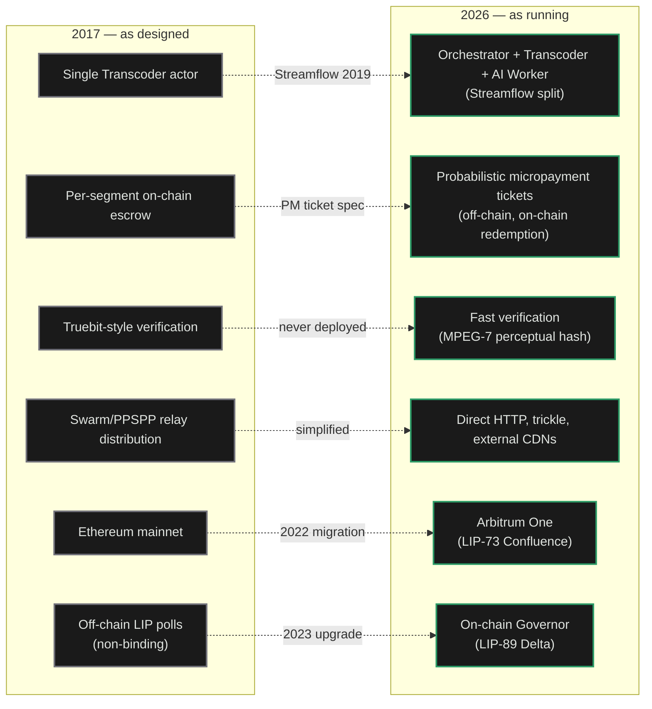

import { CardTitleTextWithArrow, CustomCardTitle, Subtitle } from '/snippets/components/elements/text/Text.jsx'
import { Quote, FrameQuote } from '/snippets/components/displays/quotes/Quote.jsx'
import { CustomDivider } from '/snippets/components/elements/spacing/Divider.jsx'
import { LinkArrow } from '/snippets/components/elements/links/Links.jsx'
import { DynamicTableV2 } from '/snippets/components/displays/tables/Tables.jsx'
import { StyledSteps, StyledStep } from '/snippets/components/displays/steps/Steps.jsx'
import { ScrollableDiagram } from '/snippets/components/displays/diagrams/ScrollableDiagram.jsx'
import { BorderedBox } from '/snippets/components/wrappers/containers/Containers.jsx'

<Quote>
The Livepeer Network is the running set of `go-livepeer` nodes that deliver transcoding and AI inference jobs at production volume. The Protocol is the rule book on Arbitrum One that the Network obeys. The split between the two is the design: rules change slowly, execution changes weekly, and the running system stays trustworthy without a central operator.
</Quote>

<CustomDivider style={{ margin: 0, marginBottom: '-2rem' }} />

## Network Role

A user posts a video stream and gets it back transcoded. A developer hits a Gateway endpoint and receives an AI inference result. Both interactions happen because a Gateway routed the work to an Orchestrator, the Orchestrator did the work on a GPU, a ticket settled the payment, and a result came back. That loop is the Network.

The Protocol is something different. It is the on-chain rule set: a set of smart contracts on Arbitrum One that records who has stake, which Orchestrators are eligible for video work this round, what the inflation rate is, and where deposits sit. The Network reads from the Protocol when it needs ground truth, and writes to the Protocol on three triggers: a winning ticket, a per-round reward call, and a stake or deposit change. Everything else stays off-chain.

```mermaid
%%{init: {'theme': 'base', 'themeVariables': {'primaryColor': '#1a1a1a', 'primaryTextColor': '#E0E4E0', 'primaryBorderColor': '#2b9a66', 'lineColor': '#2b9a66', 'secondaryColor': '#0d0d0d', 'tertiaryColor': '#1a1a1a', 'background': '#0d0d0d', 'fontFamily': "Inter, 'Inter Fallback', -apple-system, system-ui"}}}%%
flowchart LR
    classDef proto fill:#1a1a1a,color:#E0E4E0,stroke:#f59e0b,stroke-width:2px
    classDef net fill:#1a1a1a,color:#E0E4E0,stroke:#2b9a66,stroke-width:2px

    subgraph P["Protocol — on-chain, Arbitrum One"]
        Stake["Stake & active set<br/>BondingManager"]:::proto
        Settle["Settlement<br/>TicketBroker"]:::proto
        Reg["Service registry<br/>ServiceRegistry"]:::proto
        Mint["Inflation<br/>Minter"]:::proto
    end

    subgraph N["Network — off-chain, go-livepeer nodes"]
        Disc["Discovery"]:::net
        Match["Capability match"]:::net
        Disp["Job dispatch"]:::net
        Tick["Ticket exchange"]:::net
    end

    N -->|"reads ground truth"| P
    P -->|"settles winning tickets,<br/>distributes round rewards"| N
```

<ScrollableDiagram title="Protocol owns rules; Network owns execution" maxHeight="450px">

</ScrollableDiagram>

The split is the design. The Protocol changes slowly: by governance vote, with a timelock. The Network changes weekly, by software release. The Network can take on new workloads (AI inference, BYOC pipelines, real-time video-to-video) without a hard fork because the Protocol is not in the per-job loop.

<CustomDivider style={{ margin: '-1rem 0 -2rem 0' }} />

## What Changed Since the 2017 Whitepaper

The 2017 [Livepeer Whitepaper](/v2/about/resources/knowledge-hub/livepeer-whitepaper) specified a working system. The running Network preserves the design intent and replaces six original mechanisms with later, more practical equivalents. Anyone reading the whitepaper as current spec needs to know which parts are now historical.

<ScrollableDiagram title="2017 as designed vs 2026 as running" maxHeight="500px">

</ScrollableDiagram>

The design intent in every row is preserved. Slashing is the one whitepaper mechanism that exists in the deployed contracts but is currently inactive: the on-chain Verifier role is set to `0x0`. Today, honest work is enforced through stake exposure, fast verification, and selection feedback. Slashing reactivation is a governance decision, not a network change. See <LinkArrow href="/v2/about/network/marketplace" label="Marketplace" newline={false} /> for how the active mechanisms compose.

<CustomDivider style={{ margin: '-1rem 0 -2rem 0' }} />

## Design Properties

Seven properties hold the Network together. Each one solves a specific problem in delivering production-volume compute through a permissionless, decentralised network. A future proposal has to meet these without breaking them.

<StyledSteps iconColor="var(--accent)" titleColor="var(--accent)">
  <StyledStep title="Protocol Boundary" icon="scale-balanced">
    The chain enforces; the Network executes. The Protocol records stake, settles winning tickets, distributes inflation. The Network handles every job that does not touch the chain. The split is what lets execution change quickly while the rules stay slow.
  </StyledStep>
  <StyledStep title="Permissionless Participation" icon="door-open">
    Anyone with compatible hardware can register an Orchestrator and start receiving jobs. Anyone can run a Gateway and route demand. No application process, no vendor relationship, no gatekeeper. Capacity grows whenever a new operator joins.
  </StyledStep>
  <StyledStep title="Off-Chain Settlement" icon="bolt">
    Jobs are paid through probabilistic micropayment tickets exchanged off-chain. Only winning tickets touch the chain. This is what makes per-pixel and per-token pricing economical at production volume; on-chain settlement per job would cost more than the work itself.
  </StyledStep>
  <StyledStep title="Workload-Agnostic Runtime" icon="cubes">
    The same `go-livepeer` binary runs video transcoding, batch AI inference, and real-time live video-to-video. New capabilities ship as new pipelines, not as forks or hard upgrades. The Network expands by capability, not by replacement.
  </StyledStep>
  <StyledStep title="Open Coordination" icon="signal-stream">
    Discovery, capability advertisement, and price are all public. Gateways query Orchestrators directly; Orchestrators publish what they can do and what they charge. Price competition is visible. The marketplace is a marketplace, not a queue.
  </StyledStep>
  <StyledStep title="Stake-Anchored Trust" icon="shield-halved">
    Orchestrators bond LPT to participate. Their stake is the economic exposure that backs their work; misbehaviour or downtime costs them. The Network is trustworthy without a central operator because stake makes it costly to behave otherwise.
  </StyledStep>
  <StyledStep title="Anchor in the Protocol" icon="link">
    Every off-chain interaction resolves against on-chain truth: stake on `BondingManager`, deposits on `TicketBroker`, capabilities advertised through `ServiceRegistry`. The off-chain layer scales freely; the on-chain layer settles authoritatively.
  </StyledStep>
</StyledSteps>

<CustomDivider style={{ margin: '-1rem 0 -2rem 0' }} />

## Design Decisions

The seven properties are the constraint. The decisions below are how the running system honours them.

- **Single binary, multiple modes.** `go-livepeer` runs as Gateway, Orchestrator, or worker. One codebase, one upgrade path. A new operator picks a mode, not a product.
- **Probabilistic Micropayments off-chain.** Tickets accumulate off-chain; only winning tickets are submitted to `TicketBroker`. Per-pixel video and per-token AI become economical because on-chain settlement per job would exceed the price of the work.
- **Posted prices, not auctions.** Orchestrators publish a price-per-unit; Gateways accept or reject. No bidding round. The market runs continuously; price competition is visible; Gateways route work without per-job coordination.
- **Stake gates the Active Set.** Bonded LPT determines which Orchestrators are eligible for video work each round. Reliability is anchored in the economic exposure of operators.
- **Pipelines, not protocol upgrades.** New AI capabilities ship as new pipelines an Orchestrator chooses to run. Adding capacity for a new workload does not require a hard fork or a governance vote.

<Tip>
Slashing exists in the Protocol but is dormant: the on-chain Verifier role is set to `0x0`. Honest work is enforced today through stake exposure, fast verification, and marketplace selection, not active on-chain slashing.
</Tip>

<CustomDivider style={{ margin: '-1rem 0 -2rem 0' }} />

## Is the Network Decentralised in Practice

Decentralisation is a property of where ground truth lives and how decisions are made. The Network is decentralised by four measurable properties.

<DynamicTableV2
  headerList={['Property', 'Measured by', 'Where to verify']}
  itemsList={[
    {
      Property: <Subtitle variant="changelog">**No privileged operator**</Subtitle>,
      'Measured by': 'Number of independent active Orchestrators; Nakamoto coefficient (minimum operators to control 33% of stake)',
      'Where to verify': 'Explorer Orchestrator list; subgraph `Transcoder` query',
    },
    {
      Property: <Subtitle variant="changelog">**No central Gateway**</Subtitle>,
      'Measured by': 'Distinct active Gateway addresses redeeming winning tickets',
      'Where to verify': 'Explorer Gateway list; subgraph `Broadcaster` query',
    },
    {
      Property: <Subtitle variant="changelog">**Permissionless governance**</Subtitle>,
      'Measured by': 'Anyone with 100 staked LPT (or a sponsoring staker) can submit a Treasury proposal',
      'Where to verify': 'On-chain `LivepeerGovernor`; LIP-89 spec',
    },
    {
      Property: <Subtitle variant="changelog">**Permissionless software**</Subtitle>,
      'Measured by': 'go-livepeer is open source; any compatible client can interoperate',
      'Where to verify': '[github.com/livepeer/go-livepeer](https://github.com/livepeer/go-livepeer)',
    },
  ]}
/>

The Livepeer Foundation coordinates ecosystem work and funds Special Purpose Entities through the on-chain Treasury. The Foundation does not run the Network, does not set prices, does not approve operators. The on-chain `LivepeerGovernor` is the only authority for protocol parameter changes; a vote requires 33% quorum and over 50% support to pass.

<CustomDivider style={{ margin: '-1rem 0 -2rem 0' }} />

## Network Actors

Four kinds of participant run the off-chain layer. Each commits something different and earns differently.

<DynamicTableV2
  headerList={['Actor', 'What they run', 'What they commit', 'What they earn']}
  itemsList={[
    {
      Actor: <Subtitle variant="changelog">**Orchestrator**</Subtitle>,
      'What they run': '`go-livepeer` in Orchestrator mode plus attached transcoders and AI workers',
      'What they commit': 'GPU hardware, bonded LPT, operational uptime',
      'What they earn': 'ETH fees from jobs, LPT inflation rewards each round',
    },
    {
      Actor: <Subtitle variant="changelog">**Gateway**</Subtitle>,
      'What they run': '`go-livepeer` in Gateway mode, optionally with redeemer and remote signer',
      'What they commit': 'ETH deposit and reserve, routing infrastructure, client-facing service',
      'What they earn': 'Margin between price paid to Orchestrators and price charged to clients',
    },
    {
      Actor: <Subtitle variant="changelog">**Delegator**</Subtitle>,
      'What they run': 'No node. Bonds LPT to one Orchestrator through the Explorer',
      'What they commit': "Capital exposure to LPT and to the chosen Orchestrator's performance",
      'What they earn': "Share of the Orchestrator's ETH fees and LPT inflation, by stake share",
    },
    {
      Actor: <Subtitle variant="changelog">**Client**</Subtitle>,
      'What they run': 'An application that calls a Gateway API or SDK',
      'What they commit': 'No network role. Pays for jobs through a Gateway.',
      'What they earn': 'The transcoded video or AI output the job produced',
    },
  ]}
/>

Orchestrators and Gateways are operators; both run nodes and both face operational risk. Delegators and clients are not operators; they participate by capital or by demand.

<CustomDivider style={{ margin: '-1rem 0 -2rem 0' }} />

## Extending the Network

The Network grows in three ways outside of running an Orchestrator or Gateway: adding new pipelines, funding work through Special Purpose Entities, and voting on protocol changes.

<DynamicTableV2
  headerList={['Path', 'Gate', 'What it adds']}
  itemsList={[
    {
      Path: <Subtitle variant="changelog">**Run a BYOC pipeline**</Subtitle>,
      Gate: 'None at the protocol level; partner with operators willing to load the container',
      'What it adds': 'A new capability the Network can route to. Treated identically to built-in pipelines for selection, pricing, and settlement.',
    },
    {
      Path: <Subtitle variant="changelog">**Propose a Special Purpose Entity (SPE)**</Subtitle>,
      Gate: '100 staked LPT (or a sponsoring staker), 7-day forum discussion, on-chain Governor vote',
      'What it adds': 'Treasury-funded work: research, Gateways, ecosystem services, integration.',
    },
    {
      Path: <Subtitle variant="changelog">**Vote on a Livepeer Improvement Proposal (LIP)**</Subtitle>,
      Gate: 'Hold or delegate any amount of LPT; voting weight is proportional to stake',
      'What it adds': 'Direct say in protocol parameter changes, treasury cut rate, network upgrades.',
    },
  ]}
/>

For governance mechanics, the SPE proposal lifecycle, voting parameters, and the active SPE roster, see <LinkArrow href="/v2/about/protocol/governance-and-treasury" label="Governance & Treasury" newline={false} />.

<CustomDivider style={{ margin: '-1rem 0 -2rem 0' }} />

## LIP Provenance

Every property the Network commits to traces to a specific Livepeer Improvement Proposal that ratified the change and a contract or codebase that implements it. Provenance is what lets a researcher cite the running Network with confidence.

<DynamicTableV2
  headerList={['Network property', 'Ratified by', 'Implemented in']}
  itemsList={[
    {
      'Network property': <Subtitle variant="changelog">**Off-chain settlement (PM tickets)**</Subtitle>,
      'Ratified by': 'Streamflow spec (2019), refined by LIP-36 cumulative earnings, LIP-52 snapshot claim',
      'Implemented in': '`pm/` package in `go-livepeer`; `TicketBroker` contract on Arbitrum One',
    },
    {
      'Network property': <Subtitle variant="changelog">**Active Set election**</Subtitle>,
      'Ratified by': 'Streamflow spec; LIP-83 round-length adjustment',
      'Implemented in': '`BondingManager`, `RoundsManager` contracts',
    },
    {
      'Network property': <Subtitle variant="changelog">**Service URI advertisement**</Subtitle>,
      'Ratified by': 'LIP-9 (ServiceRegistry)',
      'Implemented in': '`ServiceRegistry` contract; `discovery/` package in `go-livepeer`',
    },
    {
      'Network property': <Subtitle variant="changelog">**On-chain governance**</Subtitle>,
      'Ratified by': 'LIP-89, LIP-91, LIP-92 (Delta upgrade, 2023)',
      'Implemented in': '`LivepeerGovernor`, `BondingVotes`, `Treasury` contracts',
    },
    {
      'Network property': <Subtitle variant="changelog">**Arbitrum deployment**</Subtitle>,
      'Ratified by': 'LIP-73 (Confluence, 2022)',
      'Implemented in': 'Full contract redeployment to Arbitrum One',
    },
    {
      'Network property': <Subtitle variant="changelog">**SPE funding convention**</Subtitle>,
      'Ratified by': 'LIP-90 (Funding Entity Conventions, 2023)',
      'Implemented in': 'Social convention; Treasury proposals route through SPEs',
    },
    {
      'Network property': <Subtitle variant="changelog">**AI extension and BYOC**</Subtitle>,
      'Ratified by': 'AI Video SPE Stage 1 through Stage 4 (no LIP)',
      'Implemented in': '`ai/`, `byoc/`, `trickle/` packages in `go-livepeer`; `ai-runner` repository',
    },
  ]}
/>

The AI extension is the one Network property without a LIP anchoring it. The mandate for AI work was authorised through the SPE convention (LIP-90) by funding the AI Video Special Purpose Entity. This is a deliberate consequence of the SPE model: pipeline-level capability does not need a hard fork.

<CustomDivider style={{ margin: '-1rem 0 -2rem 0' }} />

## Network Evolution

The Network has gone through four phases. Each phase preserved the design intent of the one before it; none was a reset.

<DynamicTableV2
  headerList={['Phase', 'Period', 'What changed']}
  itemsList={[
    {
      Phase: <Subtitle variant="changelog">**Genesis**</Subtitle>,
      Period: '2018–2019',
      'What changed': 'Mainnet launch on Ethereum. Single-actor Transcoder model from the whitepaper. Off-chain LIP polls.',
    },
    {
      Phase: <Subtitle variant="changelog">**Streamflow**</Subtitle>,
      Period: '2019–2022',
      'What changed': 'Orchestrator-Transcoder split. Probabilistic micropayment tickets replace per-segment on-chain escrow. Fast verification replaces Truebit.',
    },
    {
      Phase: <Subtitle variant="changelog">**Confluence**</Subtitle>,
      Period: '2022',
      'What changed': 'Migration from Ethereum mainnet to Arbitrum One under LIP-73. Round length recalibrated to L2 block times.',
    },
    {
      Phase: <Subtitle variant="changelog">**Delta + AI**</Subtitle>,
      Period: '2023–present',
      'What changed': 'On-chain Governor + Treasury under LIP-89/91/92. AI Video SPE delivers AI inference, real-time live AI, and BYOC pipelines.',
    },
  ]}
/>

<Card title={<CustomCardTitle icon="diagram-project" title="Network Architecture" />} href="/v2/about/network/architecture" horizontal arrow > How the running Network is structured: layers, topology, traffic planes, on-chain anchor. </Card>

<CustomDivider />

## Continue by Role

Pick the path that matches what brought you to the Network.

<Columns cols={2}>
  <Card title={<CustomCardTitle icon="microchip" title="Run an Orchestrator" />} href="/v2/orchestrators/portal" horizontal arrow>
    GPU hardware, staking, earnings, operations.
  </Card>
  <Card title={<CustomCardTitle icon="torii-gate" title="Run a Gateway" />} href="/v2/gateways/portal" horizontal arrow>
    Routing infrastructure, deposits, pricing.
  </Card>
  <Card title={<CustomCardTitle icon="hand-holding-dollar" title="Delegate LPT" />} href="/v2/delegators/portal" horizontal arrow>
    Stake, choose Orchestrators, earn rewards.
  </Card>
  <Card title={<CustomCardTitle icon="display-code" title="Build on Livepeer" />} href="/v2/developers/portal" horizontal arrow>
    APIs, SDKs, integration paths.
  </Card>
</Columns>

## Related Pages

<Columns cols={2}>
  <Card title={<CustomCardTitle icon="cogs" title="Core Mechanisms" />} href="/v2/about/network/core-mechanisms" horizontal arrow>
    Discovery, dispatch, payment plumbing, settlement triggers.
  </Card>
  <Card title={<CustomCardTitle icon="diagram-project" title="Network Architecture" />} href="/v2/about/network/architecture" horizontal arrow>
    Layers, topology, traffic planes, on-chain anchor.
  </Card>
  <Card title={<CustomCardTitle icon="store" title="Marketplace" />} href="/v2/about/network/marketplace" horizontal arrow>
    Market shape, settlement, trust mechanisms.
  </Card>
  <Card title={<CustomCardTitle icon="people-group" title="Governance & Treasury" />} href="/v2/about/protocol/governance-and-treasury" horizontal arrow>
    SPEs, governance process, treasury: how to extend the Network beyond running a node.
  </Card>
</Columns>
