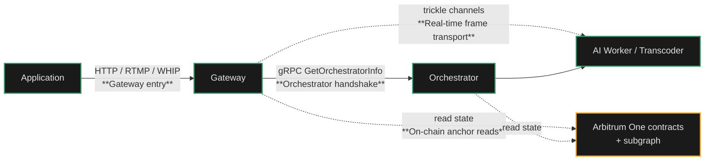

import { CustomCardTitle, Subtitle } from '/snippets/components/elements/text/Text.jsx'
import { Quote } from '/snippets/components/displays/quotes/Quote.jsx'
import { CustomDivider } from '/snippets/components/elements/spacing/Divider.jsx'
import { LinkArrow } from '/snippets/components/elements/links/Links.jsx'
import { DynamicTableV2 } from '/snippets/components/displays/tables/Tables.jsx'
import { ScrollableDiagram } from '/snippets/components/displays/diagrams/ScrollableDiagram.jsx'
import { BorderedBox } from '/snippets/components/wrappers/containers/Containers.jsx'

<Quote>
The Network exposes four reachable surfaces. Clients enter through a Gateway. Gateways and Orchestrators handshake through `OrchestratorInfo`. Real-time frames move over the trickle protocol. The chain is read directly through Arbitrum One.
</Quote>

<CustomDivider style={{ margin: 0, marginBottom: '-2rem' }} />

## Network Interfaces

A developer integrating with Livepeer touches different surfaces depending on their role. An application developer calls a Gateway. A Gateway implementation talks to Orchestrators. An Orchestrator implementation talks to its workers and to the chain. The four surfaces below are described at the conceptual level; reference specs and code live in the Developers and Gateways tabs.

<DynamicTableV2
  headerList={['Surface', 'Who uses it', 'What it carries']}
  itemsList={[
    {
      Surface: <Subtitle variant="changelog">**Gateway entry**</Subtitle>,
      'Who uses it': 'Application developers and clients',
      'What it carries': 'Video streams, file uploads, AI inference requests; HTTP/RTMP/WHIP transports',
    },
    {
      Surface: <Subtitle variant="changelog">**Orchestrator handshake**</Subtitle>,
      'Who uses it': 'Gateways discovering and selecting Orchestrators',
      'What it carries': '`GetOrchestratorInfo` requests, capability advertisement, ticket parameter exchange, session establishment',
    },
    {
      Surface: <Subtitle variant="changelog">**Real-time frame transport**</Subtitle>,
      'Who uses it': 'Gateway and Orchestrator AI worker, for live video-to-video pipelines',
      'What it carries': 'Per-frame video data over the trickle protocol; sub-second round-trip',
    },
    {
      Surface: <Subtitle variant="changelog">**On-chain anchor reads**</Subtitle>,
      'Who uses it': 'Anyone querying network state',
      'What it carries': 'Stake, Active Set, deposits, service URIs, governance state through Arbitrum One contracts and the subgraph',
    },
  ]}
/>

<ScrollableDiagram title="Where Each Interface Sits in the Network" maxHeight="500px">



</ScrollableDiagram>

<CustomDivider style={{ margin: '-1rem 0 -2rem 0' }} />

## Gateway Entry Surface

The Gateway is the front door. Application developers do not talk to Orchestrators or to the chain directly; they talk to a Gateway. The Gateway then handles discovery, payment, and result delivery on the application's behalf.

Three entry transports are supported by Gateway implementations today:

<DynamicTableV2
  headerList={['Transport', 'Workload', 'Notes']}
  itemsList={[
    {
      Transport: <Subtitle variant="changelog">**HTTP (REST)**</Subtitle>,
      Workload: 'AI inference, file transcoding',
      Notes: 'Request-response. Used by language SDKs (`livepeer-js`, `livepeer-python`, `livepeer-go`) for AI calls and asset uploads.',
    },
    {
      Transport: <Subtitle variant="changelog">**RTMP**</Subtitle>,
      Workload: 'Live video transcoding',
      Notes: 'Standard push protocol used by encoders like OBS. Gateway exposes an RTMP endpoint per stream key.',
    },
    {
      Transport: <Subtitle variant="changelog">**WHIP**</Subtitle>,
      Workload: 'Low-latency live ingest',
      Notes: 'WebRTC-HTTP Ingestion Protocol. Used for sub-second ingest and for browser-based clients.',
    },
  ]}
/>

A developer integrating with Livepeer typically uses one of the language SDKs against a hosted Gateway (Studio, Daydream) or a self-operated Gateway. The Gateway URL is an HTTPS endpoint; authentication and rate limiting are Gateway-side decisions, not protocol-level.

The HTTP surface a Gateway exposes covers four families of route. Specific paths vary slightly between Gateway implementations; the families are stable.

<DynamicTableV2
  headerList={['Route family', 'Example paths', 'What it does']}
  itemsList={[
    {
      'Route family': <Subtitle variant="changelog">**Live ingest**</Subtitle>,
      'Example paths': '`rtmp://gateway:1935`, `POST /webrtc/{streamId}` (WHIP), `GET /stream/{id}.m3u8` (HLS playback)',
      'What it does': 'Accept live video for transcoding; serve transcoded outputs',
    },
    {
      'Route family': <Subtitle variant="changelog">**Batch AI inference**</Subtitle>,
      'Example paths': '`POST /text-to-image`, `POST /image-to-image`, `POST /audio-to-text`, `POST /upscale`, `POST /llm`',
      'What it does': 'Submit a single AI inference request; receive the result synchronously',
    },
    {
      'Route family': <Subtitle variant="changelog">**Real-time AI streaming**</Subtitle>,
      'Example paths': '`POST /live/video-to-video/{stream}/{start|update|stop|status}`',
      'What it does': 'Open and manage a real-time AI session; frames flow over trickle once started',
    },
    {
      'Route family': <Subtitle variant="changelog">**BYOC (capability-routed)**</Subtitle>,
      'Example paths': '`POST /process/request/{capability}`, `POST /process/stream/{start|update|status|stop|data}`',
      'What it does': 'Submit work to any registered BYOC pipeline by capability name',
    },
  ]}
/>

<Card title={<CustomCardTitle icon="display-code" title="Build on Livepeer" />} href="/v2/developers/portal" horizontal arrow > SDKs, API references, integration patterns. </Card>

<CustomDivider style={{ margin: '-1rem 0 -2rem 0' }} />

## Orchestrator Handshake

The handshake between Gateway and Orchestrator is a session-level RPC. The Gateway calls `GetOrchestratorInfo`; the Orchestrator returns its capability set, its current price-per-unit, and the ticket parameters the Gateway must use.

<ScrollableDiagram title="OrchestratorInfo Handshake and Session Setup" maxHeight="600px">

```mermaid
%%{init: {'theme': 'base', 'themeVariables': { 'primaryColor': '#1a1a1a', 'primaryTextColor': '#E0E4E0', 'primaryBorderColor': '#2b9a66', 'lineColor': '#2b9a66', 'secondaryColor': '#0d0d0d', 'tertiaryColor': '#1a1a1a', 'background': '#0d0d0d', 'fontFamily': "Inter, 'Inter Fallback', -apple-system, system-ui" }}}%%
sequenceDiagram
    autonumber
    participant G as Gateway
    participant O as Orchestrator
    participant TB as TicketBroker

    G->>O: GetOrchestratorInfo
    O-->>G: OrchestratorInfo<br/>(capabilities, price-per-unit, ticket parameters)
    G->>G: filter by capability and price ceiling
    G->>O: open session, send job + ticket
    O-->>G: result
    Note over G,O: tickets accumulate per segment;<br/>most do not win
    O->>TB: redeem winning ticket
```

</ScrollableDiagram>

The handshake establishes the session. Once open, the Gateway dispatches segments or frames with tickets attached. Tickets are signed by the Gateway against the parameters the Orchestrator returned in the handshake; the Orchestrator validates each ticket before performing the work. Most tickets do not win; only winning tickets are submitted to `TicketBroker` for on-chain settlement.

### Capability Bitstrings

`OrchestratorInfo.Capabilities` is a bitstring carrying every capability the Orchestrator offers, plus a per-capability constraint map keyed by model identifier. Each entry records whether the model is warm-loaded, the Orchestrator's per-model concurrency capacity, and the runner version. The compatibility check at the Gateway is a simple AND across the bitstrings: the Gateway's required capability bits must be a subset of the Orchestrator's offered bits, plus all per-model constraints must be satisfiable.

<CustomDivider style={{ margin: '-1rem 0 -2rem 0' }} />

## Trickle Protocol

For real-time AI workloads, the segment-and-result pattern is too slow. Frames need to move between Gateway and Orchestrator at sub-second latency, with audio and metadata streaming alongside. The trickle protocol is the transport.

Trickle is a Livepeer-developed transport with three properties that matter for real-time AI:

<BorderedBox variant="accent">
  - **Streaming, not request-response.** Frames move continuously in both directions, not as discrete jobs.
  - **Multi-track.** Video frames, audio, and dynamic parameter updates ride the same connection.
  - **Operator-controllable.** A built-in HTTP control API lets operators update model parameters mid-stream, which is what makes interactive pipelines like ComfyStream possible.
</BorderedBox>

The trickle protocol is implemented in the `pytrickle` Python library and in the `go-livepeer` AI worker. ComfyStream and other real-time pipelines depend on it. Real-time AI integrators typically run a `pytrickle`-based Gateway client or use a hosted Gateway that implements the protocol on the client's behalf.

The protocol shape: a publisher posts to `POST /channel/seq` with a monotonically increasing sequence number; subscribers fetch with `GET /channel/seq` for a specific segment, or `GET /channel/-1` for the live edge. Subscribers can preconnect on `seq+1` to remove latency between segment boundaries. Audio, video, and control flow as parallel channels on the same connection, distinguished by channel name.

<Card title={<CustomCardTitle icon="rotate" title="pytrickle Reference" />} href="/v2/developers/resources/reference/pytrickle-reference" horizontal arrow > The trickle protocol library and integration reference. </Card>

<CustomDivider style={{ margin: '-1rem 0 -2rem 0' }} />

## On-Chain Reads

Network state is publicly readable on Arbitrum One. Anyone can query the protocol contracts directly, or query the indexed view through the Livepeer subgraph. No operator relationship is needed to see what the Network is doing.

<DynamicTableV2
  headerList={['Read path', 'What it returns', 'When to use']}
  itemsList={[
    {
      'Read path': <Subtitle variant="changelog">**Arbitrum One contracts**</Subtitle>,
      'What it returns': 'Live state of `BondingManager`, `TicketBroker`, `RoundsManager`, `Minter`, `ServiceRegistry`',
      'When to use': 'Real-time queries, ticket validation, contract integration',
    },
    {
      'Read path': <Subtitle variant="changelog">**Livepeer subgraph**</Subtitle>,
      'What it returns': 'Indexed historical view of all on-chain events: stake changes, redemptions, rewards, votes',
      'When to use': 'Historical queries, dashboards, analytics',
    },
    {
      'Read path': <Subtitle variant="changelog">**Network Capabilities API**</Subtitle>,
      'What it returns': 'Aggregated capability data across Orchestrators (off-chain advertised capabilities beyond what the on-chain registry alone exposes)',
      'When to use': 'Capability filtering richer than `ServiceRegistry` alone',
    },
  ]}
/>

<CustomDivider />

## Related Pages

<Columns cols={2}>
  <Card title={<CustomCardTitle icon="diagram-project" title="Network Architecture" />} href="/v2/about/network/architecture" horizontal arrow>
    Where each surface fits in the Network.
  </Card>
  <Card title={<CustomCardTitle icon="route" title="Job Pipelines" />} href="/v2/about/network/job-pipelines" horizontal arrow>
    What workloads run across these surfaces.
  </Card>
  <Card title={<CustomCardTitle icon="display-code" title="Build on Livepeer" />} href="/v2/developers/portal" horizontal arrow>
    SDKs, APIs, and code-level reference.
  </Card>
  <Card title={<CustomCardTitle icon="torii-gate" title="Run a Gateway" />} href="/v2/gateways/portal" horizontal arrow>
    Operator-side Gateway implementation.
  </Card>
</Columns>
