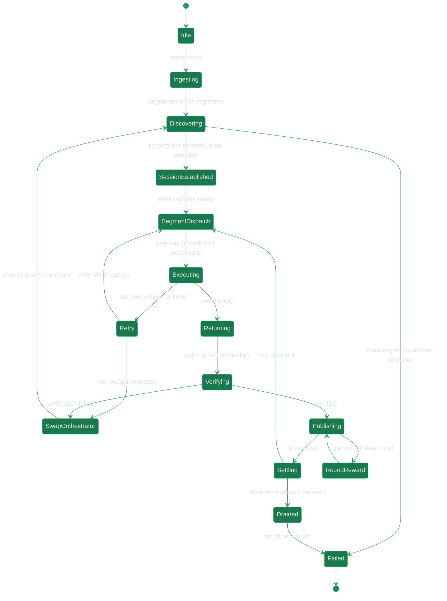

import { DynamicTable } from "/snippets/components/displays/tables/Tables.jsx"
import { ScrollableDiagram } from "/snippets/components/displays/diagrams/ScrollableDiagram.jsx"

A Livepeer job is a unit of media compute submitted by a Gateway and executed by an Orchestrator. Because every workload – live transcode, file transcode, AI inference – is broken into segments, the lifecycle is modelled per-segment rather than per-stream. Settlement runs continuously off-chain via probabilistic tickets and periodically on-chain via reward calls.

This page covers the shape of a job, the shared state machine, the per-workload pipeline differences, and the metrics and failure modes that operators observe in production. For how jobs are matched and priced, see [Marketplace](./marketplace-model). For the node software that runs them, see [Architecture](./architecture).

## Shape of a job

Every Livepeer job moves through four phases. Two are off-chain and continuous; two touch the protocol.

<DynamicTable
  headerList={["Phase", "Where", "What happens", "Protocol touchpoint"]}
  itemsList={[
    { "Phase": "Submit", "Where": "Off-chain", "What happens": "Client posts a stream, file, or inference request to a Gateway", "Protocol touchpoint": "Gateway deposit/reserve in TicketBroker" },
    { "Phase": "Route", "Where": "Off-chain", "What happens": "Gateway discovers Orchestrators, accepts a price, opens a session", "Protocol touchpoint": "ServiceRegistry advertises Orchestrator URI" },
    { "Phase": "Compute", "Where": "Off-chain", "What happens": "Segments dispatched, processed by transcoder or AI worker, returned with tickets", "Protocol touchpoint": "Tickets generated against on-chain deposit" },
    { "Phase": "Settle", "Where": "On-chain", "What happens": "Winning tickets redeemed; per-round reward distributes inflation to stake", "Protocol touchpoint": "TicketBroker.redeemWinningTicket, Minter.reward" }
  ]}
/>

The on-chain layer never sees individual segments. It sees deposits, winning tickets, and reward calls. Everything else is peer-to-peer between Gateway and Orchestrator.

## Lifecycle state machine

The session-level state machine below tracks one job from ingest to drained reserve. Per-segment dispatch loops inside `SegmentDispatch → Executing → Returning → Verifying → Publishing → Settling`. Per-round reward accounting runs in parallel as a periodic transition out of `Publishing`.

<ScrollableDiagram title="Livepeer Job Lifecycle State Machine" maxHeight="600px">

</ScrollableDiagram>

## Steps in detail

<Steps>
<Step title="Ingest and segmentation">
The Gateway accepts an RTMP stream, an HTTP push, or an AI inference request and produces segments to be processed downstream.
</Step>
<Step title="Discovery and selection">
The Gateway queries advertised Orchestrators via ServiceRegistry, scores them on latency, capability, and price, and opens a session with one or more.
</Step>
<Step title="Price agreement">
Orchestrators publish a price per pixel (Wei denominated) off-chain. Pricing may auto-adjust to cover ticket-redemption gas overhead during congestion.
</Step>
<Step title="Segment dispatch and compute">
The Gateway uploads each segment with a probabilistic payment ticket. The Orchestrator runs the work locally or hands it to attached transcoder or AI-worker processes.
</Step>
<Step title="Result return and verification">
Results are returned to the Gateway. Optional fast verification compares re-encoded output. Failures trigger retries or an Orchestrator swap.
</Step>
<Step title="Continuous settlement">
Tickets accumulate off-chain. The Orchestrator submits winning tickets to the TicketBroker on Arbitrum, redeeming them for ETH from the Gateway's deposit.
</Step>
<Step title="Periodic reward accounting">
Each round, an active Orchestrator calls `reward()` on Arbitrum. Newly minted LPT is distributed across the Orchestrator and its Delegators by stake share.
</Step>
</Steps>

## Pipelines by workload

The state machine is shared. The pipeline details – ingest mode, segment cadence, payment style, latency budget – vary by workload.

<DynamicTable
  headerList={["Pipeline", "Ingest", "Segment cadence", "Compute path", "Latency budget", "Payment style"]}
  itemsList={[
    { "Pipeline": "Live transcode", "Ingest": "RTMP or WHIP push to Gateway", "Segment cadence": "2-6 second segments, continuous", "Compute path": "Orchestrator → FFmpeg transcoder (GPU)", "Latency budget": "Sub-second to a few seconds", "Payment style": "ETH ticket per segment, periodic on-chain redemption" },
    { "Pipeline": "File transcode", "Ingest": "HTTP upload of full asset", "Segment cadence": "Fixed-size chunks, parallel dispatch", "Compute path": "Orchestrator → FFmpeg transcoder (GPU)", "Latency budget": "Throughput-oriented, not real-time", "Payment style": "Batch credits or ETH tickets, single redemption" },
    { "Pipeline": "AI inference", "Ingest": "Frame stream, image, or prompt to Gateway", "Segment cadence": "Per-frame or per-job", "Compute path": "Orchestrator → AI worker (Docker, multi-stage Cascade pipelines)", "Latency budget": "Real-time for live use cases (Daydream, ComfyStream)", "Payment style": "ETH ticket per inference unit, periodic redemption" }
  ]}
/>

Cascade is Livepeer's coordination layer for multi-stage AI pipelines, where one inference request flows through a sequence of models (for example text encoder → image generator → upscaler) before the final result returns to the Gateway.

## Events and metrics

Each transition in the state machine is observable. The metrics below are the primary signals operators track in production.

<DynamicTable
  headerList={["Event", "Metric", "Transition", "Notes"]}
  itemsList={[
    { "Event": "Stream starts", "Metric": "livepeer_stream_started_total", "Transition": "Idle → Ingesting", "Notes": "Defined in node metrics surface." },
    { "Event": "Discovery fails", "Metric": "livepeer_discovery_errors_total", "Transition": "Discovering → Failed", "Notes": "Selection algorithm is implementation-defined." },
    { "Event": "Segment transcode fails", "Metric": "livepeer_segment_transcode_failed_total", "Transition": "Executing → Retry", "Notes": "Retry budget controlled by maxAttempts (default 3)." },
    { "Event": "Orchestrator swap", "Metric": "livepeer_orchestrator_swaps", "Transition": "Retry or Verifying → SwapOrchestrator", "Notes": "Swap policy is observable via metrics, not formally specified." },
    { "Event": "Payment sent", "Metric": "livepeer_tickets_sent, livepeer_ticket_value_sent", "Transition": "Publishing → Settling", "Notes": "Deposit and reserve surfaced per Gateway." },
    { "Event": "Reserve depleted", "Metric": "livepeer_gateway_reserve, livepeer_gateway_deposit", "Transition": "Settling → Drained", "Notes": "Operator-specific sizing of deposit vs reserve." },
    { "Event": "Ticket redemption error", "Metric": "livepeer_ticket_redemption_errors", "Transition": "Settling (degraded)", "Notes": "Affects realised Orchestrator revenue." },
    { "Event": "On-chain tx timeout", "Metric": "txTimeout (default 5 min)", "Transition": "Settling or RoundReward (retry or replace)", "Notes": "Replacement knobs exposed via CLI options." },
    { "Event": "Per-round reward", "Metric": "Orchestrator reward service enabled", "Transition": "Publishing ↔ RoundReward", "Notes": "Auto reward calls per round on Arbitrum by default." }
  ]}
  monospaceColumns={[1]}
/>

## Failure modes and recovery

<DynamicTable
  headerList={["Failure", "Trigger", "Recovery"]}
  itemsList={[
    { "Failure": "No suitable Orchestrator", "Trigger": "Discovery errors exceed tolerance", "Recovery": "Session enters Failed; client retries with relaxed criteria" },
    { "Failure": "Segment compute failure", "Trigger": "Transcoder timeout or worker error", "Recovery": "Retry up to maxAttempts, then SwapOrchestrator" },
    { "Failure": "Verification mismatch", "Trigger": "Fast verification rejects returned segment", "Recovery": "Immediate SwapOrchestrator" },
    { "Failure": "Reserve drained", "Trigger": "Gateway deposit or reserve depleted mid-session", "Recovery": "Session ends; Gateway tops up TicketBroker before resuming" },
    { "Failure": "Redemption tx stuck", "Trigger": "On-chain tx exceeds txTimeout", "Recovery": "Replace tx with higher gas; metric flags redemption errors" }
  ]}
/>

## See also

- [Marketplace](./marketplace-model) – how supply and demand match, pricing, routing
- [Architecture](./architecture) – node types, go-livepeer components, worker layer
- [Blockchain contracts](../protocol/blockchain-contracts) – TicketBroker, BondingManager, Minter addresses
- [Actors](./actors) – Gateway, Orchestrator, Delegator roles

## References

- [go-livepeer source](https://github.com/livepeer/go-livepeer)
- [TicketBroker contract](https://github.com/livepeer/protocol/tree/master/contracts/pm)
- [Cascade and real-time AI pipelines](https://blog.livepeer.org/real-time-ai-comfyui)
- [Forum: LIPs](https://forum.livepeer.org/c/lips/)
