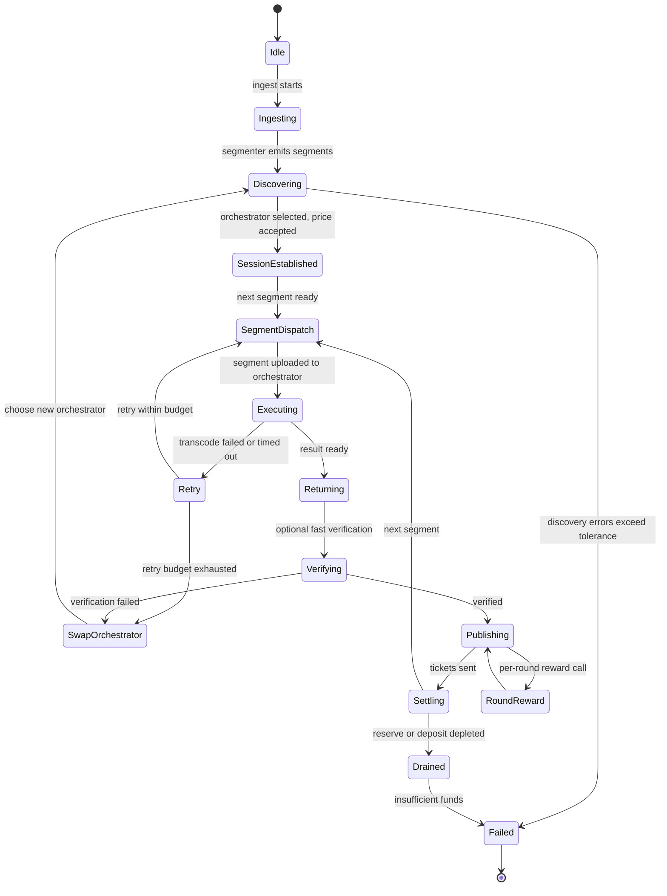
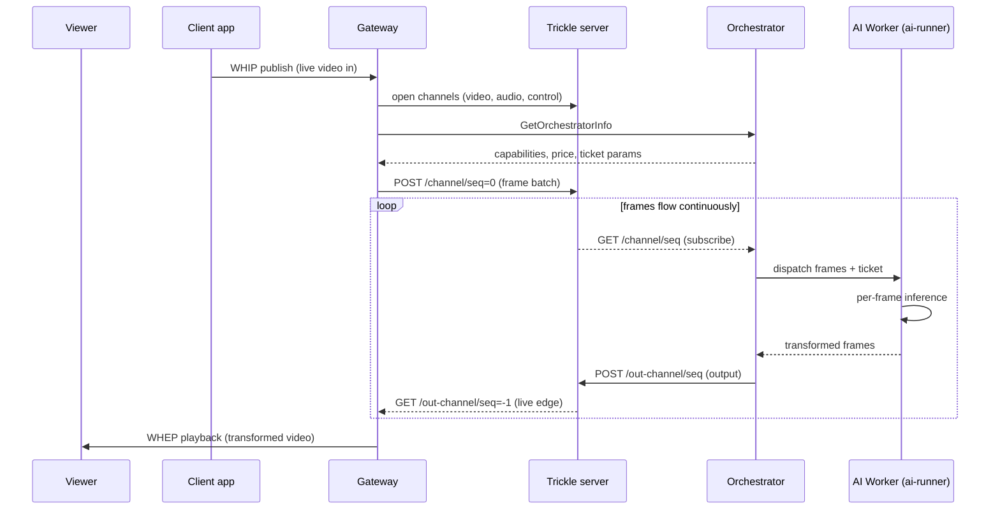

import { CustomCardTitle, Subtitle } from '/snippets/components/elements/text/Text.jsx'
import { Quote } from '/snippets/components/displays/quotes/Quote.jsx'
import { CustomDivider } from '/snippets/components/elements/spacing/Divider.jsx'
import { LinkArrow } from '/snippets/components/elements/links/Links.jsx'
import { DynamicTableV2 } from '/snippets/components/displays/tables/Tables.jsx'
import { StyledSteps, StyledStep } from '/snippets/components/displays/steps/Steps.jsx'
import { ScrollableDiagram } from '/snippets/components/displays/diagrams/ScrollableDiagram.jsx'

<Quote>
A **pipeline** is a unit of work the Network knows how to run. Pipelines come in three classes by how the work is shaped: video transcoding, batch AI, and real-time AI. Adding a new pipeline expands the Network's capability set without changing the protocol.
</Quote>

<CustomDivider style={{ margin: 0, marginBottom: '-2rem' }} />

The Network's capability set is defined by the pipelines its orchestrators run. A pipeline is a workload the orchestrator can accept, with a defined input format, output format, and pricing unit. Pipelines are the unit of capability growth: when a new model or workload becomes available, it ships as a new pipeline that operators choose to load.

The key consequence is that the Network's capability set is open and grows by participation. New AI models, new transcoding profiles, and new custom workloads all enter the Network the same way: an orchestrator declares the pipeline in its configuration, loads the model, and starts advertising the capability. No protocol upgrade required.

<CustomDivider style={{ margin: '-1rem 0 -2rem 0' }} />

## Workload Classes

Every pipeline falls into one of three classes by how the work is shaped. The class determines what an orchestrator must run, how the gateway dispatches work, and what latency the workload tolerates.

<DynamicTableV2
  headerList={['Class', 'Examples', 'How it runs', 'Latency budget']}
  itemsList={[
    {
      Class: <Subtitle variant="changelog">**Video transcoding**</Subtitle>,
      Examples: 'Live RTMP/WHIP streams, file VOD assets',
      'How it runs': 'Orchestrator dispatches to FFmpeg-based transcoders with NVENC/NVDEC GPU acceleration',
      'Latency budget': 'Sub-second for live; throughput-oriented for file',
    },
    {
      Class: <Subtitle variant="changelog">**Batch AI inference**</Subtitle>,
      Examples: 'Text-to-image, image-to-image, image-to-video, audio-to-text, segment-anything-2, upscale, large language models',
      'How it runs': 'Orchestrator dispatches to AI worker, which runs a Python `ai-runner` container with the model loaded',
      'Latency budget': 'Seconds to tens of seconds, depending on pipeline',
    },
    {
      Class: <Subtitle variant="changelog">**Real-time AI**</Subtitle>,
      Examples: 'Live video-to-video, real-time effects, ComfyStream pipelines',
      'How it runs': 'Frames carried over the trickle protocol between gateway and orchestrator AI worker; per-frame inference inside `ai-runner`',
      'Latency budget': 'Sub-second per frame for interactive use',
    },
  ]}
/>

The state machine each pipeline follows is the same in shape: ingest, dispatch, compute, return, settle. The differences are in cadence, transport, and compute path. Operator-side detail on how the state machine is implemented lives in the orchestrator and gateway tabs.

<CustomDivider style={{ margin: '-1rem 0 -2rem 0' }} />

## Job Lifecycle

Every pipeline has the same lifecycle from job intake to settlement, regardless of class. Cadence and transport differ; the lifecycle does not.

<StyledSteps iconColor="var(--accent)" titleColor="var(--accent)">
  <StyledStep title="Intake" icon="arrow-right-to-bracket">
    The gateway accepts the work from a client: an RTMP or WHIP stream, an HTTP file upload, or an AI inference request. It produces segments or frames suitable for downstream dispatch.
  </StyledStep>
  <StyledStep title="Discovery and selection" icon="magnifying-glass">
    The gateway selects an orchestrator that advertises the pipeline at a price the gateway accepts. Pipeline-specific capability is part of the selection criteria.
  </StyledStep>
  <StyledStep title="Dispatch and compute" icon="bolt">
    The gateway dispatches segments or frames with attached probabilistic micropayment tickets. The orchestrator runs the pipeline against the work, locally or on attached workers.
  </StyledStep>
  <StyledStep title="Result return" icon="circle-check">
    The orchestrator returns transcoded segments, generated frames, or inference output. The gateway delivers the result to the client.
  </StyledStep>
  <StyledStep title="Settlement" icon="ticket">
    Tickets accumulate off-chain. Winning tickets are redeemed on-chain by the orchestrator. Per-round inflation rewards run in parallel through `BondingManager`.
  </StyledStep>
</StyledSteps>

<CustomDivider style={{ margin: '-1rem 0 -2rem 0' }} />

## Job State Machine

Inside the lifecycle phases, jobs follow a per-segment state machine. The session-level transitions below show how a single job moves through ingest, dispatch, retry, and drained reserve.

<ScrollableDiagram title="Job Lifecycle State Machine" maxHeight="600px">

</ScrollableDiagram>

<CustomDivider style={{ margin: '-1rem 0 -2rem 0' }} />

## Built-In Pipelines

The Network ships a set of built-in pipelines maintained in the `ai-runner` repository. Each runs as a Python container an orchestrator can load and serve. The set covers the most common AI workloads.

<DynamicTableV2
  headerList={['Pipeline', 'Class', 'What it produces']}
  itemsList={[
    { Pipeline: 'Video transcoding profiles', Class: 'Video', 'What it produces': 'Transcoded video at requested resolution, bitrate, and codec' },
    { Pipeline: 'Text-to-image', Class: 'Batch AI', 'What it produces': 'Generated image from a text prompt' },
    { Pipeline: 'Image-to-image', Class: 'Batch AI', 'What it produces': 'Transformed image from an input image and prompt' },
    { Pipeline: 'Image-to-video', Class: 'Batch AI', 'What it produces': 'Short generated video clip from an input image' },
    { Pipeline: 'Audio-to-text', Class: 'Batch AI', 'What it produces': 'Transcribed text from input audio' },
    { Pipeline: 'Text-to-speech', Class: 'Batch AI', 'What it produces': 'Generated audio from text input' },
    { Pipeline: 'Segment-anything-2', Class: 'Batch AI', 'What it produces': 'Image segmentation masks' },
    { Pipeline: 'Upscale', Class: 'Batch AI', 'What it produces': 'Upscaled image or video' },
    { Pipeline: 'Frame interpolation', Class: 'Batch AI', 'What it produces': 'Generated intermediate frames for smoother motion' },
    { Pipeline: 'Large language models', Class: 'Batch AI', 'What it produces': 'Text completions from a prompt' },
    { Pipeline: 'Live video-to-video', Class: 'Real-time AI', 'What it produces': 'Per-frame transformed video output for interactive applications' },
    { Pipeline: 'ComfyStream', Class: 'Real-time AI', 'What it produces': 'Real-time output from custom ComfyUI workflows' },
  ]}
/>

The set evolves continuously. New pipelines ship through the `ai-runner` release cadence; orchestrators choose which to load based on hardware, demand, and operator strategy.

<CustomDivider style={{ margin: '-1rem 0 -2rem 0' }} />

## Real-Time AI

Real-time AI pipelines (live video-to-video, ComfyStream) move frames continuously between gateway and orchestrator over the trickle protocol, with audio and control on parallel channels. The end-to-end path differs from batch pipelines in cadence and transport, not in marketplace mechanics.

<ScrollableDiagram title="Real-Time AI via Trickle" maxHeight="600px">

</ScrollableDiagram>

The trickle server is logical, not a separate service: it is implemented inside `go-livepeer` on both gateway and orchestrator sides. Channels are named streams; a real-time AI session typically opens three (video in, video out, control) plus an audio pair. Subscribers can preconnect to the next sequence number to remove latency between segment boundaries, which is what makes the protocol viable for sub-second pipelines.

<CustomDivider style={{ margin: '-1rem 0 -2rem 0' }} />

## BYOC Pipelines

Pipelines outside the built-in set arrive through Bring-Your-Own-Container. A developer or operator packages a custom pipeline as a container, declares its interface, and either runs it themselves as an orchestrator or partners with operators to run it for them.

BYOC pipelines use the same payment flow, the same dispatch shape, and the same settlement boundary as built-in pipelines. The difference is that the pipeline definition lives outside the `ai-runner` repository, controlled by the BYOC author. This is how new workload types reach the Network without coordination through Livepeer Inc.

The BYOC capability is registered with an orchestrator at runtime via `/capability/register`. Once registered, gateways discover the new capability through the orchestrator's `OrchestratorInfo` advertisement on the next handshake. The marketplace treats BYOC pipelines the same way it treats built-in pipelines for the purposes of selection, pricing, and settlement.

<Card title={<CustomCardTitle icon="code-branch" title="Build a BYOC Pipeline" />} href="/v2/developers/build/byoc" horizontal arrow > How developers package and ship custom pipelines on the Network. </Card>

<CustomDivider />

## Failure Modes

Each transition in the state machine has a known failure mode and a known recovery path. The most common are summarised below.

<DynamicTableV2
  headerList={['Failure', 'Trigger', 'Recovery']}
  itemsList={[
    { Failure: 'No suitable Orchestrator', Trigger: 'Discovery errors exceed tolerance', Recovery: 'Session enters Failed; client retries with relaxed criteria' },
    { Failure: 'Segment compute failure', Trigger: 'Transcoder timeout or worker error', Recovery: 'Retry up to maxAttempts, then SwapOrchestrator' },
    { Failure: 'Verification mismatch', Trigger: 'Fast verification rejects returned segment', Recovery: 'Immediate SwapOrchestrator' },
    { Failure: 'Reserve drained', Trigger: 'Gateway deposit or reserve depleted mid-session', Recovery: 'Session ends; Gateway tops up TicketBroker before resuming' },
    { Failure: 'Redemption tx stuck', Trigger: 'On-chain tx exceeds txTimeout', Recovery: 'Replace tx with higher gas; metric flags redemption errors' },
  ]}
/>

## Related Pages

<Columns cols={2}>
  <Card title={<CustomCardTitle icon="circle-nodes" title="Network Design" />} href="/v2/about/network/design" horizontal arrow>
    Purpose, properties, actors.
  </Card>
  <Card title={<CustomCardTitle icon="diagram-project" title="Network Architecture" />} href="/v2/about/network/architecture" horizontal arrow>
    Fleet structure and surfaces.
  </Card>
  <Card title={<CustomCardTitle icon="plug" title="Network Interfaces" />} href="/v2/about/network/interfaces" horizontal arrow>
    Reachable surfaces and protocols.
  </Card>
  <Card title={<CustomCardTitle icon="microchip" title="Run an Orchestrator" />} href="/v2/orchestrators/portal" horizontal arrow>
    Operator-side pipeline configuration.
  </Card>
</Columns>
