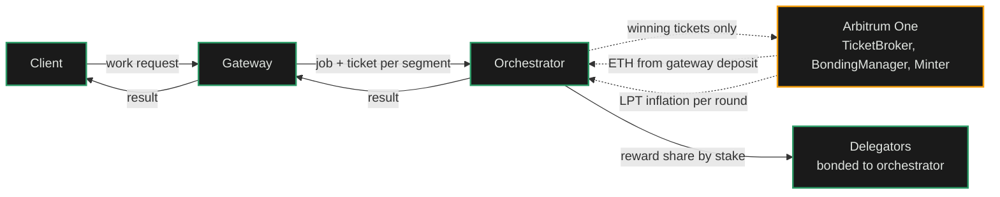
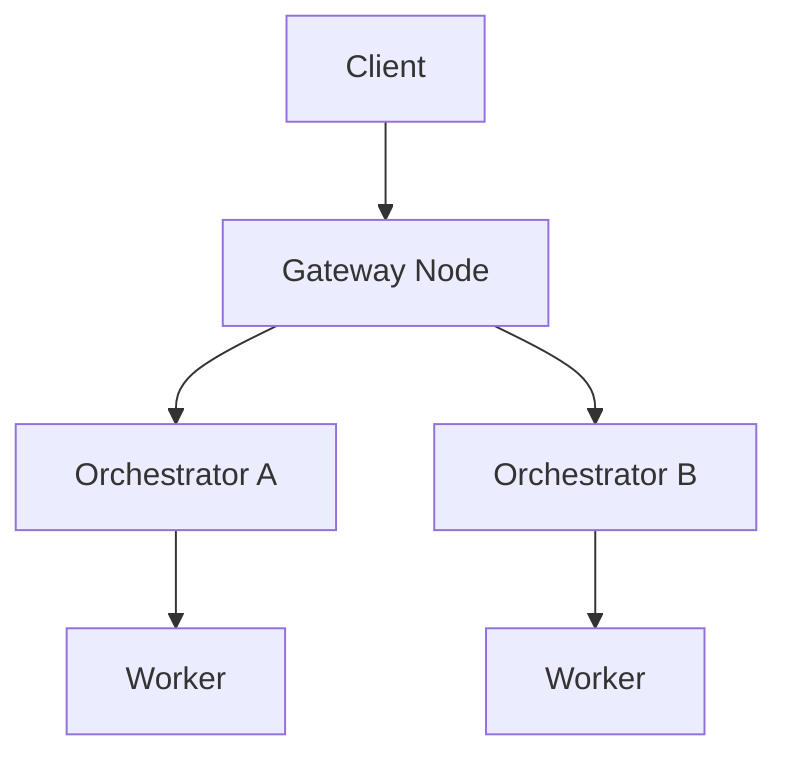

import { CustomCardTitle, Subtitle } from '/snippets/components/elements/text/Text.jsx'
import { Quote } from '/snippets/components/displays/quotes/Quote.jsx'
import { CustomDivider } from '/snippets/components/elements/spacing/Divider.jsx'
import { LinkArrow } from '/snippets/components/elements/links/Links.jsx'
import { DynamicTableV2 } from '/snippets/components/displays/tables/Tables.jsx'
import { StyledSteps, StyledStep } from '/snippets/components/displays/steps/Steps.jsx'
import { ScrollableDiagram } from '/snippets/components/displays/diagrams/ScrollableDiagram.jsx'
import { BorderedBox } from '/snippets/components/wrappers/containers/Containers.jsx'

<Quote>
The Network is an **open marketplace for real-time compute**. Operators publish what they can do; gateways route demand to them; payment settles continuously off-chain. The Protocol stays out of price discovery and only enters when a winning ticket is redeemed.
</Quote>

<CustomDivider style={{ margin: 0, marginBottom: '-2rem' }} />

## Market Shape

The Livepeer Network is a posted-price market for GPU compute. Operators on the supply side publish their capabilities and prices. Gateways on the demand side discover, score, and route work to them. Payment runs continuously through probabilistic micropayments, with on-chain settlement only when a ticket wins.

The shape is deliberate. An auction would force every job through a bidding round, adding latency the workloads cannot absorb. On-chain settlement per job would cost more than the work itself. The marketplace runs continuously off-chain so per-pixel video and per-token AI remain economical at production volume.

<DynamicTableV2
  headerList={['Market property', 'Livepeer Network', 'Why it is shaped this way']}
  itemsList={[
    {
      'Market property': <Subtitle variant="changelog">**Pricing**</Subtitle>,
      'Livepeer Network': 'Posted prices, set by orchestrators',
      'Why it is shaped this way': 'Continuous market; price competition is visible; gateways route without per-job coordination',
    },
    {
      'Market property': <Subtitle variant="changelog">**Discovery**</Subtitle>,
      'Livepeer Network': 'Public, multi-surface (on-chain registry, direct configuration, webhooks, network capabilities API)',
      'Why it is shaped this way': 'No gatekeeper; gateways select operators on capability and policy',
    },
    {
      'Market property': <Subtitle variant="changelog">**Matching**</Subtitle>,
      'Livepeer Network': 'Gateway-side scoring against operator-published capabilities',
      'Why it is shaped this way': 'Routing decisions stay close to demand; operators do not run a matching service',
    },
    {
      'Market property': <Subtitle variant="changelog">**Settlement**</Subtitle>,
      'Livepeer Network': 'Off-chain probabilistic micropayments with periodic on-chain redemption',
      'Why it is shaped this way': 'Settlement cost stays below the value of the work',
    },
    {
      'Market property': <Subtitle variant="changelog">**Trust anchor**</Subtitle>,
      'Livepeer Network': 'Bonded LPT staked by orchestrators',
      'Why it is shaped this way': 'Economic exposure makes misbehaviour costly; no central operator required',
    },
  ]}
/>

<CustomDivider style={{ margin: '-1rem 0 -2rem 0' }} />

## How Work and Value Move

Two flows run continuously across the marketplace. Work flows from clients through gateways to orchestrators. Value flows in the opposite direction, mostly off-chain, with periodic on-chain settlement.

<ScrollableDiagram title="Work and Value Flow Across the Marketplace" maxHeight="600px">

</ScrollableDiagram>

The diagram is the marketplace. Solid arrows are continuous off-chain traffic; dashed arrows are the periodic on-chain settlement. Most jobs never produce a dashed arrow. The marketplace runs at the speed of the solid lines, anchored by the dashed ones.

<CustomDivider style={{ margin: '-1rem 0 -2rem 0' }} />

## Settlement Boundary

The boundary between what the Protocol records and what stays off-chain is sharp. The Protocol sees deposits, winning tickets, active-set membership, and inflation distribution. Everything else is direct gateway-to-orchestrator traffic.

<BorderedBox variant="accent">
  <Subtitle style={{ fontSize: '1rem', marginBottom: '0.5rem' }}>**Visible on-chain**</Subtitle>
  - Orchestrator service URIs and active-set membership
  - Gateway deposits and reserves in `TicketBroker`
  - Winning tickets when redeemed
  - Per-round LPT inflation distributions to bonded stake
  - Governance proposals and votes

  <Subtitle style={{ fontSize: '1rem', marginTop: '1rem', marginBottom: '0.5rem' }}>**Off-chain only**</Subtitle>
  - Capability and price advertisement
  - Per-session price agreement and ticket parameter exchange
  - Per-segment job dispatch and results
  - All probabilistic tickets that do not win the lottery
  - Discovery scoring and operator routing policy
</BorderedBox>

This split is what lets per-pixel and per-token pricing remain economical at production volume. On-chain settlement per segment would cost more than the work itself; off-chain ticketing with periodic redemption keeps the cost ratio sustainable.

<CustomDivider style={{ margin: '-1rem 0 -2rem 0' }} />

## How Honest Work is Enforced

The Network produces verifiable work without a central operator. Three mechanisms stack: stake exposure, fast verification, and the discovery surface itself.

<StyledSteps iconColor="var(--accent)" titleColor="var(--accent)">
  <StyledStep title="Stake exposure" icon="shield-halved">
    Orchestrators bond LPT to be eligible for video work. The bonded stake is what makes them discoverable, what gives delegators a reason to back them, and what they lose value on if they misbehave or go offline. The marketplace is not anonymous; every orchestrator has economic skin in the game.
  </StyledStep>
  <StyledStep title="Fast verification" icon="circle-check">
    Gateways can re-encode a returned segment and compare it against the orchestrator's output to detect tampering. Verification is optional per-session and per-segment, applied at a sample rate the gateway chooses. A verification mismatch triggers an immediate orchestrator swap and feeds operator-side reputation signals.
  </StyledStep>
  <StyledStep title="Marketplace selection" icon="filter">
    Gateways score candidates on capability match, latency, stake-weighted reliability, and operator history. Orchestrators that fail jobs, return wrong outputs, or run high latency drop out of selection. The marketplace prunes itself; operators that perform well receive more work.
  </StyledStep>
</StyledSteps>

The three mechanisms compose. Stake makes misbehaviour costly. Verification detects it when it happens. Selection routes around operators that produce it. None of the three depends on a central authority.

<CustomDivider />

## Related Pages

<Columns cols={2}>
  <Card title={<CustomCardTitle icon="circle-nodes" title="Network Design" />} href="/v2/about/network/design" horizontal arrow>
    Purpose, properties, actors, where to go.
  </Card>
  <Card title={<CustomCardTitle icon="diagram-project" title="Network Architecture" />} href="/v2/about/network/architecture" horizontal arrow>
    The running fleet's structure and surfaces.
  </Card>
  <Card title={<CustomCardTitle icon="cogs" title="Protocol Mechanisms" />} href="/v2/about/protocol/mechanisms" horizontal arrow>
    Staking, rewards, settlement, rounds.
  </Card>
  <Card title={<CustomCardTitle icon="microchip" title="Run an Orchestrator" />} href="/v2/orchestrators/portal" horizontal arrow>
    Operator-side pricing, staking, earnings.
  </Card>
</Columns>

{  /* ---
title: Livepeer Marketplace
sidebarTitle: Marketplace
description: >-
  How the Livepeer Network marketplace matches demand and supply for real-time media compute: transcoding and AI
  inference, including routing, pricing, and settlement.
lifecycleStage: discover
complexity: intermediate
pageType: concept
audience: general
lastVerified: 2026-03-17T00:00:00.000Z
purpose: concept
keywords:
  - livepeer
  - about
  - livepeer network
  - marketplace
  - routing
  - orchestrators
  - gateways
  - pricing
'og:image': /snippets/assets/media/og-images/en/about.png
---
import { DynamicTable } from '/snippets/components/displays/tables/Tables.jsx'
import { GotoCard, GotoLink } from '/snippets/components/elements/links/Links.jsx'

The Livepeer Network supports a dynamic decentralised marketplace for real-time media compute: transcoding and AI inference. Unlike static infrastructure platforms, Livepeer's open marketplace introduces real-time **bidding, routing, and pricing** of jobs across a global pool of Orchestrators. The marketplace layer, actor behaviours, session economics, and how it relates to the protocol.

## Marketplace overview

<DynamicTable
  headerList={["Element", "Role"]}
  itemsList={[
    { "Element": "Gateway / Client", "Role": "Submit job requests (stream, image, session intent)" },
    { "Element": "Gateway", "Role": "Matches requests to suitable Orchestrators" },
    { "Element": "Orchestrator", "Role": "Advertises availability, pricing, and capabilities" },
    { "Element": "Worker", "Role": "Executes compute task (Transcoder or AI worker)" },
    { "Element": "TicketBroker", "Role": "Receives tickets for ETH reward upon verified work (on-chain)" }
  ]}
/>

This market is **continuous** - Orchestrators are always available for sessions; Gateways route work off-chain without per-job on-chain gas.

## Demand: client workloads

Clients submit multiple media compute jobs through Gateways:

<DynamicTable
  headerList={["Job type", "Example use case", "Payment style"]}
  itemsList={[
    { "Job type": "Live stream", "Example use case": "RTMP ingest for video platforms", "Payment style": "Per-minute ETH / credits" },
    { "Job type": "AI inference", "Example use case": "Frame-by-frame image-to-image generation", "Payment style": "Per-job (frame, token)" },
    { "Job type": "File transcode", "Example use case": "Static MP4 → web formats", "Payment style": "Batch credits" }
  ]}
/>

**API examples:** Livepeer Studio REST, Gateway POST job, ComfyStream interface (AI).

## Supply: Orchestrator nodes

Orchestrators advertise:

- Hardware specs (GPU/CPU, memory)
- Region and latency
- Supported workloads (video, AI, or both)
- Price per segment / frame / token

They update availability via Gateway-side gRPC or REST heartbeat endpoints. Gateways use this information to route jobs to the best match.

## Routing logic

The Gateway scores Orchestrators by:

- Latency to input source
- Workload match (video vs AI)
- Cost per job
- Availability and retry buffer

Sessions are **routed** off-chain to the best match; no on-chain gas is spent per job.

## Price discovery

The current Livepeer implementation uses **posted pricing** (Orchestrator-set), not auction-based. A few notes:

- Clients can be matched to the lowest available compatible provider.
- Prices may vary by:
  - Region (e.g. US-East vs EU-Central)
  - GPU load (AI-heavy Orchestrators may charge more)
  - Quality profile (e.g. 1080p60 vs 720p30)

<Note>
In development: LIPs may introduce dynamic auction mechanisms for AI sessions (e.g. Spot job auctions). See the [Forum LIPs](https://forum.livepeer.org/c/lips/) for proposals.
</Note>

## Payments and settlement

**Clients** pay via:

- ETH tickets (settled on-chain via the protocol’s `TicketBroker`)
- Credit balance (tracked off-chain by some Gateways)

**Orchestrators:**

- Claim winning tickets to the `TicketBroker` on Arbitrum
- Accumulate ETH earnings from transcoding/AI work
- Claim inflation (LPT) rewards from the `BondingManager` each round

## Credit system extensions

Some Gateways provide user-friendly pricing in addition to direct ETH:

<DynamicTable
  headerList={["Currency", "Top-up methods", "Denomination example"]}
  itemsList={[
    { "Currency": "USD", "Top-up methods": "Credit card, USDC", "Denomination example": "Per minute or per job" },
    { "Currency": "ETH", "Top-up methods": "MetaMask, smart wallet", "Denomination example": "Per job or per segment" }
  ]}
/>

Orchestrators can price in USD-equivalent via oracle-based quoting where supported.

## Observability

Each session can be logged with:

- Latency to first response
- Retry count
- Orchestrator ID and region
- Price paid (ETH or credit)

Future marketplace indexers may surface real-time job flow stats for the network.

## Protocol–market boundaries

<DynamicTable
  headerList={["Layer", "Description", "Example"]}
  itemsList={[
    { "Layer": "Protocol", "Description": "Verifies work and pays ETH & LPT rewards", "Example": "TicketBroker, BondingManager" },
    { "Layer": "Marketplace", "Description": "Matches jobs to compute providers", "Example": "Gateway load balancer, routing" },
    { "Layer": "Interface layer", "Description": "Abstracts API, SDK, session negotiation", "Example": "Livepeer Studio SDK, Daydream API" }
  ]}
/>

## Future upgrades (LIPs proposed)

- **LIP-78:** Spot job auctions
- **LIP-81:** Credit-to-protocol sync bridge
- **LIP-85:** Orchestrator staking influence on job routing

For current status, see the [Forum LIPs](https://forum.livepeer.org/c/lips/) and [Technical roadmap](../resources/technical-roadmap).

## See also

- [Job pipelines](./job-pipelines) - End-to-end flow from ingest to settlement
- [Actors](./actors) - Gateway, Orchestrator, and Delegator roles
- [Livepeer Protocol overview](../protocol/overview) - On-chain contracts and incentives
- [Blockchain contracts](../protocol/blockchain-contracts) - TicketBroker and other contract addresses

## References

- [Livepeer Studio / Gateway docs](https://livepeer.studio/docs)
- [TicketBroker (protocol)](https://github.com/livepeer/protocol/tree/master/contracts/job)
- [Orchestrator node setup](/v2/Orchestrators/portal)
- [Forum: LIP proposals](https://forum.livepeer.org/c/lips/)
- [Livepeer AI (ComfyStream, blog)](https://blog.livepeer.org/real-time-ai-comfyui) */}
