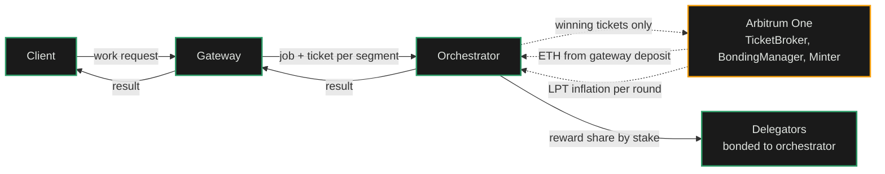
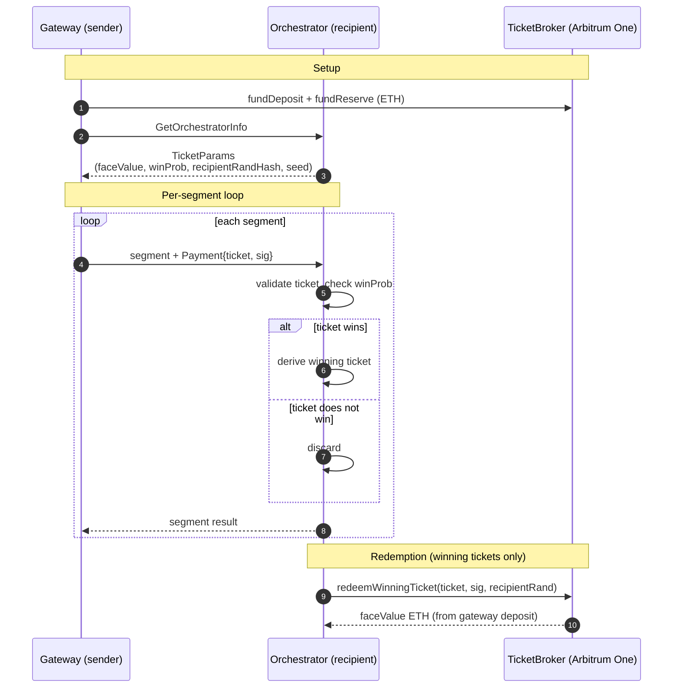

import { CustomCardTitle, Subtitle } from '/snippets/components/elements/text/Text.jsx'
import { Quote } from '/snippets/components/displays/quotes/Quote.jsx'
import { CustomDivider } from '/snippets/components/elements/spacing/Divider.jsx'
import { LinkArrow } from '/snippets/components/elements/links/Links.jsx'
import { DynamicTableV2 } from '/snippets/components/displays/tables/Tables.jsx'
import { StyledSteps, StyledStep } from '/snippets/components/displays/steps/Steps.jsx'
import { ScrollableDiagram } from '/snippets/components/displays/diagrams/ScrollableDiagram.jsx'
import { BorderedBox } from '/snippets/components/wrappers/containers/Containers.jsx'

<Quote>
The Network is an **open marketplace for real-time compute**. Operators publish what they can do; gateways route demand to them; payment settles continuously off-chain. The Protocol stays out of price discovery and only enters when a winning ticket is redeemed.
</Quote>

<CustomDivider style={{ margin: 0, marginBottom: '-2rem' }} />

## Market Shape

The Livepeer Network is a posted-price market for GPU compute. Operators on the supply side publish their capabilities and prices. Gateways on the demand side discover, score, and route work to them. Payment runs continuously through probabilistic micropayments, with on-chain settlement only when a ticket wins.

The shape is deliberate. An auction would force every job through a bidding round, adding latency the workloads cannot absorb. On-chain settlement per job would cost more than the work itself. The marketplace runs continuously off-chain so per-pixel video and per-token AI remain economical at production volume.

<DynamicTableV2
  headerList={['Market property', 'Livepeer Network', 'Why it is shaped this way']}
  itemsList={[
    {
      'Market property': <Subtitle variant="changelog">**Pricing**</Subtitle>,
      'Livepeer Network': 'Posted prices, set by orchestrators',
      'Why it is shaped this way': 'Continuous market; price competition is visible; gateways route without per-job coordination',
    },
    {
      'Market property': <Subtitle variant="changelog">**Discovery**</Subtitle>,
      'Livepeer Network': 'Public, multi-surface (on-chain registry, direct configuration, webhooks, network capabilities API)',
      'Why it is shaped this way': 'No gatekeeper; gateways select operators on capability and policy',
    },
    {
      'Market property': <Subtitle variant="changelog">**Matching**</Subtitle>,
      'Livepeer Network': 'Gateway-side scoring against operator-published capabilities',
      'Why it is shaped this way': 'Routing decisions stay close to demand; operators do not run a matching service',
    },
    {
      'Market property': <Subtitle variant="changelog">**Settlement**</Subtitle>,
      'Livepeer Network': 'Off-chain probabilistic micropayments with periodic on-chain redemption',
      'Why it is shaped this way': 'Settlement cost stays below the value of the work',
    },
    {
      'Market property': <Subtitle variant="changelog">**Trust anchor**</Subtitle>,
      'Livepeer Network': 'Bonded LPT staked by orchestrators',
      'Why it is shaped this way': 'Economic exposure makes misbehaviour costly; no central operator required',
    },
  ]}
/>

<CustomDivider style={{ margin: '-1rem 0 -2rem 0' }} />

## Work and Value Flow

Two flows run continuously across the marketplace. Work flows from clients through gateways to orchestrators. Value flows in the opposite direction, mostly off-chain, with periodic on-chain settlement.

<ScrollableDiagram title="Work and Value Flow Across the Marketplace" maxHeight="600px">

</ScrollableDiagram>

The diagram is the marketplace. Solid arrows are continuous off-chain traffic; dashed arrows are the periodic on-chain settlement. Most jobs never produce a dashed arrow. The marketplace runs at the speed of the solid lines, anchored by the dashed ones.

<CustomDivider style={{ margin: '-1rem 0 -2rem 0' }} />

## Settlement Boundary

The boundary between what the Protocol records and what stays off-chain is sharp. The Protocol sees deposits, winning tickets, active-set membership, and inflation distribution. Everything else is direct gateway-to-orchestrator traffic.

<BorderedBox variant="accent">
  <Subtitle style={{ fontSize: '1rem', marginBottom: '0.5rem' }}>**Visible on-chain**</Subtitle>
  - Orchestrator service URIs and active-set membership
  - Gateway deposits and reserves in `TicketBroker`
  - Winning tickets when redeemed
  - Per-round LPT inflation distributions to bonded stake
  - Governance proposals and votes

  <Subtitle style={{ fontSize: '1rem', marginTop: '1rem', marginBottom: '0.5rem' }}>**Off-chain only**</Subtitle>
  - Capability and price advertisement
  - Per-session price agreement and ticket parameter exchange
  - Per-segment job dispatch and results
  - All probabilistic tickets that do not win the lottery
  - Discovery scoring and operator routing policy
</BorderedBox>

This split is what lets per-pixel and per-token pricing remain economical at production volume. On-chain settlement per segment would cost more than the work itself; off-chain ticketing with periodic redemption keeps the cost ratio sustainable.

<CustomDivider style={{ margin: '-1rem 0 -2rem 0' }} />

## Probabilistic Micropayments

The mechanism that makes the off-chain settlement work is the probabilistic micropayment ticket. Every job segment carries a ticket. Most tickets do not win and never touch the chain. Only winning tickets are redeemed on-chain, where the gateway's deposit pays the orchestrator the ticket's full face value.

<ScrollableDiagram title="Probabilistic Micropayment Ticket Exchange" maxHeight="600px">

</ScrollableDiagram>

The expected value of any single ticket is `faceValue × winProb`. A gateway sets the win probability so that the per-segment expected payment matches the work being purchased. An orchestrator validates each ticket against the parameters it advertised in `OrchestratorInfo`; tickets signed against stale parameters are rejected. Redemption itself is asynchronous: an orchestrator can batch winning tickets and redeem them at convenient times relative to gas prices.

<Tip>
The design relies on a collaborative randomness scheme: the gateway's signature and the orchestrator's `recipientRand` together determine whether a ticket wins. Neither party can predict winners alone.
</Tip>

<CustomDivider style={{ margin: '-1rem 0 -2rem 0' }} />

## Honesty Enforcement

The Network produces verifiable work without a central operator. Three mechanisms stack: stake exposure, fast verification, and the discovery surface itself.

<StyledSteps iconColor="var(--accent)" titleColor="var(--accent)">
  <StyledStep title="Stake exposure" icon="shield-halved">
    Orchestrators bond LPT to be eligible for video work. The bonded stake is what makes them discoverable, what gives delegators a reason to back them, and what they lose value on if they misbehave or go offline. The marketplace is not anonymous; every orchestrator has economic exposure tied to performance.
  </StyledStep>
  <StyledStep title="Fast verification" icon="circle-check">
    Gateways can re-encode a returned segment and compare a perceptual hash (MPEG-7 video signature) against the orchestrator's output to detect tampering. Verification is optional per-session and per-segment, applied at a sample rate the gateway chooses. A verification mismatch triggers an immediate orchestrator swap and feeds operator-side reputation signals.
  </StyledStep>
  <StyledStep title="Marketplace selection" icon="filter">
    Gateways score candidates on capability match, latency, stake-weighted reliability, and operator history. Orchestrators that fail jobs, return wrong outputs, or run high latency drop out of selection. The marketplace prunes itself; operators that perform well receive more work.
  </StyledStep>
</StyledSteps>

<Tip>
On-chain slashing exists in the Protocol but is dormant: the Verifier role is set to `0x0`. Today, honest work is enforced by stake exposure (delegator withdrawal), fast verification, and selection feedback. Slashing reactivation is a governance question, not a network change.
</Tip>

The three mechanisms compose. Stake makes misbehaviour costly. Verification detects it when it happens. Selection routes around operators that produce it. None of the three depends on a central authority.

<CustomDivider />

## Related Pages

<Columns cols={2}>
  <Card title={<CustomCardTitle icon="circle-nodes" title="Network Design" />} href="/v2/about/network/design" horizontal arrow>
    Purpose, properties, actors, where to go.
  </Card>
  <Card title={<CustomCardTitle icon="diagram-project" title="Network Architecture" />} href="/v2/about/network/architecture" horizontal arrow>
    The Network's structure and surfaces.
  </Card>
  <Card title={<CustomCardTitle icon="cogs" title="Protocol Mechanisms" />} href="/v2/about/protocol/mechanisms" horizontal arrow>
    Staking, rewards, settlement, rounds.
  </Card>
  <Card title={<CustomCardTitle icon="microchip" title="Run an Orchestrator" />} href="/v2/orchestrators/portal" horizontal arrow>
    Operator-side pricing, staking, earnings.
  </Card>
</Columns>
