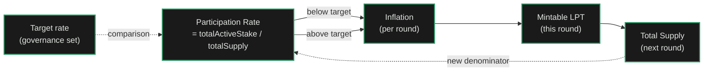

import { CustomCardTitle, Subtitle } from '/snippets/components/elements/text/Text.jsx'
import { Quote } from '/snippets/components/displays/quotes/Quote.jsx'
import { CustomDivider } from '/snippets/components/elements/spacing/Divider.jsx'
import { LinkArrow } from '/snippets/components/elements/links/Links.jsx'
import { DynamicTableV2 } from '/snippets/components/displays/tables/Tables.jsx'
import { ScrollableDiagram } from '/snippets/components/displays/diagrams/ScrollableDiagram.jsx'
import { BorderedBox } from '/snippets/components/wrappers/containers/Containers.jsx'

<Quote>
The Livepeer Explorer at [explorer.livepeer.org](https://explorer.livepeer.org/) shows network state in real time. This page defines every metric on the Explorer and the formulas to compute the standard institutional metrics (FDV, P/S ratio, Nakamoto coefficient, annualised inflation) from subgraph data.
</Quote>

<CustomDivider style={{ margin: 0, marginBottom: '-2rem' }} />

## Round Status

A round is one period during which orchestrators can call `reward` once, parameters can be changed, and a new active set is fixed. Rounds on Arbitrum One are approximately 21 hours long, set by `roundLength` measured in L1 blocks. Each round closes when its block count is reached; the next round begins when an orchestrator calls `RoundsManager.initializeRound()`.

<DynamicTableV2
  headerList={['Metric', 'What it shows', 'Why it matters']}
  itemsList={[
    {
      Metric: <Subtitle variant="changelog">**Current Round**</Subtitle>,
      'What it shows': 'Integer round ID, increments by 1 each round transition.',
      'Why it matters': 'The round number is the unit of time on Livepeer. Reward calls, stake changes, and parameter updates are all keyed to it.',
    },
    {
      Metric: <Subtitle variant="changelog">**Initialized / Locked**</Subtitle>,
      'What it shows': '`Initialized` once any orchestrator has called `initializeRound()`. `Locked` in the final blocks of a round when bond changes and parameter updates are no longer accepted.',
      'Why it matters': 'Indicates whether stake changes and reward calls are currently possible. A round that stays uninitialised signals the active set is not actively running.',
    },
    {
      Metric: <Subtitle variant="changelog">**Blocks Remaining / Time Remaining**</Subtitle>,
      'What it shows': 'L1 blocks until the round ends, plus an approximate time estimate using a 12-second L1 block average.',
      'Why it matters': 'Tells delegators how long they have to bond, change delegate, or wait for a reward call. Tells orchestrators how long they have to call `reward` before missing the round.',
    },
    {
      Metric: <Subtitle variant="changelog">**Fees (current round)**</Subtitle>,
      'What it shows': 'ETH redeemed via winning tickets in the current round, with USD-equivalent in the tooltip at recent prices.',
      'Why it matters': 'Real-time demand signal. A round with high fees means jobs are being delivered and paid for right now.',
    },
    {
      Metric: <Subtitle variant="changelog">**Rewards (current round)**</Subtitle>,
      'What it shows': 'LPT minted by orchestrators that have called `reward()` this round, displayed as `claimed / mintable LPT`.',
      'Why it matters': 'Shows how much of the round\'s scheduled inflation has been claimed. A reward call ratio below 100% means some active orchestrators have skipped the round, leaving LPT unminted.',
    },
    {
      Metric: <Subtitle variant="changelog">**Total Supply**</Subtitle>,
      'What it shows': 'Current LPT in existence, the ERC-20 `totalSupply()` of the LPT contract on Arbitrum One.',
      'Why it matters': 'The denominator of every supply-relative metric on this page. Foundation of FDV and market cap.',
    },
    {
      Metric: <Subtitle variant="changelog">**Supply Change (1Y)**</Subtitle>,
      'What it shows': 'Percent change in Total Supply over the past 365 days.',
      'Why it matters': 'Realised annual inflation, after `reward()` skip rate is taken into account. Differs from the configured inflation rate when reward calls are missed.',
    },
  ]}
/>

<CustomDivider style={{ margin: '-1rem 0 -2rem 0' }} />

## Activity Metrics

Fee volume is denominated in ETH (gateways pay in ETH via probabilistic micropayment tickets) and converted to USD at the price oracle value at redemption. Estimated usage converts fee volume into minutes of compute delivered using a per-pixel reference price; methodology last updated 21 August 2023 ([forum post](https://forum.livepeer.org/t/livepeer-explorer-minutes-estimation-methodology/2140)).

<DynamicTableV2
  headerList={['Metric', 'What it shows', 'Why it matters']}
  itemsList={[
    {
      Metric: <Subtitle variant="changelog">**Fees Paid (1d / 7d, USD)**</Subtitle>,
      'What it shows': 'Daily or weekly aggregate of all winning ticket redemptions across the network, in USD.',
      'Why it matters': 'Direct demand-side measure. The Explorer chart toggles between 1d and 7d aggregation.',
    },
    {
      Metric: <Subtitle variant="changelog">**Estimated Usage (1d / 7d, minutes)**</Subtitle>,
      'What it shows': 'Estimated minutes of network compute delivered, derived from fee volume and a per-pixel reference price.',
      'Why it matters': 'Translates fee dollars into real work done. Useful for sizing the network in terms of compute, not just money.',
    },
    {
      Metric: <Subtitle variant="changelog">**Total Fee Volume (lifetime, ETH)**</Subtitle>,
      'What it shows': 'Cumulative ETH paid through winning ticket settlements across the protocol\'s history on Arbitrum One. Subgraph field: `Protocol.totalVolumeETH`.',
      'Why it matters': 'Lifetime demand. The numerator for any cumulative revenue analysis.',
    },
    {
      Metric: <Subtitle variant="changelog">**Total Fee Volume (lifetime, USD)**</Subtitle>,
      'What it shows': 'Cumulative USD-equivalent of redeemed tickets, computed at the price oracle value on each redemption. Subgraph field: `Protocol.totalVolumeUSD`.',
      'Why it matters': 'Lifetime revenue in dollar terms. The standard input for an annualised P/S ratio.',
    },
    {
      Metric: <Subtitle variant="changelog">**Annualised Fee Revenue (computed)**</Subtitle>,
      'What it shows': 'Sum of `Day.volumeUSD` across the last 365 days. Computed from the `days` subgraph entity.',
      'Why it matters': 'The standard "TTM revenue" figure for crypto valuation comparisons.',
    },
  ]}
/>

Live: weekly transcoding fee volume from Rick Staa's Dune dashboard. Source: [`dune.com/queries/4073378`](https://dune.com/queries/4073378). For real-time daily data, see the [Explorer homepage](https://explorer.livepeer.org/).

<CustomDivider style={{ margin: '-1rem 0 -2rem 0' }} />

## Economic Metrics

Three subgraph fields fully describe the LPT supply system: `totalSupply`, `inflation`, `participationRate`. They form a closed feedback loop. When participation falls below the target rate, inflation rises; when participation exceeds target, inflation falls. The loop is defined in `BondingManager` and runs once per round.

<ScrollableDiagram title="The Participation-Inflation Feedback Loop" maxHeight="400px">

</ScrollableDiagram>

<DynamicTableV2
  headerList={['Metric', 'What it shows', 'Why it matters']}
  itemsList={[
    {
      Metric: <Subtitle variant="changelog">**Total Supply**</Subtitle>,
      'What it shows': 'LPT in existence. ERC-20 `LivepeerToken.totalSupply()`. Increases each round by `mintableTokens` claimed.',
      'Why it matters': 'The supply denominator. Both FDV and market cap derive from this.',
    },
    {
      Metric: <Subtitle variant="changelog">**Circulating Supply (computed)**</Subtitle>,
      'What it shows': 'Total Supply minus Treasury Balance minus unbonded-but-locked LPT. Livepeer does not have a vested-team component, so circulating ≈ total minus treasury for most analyses.',
      'Why it matters': 'The numerator for market cap. The supply that can move.',
    },
    {
      Metric: <Subtitle variant="changelog">**Inflation Rate (per round)**</Subtitle>,
      'What it shows': 'LPT minted per round as a fraction of total supply. Subgraph field: `Protocol.inflation` (PPM-billion).',
      'Why it matters': 'The raw input to all inflation calculations. Adjusts each round by `inflationChange` based on participation.',
    },
    {
      Metric: <Subtitle variant="changelog">**Annualised Inflation (computed)**</Subtitle>,
      'What it shows': '`inflation × rounds-per-year`. With ~21-hour rounds on Arbitrum One, approximately 417 rounds per year.',
      'Why it matters': 'The dilution rate a token holder experiences before any treasury cut.',
    },
    {
      Metric: <Subtitle variant="changelog">**Net Inflation (computed)**</Subtitle>,
      'What it shows': 'Annualised Inflation × (1 − `treasuryRewardCutRate`). The portion of new LPT that reaches stakers after the treasury takes its share.',
      'Why it matters': 'Real dilution to a delegator. The treasury cut reduces inflation reaching the active set without changing the headline rate.',
    },
    {
      Metric: <Subtitle variant="changelog">**Participation Rate**</Subtitle>,
      'What it shows': '`totalActiveStake / totalSupply`, the percent of LPT bonded to active orchestrators. Subgraph field: `Protocol.participationRate`.',
      'Why it matters': 'Both a security signal (more stake means more economic exposure backing work) and a yield modulator (drives inflation up or down).',
    },
    {
      Metric: <Subtitle variant="changelog">**Supply Change (1Y)**</Subtitle>,
      'What it shows': 'Realised annual change in Total Supply, including reward-call skip rate. Shown directly on the Explorer Round Status panel.',
      'Why it matters': 'Differs from configured inflation when orchestrators miss reward calls. The honest measure of LPT dilution holders see.',
    },
    {
      Metric: <Subtitle variant="changelog">**LPT Price in ETH**</Subtitle>,
      'What it shows': 'On-chain price oracle value used for ticket settlement and yield calculations. Subgraph field: `Protocol.lptPriceEth`.',
      'Why it matters': 'The exchange rate that converts ETH fees into LPT-equivalent yield, and the input gateways use to size winning tickets.',
    },
    {
      Metric: <Subtitle variant="changelog">**FDV (computed)**</Subtitle>,
      'What it shows': '`LPT spot price (USD) × Total Supply`. LPT spot price is sourced from CoinGecko, Coinbase, or any major exchange.',
      'Why it matters': 'Standard valuation comparable. FDV is more relevant than market cap for Livepeer because there is no team-vested overhang to discount.',
    },
    {
      Metric: <Subtitle variant="changelog">**P/S Ratio (computed)**</Subtitle>,
      'What it shows': '`FDV / Annualised Fee Revenue (USD)`. The standard valuation multiple for revenue-generating protocols.',
      'Why it matters': 'Comparable to traditional equity multiples and to other revenue-generating crypto protocols (Lido, MakerDAO, Aave).',
    },
  ]}
/>

<CustomDivider style={{ margin: '-1rem 0 -2rem 0' }} />

## Decentralisation Metrics

Concentration metrics are computed from the orchestrator subgraph entity. Active set size and delegator count are direct subgraph fields; concentration ratios and the Nakamoto coefficient are derived from the orchestrator stake distribution.

<DynamicTableV2
  headerList={['Metric', 'What it shows', 'Why it matters']}
  itemsList={[
    {
      Metric: <Subtitle variant="changelog">**Active Orchestrators**</Subtitle>,
      'What it shows': 'Count of orchestrators in the current active set. Subgraph field: `Protocol.activeTranscoderCount`. Capped at `numActiveTranscoders` (currently 100 {/* REVIEW: confirm cap pre-merge */}).',
      'Why it matters': 'The number of independent operators that run the network. Active set turnover signals competitive pressure on stake.',
    },
    {
      Metric: <Subtitle variant="changelog">**Delegators**</Subtitle>,
      'What it shows': 'Total distinct delegator addresses across the network. Subgraph field: `Protocol.delegatorsCount`.',
      'Why it matters': 'The size of the staking community. Growth here signals broader LPT distribution.',
    },
    {
      Metric: <Subtitle variant="changelog">**Average Stake per Orchestrator (computed)**</Subtitle>,
      'What it shows': '`totalActiveStake / activeTranscoderCount`.',
      'Why it matters': 'Indicates whether stake is evenly distributed across the active set or concentrated in a few large operators.',
    },
    {
      Metric: <Subtitle variant="changelog">**Average Stake per Delegator (computed)**</Subtitle>,
      'What it shows': '`totalActiveStake / delegatorsCount`.',
      'Why it matters': 'Distinguishes a network of many small delegators from one of a few whales.',
    },
    {
      Metric: <Subtitle variant="changelog">**Top 10 Stake Concentration (computed)**</Subtitle>,
      'What it shows': 'Sum of `totalStake` for the top 10 orchestrators divided by `totalActiveStake`. Computed from the orchestrators subgraph query.',
      'Why it matters': 'Standard concentration measure. Lower is more decentralised.',
    },
    {
      Metric: <Subtitle variant="changelog">**Nakamoto Coefficient (computed)**</Subtitle>,
      'What it shows': 'Minimum number of orchestrators needed to control 33% of `totalActiveStake`. Walk orchestrators desc by stake until cumulative > 33%.',
      'Why it matters': 'The standard institutional decentralisation metric. A higher Nakamoto coefficient means more orchestrators must coordinate to influence governance or active-set dynamics.',
    },
  ]}
/>

<CustomDivider style={{ margin: '-1rem 0 -2rem 0' }} />

## Staking Metrics

Forecasted Yield on the orchestrator list is computed live from network parameters (`inflation`, `inflationChange`, `totalActiveStake`, `lptPriceEth`), the orchestrator's parameters (`rewardCut`, `feeShare`, recent fee volume, reward call ratio), and configurable assumptions (time horizon, delegation amount, factors, future inflation). The result is an estimate, not a guarantee.

<DynamicTableV2
  headerList={['Metric', 'What it shows', 'Why it matters']}
  itemsList={[
    {
      Metric: <Subtitle variant="changelog">**Total Staked (LPT)**</Subtitle>,
      'What it shows': 'Sum of bonded LPT across all active orchestrators. Subgraph field: `Protocol.totalActiveStake`.',
      'Why it matters': 'The denominator of staking ratio. Excludes stake bonded to inactive orchestrators.',
    },
    {
      Metric: <Subtitle variant="changelog">**Staking Ratio**</Subtitle>,
      'What it shows': 'Identical to Participation Rate: `totalActiveStake / totalSupply`. Named differently in different contexts.',
      'Why it matters': 'Standard institutional comparable. Ethereum, Solana, and most PoS chains report this number.',
    },
    {
      Metric: <Subtitle variant="changelog">**Number of Stakers**</Subtitle>,
      'What it shows': 'Identical to Delegators count: `Protocol.delegatorsCount`.',
      'Why it matters': 'Standard institutional comparable. Often paired with Staking Ratio in coverage reports.',
    },
    {
      Metric: <Subtitle variant="changelog">**Forecasted Yield**</Subtitle>,
      'What it shows': 'Estimated rewards plus fees over a chosen time horizon if the reader were to delegate a chosen LPT amount to a specific orchestrator. Computed live in the Explorer using the formula in the [yield calculation reference](https://docs.livepeer.org/delegators/reference/yield-calculation).',
      'Why it matters': 'Lets a delegator compare orchestrators on a single yield number. The popover decomposes it into LPT rewards and ETH fees so the source of yield is visible.',
    },
    {
      Metric: <Subtitle variant="changelog">**Yield Assumptions**</Subtitle>,
      'What it shows': 'The configurable inputs to Forecasted Yield: time horizon (6M, 1Y, 2Y, 3Y, 4Y), delegation amount (LPT), factors (LPT only, ETH only, or both), inflation change (none, positive, negative).',
      'Why it matters': 'Yield is sensitive to these assumptions. The Explorer surfaces them so a reader can see whether a high yield rests on optimistic inputs.',
    },
  ]}
/>

<CustomDivider style={{ margin: '-1rem 0 -2rem 0' }} />

## Orchestrator Columns

Reward Cut and Fee Cut apply to different income streams and are commonly confused. Reward Cut applies to LPT inflation; Fee Cut applies to ETH fees. The orchestrator list at [explorer.livepeer.org/orchestrators](https://explorer.livepeer.org/orchestrators) sorts by Forecasted Yield by default; every column is sortable.

<DynamicTableV2
  headerList={['Metric', 'What it shows', 'Why it matters']}
  itemsList={[
    {
      Metric: <Subtitle variant="changelog">**Orchestrator**</Subtitle>,
      'What it shows': 'Rank, ENS name or address. The account coordinating transcoders and AI workers and receiving fees and rewards.',
      'Why it matters': 'Identity for selection and citation. Rank is by Forecasted Yield by default, but the column header is sortable.',
    },
    {
      Metric: <Subtitle variant="changelog">**Delegated Stake**</Subtitle>,
      'What it shows': 'Total LPT bonded to this orchestrator: own bond plus all delegators. Subgraph field: `Transcoder.totalStake`.',
      'Why it matters': 'Determines active-set ranking and reward share. Larger stake means a larger share of inflation rewards each round.',
    },
    {
      Metric: <Subtitle variant="changelog">**Trailing 90D Fees**</Subtitle>,
      'What it shows': 'ETH redeemed by this orchestrator in the last 90 calendar days. Subgraph field: `Transcoder.ninetyDayVolumeETH`.',
      'Why it matters': 'The orchestrator\'s actual demand-side performance. A high value means gateways are routing to this orchestrator at scale.',
    },
    {
      Metric: <Subtitle variant="changelog">**Reward Cut**</Subtitle>,
      'What it shows': 'Percent of inflation rewards the orchestrator keeps. The rest is distributed to delegators by stake share. Subgraph field: `Transcoder.rewardCut` (PPM-million; divide by 10000 for percent).',
      'Why it matters': 'A higher Reward Cut means the delegator receives less LPT inflation. Lower is better for the delegator.',
    },
    {
      Metric: <Subtitle variant="changelog">**Fee Cut**</Subtitle>,
      'What it shows': 'Percent of ETH fees the orchestrator keeps. Stored as `feeShare` (the inverse direction): Fee Cut = `1 − feeShare`. Subgraph field: `Transcoder.feeShare` (PPM-million).',
      'Why it matters': 'A higher Fee Cut means the delegator receives less ETH from each job. Lower is better for the delegator. Often confused with Reward Cut, but they apply to different income streams.',
    },
    {
      Metric: <Subtitle variant="changelog">**Reward Call Ratio (90d)**</Subtitle>,
      'What it shows': 'Percent of the last 90 rounds in which this orchestrator successfully called `reward()`. Computed from the `pools` subgraph query, counting non-null `rewardTokens` over total rounds.',
      'Why it matters': 'A reliability signal. An orchestrator that misses reward calls forfeits that round\'s LPT inflation for everyone bonded to them, including delegators.',
    },
    {
      Metric: <Subtitle variant="changelog">**Latest Fee/Reward Change**</Subtitle>,
      'What it shows': 'Days since the orchestrator last changed Reward Cut or Fee Cut. Computed from `feeShareUpdateTimestamp` and `rewardCutUpdateTimestamp`.',
      'Why it matters': 'A recent change may signal the orchestrator is competing for delegation. A multi-year-stable rate means the operator is settled.',
    },
    {
      Metric: <Subtitle variant="changelog">**Treasury Cut (per pool)**</Subtitle>,
      'What it shows': 'Percent of each round\'s LPT inflation routed to the protocol treasury before any orchestrator or delegator allocation. On-chain: `BondingManager.treasuryRewardCutRate()`.',
      'Why it matters': 'Reduces real LPT yield to all stakers in proportion to the treasury cut. Currently set by governance.',
    },
  ]}
/>

<CustomDivider style={{ margin: '-1rem 0 -2rem 0' }} />

## Gateway Columns

Gateway metrics are demand-side: who is routing jobs and paying fees. The gateway list at [explorer.livepeer.org/gateways](https://explorer.livepeer.org/gateways) shows every gateway with a recent winning ticket redemption.

<DynamicTableV2
  headerList={['Metric', 'What it shows', 'Why it matters']}
  itemsList={[
    {
      Metric: <Subtitle variant="changelog">**Gateway**</Subtitle>,
      'What it shows': 'Rank, ENS name or address. The account routing jobs to orchestrators and paying fees.',
      'Why it matters': 'Identity for the demand side of the network. Major gateways correspond to specific products built on Livepeer.',
    },
    {
      Metric: <Subtitle variant="changelog">**Deposit**</Subtitle>,
      'What it shows': 'Current ETH deposit balance funded for ticket redemptions. Subgraph field: `Broadcaster.deposit`.',
      'Why it matters': 'A funded deposit means the gateway can pay for jobs. Drained deposits cause settlement failures and signal an inactive gateway.',
    },
    {
      Metric: <Subtitle variant="changelog">**Reserve**</Subtitle>,
      'What it shows': 'Reserve ETH available for orchestrators to claim if the deposit runs out mid-session. Subgraph field: `Broadcaster.reserve`.',
      'Why it matters': 'A backstop against deposit exhaustion. Per-orchestrator reserve share is `reserve / activeTranscoderCount`.',
    },
    {
      Metric: <Subtitle variant="changelog">**90d Fees**</Subtitle>,
      'What it shows': 'ETH paid by this gateway through winning ticket settlements in the last 90 days. Subgraph field: `Broadcaster.ninetyDayVolumeETH`.',
      'Why it matters': 'Recent demand contribution. The gateway\'s share of 90d Fees Paid network-wide.',
    },
    {
      Metric: <Subtitle variant="changelog">**Total Fees**</Subtitle>,
      'What it shows': 'Lifetime ETH paid by this gateway. Subgraph field: `Broadcaster.totalVolumeETH`.',
      'Why it matters': 'Cumulative gateway impact on the network. Used for ranking and historical analysis.',
    },
    {
      Metric: <Subtitle variant="changelog">**Number of Active Gateways (computed)**</Subtitle>,
      'What it shows': 'Count of `Broadcaster` entities where `lastActiveDay` is within the last 30 days. Computed from the gateways subgraph query.',
      'Why it matters': 'Demand-side decentralisation. A network served by many gateways is more resilient than one dominated by a single integrator.',
    },
    {
      Metric: <Subtitle variant="changelog">**Top Gateway Concentration (computed)**</Subtitle>,
      'What it shows': 'Sum of top-10 gateway 90d fees divided by network 90d fees. Computed from the same subgraph query.',
      'Why it matters': 'The dual of Top 10 Stake Concentration on the supply side. A high value signals demand-side concentration risk.',
    },
  ]}
/>

<CustomDivider style={{ margin: '-1rem 0 -2rem 0' }} />

## Performance Leaderboard

A measurement service runs reference test jobs against every active orchestrator from each measurement region. Scores aggregate the results. Transcoding and AI scores are tracked separately; AI is further split by pipeline (text-to-image, image-to-image, image-to-video, audio-to-text, text-to-speech, live-video-to-video) and model. The leaderboard sits at [explorer.livepeer.org/leaderboard](https://explorer.livepeer.org/leaderboard).

<DynamicTableV2
  headerList={['Metric', 'What it shows', 'Why it matters']}
  itemsList={[
    {
      Metric: <Subtitle variant="changelog">**Total Score (0-10)**</Subtitle>,
      'What it shows': 'Composite score per region. Transcoding: combines Latency Score and Success Rate. AI: emphasises Success Rate over Latency Score.',
      'Why it matters': 'Single-number ranking for orchestrator quality. The leaderboard sorts by this column by default.',
    },
    {
      Metric: <Subtitle variant="changelog">**Success Rate (%)**</Subtitle>,
      'What it shows': 'Percent of test jobs the orchestrator successfully completed in the most recent measurement window for the selected region.',
      'Why it matters': 'Reliability metric. Failed jobs cost the gateway nothing but signal that the orchestrator cannot consistently deliver.',
    },
    {
      Metric: <Subtitle variant="changelog">**Latency Score (0-10)**</Subtitle>,
      'What it shows': 'Round-trip-time score. Transcoding: average test segment duration vs. round-trip time. AI: average round-trip time vs. the median across orchestrators.',
      'Why it matters': 'Quality signal for time-sensitive work like live video transcoding and real-time AI.',
    },
    {
      Metric: <Subtitle variant="changelog">**Region**</Subtitle>,
      'What it shows': 'Geographic origin of the test job: GLOBAL, FRA (Frankfurt), LAX (Los Angeles), MDW (Chicago), NYC (New York), PRG (Prague), SIN (Singapore), SAO (São Paulo), LON (London). Specific list varies by pipeline type.',
      'Why it matters': 'Latency is region-dependent. An orchestrator strong in Europe may be weak in Asia. Gateways select by region for latency-critical workloads.',
    },
    {
      Metric: <Subtitle variant="changelog">**Pipeline / Model**</Subtitle>,
      'What it shows': 'For AI: the specific pipeline (e.g. `text-to-image`) and model (e.g. `SDXL-Lightning`) the score is for.',
      'Why it matters': 'AI capability is per-model, not per-orchestrator. An orchestrator may run SDXL-Lightning at high score and not run live video-to-video at all.',
    },
    {
      Metric: <Subtitle variant="changelog">**Price Per Pixel**</Subtitle>,
      'What it shows': 'The orchestrator\'s advertised price-per-pixel for transcoding work. Source: [`nyc.livepeer.com/orchestratorStats`](https://nyc.livepeer.com/orchestratorStats), joined into the leaderboard response.',
      'Why it matters': 'Cost side of the gateway selection decision. Performance plus price is what determines real routing.',
    },
  ]}
/>

<CustomDivider style={{ margin: '-1rem 0 -2rem 0' }} />

## Treasury and Governance

The Treasury holds LPT funded by a configurable share of each round's inflation. Treasury proposals authorise spending; polls vote on protocol parameter changes. Treasury state is at [explorer.livepeer.org/treasury](https://explorer.livepeer.org/treasury).

<DynamicTableV2
  headerList={['Metric', 'What it shows', 'Why it matters']}
  itemsList={[
    {
      Metric: <Subtitle variant="changelog">**Treasury Balance**</Subtitle>,
      'What it shows': 'LPT held by the Treasury contract. On-chain: `LivepeerToken.balanceOf(treasury)`. Treasury contract address is resolved via the Controller.',
      'Why it matters': 'Protocol-owned LPT available for governance-approved spending. The standing balance.',
    },
    {
      Metric: <Subtitle variant="changelog">**Treasury Reward Cut Rate**</Subtitle>,
      'What it shows': 'Percent of each round\'s minted LPT routed to the treasury. On-chain: `BondingManager.treasuryRewardCutRate()`. Currently set by governance {/* REVIEW: confirm current value pre-merge */}.',
      'Why it matters': 'The inflation tap. A higher rate funds the treasury faster but reduces real LPT yield to stakers.',
    },
    {
      Metric: <Subtitle variant="changelog">**Treasury Balance Ceiling**</Subtitle>,
      'What it shows': 'LPT balance cap. When the treasury reaches this value, `treasuryRewardCutRate` is treated as 0% until the balance falls below the ceiling. On-chain: `BondingManager.treasuryBalanceCeiling()` {/* REVIEW: confirm current value pre-merge */}.',
      'Why it matters': 'Self-limiting mechanism. The treasury cannot grow unbounded; once the ceiling is hit, the treasury cut goes to zero until the balance falls below it.',
    },
    {
      Metric: <Subtitle variant="changelog">**Treasury Inflows (annualised, computed)**</Subtitle>,
      'What it shows': '`inflation × treasuryRewardCutRate × annual rounds × Total Supply`. The LPT routed to treasury per year at current parameters.',
      'Why it matters': 'How fast the treasury fills. Compared with the ceiling, predicts when the treasury cut goes to zero.',
    },
    {
      Metric: <Subtitle variant="changelog">**Treasury Spend (lifetime, computed)**</Subtitle>,
      'What it shows': 'Sum of LPT spent via executed treasury proposals. Computed from the `TreasuryProposal` subgraph entity.',
      'Why it matters': 'How much the protocol has spent on funded initiatives (SPEs, RFPs, security work).',
    },
    {
      Metric: <Subtitle variant="changelog">**Treasury Proposals**</Subtitle>,
      'What it shows': 'Per-proposal: proposer, description, calldata, vote totals, state (Pending, Active, Succeeded, Defeated, Executed). Subgraph entity: `TreasuryProposal`.',
      'Why it matters': 'The list of decisions on protocol-owned funds. Each proposal links to its full vote history.',
    },
    {
      Metric: <Subtitle variant="changelog">**Polls**</Subtitle>,
      'What it shows': 'On-chain polls that vote on parameter change LIPs. Each poll has a creator, end block, and quorum threshold.',
      'Why it matters': 'How LIPs become protocol parameter changes. A poll that fails quorum cannot enact the change even if "Yes" outpolls "No".',
    },
    {
      Metric: <Subtitle variant="changelog">**Voter Turnout**</Subtitle>,
      'What it shows': 'Percent of `totalActiveStake` that voted on a given poll or proposal. Stake-weighted.',
      'Why it matters': 'Governance engagement signal. Low turnout on a proposal that nominally passes weakens its mandate.',
    },
    {
      Metric: <Subtitle variant="changelog">**Active Set Cap**</Subtitle>,
      'What it shows': 'Maximum orchestrators eligible per round: `numActiveTranscoders`. On-chain: `BondingManager.numActiveTranscoders()`. Currently 100 {/* REVIEW: confirm cap pre-merge */}.',
      'Why it matters': 'Hard ceiling on how many independent orchestrators can earn from the active set in any given round.',
    },
  ]}
/>

For treasury balance over time, see Doug Petkanics's [Livepeer Treasury dashboard](https://dune.com/dob/livepeer-treasury) on Dune. Authoritative on-chain state is at [explorer.livepeer.org/treasury](https://explorer.livepeer.org/treasury).

<CustomDivider style={{ margin: '-1rem 0 -2rem 0' }} />

## Transactions Feed

A chronological feed of every state-changing protocol call sits at [explorer.livepeer.org/transactions](https://explorer.livepeer.org/transactions). Event types:

- **`BondEvent`**: a delegator bonded LPT to an orchestrator. Includes new delegators, additional bonds, and switches from one delegate to another.
- **`UnbondEvent` / `RebondEvent`**: a delegator started unbonding or rebonded before withdrawing.
- **`RewardEvent`**: an orchestrator called `reward()` for a round and minted that round's share of LPT inflation.
- **`WinningTicketRedeemedEvent`**: a winning probabilistic ticket was settled on-chain, transferring ETH from gateway to orchestrator.
- **`DepositFundedEvent` / `ReserveFundedEvent`**: a gateway funded its deposit or reserve.
- **`TranscoderActivatedEvent` / `TranscoderDeactivatedEvent`**: an orchestrator entered or left the active set.
- **`TranscoderUpdateEvent`**: an orchestrator changed `rewardCut`, `feeShare`, or service URI.

Every event is queryable from the subgraph and links through to the underlying Arbiscan transaction.

<CustomDivider style={{ margin: '-1rem 0 -2rem 0' }} />

## Endpoints

For analysts and researchers building dashboards or running scripts, the canonical endpoints in one block:

<BorderedBox variant="accent">
  <Subtitle fontSize="1rem" marginBottom="0.5rem">**Explorer (live, authoritative for current state)**</Subtitle>

  Homepage: `https://explorer.livepeer.org/`
  Orchestrators: `https://explorer.livepeer.org/orchestrators`
  Gateways: `https://explorer.livepeer.org/gateways`
  Performance leaderboard: `https://explorer.livepeer.org/leaderboard`
  Treasury: `https://explorer.livepeer.org/treasury`
  Voting: `https://explorer.livepeer.org/voting`
  Transactions: `https://explorer.livepeer.org/transactions`
  Per-account: `https://explorer.livepeer.org/accounts/<address>/orchestrating`

  <Subtitle fontSize="1rem" marginTop="1rem" marginBottom="0.5rem">**Subgraph (Arbitrum One, every metric the Explorer reads)**</Subtitle>

  GraphQL: `https://gateway.thegraph.com/api/{API_KEY}/subgraphs/id/FE63YgkzcpVocxdCEyEYbvjYqEf2kb1A6daMYRxmejYC`

  Default deployment ID is configurable; the value above is the public default referenced in `livepeer/explorer/lib/chains.ts`.

  <Subtitle fontSize="1rem" marginTop="1rem" marginBottom="0.5rem">**Performance leaderboard API**</Subtitle>

  Aggregated transcoding stats: `https://leaderboard-serverless.vercel.app/api/aggregated_stats`
  Per-orchestrator: `https://leaderboard-serverless.vercel.app/api/raw_stats?orchestrator=<address>`
  AI aggregated stats: `<AI_METRICS_SERVER_URL>/api/aggregated_stats?pipeline=<id>&model=<name>`
  Available pipelines: `<AI_METRICS_SERVER_URL>/api/pipelines?region=<region>`

  <Subtitle fontSize="1rem" marginTop="1rem" marginBottom="0.5rem">**Pricing (orchestrator-advertised prices)**</Subtitle>

  All orchestrators: `https://nyc.livepeer.com/orchestratorStats`

  <Subtitle fontSize="1rem" marginTop="1rem" marginBottom="0.5rem">**Dune dashboards**</Subtitle>

  Main: [`dune.com/ff3314/livepeer`](https://dune.com/ff3314/livepeer)
  AI: [`dune.com/rickstaa/livepeer-ai`](https://dune.com/rickstaa/livepeer-ai)
  Treasury: [`dune.com/dob/livepeer-treasury`](https://dune.com/dob/livepeer-treasury)
  Profitability: [`dune.com/Lizzl/livepeer-profitability-dashboard`](https://dune.com/Lizzl/livepeer-profitability-dashboard)
  Specific queries: [`4073378`](https://dune.com/queries/4073378) (transcoding fees, weekly), [`3983737`](https://dune.com/queries/3983737) (AI fees, weekly)

  <Subtitle fontSize="1rem" marginTop="1rem" marginBottom="0.5rem">**On-chain contracts (Arbitrum One)**</Subtitle>

  Controller: `0xD8E8328501E9645d16Cf49539efC04f734606ee4`
  PollCreator: `0x8bb50806D60c492c0004DAD5D9627DAA2d9732E6`
  Other contracts (BondingManager, TicketBroker, ServiceRegistry, Minter, Treasury, LivepeerGovernor) are resolved via the Controller. See [Blockchain Contracts](/v2/about/protocol/blockchain-contracts).
</BorderedBox>

<CustomDivider />

## Related Pages

<Columns cols={2}>
  <Card title={<CustomCardTitle icon="chart-line" title="Network Observability" />} href="/v2/about/network/observability" horizontal arrow>
    The five surfaces these metrics come from, end-to-end.
  </Card>
  <Card title={<CustomCardTitle icon="diagram-project" title="Network Architecture" />} href="/v2/about/network/architecture" horizontal arrow>
    The Network topology that produces every metric on this page.
  </Card>
  <Card title={<CustomCardTitle icon="store" title="Marketplace Model" />} href="/v2/about/network/marketplace-model" horizontal arrow>
    What fee volume, settlement, and ticket redemption represent.
  </Card>
  <Card title={<CustomCardTitle icon="file-code" title="Blockchain Contracts" />} href="/v2/about/protocol/blockchain-contracts" horizontal arrow>
    Contract addresses backing every on-chain metric on this page.
  </Card>
</Columns>
