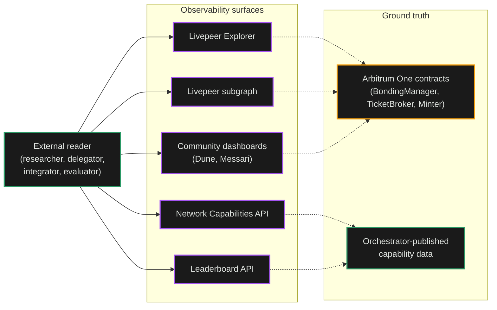
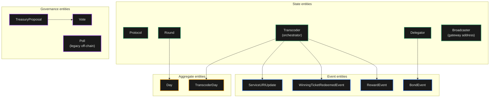

---
title: Network Observability
sidebarTitle: Observability
description: "How to see the Livepeer Network from outside: the Explorer, the subgraph, leaderboard data, and the Network Capabilities API."
lifecycleStage: discover
complexity: beginner
keywords:
  - livepeer
  - about
  - livepeer network
  - observability
  - livepeer explorer
  - livepeer subgraph
  - leaderboard
  - capabilities api
'og:image': /snippets/assets/media/og-images/en/about.png
'og:image:alt': Livepeer Docs social preview image for About
'og:image:type': image/png
'og:image:width': 1200
'og:image:height': 630
pageType: concept
pageVariant: explain
purpose: explain
audience: community
status: current
veracityStatus: verified
lastVerified: 2026-05-04
aim: Where to look to see the running network without operating any of it
---

import { CustomCardTitle, Subtitle } from '/snippets/components/elements/text/Text.jsx'
import { Quote } from '/snippets/components/displays/quotes/Quote.jsx'
import { CustomDivider } from '/snippets/components/elements/spacing/Divider.jsx'
import { LinkArrow } from '/snippets/components/elements/links/Links.jsx'
import { DynamicTableV2 } from '/snippets/components/displays/tables/Tables.jsx'
import { ScrollableDiagram } from '/snippets/components/displays/diagrams/ScrollableDiagram.jsx'
import { BorderedBox } from '/snippets/components/wrappers/containers/Containers.jsx'

<Quote>
The Network is observable from outside through five surfaces: the Explorer, the Livepeer subgraph, community dashboards, the leaderboard API, and the Network Capabilities API. None requires operating a node.
</Quote>

<CustomDivider style={{ margin: 0, marginBottom: '-2rem' }} />

The Network is decentralised by design, which means there is no single source of truth for what the Network is doing right now. Researchers, evaluators, delegators, gateway operators, and integrators all need to see the Network without trusting any single operator.

Five external surfaces solve this. Each reads ground truth either from the chain or from operator-published data, and each is operated by a different party. Together they let an outside reader build a real picture of the Network's state, history, and performance.

<CustomDivider style={{ margin: '-1rem 0 -2rem 0' }} />

## Read Paths

<ScrollableDiagram title="External Read Paths into the Network" maxHeight="600px">

</ScrollableDiagram>

The five surfaces fan out into two ground-truth sources: the on-chain protocol contracts on Arbitrum One, and the off-chain capability and performance data published by orchestrators themselves.

<CustomDivider style={{ margin: '-1rem 0 -2rem 0' }} />

## Observability Surfaces

<DynamicTableV2
  headerList={['Surface', 'What it exposes', 'Who runs it', 'Best for']}
  itemsList={[
    {
      Surface: <Subtitle variant="changelog">**Livepeer Explorer**</Subtitle>,
      'What it exposes': 'Active orchestrators, active set, bonded supply, round state, treasury balance, governance proposals',
      'Who runs it': 'Open-source front-end at `explorer.livepeer.org`',
      'Best for': 'Delegators choosing orchestrators; operators monitoring round status; voters reviewing active proposals',
    },
    {
      Surface: <Subtitle variant="changelog">**Livepeer subgraph**</Subtitle>,
      'What it exposes': 'Indexed view of every on-chain event: stake changes, ticket redemptions, reward calls, treasury proposals and votes',
      'Who runs it': 'Deployed on The Graph for Arbitrum One',
      'Best for': 'Historical queries, dashboards, programmatic data products, research',
    },
    {
      Surface: <Subtitle variant="changelog">**Community dashboards**</Subtitle>,
      'What it exposes': 'Aggregated views over chain data: orchestrator earnings, delegator flows, treasury health, AI vs. transcoding fees',
      'Who runs it': 'Independent contributors via Dune; Messari quarterly research',
      'Best for': 'Quick-look summaries, comparative analysis, public reporting',
    },
    {
      Surface: <Subtitle variant="changelog">**Leaderboard API**</Subtitle>,
      'What it exposes': 'Per-orchestrator latency and success-rate scores by region, derived from continuous test jobs',
      'Who runs it': 'Operated through Cloud SPE / NaaP infrastructure',
      'Best for': 'Performance comparison; gateway selection tuning; delegator orchestrator-quality signals',
    },
    {
      Surface: <Subtitle variant="changelog">**Network Capabilities API**</Subtitle>,
      'What it exposes': 'Aggregated orchestrator capability data: which AI pipelines, which transcoding profiles, which BYOC containers',
      'Who runs it': 'Aggregator service over orchestrator `OrchestratorInfo` advertisements',
      'Best for': 'Capability filtering richer than `ServiceRegistry` alone; integrators evaluating coverage',
    },
  ]}
/>

<CustomDivider style={{ margin: '-1rem 0 -2rem 0' }} />

## Subgraph Entity Map

The Livepeer subgraph is the most flexible of the read paths because it indexes every on-chain event into a queryable schema. The entities cluster into four families: state (current network shape), events (per-action history), governance (proposals and votes), and aggregates (per-day, per-round summaries).

<ScrollableDiagram title="Subgraph Entity Map" maxHeight="600px">

</ScrollableDiagram>

The state entities answer "what is the network right now". The event entities answer "what happened at a specific block". The aggregate entities answer "what was the volume per day or per round". Together they cover every question an outside observer can ask of the on-chain layer.

<CustomDivider style={{ margin: '-1rem 0 -2rem 0' }} />

## Surface Trade-Offs

Different questions call for different surfaces. The decision is usually fast once the question shape is named.

<DynamicTableV2
  headerList={['Question', 'Best surface', 'Why']}
  itemsList={[
    { Question: 'Who are the active orchestrators right now?', 'Best surface': 'Explorer or subgraph', Why: 'Live state of the active set' },
    { Question: 'How much LPT was paid in inflation last round?', 'Best surface': 'Subgraph (`Round.mintableTokens`)', Why: 'Per-round numeric query' },
    { Question: 'Quarterly fees, AI vs. video share', 'Best surface': 'Community dashboards (Messari, Dune)', Why: 'Aggregated and pre-categorised' },
    { Question: "An orchestrator's latency in the EU region", 'Best surface': 'Leaderboard API', Why: 'Continuous test-job results, not on-chain' },
    { Question: 'Does any orchestrator run model X?', 'Best surface': 'Network Capabilities API', Why: 'Off-chain capability data, not in `ServiceRegistry`' },
    { Question: 'Outcome of the most recent treasury vote', 'Best surface': 'Explorer Treasury tab', Why: 'Voting state with a UI' },
    { Question: 'Ticket redemption history for an address', 'Best surface': 'Subgraph (`WinningTicketRedeemedEvent`)', Why: 'Event-sourced query' },
  ]}
/>

<CustomDivider style={{ margin: '-1rem 0 -2rem 0' }} />

## Off-Chain Blind Spots

Some of the Network is not visible from outside, by design.

<BorderedBox variant="accent">
  <Subtitle fontSize="1rem" marginBottom="0.5rem">**Visible to outside readers**</Subtitle>
  - Stake, active-set membership, deposits, reserves
  - Winning ticket redemptions and reward calls
  - Governance proposals, votes, and outcomes
  - Service URIs and advertised capabilities
  - Aggregate fees and inflation per round and per quarter
  - Per-orchestrator test-job latency and success rate

  <Subtitle fontSize="1rem" marginTop="1rem" marginBottom="0.5rem">**Off-chain only, not generally visible**</Subtitle>
  - Per-segment job dispatch and result data
  - All probabilistic tickets that did not win
  - Per-session price agreement and ticket parameter exchange
  - Specific gateway-to-orchestrator routing decisions
  - Real-time frame transport over trickle channels
</BorderedBox>

The split is a design choice. The marketplace runs at a cadence the chain cannot match. What stays off-chain is the high-frequency, ephemeral coordination traffic that has no audit value once the work is done. What is visible on-chain is the durable record of what was paid for and who is running.

<CustomDivider />

## Related Pages

<Columns cols={2}>
  <Card title={<CustomCardTitle icon="diagram-project" title="Network Architecture" />} href="/v2/about/network/architecture" horizontal arrow>
    The Network topology these surfaces observe.
  </Card>
  <Card title={<CustomCardTitle icon="plug" title="Network Interfaces" />} href="/v2/about/network/interfaces" horizontal arrow>
    The on-chain anchor reads in detail.
  </Card>
  <Card title={<CustomCardTitle icon="store" title="Marketplace Model" />} href="/v2/about/network/marketplace-model" horizontal arrow>
    What the on-chain settlement record represents.
  </Card>
  <Card title={<CustomCardTitle icon="file-code" title="Blockchain Contracts" />} href="/v2/about/protocol/blockchain-contracts" horizontal arrow>
    Contract addresses and ABIs.
  </Card>
</Columns>
