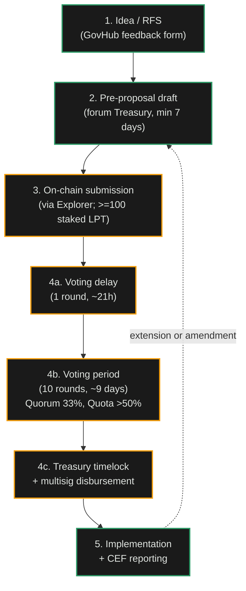
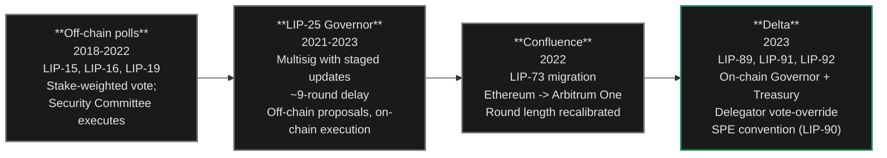

import { CustomCardTitle, Subtitle } from '/snippets/components/elements/text/Text.jsx'
import { Quote, FrameQuote } from '/snippets/components/displays/quotes/Quote.jsx'
import { CustomDivider } from '/snippets/components/elements/spacing/Divider.jsx'
import { LinkArrow } from '/snippets/components/elements/links/Links.jsx'
import { DynamicTableV2 } from '/snippets/components/displays/tables/Tables.jsx'
import { StyledSteps, StyledStep } from '/snippets/components/displays/steps/Steps.jsx'
import { ScrollableDiagram } from '/snippets/components/displays/diagrams/ScrollableDiagram.jsx'
import { BorderedBox } from '/snippets/components/wrappers/containers/Containers.jsx'

<Quote>
Anyone can run a Gateway, anyone can delegate LPT to an Orchestrator, anyone can author a custom pipeline as a container, and anyone with a hundred staked LPT (or a sponsoring staker) can propose a Special Purpose Entity to extend the Network.
</Quote>

<CustomDivider style={{ margin: 0, marginBottom: '-2rem' }} />

## Permissionless Participation

The Network is designed so that capacity, capability, and direction can grow without coordination through any single entity. Five participation paths are open today, each with its own gate, its own commitment, and its own return.

<DynamicTableV2
  headerList={['Path', 'Gate', 'What you commit', 'What you contribute']}
  itemsList={[
    {
      Path: <Subtitle variant="changelog">**Run an Orchestrator**</Subtitle>,
      Gate: 'Bond LPT, register service URI, hold capability hardware',
      'What you commit': 'GPU hardware, bonded LPT, operational uptime',
      'What you contribute': 'Compute supply',
    },
    {
      Path: <Subtitle variant="changelog">**Run a Gateway**</Subtitle>,
      Gate: 'Fund a TicketBroker deposit and reserve',
      'What you commit': 'Routing infrastructure, ETH liquidity, client-facing service',
      'What you contribute': 'Demand routing',
    },
    {
      Path: <Subtitle variant="changelog">**Delegate LPT**</Subtitle>,
      Gate: 'Hold LPT and bond it to an orchestrator',
      'What you commit': 'Capital exposure to LPT and to the orchestrator chosen',
      'What you contribute': 'Stake-weighted security; vote weight',
    },
    {
      Path: <Subtitle variant="changelog">**Author a BYOC pipeline**</Subtitle>,
      Gate: 'None at the protocol level; partner with operators willing to run it',
      'What you commit': 'Container engineering, pipeline maintenance',
      'What you contribute': 'New capability for the network',
    },
    {
      Path: <Subtitle variant="changelog">**Propose an SPE**</Subtitle>,
      Gate: 'Hold (or be sponsored by) at least 100 staked LPT',
      'What you commit': 'A funded mandate; periodic reporting; on-chain accountability',
      'What you contribute': 'New work the Treasury funds (research, public goods, ecosystem services)',
    },
  ]}
/>

The first three paths are operational and are covered by their respective tabs. This page focuses on the last two, which are how the Network's direction expands beyond what any operator can do alone, with particular emphasis on Special Purpose Entities.

<CustomDivider style={{ margin: '-1rem 0 -2rem 0' }} />

## SPEs

A Special Purpose Entity (SPE) is a working group, DAO, committee, or individual that the Treasury funds to deliver public-goods work for the Livepeer Network. The convention was codified in [LIP-90](https://github.com/livepeer/LIPs/blob/master/LIPs/LIP-90.md) (Funding Entity Conventions, 2023) and operates as a social rule, not a contract-enforced rule.

<FrameQuote author="LIP-90: Funding Entity Conventions" href="https://github.com/livepeer/LIPs/blob/master/LIPs/LIP-90.md">
The Livepeer Treasury funds work that benefits the broad set of LPT holders, not single recipients. End-recipients should not apply directly; they should be aggregated under a Special Purpose Entity that takes responsibility for the work.
</FrameQuote>

The two governing conventions are simple:

1. The Treasury funds **public goods** (work whose benefit accrues to the broader Network and to LPT holders generally, not to a single recipient alone).
2. End-recipients route through SPEs. The SPE is the addressee for any treasury proposal; it then aggregates and disburses to actual recipients.

SPEs exist for compute provision (AI Video / MuxionLabs, Cloud SPE), governance work (GovWorks), demand-side and applications (Streamplace, Agent SPE), engineering and protocol R&D (Sidestream Protocol R&D, FrameWorks), education and onboarding (E², LISAR), and more.

<CustomDivider style={{ margin: '-1rem 0 -2rem 0' }} />

## SPE Proposal Route

The proposal process is documented at [forum.livepeer.org/t/livepeer-governance-process/2767](https://forum.livepeer.org/t/livepeer-governance-process/2767) and runs through five phases. The on-chain mechanics are governed by [LIP-89](https://github.com/livepeer/LIPs/blob/master/LIPs/LIP-89.md) (Livepeer Treasury, 2023).

<ScrollableDiagram title="SPE Proposal Lifecycle" maxHeight="600px">

</ScrollableDiagram>

<StyledSteps iconColor="var(--accent)" titleColor="var(--accent)">
  <StyledStep title="Idea or Request for SPE" icon="lightbulb">
    Submit an idea via the GovHub Notion feedback form, or respond to a published Request for SPE. GovWorks reviews fit and signals whether the idea is a candidate for treasury funding.
  </StyledStep>
  <StyledStep title="Pre-proposal draft" icon="pen">
    Use the SPE Proposal Template. Post in the forum Treasury category as `[SPE Pre-Proposal] ...`. **A minimum 7-day forum discussion period is mandatory.** Revise based on feedback. GovWorks gives the go-ahead when the draft is ready for on-chain submission.
  </StyledStep>
  <StyledStep title="On-chain submission" icon="upload">
    The proposer must hold at least **100 staked LPT**, the proposal threshold from LIP-89. The proposal is submitted via the Livepeer Explorer Treasury tab using an EVM-compatible wallet (multisig recommended). If the proposer does not personally hold 100 staked LPT, GovWorks brokers a sponsoring staker so the proposal can still be submitted.
  </StyledStep>
  <StyledStep title="On-chain voting" icon="check-to-slot">
    Voting delay is **1 round** (~21 hours). Voting period is **10 rounds** (~9 days). Orchestrators vote with their full delegated stake; **delegators may override their orchestrator's vote**. Pass conditions: **quorum of 33% of total staked LPT**, **majority of more than 50% For**.
  </StyledStep>
  <StyledStep title="Implementation and accountability" icon="chart-line">
    On success, the Treasury executes a transfer to the designated wallet (after the Treasury timelock). The SPE publishes periodic forum updates, commonly using the Foundation's Contribution Efficiency Framework. Extensions and amendments require a fresh on-chain proposal.
  </StyledStep>
</StyledSteps>

<Tip>
The 100 LPT threshold is a *staked* threshold, not a held threshold. The proposer must have bonded LPT to an orchestrator (their own or someone else's) for the stake to count. GovWorks operates an explicit \"sponsoring staker\" service to keep the proposal door open to anyone with a credible mandate.
</Tip>

<CustomDivider style={{ margin: '-1rem 0 -2rem 0' }} />

## Active SPEs

The Network is currently extended through a number of Special Purpose Entities, each with a distinct mandate. The roster below is a snapshot; for live status, funding amounts, and the current term, see the canonical SPE roster.

<DynamicTableV2
  headerList={['SPE', 'Mandate', 'Status']}
  itemsList={[
    { SPE: <Subtitle variant="changelog">**AI Video SPE / MuxionLabs**</Subtitle>, Mandate: 'AI video pipelines, ComfyStream, BYOC productionisation', Status: 'Active, multi-phase' },
    { SPE: <Subtitle variant="changelog">**GovWorks**</Subtitle>, Mandate: 'Meta-governance, proposal templates, mentor SPEs, treasury hub', Status: 'Active' },
    { SPE: <Subtitle variant="changelog">**Livepeer.Cloud**</Subtitle>, Mandate: 'Free RTMP and AI Gateways, AI Job Tester, NaaP Analytics', Status: 'Active' },
    { SPE: <Subtitle variant="changelog">**Streamplace**</Subtitle>, Mandate: 'Open-source video stack for decentralised social', Status: 'Active' },
    { SPE: <Subtitle variant="changelog">**Sidestream Protocol R&D**</Subtitle>, Mandate: 'Vulnerability triage, protocol upgrades, security backlog', Status: 'Active' },
    { SPE: <Subtitle variant="changelog">**Agent SPE**</Subtitle>, Mandate: 'AI agent framework integration, VTuber agents, inference credits', Status: 'Active' },
    { SPE: <Subtitle variant="changelog">**Embody**</Subtitle>, Mandate: 'Embodied AI avatars, WEAVE toolset', Status: 'Active' },
    { SPE: <Subtitle variant="changelog">**FrameWorks**</Subtitle>, Mandate: 'Transcoding stability, hardware support, operator onboarding', Status: 'Active' },
    { SPE: <Subtitle variant="changelog">**Harmonic**</Subtitle>, Mandate: 'Farcaster / Base / Coinbase Wallet streaming integration', Status: 'Active' },
    { SPE: <Subtitle variant="changelog">**LiveInfra**</Subtitle>, Mandate: 'Community Arbitrum Node (free RPC)', Status: 'Active' },
    { SPE: <Subtitle variant="changelog">**Transformation SPE**</Subtitle>, Mandate: 'Foundation meta-SPE; new contribution mechanisms', Status: 'Active' },
  ]}
/>

The roster grows. Active pre-proposals as of the last verification include Network Engineering, DevRel, and others. Each pre-proposal lives in the Forum's Treasury category for at least seven days before any on-chain submission.

<Card title={<CustomCardTitle icon="building" title="Special Purpose Entities" />} href="/v2/community/ecosystem/spes" horizontal arrow > Live SPE roster with funding, leads, and forum links. </Card>

<CustomDivider style={{ margin: '-1rem 0 -2rem 0' }} />

## On-Chain Mechanics

The mechanism that ratifies an SPE proposal is the on-chain Livepeer Governor, deployed on Arbitrum One. The Governor uses the OpenZeppelin Governor pattern with `BondingVotes` checkpoints for stake-weighted voting and `GovernorCountingOverridable` for delegator vote-overriding. Treasury funding flows through a timelocked Treasury contract.

<DynamicTableV2
  headerList={['Parameter', 'Value', 'Source']}
  itemsList={[
    { Parameter: 'Voting delay', Value: '1 round (~21 hours)', Source: 'LIP-89' },
    { Parameter: 'Voting period', Value: '10 rounds (~9 days)', Source: 'LIP-89' },
    { Parameter: 'Proposal threshold', Value: '100 staked LPT', Source: 'LIP-89' },
    { Parameter: 'Quorum', Value: '33% of total staked LPT', Source: 'LIP-89' },
    { Parameter: 'Quota', Value: '>50% For', Source: 'LIP-89' },
    { Parameter: 'Treasury inflation cut', Value: '10% (with 750k LPT ceiling)', Source: 'LIP-92' },
  ]}
/>

The relationship between Network participation and on-chain governance is asymmetric: the on-chain vote is what funds the SPE; the SPE is what extends the Network. Both depend on the marketplace they ultimately serve.

<CustomDivider style={{ margin: '-1rem 0 -2rem 0' }} />

## Governance Evolution

The on-chain Governor that ratifies SPE proposals today is the third generation of Livepeer governance. The earlier generations are still relevant context: each shaped the constraints the current system operates under.

<ScrollableDiagram title="Governance Evolution" maxHeight="500px">

</ScrollableDiagram>

The Delta upgrade is the first generation in which proposal submission is permissionless above a stake threshold and execution is timelocked but unconditional. Earlier eras required Security Committee approval to execute even passing votes. The 100 staked LPT threshold (LIP-89) and the SPE convention (LIP-90) together create the permissionlessness gradient described above: the door is open to anyone with the stake to push it.

<CustomDivider />

## Related Pages

<Columns cols={2}>
  <Card title={<CustomCardTitle icon="circle-nodes" title="Network Design" />} href="/v2/about/network/design" horizontal arrow>
    Permissionless participation as a design property.
  </Card>
  <Card title={<CustomCardTitle icon="store" title="Marketplace Model" />} href="/v2/about/network/marketplace-model" horizontal arrow>
    Where SPE-funded gateways and pipelines show up.
  </Card>
  <Card title={<CustomCardTitle icon="scale-balanced" title="Governance and Economics" />} href="/v2/about/concepts/governance-and-economics" horizontal arrow>
    The wider context of LPT, voting, and value flows.
  </Card>
  <Card title={<CustomCardTitle icon="hand-holding-dollar" title="Delegate LPT" />} href="/v2/delegators/portal" horizontal arrow>
    Stake, choose orchestrators, override votes.
  </Card>
</Columns>
