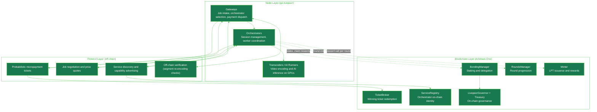
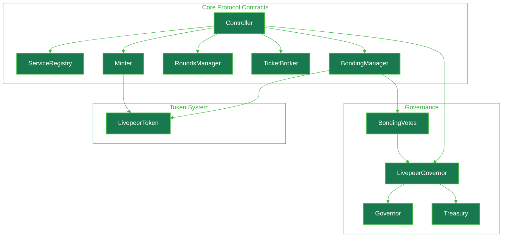

import { LinkArrow } from '/snippets/components/elements/links/Links.jsx'
import { ScrollableDiagram } from '/snippets/components/displays/diagrams/ScrollableDiagram.jsx'
import { DynamicTableV2 } from '/snippets/components/displays/tables/Tables.jsx'
import { CardTitleTextWithArrow } from '/snippets/components/elements/text/Text.jsx'
import { CustomDivider } from '/snippets/components/elements/spacing/Divider.jsx'
import { Quote } from '/snippets/components/displays/quotes/Quote.jsx'
import { FlexContainer } from '/snippets/components/wrappers/containers/Containers.jsx'

<FlexContainer justify="center" style={{padding: 0, margin: 0}}>
  <CardTitleTextWithArrow icon="github" horizontal href="https://github.com/livepeer/protocol"> Livepeer Protocol </CardTitleTextWithArrow>
</FlexContainer>
<CustomDivider style={{margin: 0, marginBottom: "-1rem"}} />

<Quote>
The Livepeer protocol is a layered system. Smart contracts on Arbitrum One handle staking, payments, and coordination. Off-chain protocols handle job negotiation and per-segment payment. Node software runs the actual media and AI compute work. Each layer has a defined role, and the boundaries between them are what make the network scalable and verifiable.
</Quote>

<CustomDivider style={{margin: 0, marginBottom: "-2rem"}} />

The protocol is structured so that on-chain contracts coordinate economic security and off-chain components handle high-throughput compute. The blockchain settles state that must be globally agreed upon - stake, payments, governance. Everything else runs off-chain and references the chain only when it has to.

<CustomDivider middleText="Layered Architecture" />

## Three Architectural Layers

The protocol stack has three layers, each with a different responsibility and a different rate of change. The blockchain layer is slow, expensive, and authoritative. The protocol layer is fast and trust-minimised. The node layer is where the actual work happens.

<ScrollableDiagram title="Livepeer Protocol Stack" maxHeight="500px">

</ScrollableDiagram>

<DynamicTableV2
  headerList={["Layer", "Runs on", "Responsibility", "Rate of change"]}
  itemsList={[
    {
      "Layer": "Blockchain",
      "Runs on": "Arbitrum One smart contracts",
      "Responsibility": "Staking, payments, round progression, service registry, governance, treasury",
      "Rate of change": "Per round (~24h), per LIP, per redemption",
    },
    {
      "Layer": "Protocol",
      "Runs on": "Peer-to-peer between Gateways and Orchestrators",
      "Responsibility": "Service discovery, price negotiation, per-segment payment tickets, verification",
      "Rate of change": "Per session, per segment",
    },
    {
      "Layer": "Node",
      "Runs on": "go-livepeer software on participant machines",
      "Responsibility": "Video transcoding, AI inference, session management, ticket validation",
      "Rate of change": "Per request, per frame",
    },
  ]}
/>

<CustomDivider middleText="Blockchain Layer" />

## Blockchain Layer

The blockchain layer is the protocol's source of truth for any state that must be globally agreed and economically secured. Smart contracts deployed on Arbitrum One coordinate stake, settle payments, govern parameters, and define the active set of Orchestrators eligible for work.

The contracts are organised around a central `Controller` that records the deployed address of every other protocol contract. Contracts query the Controller to find each other, which makes upgrades possible without redeploying the entire system.

<ScrollableDiagram title="Livepeer Protocol Contract Architecture" maxHeight="600px">

</ScrollableDiagram>

The LPT token contract is deployed on Ethereum mainnet and bridged to Arbitrum One. Protocol contracts read and write the bridged LPT on Arbitrum. The Confluence upgrade ([LIP-73](https://github.com/livepeer/LIPs/blob/main/LIPs/LIP-0073.md)) migrated the protocol contracts from Ethereum mainnet to Arbitrum One to reduce transaction costs and increase throughput, while keeping Ethereum's security guarantees through the rollup.

For full contract addresses and source links see <LinkArrow href="/v2/about/protocol/blockchain-contracts" label="Blockchain Contracts" newline={false} />.

<CustomDivider middleText="Protocol Layer" />

## Protocol Layer

The protocol layer is the set of off-chain coordination protocols that sit between Gateways and Orchestrators. It is what makes the network usable at production volume: every video segment, every AI inference request, every price quote runs through the protocol layer without touching the chain.

The protocol layer pairs each off-chain mechanism with a thin on-chain anchor. Discovery happens off-chain, but the addresses Gateways query were registered on-chain. Payment happens off-chain through tickets, but winning tickets settle on-chain. Verification happens off-chain through re-encoding, but slashing happens on-chain.

<DynamicTableV2
  headerList={['Mechanism', 'Off-chain component', 'On-chain anchor']}
  itemsList={[
    {
      'Mechanism': 'Bonding and delegation',
      'Off-chain component': 'Client-side delegation decisions',
      'On-chain anchor': 'BondingManager.bond()',
    },
    {
      'Mechanism': 'Service discovery',
      'Off-chain component': 'Client queries to advertised endpoints',
      'On-chain anchor': 'ServiceRegistry.setServiceURI()',
    },
    {
      'Mechanism': 'Job negotiation',
      'Off-chain component': 'Peer-to-peer price quotes between Gateway and Orchestrator',
      'On-chain anchor': 'None - prices are not posted on-chain',
    },
    {
      'Mechanism': 'Probabilistic micropayments',
      'Off-chain component': 'Ticket generation and validation per segment',
      'On-chain anchor': 'TicketBroker.redeemWinningTicket()',
    },
    {
      'Mechanism': 'Verification',
      'Off-chain component': 'Segment re-encoding checks',
      'On-chain anchor': 'BondingManager.slashTranscoder()',
    },
    {
      'Mechanism': 'Rewards',
      'Off-chain component': 'Orchestrator-initiated reward() call each round',
      'On-chain anchor': 'Minter.reward()',
    },
  ]}
/>

The probabilistic micropayment design is the load-bearing piece. Without it, every transcoded segment would need an on-chain transaction. With it, payments accumulate as off-chain tickets and only winning tickets settle on Arbitrum, keeping per-segment cost bounded while preserving the economic guarantees of on-chain settlement.

For the mechanisms in detail see <LinkArrow href="/v2/about/protocol/mechanisms" label="Core Mechanisms" newline={false} />.

<CustomDivider middleText="Node Layer" />

## Node Layer

The node layer is the software that participants run. The reference implementation is [go-livepeer](https://github.com/livepeer/go-livepeer). It is the same binary in every role - the role is selected by command-line flag.

A node started with `-broadcaster` (or `-gateway`) accepts video streams and AI requests from applications, selects Orchestrators from the on-chain registry, and dispatches jobs with attached payment tickets. A node started with `-orchestrator` registers on-chain, advertises capabilities, accepts jobs from Gateways, and coordinates GPU workers. A node started with `-transcoder` connects to an Orchestrator and performs only the video encoding work, allowing GPU capacity to scale independently of the Orchestrator controller.

<DynamicTableV2
  headerList={["Node role", "Started with", "Responsibility"]}
  itemsList={[
    {
      "Node role": "Gateway",
      "Started with": "go-livepeer -gateway (or -broadcaster)",
      "Responsibility": "Receive jobs from applications, select Orchestrators, dispatch work with payment tickets, return results",
    },
    {
      "Node role": "Orchestrator",
      "Started with": "go-livepeer -orchestrator",
      "Responsibility": "Register on-chain, advertise capabilities, accept jobs, coordinate workers, redeem winning tickets",
    },
    {
      "Node role": "Transcoder",
      "Started with": "go-livepeer -transcoder -orchAddr <addr>",
      "Responsibility": "Perform video encoding work for a connected Orchestrator (O-T split configuration)",
    },
    {
      "Node role": "AI Runner",
      "Started with": "Docker container managed by Orchestrator process",
      "Responsibility": "Run AI inference for a specific pipeline and model on GPU",
    },
  ]}
/>

The node layer is what interacts with both other layers. Gateways read the on-chain ServiceRegistry to discover Orchestrators, then talk to those Orchestrators directly through the protocol layer. Orchestrators read on-chain stake and bonding state, accept off-chain jobs, redeem winning tickets back on-chain, and call `reward()` once per round to claim inflation.

<CustomDivider middleText="System Interactions" />

## How the Layers Interact

The interaction model is best read as the lifecycle of a single piece of work. A Gateway has a video stream or an AI request. It needs an Orchestrator that can do the work, a way to pay for it, and a way to verify the result. The three layers each play one part.

The Gateway begins by reading the on-chain ServiceRegistry to find Orchestrators that have advertised the capability it needs. It then negotiates price directly with one or more candidates over the protocol layer - that negotiation never touches the chain. Once a session is open, jobs flow segment-by-segment, each carrying a probabilistic payment ticket.

Most tickets are losing tickets and never settle. A small fraction win and are redeemed by the Orchestrator on-chain through the TicketBroker, releasing accumulated ETH. Once per round, the Orchestrator also calls `reward()` to claim its share of newly minted LPT, distributed proportionally to bonded stake.

For the per-job state machine and per-workload pipeline differences see <LinkArrow href="/v2/about/network/job-pipelines" label="Job Pipelines" newline={false} />.

<CustomDivider middleText="Design Principles" />

## What This Architecture Buys

The layered design reflects three deliberate tradeoffs.

The blockchain handles only what must be globally agreed: stake, payments at the redemption boundary, governance, and the active set. Everything else is pushed off-chain, which is what makes the per-segment cost low enough to compete with centralised infrastructure.

The protocol layer is the verification surface. Gateways check that returned segments match the input - if they do not, the Gateway stops sending work. Slashing on-chain only intervenes for repeated or provable misbehaviour. Most quality enforcement happens through Gateway selection, which costs the misbehaving Orchestrator future revenue without requiring an on-chain transaction.

The node layer is interchangeable. Anyone can implement a compatible Gateway or Orchestrator against the protocol specification. go-livepeer is the reference implementation, but the protocol does not require it - what defines a compliant participant is correct interaction with the on-chain contracts and the off-chain protocol mechanisms.

<CustomDivider />

## Related Pages

<CardGroup cols={2}>
  <Card title="Protocol Design" icon="compass-drafting" href="/v2/about/protocol/design" arrow horizontal>
    Why the protocol is structured this way and the design decisions behind it.
  </Card>
  <Card title="Core Mechanisms" icon="gears" href="/v2/about/protocol/mechanisms" arrow horizontal>
    Rounds, staking, rewards, payments, slashing, and upgrades in detail.
  </Card>
  <Card title="Protocol Actors" icon="users-gear" href="/v2/about/protocol/actors" arrow horizontal>
    Orchestrators, Gateways, Delegators, and how their incentives align.
  </Card>
  <Card title="Blockchain Contracts" icon="file-contract" href="/v2/about/protocol/blockchain-contracts" arrow horizontal>
    Full contract reference with deployed addresses and source links.
  </Card>
  <Card title="Governance and Treasury" icon="building-columns" href="/v2/about/protocol/governance-and-treasury" arrow horizontal>
    LIPs, on-chain voting, and the protocol treasury.
  </Card>
  <Card title="Livepeer Token" icon="coins" href="/v2/about/protocol/livepeer-token" arrow horizontal>
    LPT token economics, inflation, and bridging.
  </Card>
</CardGroup>
