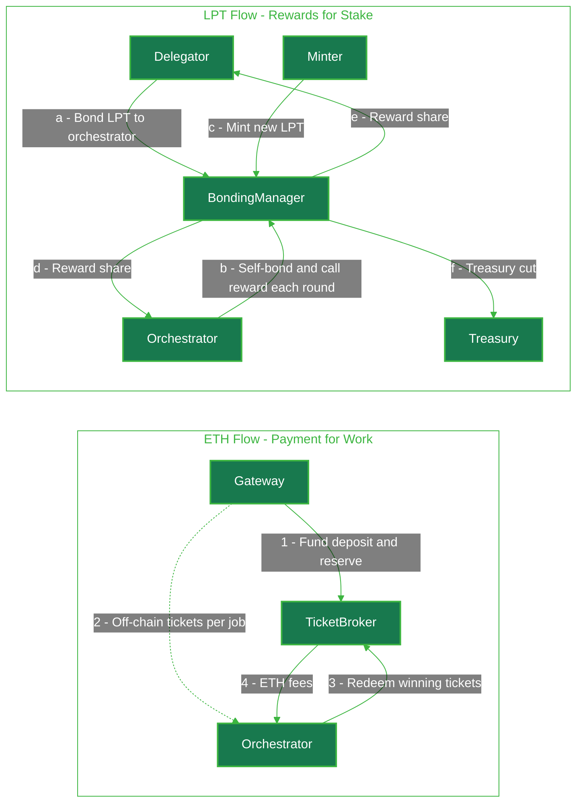

import { CustomCardTitle, Subtitle } from '/snippets/components/elements/text/Text.jsx'
import { Quote } from '/snippets/components/displays/quotes/Quote.jsx'
import { CustomDivider } from '/snippets/components/elements/spacing/Divider.jsx'
import { LinkArrow } from '/snippets/components/elements/links/Links.jsx'
import { DynamicTableV2 } from '/snippets/components/displays/tables/Tables.jsx'
import { StyledSteps, StyledStep } from '/snippets/components/displays/steps/Steps.jsx'
import { ScrollableDiagram } from '/snippets/components/displays/diagrams/ScrollableDiagram.jsx'
import { BorderedBox, CenteredContainer } from '/snippets/components/wrappers/containers/Containers.jsx'

<Quote>
The **Livepeer Token (LPT)** is the protocol's _staking and coordination_ token. It secures the network, routes work to operators, and grants governance rights. ETH - not LPT - is the medium of exchange for transcoding and AI inference jobs.
</Quote>

<CustomDivider style={{ margin: 0, marginBottom: "-2rem" }} />

## Two tokens, two jobs

The Livepeer protocol uses two distinct assets, each with a job that the other cannot do. ETH pays for work performed off-chain. LPT secures the right to perform that work and to share in protocol rewards.

<DynamicTableV2
  headerList={["Asset", "Role", "Used by", "Earned by"]}
  itemsList={[
    {
      "Asset": <Subtitle variant="changelog">**ETH**</Subtitle>,
      "Role": "Medium of exchange for video transcoding and AI inference jobs",
      "Used by": "Gateways - to fund deposits and pay for work",
      "Earned by": "Orchestrators - via probabilistic micropayment tickets",
    },
    {
      "Asset": <Subtitle variant="changelog">**LPT**</Subtitle>,
      "Role": "Staking, coordination, security, and governance",
      "Used by": "Orchestrators and Delegators - bonded into the protocol",
      "Earned by": "Bonded participants - via inflationary rewards each round",
    },
  ]}
/>

This separation is deliberate. Service buyers should not need to acquire a protocol-specific token to use the network. Operators should have economic skin in the game in a way that scales with how much of the network they want to influence and earn from. ETH satisfies the first requirement; LPT satisfies the second.

<Tip>
Gateways pay in ETH. Orchestrators are paid in ETH for the work they perform. LPT is never used to pay for jobs.
</Tip>

<CustomDivider style={{ margin: "-1rem 0 -2rem 0" }} />

## What LPT is

LPT is an [ERC-20 token](https://github.com/livepeer/protocol/blob/delta/contracts/token/LivepeerToken.sol) deployed on Ethereum Mainnet, with a bridged representation on [Arbitrum One](https://arbitrum.io/) where all active protocol operations occur. It is the staking asset of a delegated proof-of-stake system: holders bond LPT to participate in or support the network, and the amount they bond determines both their share of rewards and their voting weight on protocol decisions.

The initial supply of 10,000,000 LPT was distributed through the [Merkle Mine](https://github.com/livepeer/merkle-mine) at network launch in 2018, a permissionless claim mechanism that allowed any Ethereum address to mine and claim tokens directly. There was no ICO and no pre-mine. Total supply has grown since then through the protocol's inflationary reward schedule, which mints new LPT each round to participants who stake.

<CenteredContainer preset="fitContent" width="90%">
  <BorderedBox variant="accent">
    <Subtitle fontSize="1rem" marginBottom="0.5rem">**Quick reference**</Subtitle>
    - **Token standard**: ERC-20 (with EIP-2612 permit, burnable, role-based mint/burn)
    - **Origin chain**: Ethereum Mainnet
    - **Active chain**: Arbitrum One (bridged via paired LPTGateway contracts)
    - **Initial supply**: 10,000,000 LPT (Merkle Mine, 2018)
    - **Issuance**: Dynamic inflation, per round, only to bonded participants
    - **Divisibility**: 18 decimals, in line with Ethereum and standard ERC-20 tokens
  </BorderedBox>
</CenteredContainer>

<CustomDivider style={{ margin: "-1rem 0 -2rem 0" }} />

## What LPT does in the protocol

LPT performs four functions in the Livepeer Protocol. Each function is enforced on-chain through smart contracts on Arbitrum One.

<StyledSteps iconColor="var(--accent)" titleColor="var(--accent)">
  <StyledStep title="Stakes operators into the network" icon="lock">
    Orchestrators bond LPT to themselves to be eligible to perform transcoding and AI inference work. The active set of orchestrators that receive video work is determined by total bonded stake - own stake plus delegated stake - sorted from highest to lowest.
  </StyledStep>
  <StyledStep title="Secures the network through skin in the game" icon="shield-halved">
    Bonded LPT is the protocol's economic security primitive. Slashing rules can burn an orchestrator's stake (and the stake of those who delegated to it) for protocol violations, giving every participant a financial reason to behave honestly.
  </StyledStep>
  <StyledStep title="Routes work in proportion to stake" icon="arrows-split-up-and-left">
    Stake weight is the coordination signal that tells gateways which orchestrators to prefer. Higher-staked orchestrators sit higher in the active set and are more likely to receive video transcoding jobs from the network.
  </StyledStep>
  <StyledStep title="Grants governance rights" icon="building-columns">
    Bonded LPT confers voting power, proportional to stake, over Livepeer Improvement Proposals (LIPs) and treasury allocations. Delegators vote through their orchestrator by default, and can override that vote on any specific proposal.
  </StyledStep>
</StyledSteps>

<Info>
**Slashing today.** The slashing function (`slashTranscoder()`) exists in the BondingManager contract, but the Verifier role is currently set to the null address, leaving slashing inoperative. It can be re-enabled through governance. The economic security model still relies on stake at risk - bonded LPT remains illiquid for the unbonding period and is exposed to whatever slashing conditions governance reactivates.
</Info>

<CustomDivider style={{ margin: "-1rem 0 -2rem 0" }} />

## How value flows through the network

The protocol creates two parallel value flows: an ETH flow that pays for compute work, and an LPT flow that rewards the participants who secure the network. Both flows settle on Arbitrum One.

<ScrollableDiagram title="LPT and ETH Value Flows in the Livepeer Protocol" maxHeight="600px">

</ScrollableDiagram>

The ETH flow pays for actual compute. Gateways pre-fund a deposit and a reserve in the [TicketBroker contract](/v2/about/protocol/blockchain-contracts#ticketbroker) and issue off-chain probabilistic micropayment tickets to orchestrators with each transcoding or inference job. Orchestrators redeem winning tickets on-chain to receive ETH. This amortises payment costs across many jobs without losing the strong settlement guarantees of on-chain payments.

The LPT flow rewards stake. Each round, the [Minter contract](/v2/about/protocol/blockchain-contracts#minter) calculates the round's mintable LPT supply based on the current inflation rate, and the [BondingManager](/v2/about/protocol/blockchain-contracts#bondingmanager) distributes those new tokens. Orchestrators that called `reward()` during their active round receive a share proportional to their bonded stake. Delegators receive the remainder of the orchestrator's reward, after the orchestrator's commission (`rewardCut`) is taken. A configurable fraction of each round's rewards is also routed to the protocol treasury.

<Tip>
The two flows meet at the orchestrator. A working orchestrator earns ETH from the work it performs and LPT inflation from the stake it bonds. Delegators earn a share of both. The orchestrator's `feeShare` parameter sets the percentage of ETH fees passed to delegators. The orchestrator's `rewardCut` parameter sets the percentage of LPT rewards the orchestrator keeps as commission, with the remainder distributed to delegators in proportion to their bonded stake.
</Tip>

<CustomDivider style={{ margin: "-1rem 0 -2rem 0" }} />

## Inflation, bonding, and the target rate

Livepeer ties LPT issuance to network participation. Each round, the protocol checks how much of the total LPT supply is bonded and adjusts the next round's inflation rate up or down to nudge the bonded share toward a target.

<StyledSteps iconColor="var(--accent)" titleColor="var(--accent)">
  <StyledStep title="Bonded share is below target" icon="arrow-trend-up">
    Inflation increases on the next round. Higher rewards attract more bonded stake, which secures the network.
  </StyledStep>
  <StyledStep title="Bonded share is above target" icon="arrow-trend-down">
    Inflation decreases on the next round. Lower issuance limits dilution of bonded holders once security is met.
  </StyledStep>
  <StyledStep title="Only bonded LPT earns rewards" icon="hand-holding-dollar">
    Newly minted LPT is distributed exclusively to bonded stake. Unbonded LPT is diluted by every round's issuance.
  </StyledStep>
</StyledSteps>

This creates a clear opportunity cost for holding LPT idle. The dilution is not theoretical: every round of inflation that an unbonded holder sits through reduces their share of the total supply. The mechanism design intends for stakeholders to either bond directly, delegate to an orchestrator they trust, or accept the dilution as the cost of liquidity.

<Note>
Inflation parameters - the target bonding rate, the per-round inflation step, the minimum and maximum bounds - are set in the Minter contract and adjustable through governance. The exact current values can be read directly from the contract on Arbitrum One. See <LinkArrow href="/v2/about/protocol/blockchain-contracts#minter" label="Minter contract reference" newline={false} /> for the precise function signatures.
</Note>

<CustomDivider style={{ margin: "-1rem 0 -2rem 0" }} />

## Bonding, unbonding, and rebonding

LPT participation in the protocol is gated by an unbonding period. This delay is the protocol's protection against rapid stake exit during a slashing event.

<DynamicTableV2
  headerList={["Action", "Function", "Effect"]}
  itemsList={[
    {
      "Action": <Subtitle variant="changelog">**Bond**</Subtitle>,
      "Function": "`bond(amount, orchestrator)`",
      "Effect": "LPT moves from holder to BondingManager. Stake counts toward orchestrator's active set position from the next round.",
    },
    {
      "Action": <Subtitle variant="changelog">**Unbond**</Subtitle>,
      "Function": "`unbond(amount)`",
      "Effect": "Creates an unbonding lock. Stake stops earning rewards. LPT is locked for the unbonding period.",
    },
    {
      "Action": <Subtitle variant="changelog">**Rebond**</Subtitle>,
      "Function": "`rebond(unbondingLockId)`",
      "Effect": "Cancels an in-progress unbond. Stake returns to active duty without resetting the unbonding period.",
    },
    {
      "Action": <Subtitle variant="changelog">**Withdraw stake**</Subtitle>,
      "Function": "`withdrawStake(unbondingLockId)`",
      "Effect": "After the unbonding period expires, returns LPT to the holder's wallet.",
    },
    {
      "Action": <Subtitle variant="changelog">**Claim earnings**</Subtitle>,
      "Function": "`claimEarnings(endRound)`",
      "Effect": "Realises accumulated LPT rewards and ETH fees from past rounds into the holder's claimable balance.",
    },
  ]}
/>

Rounds are the protocol's time unit. On Arbitrum One, a round is configured to approximately 24 hours. State changes triggered by `bond`, `unbond`, or orchestrator parameter updates take effect at the start of the next round, ensuring all participants compete on a stable view of the active set within any given round.

<CustomDivider style={{ margin: "-1rem 0 -2rem 0" }} />

## Where to go next

<Columns cols={2}>
  <Card title={<CustomCardTitle icon="cogs" title="Core Mechanisms" />} href="/v2/about/protocol/mechanisms" horizontal arrow>
    Staking, rewards, payments, rounds, and slashing - the protocol primitives in detail.
  </Card>
  <Card title={<CustomCardTitle icon="file-code" title="Blockchain Contracts" />} href="/v2/about/protocol/blockchain-contracts" horizontal arrow>
    Every contract, every function. BondingManager, TicketBroker, Minter, and the rest.
  </Card>
  <Card title={<CustomCardTitle icon="vault" title="Governance and Treasury" />} href="/v2/about/protocol/governance-and-treasury" horizontal arrow>
    On-chain voting, proposal lifecycle, and how LPT inflation funds ecosystem work.
  </Card>
  <Card title={<CustomCardTitle icon="diagram-project" title="Protocol Design" />} href="/v2/about/protocol/design" horizontal arrow>
    Design decisions behind delegated proof-of-stake, probabilistic micropayments, and the role of LPT.
  </Card>
  <Card title={<CustomCardTitle icon="hand-holding-dollar" title="Obtain LPT" />} href="https://www.livepeer.org/lpt" horizontal arrow>
    Where to acquire LPT to delegate, bond, or run an orchestrator.
  </Card>
  <Card title={<CustomCardTitle icon="chart-line" title="Livepeer Explorer" />} href="https://explorer.livepeer.org/" horizontal arrow>
    Live network data: inflation rate, bonded supply, orchestrators, and rewards.
  </Card>
</Columns>
