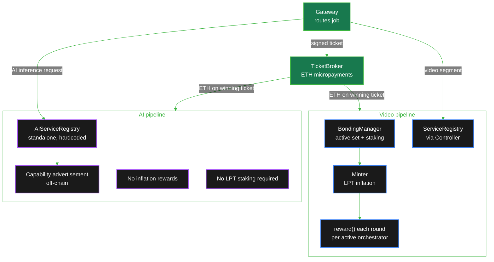

import { CustomDivider } from '/snippets/components/elements/spacing/Divider.jsx'
import { LinkArrow } from '/snippets/components/elements/links/Links.jsx'
import { Quote, FrameQuote } from '/snippets/components/displays/quotes/Quote.jsx'
import { DynamicTableV2 } from '/snippets/components/displays/tables/Tables.jsx'
import { ScrollableDiagram } from '/snippets/components/displays/diagrams/ScrollableDiagram.jsx'
import { StyledSteps, StyledStep } from '/snippets/components/displays/steps/Steps.jsx'
import { BorderedBox, CenteredContainer } from '/snippets/components/wrappers/containers/Containers.jsx'
import { CardTitleTextWithArrow, CustomCardTitle, Subtitle } from '/snippets/components/elements/text/Text.jsx'
import { ValueResponseField } from '/snippets/components/displays/response-fields/ResponseField.jsx'

<CenteredContainer style={{ width: '90%' }}>
  <Tip>The protocol coordinates work and secures the network through five mechanisms: rounds, staking and delegation, rewards, probabilistic micropayments, and upgradeability. Video and AI workloads share the same payment rail but follow different incentive paths.</Tip>
</CenteredContainer>

The Livepeer protocol secures a decentralised marketplace for video and AI compute through a tightly coupled set of smart contracts on Arbitrum One. These contracts encode five mechanisms that together turn LPT into work, ETH into operator revenue, and stake into a security guarantee.

This page explains each mechanism, names the contract that implements it, and surfaces the one architectural choice that catches most readers off guard: video and AI pipelines have the same network footprint but a different relationship with the protocol.

<CustomDivider middleText="Objectives" />

## What the mechanisms do

Each mechanism exists to solve a specific coordination problem. Naming the problem first makes the design legible.

<DynamicTableV2
  headerList={["Problem", "Mechanism", "Implementation"]}
  itemsList={[
    { "Problem": "Coordinate global state changes across an open set of operators", "Mechanism": "Rounds", "Implementation": "RoundsManager" },
    { "Problem": "Allocate work to operators who have skin in the game", "Mechanism": "Staking and delegation", "Implementation": "BondingManager" },
    { "Problem": "Pay for security and participation without external subsidy", "Mechanism": "Rewards and inflation", "Implementation": "Minter, BondingManager" },
    { "Problem": "Settle high-frequency, low-value-per-job payments without per-job gas cost", "Mechanism": "Probabilistic micropayments", "Implementation": "TicketBroker" },
    { "Problem": "Evolve the protocol without forcing operators to migrate addresses", "Mechanism": "Proxy-based upgradeability", "Implementation": "Controller, Governor" },
  ]}
/>

The four economic mechanisms (rounds, staking, rewards, payments) coordinate how operators are selected, paid, and held accountable. The fifth (upgradeability) makes the first four governable. For the contracts behind each mechanism, see <LinkArrow href="/v2/about/protocol/blockchain-contracts" label="Blockchain Contracts" newline={false} />.

<CustomDivider middleText="Video vs AI" />

## Video and AI take different paths

The single most important architectural fact about the protocol is that video transcoding and AI inference share the same network and the same payment rail, but they do not share the same incentive layer. Reading the rest of this page without that distinction leads to wrong conclusions.

<FrameQuote>
The video transcoding system and AI system are architecturally separate and operate independently.
</FrameQuote>

Video Orchestrators stake LPT, compete for the active set, call `reward()` to mint inflationary LPT, and distribute earnings to delegators. AI services are a directory of capability endpoints. They use the same Gateway-to-Orchestrator routing and the same TicketBroker payment flow, but they do not participate in the staking pool, the active set, or the inflation rewards. This is by design: the AI subnet was launched without imposing the staking gate, so that AI capacity could grow on the network's economic merit before being absorbed into the full economic security model.

<ScrollableDiagram title="Video vs AI mechanism paths" maxHeight="700px">

</ScrollableDiagram>

The settlement asset (ETH via probabilistic tickets) and the orchestrator software are common to both pipelines. The staking, active set election, and inflation rewards are video-only.

<DynamicTableV2
  tableTitle="Mechanism comparison: video vs AI"
  headerList={["Mechanism", "Video orchestrators", "AI services"]}
  itemsList={[
    { "Mechanism": "LPT staking required", "Video orchestrators": "Yes - bond LPT to enter the transcoder pool", "AI services": "No - capability registration only" },
    { "Mechanism": "Active set election", "Video orchestrators": "Stake-weighted, top of sorted pool, gates round rewards", "AI services": "No active set; any registered orchestrator can serve" },
    { "Mechanism": "Inflationary LPT rewards", "Video orchestrators": "Yes - distributed via reward() each round", "AI services": "None at the protocol layer" },
    { "Mechanism": "ETH job fees via TicketBroker", "Video orchestrators": "Yes", "AI services": "Yes" },
    { "Mechanism": "Service discovery contract", "Video orchestrators": "ServiceRegistry, registered via Controller", "AI services": "AIServiceRegistry, address hardcoded in go-livepeer" },
    { "Mechanism": "Governance voting weight", "Video orchestrators": "Bonded stake confers voting power on LivepeerGovernor", "AI services": "None inherent; voting power follows bonded LPT only" },
  ]}
/>

The asymmetry is intentional. Forcing AI orchestrators to acquire and stake LPT before serving inference would have throttled the supply side of a market that did not yet have demand-side product-market fit. Once AI demand stabilises, the question of whether and how to bring AI services under the same staking model is itself a governance question and would be settled by a future LIP.

<CustomDivider middleText="The five mechanisms" />

## Mechanism details

Each mechanism is described in three layers: what it coordinates, the contract functions that implement it, and the parameters operators or developers most commonly interact with.

<BorderedBox variant="accent">
<Tabs>

<Tab title="Rounds" icon="clock">

### Rounds and timing

Rounds are the protocol's clock. Every reward distribution, parameter update, and active set election is gated to round boundaries. Without a round boundary, every contract would need its own time accounting; with one, the protocol can synchronise state changes across actors who never communicate directly.

A round is a fixed number of Arbitrum blocks. The current round must be initialised by an on-chain transaction before reward calls and parameter changes for that round can proceed. {/* REVIEW: confirm current Arbitrum round duration. LIP-83 adjusted roundLength for Ethereum Merge; the post-Confluence value on Arbitrum One is approximately one day. */}

**What rounds gate**

- Bonding and unbonding state changes take effect in the next round, not the current one
- Reward distribution is calculated per round based on active stake snapshotted at round start
- Parameter updates by orchestrators are blocked during the round-end lock period to prevent gambling timing
- Earnings can only be claimed for rounds that have been initialised
- A given orchestrator can call `reward()` at most once per round

**Implementation**

The `RoundsManager` contract holds round length, current round number, initialisation status, and per-round block hashes used as randomness for ticket validation.

<AccordionGroup>
  <Accordion title="Round length and initialisation" icon="clock">
    The `roundLength` state variable stores the round length in Arbitrum blocks. It is updated via `setRoundLength()`, callable only by the Controller owner (the Governor).

    <ValueResponseField name="initializeRound" label="function" post={["initializeRound()"]}>
      - Public function callable by any address; typically triggered by orchestrators at the start of each round
      - Stores the round's block hash, snapshots active stake, unlocks mintable rewards
      - Reverts if the system is paused or the previous round has not yet completed
      - Idempotent: callable only once per round
    </ValueResponseField>
  </Accordion>
  <Accordion title="Round lock period" icon="lock">
    The lock period is a configurable percentage of the round length. During the lock period, orchestrator parameter updates (`rewardCut`, `feeShare`) are blocked. This prevents an orchestrator from changing its commission rates between the moment delegators choose to bond and the moment rewards are calculated.
  </Accordion>
</AccordionGroup>

</Tab>

<Tab title="Staking" icon="lock">

### Staking and delegation

Staking is how the protocol turns LPT into the right to perform work. An orchestrator without staked LPT cannot enter the active set; an orchestrator without delegated LPT typically cannot stay in it. Bonding is the same operation for both: the difference is whether you bond to your own address (self-stake) or to someone else's (delegation).

The active set is a fixed-size, stake-sorted pool of orchestrators eligible to receive video jobs and call `reward()` each round. Position in the pool is the price-discovery mechanism: capital flows toward operators who attract delegations, which attracts more work, which attracts more delegations.

**Mechanism summary**

- Orchestrators bond LPT to their own address to register; total bonded stake (self plus delegated) determines active set position
- Delegators bond LPT to an orchestrator of their choice and share in that orchestrator's rewards and fees, less the orchestrator's commission
- Both delegators and orchestrators inherit voting power on the LivepeerGovernor in proportion to bonded stake; delegators may override their orchestrator's vote on any individual proposal
- Unbonding triggers a waiting period (`unbondingPeriod` rounds) before stake can be withdrawn, preventing instantaneous flight from a slashed or failing operator

**Key functions** (BondingManager)

<DynamicTableV2
  headerList={["Function", "Caller", "Effect"]}
  itemsList={[
    { "Function": "bond(amount, to)", "Caller": "Anyone holding LPT", "Effect": "Delegate LPT to an orchestrator address (or self)" },
    { "Function": "transcoder(rewardCut, feeShare)", "Caller": "Self-bonded address", "Effect": "Register as orchestrator; set commission and delegator share" },
    { "Function": "unbond(amount)", "Caller": "Bonded address", "Effect": "Initiate withdrawal; creates an unbonding lock" },
    { "Function": "rebond(unbondingLockId)", "Caller": "Bonded address", "Effect": "Cancel unbonding before period ends" },
    { "Function": "withdrawStake(unbondingLockId)", "Caller": "Bonded address", "Effect": "Withdraw LPT after unbonding period elapses" },
  ]}
/>

<Info>
**Slashing exists in the contract but is not currently active.** `slashTranscoder()` is implemented in BondingManager, but the Verifier role required to call it is set to the null address. Misbehaviour is currently disciplined economically through delegator flight rather than through automated stake forfeiture. Re-enabling slashing would require a governance proposal to configure a Verifier and update compatibility paths. AI services do not have a slashing mechanism at the protocol layer and would be governed under any future video re-enablement separately. {/* REVIEW: confirm slashing remains disabled and that the Verifier role is still set to 0x000. SME: Rick. */}
</Info>

<Tip>**AI services do not stake.** The AIServiceRegistry is a discovery contract, not a bonding pool. AI orchestrators advertise capabilities and serve jobs; they do not enter the active set or earn inflationary LPT.</Tip>

</Tab>

<Tab title="Rewards" icon="coins">

### Rewards and inflation

The reward system answers two questions in one mechanism: how much new LPT enters circulation each round, and how that LPT is divided between operators, delegators, and the treasury. The answers are coupled, because dilution is the cost of paying the security budget.

**Dynamic inflation**

Livepeer uses a dynamic inflation rate. New LPT is minted each round in proportion to the participation rate.

- If less than the target fraction of LPT supply is bonded, inflation rises (more aggressive subsidy to attract stake)
- If more than the target fraction is bonded, inflation falls (less dilution; security budget is sufficient)
- Inflation bounds are governed parameters, with proposed ceiling and floor in [LIP-100](https://github.com/livepeer/LIPs/blob/main/LIPs/LIP-0100.md)

The mechanic is a feedback loop: the protocol pays exactly enough LPT inflation to keep enough stake bonded to secure the network, and no more.

**Reward distribution flow**

Each round, every active orchestrator can call `reward()` exactly once. The function performs four operations atomically.

<StyledSteps iconColor="var(--accent)" titleColor="var(--accent)">
  <StyledStep title="Mint" icon="circle-plus">
    BondingManager queries `currentMintableTokens()` from Minter, which calculates the round's new LPT based on inflation rate and total supply.
  </StyledStep>
  <StyledStep title="Treasury cut" icon="building-columns">
    `treasuryRewardCutRate` of the new LPT is routed to the Treasury contract before any operator distribution. {/* REVIEW: confirm current treasuryRewardCutRate (LIP-92 initial value: 10%; halts at 750,000 LPT balance ceiling). SME: Rick. */}
  </StyledStep>
  <StyledStep title="Orchestrator commission" icon="user-shield">
    The remaining LPT is allocated proportional to the orchestrator's stake share of the active set. The orchestrator retains its `rewardCut` percentage as commission.
  </StyledStep>
  <StyledStep title="Delegator pool" icon="users">
    The remainder accrues to delegators in proportion to their bonded stake. Delegators must call `claimEarnings()` to crystallise the accrued LPT into withdrawable balance.
  </StyledStep>
</StyledSteps>

The reward call is the orchestrator's primary recurring on-chain obligation. An orchestrator that misses a `reward()` call loses that round's inflation share for itself and its delegators, which is the operator-side incentive for high uptime in the absence of slashing.

**ETH fee distribution**

ETH fees from redeemed winning tickets follow a parallel path. Fees accumulate in the orchestrator's earnings pool, the orchestrator retains its configured `feeShare` portion (the share passed to delegators), and the remainder is delegator-claimable in the same `claimEarnings()` flow.

<Note>The naming is a known source of confusion. `feeShare` in the BondingManager is defined as **the percentage of fees paid to delegators by the orchestrator**, not the gateway's cut and not the orchestrator's retained portion. Source: `BondingManager.sol` struct comment.</Note>

</Tab>

<Tab title="Payments" icon="money-bill-transfer">

### Probabilistic micropayments

Probabilistic micropayments are the mechanism that makes streaming-rate compute economically viable on a public chain. Without them, gas cost per job would dwarf the price of the job. With them, settlement cost is amortised across thousands of off-chain tickets per on-chain redemption.

**Mechanism**

Each ticket is a signed off-chain message with a face value (the payout if the ticket wins) and a win probability (typically a small fraction). Expected value of a ticket equals face value multiplied by win probability, which the gateway sets to match the contracted price of the work performed. Most tickets do not win and never touch the chain. The few that do are redeemed on-chain by the orchestrator, which transfers the face value from the gateway's reserve to the orchestrator's fee pool.

<StyledSteps iconColor="var(--accent)" titleColor="var(--accent)">
  <StyledStep title="Gateway funds deposit and reserve" icon="wallet">
    Gateway calls `fundDepositAndReserve()` on TicketBroker to lock ETH. Deposit covers active session liquidity; reserve covers redemptions if deposit is exhausted.
  </StyledStep>
  <StyledStep title="Off-chain ticket creation" icon="file-signature">
    For each unit of work, the gateway signs a ticket with face value, win probability, and recipient parameters. The ticket is sent to the orchestrator over HTTP, never on-chain.
  </StyledStep>
  <StyledStep title="Ticket validation" icon="shield-check">
    Orchestrator verifies the signature, computes whether the ticket wins using the recipient randomness and the round's stored block hash, and queues winners locally.
  </StyledStep>
  <StyledStep title="On-chain redemption" icon="arrow-up-right-from-square">
    Orchestrator calls `redeemWinningTicket()` on TicketBroker. The contract validates the ticket against on-chain state, transfers ETH to the orchestrator's fee pool via BondingManager, and emits `WinningTicketRedeemed` and `WinningTicketTransfer` events.
  </StyledStep>
</StyledSteps>

**Why this design**

The probabilistic structure trades away per-payment certainty for amortised settlement cost. Both sides accept the variance because expected value matches the contracted price and the variance reduces with sample size. At streaming volumes, the orchestrator's realised earnings converge to expected earnings within minutes of work, and the gateway's realised cost converges to its budgeted cost within the same window.

**Withdrawal flow**

A gateway exiting the network calls `unlock()` on TicketBroker, waits the unlock period, then calls `withdraw()` to recover any unredeemed deposit and reserve. This is the gateway-side equivalent of the orchestrator unbonding period: it gives the protocol time to settle outstanding tickets before funds leave.

</Tab>

<Tab title="Upgrades" icon="arrow-up-from-bracket">

### Upgradeability

The protocol is designed to evolve. New LIPs alter contract code without forcing operators, gateways, or delegators to migrate to new addresses. The mechanism is a standard proxy pattern coordinated through the Controller registry.

**How upgrades work**

<StyledSteps iconColor="var(--accent)" titleColor="var(--accent)">
  <StyledStep title="LIP authored and discussed" icon="file-pen">
    Author drafts the LIP, gathers community feedback on the [Forum](https://forum.livepeer.org/c/lips/18), and submits the proposal to GitHub.
  </StyledStep>
  <StyledStep title="On-chain proposal" icon="ballot">
    Author with at least 100 LPT submits the proposal to LivepeerGovernor. Voting opens for 30 rounds.
  </StyledStep>
  <StyledStep title="Governor execution" icon="check-to-slot">
    If the proposal passes (33% quorum, more than 50% For), it queues into the Treasury timelock and then to the Governor. Governor calls `setContractInfo()` on the Controller to register the new implementation under the same name hash.
  </StyledStep>
  <StyledStep title="Proxy continuity" icon="arrows-spin">
    Proxy addresses are unchanged. State is preserved. Subsequent calls to the proxy delegate to the new implementation. Operators and applications need no migration.
  </StyledStep>
</StyledSteps>

**Why the pattern matters**

The Controller registry is the single point of indirection that makes the protocol governable without disrupting users. Every contract resolves peer addresses dynamically through the Controller, so a single registry update propagates new behaviour across the system. The trade-off is that the Controller's owner (the Governor) is a privileged role; the protection is that Governor is itself controlled by stake-weighted votes, not by any individual.

For governance lifecycle and the LivepeerGovernor specification, see <LinkArrow href="/v2/about/protocol/governance-and-treasury" label="Governance and Treasury" newline={false} />.

</Tab>

<Tab title="Configuration" icon="sliders">

### Network configuration

The protocol is deployed on Arbitrum One (active) and Ethereum Mainnet (token contract and bridge only). All operational mechanisms run on Arbitrum since the Confluence migration ([LIP-73](https://github.com/livepeer/LIPs/blob/main/LIPs/LIP-0073.md)) reduced gas costs by approximately 100x while preserving Ethereum's security through the Arbitrum rollup.

**Governable parameters**

These are the parameters most often touched by LIPs. Each is owner-only on its contract, where the owner is the Governor and the Governor only acts on a passed vote.

<DynamicTableV2
  headerList={["Parameter", "Contract", "Effect when changed"]}
  itemsList={[
    { "Parameter": "Active set size", "Contract": "BondingManager", "Effect when changed": "Caps the number of orchestrators eligible for round rewards" },
    { "Parameter": "unbondingPeriod", "Contract": "BondingManager", "Effect when changed": "Delay between unbond() and withdrawStake() being callable" },
    { "Parameter": "roundLength", "Contract": "RoundsManager", "Effect when changed": "Number of Arbitrum blocks per round" },
    { "Parameter": "roundLockAmount", "Contract": "RoundsManager", "Effect when changed": "Lock period at end of each round; blocks parameter updates" },
    { "Parameter": "inflation, inflationChange", "Contract": "Minter", "Effect when changed": "Per-round adjustment of the LPT issuance schedule" },
    { "Parameter": "targetBondingRate", "Contract": "Minter", "Effect when changed": "Bonding rate that inflation auto-adjusts towards" },
    { "Parameter": "treasuryRewardCutRate", "Contract": "BondingManager", "Effect when changed": "Fraction of each round's mint routed to the Treasury" },
    { "Parameter": "treasuryBalanceCeiling", "Contract": "BondingManager", "Effect when changed": "Treasury balance at which contributions automatically pause" },
  ]}
/>

For current parameter values and contract addresses, see <LinkArrow href="/v2/about/protocol/blockchain-contracts" label="Blockchain Contracts" newline={false} />.

</Tab>

</Tabs>
</BorderedBox>

<CustomDivider middleText="How it composes" />

## How the mechanisms compose

The five mechanisms are not independent. A change to any one of them ripples through the others, which is why governance proposals tend to specify second-order effects explicitly.

<DynamicTableV2
  headerList={["If you change...", "It affects..."]}
  itemsList={[
    { "If you change...": "roundLength", "It affects...": "Reward call frequency, unbonding wall-clock time, governance vote duration in days" },
    { "If you change...": "Active set size", "It affects...": "Stake threshold to receive work, distribution of inflation across operators, decentralisation of the supply side" },
    { "If you change...": "Inflation rate", "It affects...": "Real yield to delegators, opportunity cost of holding unbonded LPT, LPT/USD market dynamics" },
    { "If you change...": "treasuryRewardCutRate", "It affects...": "Public goods funding rate, dilution borne by stakers, time to ceiling at current participation" },
    { "If you change...": "Probabilistic ticket parameters", "It affects...": "Variance in operator earnings, gas cost per ETH paid out, gateway capital efficiency" },
  ]}
/>

The composition is the point. A unified set of parameters running in lockstep across rounds is what allows operators across jurisdictions, infrastructure stacks, and capital sizes to participate in the same market on the same terms.

<CustomDivider />

## Related pages

<CardGroup cols={2}>
  <Card title="Protocol Design" icon="cube" href="/v2/about/protocol/design" arrow horizontal>
    Why the protocol exists, the actors it coordinates, and the design choices behind the mechanisms on this page.
  </Card>
  <Card title="Blockchain Contracts" icon="file-code" href="/v2/about/protocol/blockchain-contracts" arrow horizontal>
    Every contract referenced here, with addresses, function signatures, and source.
  </Card>
  <Card title="Governance and Treasury" icon="building-columns" href="/v2/about/protocol/governance-and-treasury" arrow horizontal>
    LIP lifecycle, Governor specification, and the treasury that the reward mechanism funds.
  </Card>
  <Card title="Token and Economics" icon="coins" href="/v2/about/protocol/livepeer-token" arrow horizontal>
    LPT supply, bonding maths, and the dual-asset economics that connect the mechanisms above to value flow.
  </Card>
  <Card title="Network Architecture" icon="circle-nodes" href="/v2/about/network/architecture" arrow horizontal>
    How orchestrator and gateway nodes implement these mechanisms off-chain.
  </Card>
  <Card title="LIPs Repository" icon="github" href="https://github.com/livepeer/LIPs" arrow horizontal>
    Every parameter on this page is set by a passed LIP. The repository is the canonical record.
  </Card>
</CardGroup>
