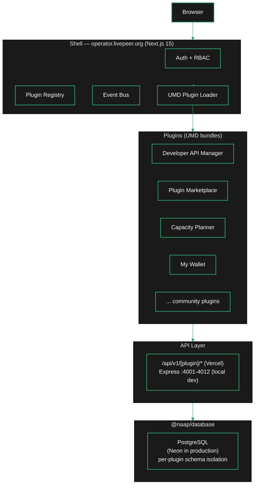

import { LinkArrow } from '/snippets/components/elements/links/Links.jsx'
import { StyledTable, TableRow, TableCell } from '/snippets/components/displays/tables/Tables.jsx'
import { CustomDivider } from '/snippets/components/elements/spacing/Divider.jsx'
import { ScrollableDiagram } from '/snippets/components/displays/diagrams/ScrollableDiagram.jsx'
import { CenteredContainer } from '/snippets/components/wrappers/containers/Containers.jsx'

<CenteredContainer style={{ width: '90%' }}>
  <Tip>NaaP is a micro-frontend architecture. The shell is a Next.js 15 host. Plugins compile to UMD bundles and load at runtime. Each plugin gets a ShellContext object with auth, navigation, theming, and database access.</Tip>
</CenteredContainer>

<CustomDivider />

## Micro-frontend design

NaaP is a micro-frontend architecture. The shell application is a Next.js 15 host. Plugins are compiled to UMD bundles and loaded at runtime via a plugin registry. Each plugin gets a `ShellContext` object on mount - this is the entire interface between a plugin and the platform.

The shell provides these services to every plugin via `ShellContext`:

```typescript icon="terminal"
interface ShellContext {
  auth: IAuthService;           // Authentication and authorisation
  navigate: NavigateFunction;   // Client-side navigation
  eventBus: IEventBus;          // Inter-plugin communication
  theme: IThemeService;         // Theme management
  notifications: INotificationService; // Toast notifications
  integrations: IIntegrationService;   // AI, storage, email
  logger: ILoggerService;       // Structured logging
  permissions: IPermissionService;     // Permission checking
  tenant?: ITenantService;      // Tenant context
  team?: ITeamContext;          // Team context
}
```

Plugins own a full vertical slice: frontend React components, backend API logic, and an isolated PostgreSQL schema within the shared database. In production (Vercel), plugin backends run as Next.js API route handlers at `/api/v1/[plugin-name]/*`. In local development, the shell proxies the same routes to standalone Express backends on ports 4001-4012.

The following diagram shows the complete request flow from browser to database.

<ScrollableDiagram title="NaaP request flow" maxHeight="480px">

</ScrollableDiagram>

<CustomDivider />

## Installed plugins

NaaP ships with 12 plugins covering developer, operator, monitoring, and governance use cases. The Plugin Marketplace plugin manages installation of additional community plugins.

<StyledTable variant="bordered">
  <thead>
    <TableRow header>
      <TableCell header>Plugin</TableCell>
      <TableCell header>Category</TableCell>
      <TableCell header>What it does</TableCell>
    </TableRow>
  </thead>
  <tbody>
    <TableRow>
      <TableCell>**Plugin Marketplace**</TableCell>
      <TableCell>Core</TableCell>
      <TableCell>Discover, install, and manage plugins within the shell</TableCell>
    </TableRow>
    <TableRow>
      <TableCell>**Developer API Manager**</TableCell>
      <TableCell>Developer</TableCell>
      <TableCell>Create and manage API keys, browse AI model listings, configure gateway connections, monitor usage quotas. Integrates with pymthouse as a billing provider via OAuth.</TableCell>
    </TableRow>
    <TableRow>
      <TableCell>**Plugin Publisher**</TableCell>
      <TableCell>Developer</TableCell>
      <TableCell>Validate, publish, and manage plugins in the NaaP marketplace</TableCell>
    </TableRow>
    <TableRow>
      <TableCell>**Capacity Planner**</TableCell>
      <TableCell>Monitoring</TableCell>
      <TableCell>Plan and monitor compute capacity across Livepeer node infrastructure</TableCell>
    </TableRow>
    <TableRow>
      <TableCell>**My Dashboard**</TableCell>
      <TableCell>Analytics</TableCell>
      <TableCell>Embedded analytics dashboards sourced via the Dashboard Data Provider pattern</TableCell>
    </TableRow>
    <TableRow>
      <TableCell>**My Wallet**</TableCell>
      <TableCell>Finance</TableCell>
      <TableCell>MetaMask wallet integration and LPT staking operations</TableCell>
    </TableRow>
    <TableRow>
      <TableCell>**Daydream Video**</TableCell>
      <TableCell>Media</TableCell>
      <TableCell>Real-time AI video generation via the Livepeer AI subnet</TableCell>
    </TableRow>
    <TableRow>
      <TableCell>**Community Hub**</TableCell>
      <TableCell>Social</TableCell>
      <TableCell>Community forum and discussion for Livepeer network participants</TableCell>
    </TableRow>
  </tbody>
</StyledTable>

<CustomDivider />

<CustomDivider />

The [building a plugin](/v2/developers/build/plugins-and-extensions/building-a-plugin) page covers the CLI, scaffold commands, and SDK hooks for creating your own plugin.
