# Persona infrastructure maps — Livepeer Developers tab

**Project:** Livepeer docs-v2
**Branch:** `docs-v2-dev`
**Purpose:** Map all available infrastructure and the guides needed for each of the five developer personas.

Five maps. Each shows what the persona touches (infra) and what docs they need to walk the path (guides).

## Colour convention (consistent across all five)

| Class | Meaning |
|-------|---------|
| `persona` | The persona node itself |
| `gw` | Gateways (community, self-hosted, alternative) |
| `sdk` | SDKs and client libraries |
| `trans` | Transport layer (ingest, playback, trickle, data channels) |
| `ref` | Reference material (pipeline lists, model files, codec lists) |
| `proto` | Protocol-layer code (go-livepeer, ai-runner, lpms) |
| `chain` | On-chain components (TicketBroker, contracts, payments) |
| `plugin` | Plugin platform (NaaP) |
| `ecosystem` | Ecosystem integrations (streamplace, frameworks) |
| `entry` | Entry points (livepeer.org, whitepaper, forum) |
| `repo` | Source repositories |
| `contract` | Specific Solidity contracts |
| `observ` | Observability (Explorer, Subgraph, Dune) |
| `gov` | Governance surfaces (LIPs, Treasury, forum) |
| `guide` | Documentation pages (lavender, dashed) |
| `routing` | Cross-tab routing (gray, dashed) |

<CustomDivider />

## Persona 1 — AI Persona ("OpenAI for video AI")

Looking for an inference API. Endpoint, key, models, schema, SDK, pricing.
Activation: first successful API call.

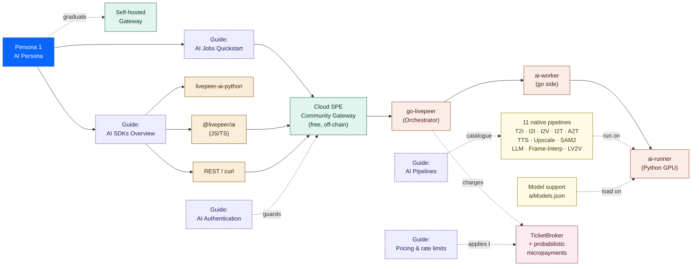

<CustomDivider />

## Persona 2 — Video Platform Persona ("Mux with AI bolted on")

Looking for ingest endpoints, transcoding presets, embeddable player, VOD, webhooks, recording.
Activation: first stream goes live with playback URL working.

Boundary: this persona arrives expecting Studio-shaped infra. The Developers-tab Build path does NOT use Studio. Direct-network options: self-hosted gateway with on-chain video transcoding, or Frameworks (open streaming stack). Studio acknowledged via routing only.

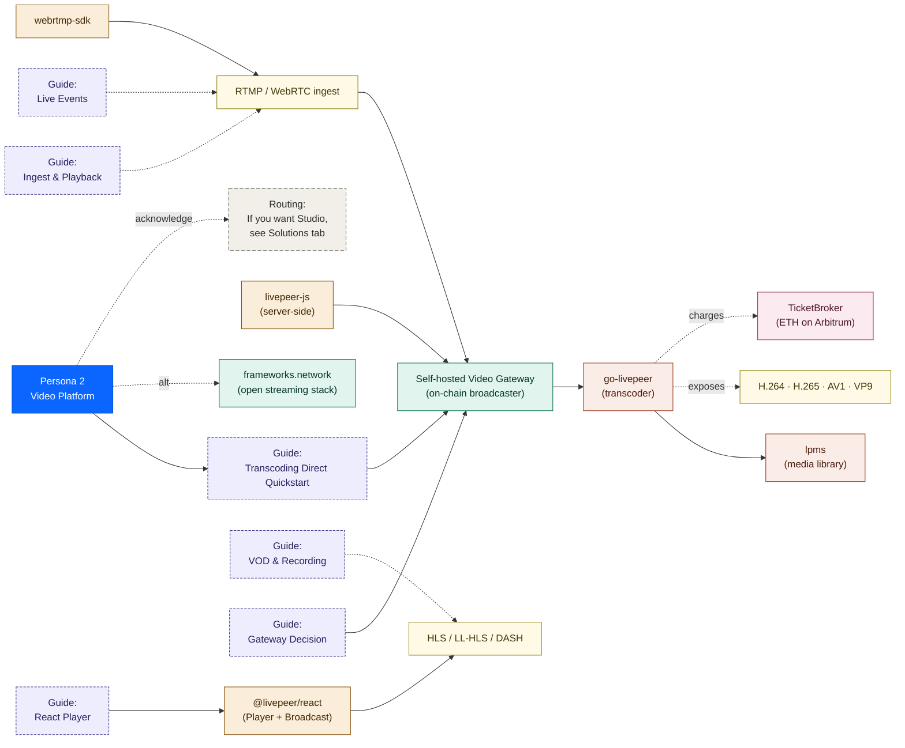

<CustomDivider />

## Persona 3 — Compute Primitives Persona ("Modal/RunPod, but cheaper")

Looking for container runtime, GPU declarations, BYOC, per-GPU-second pricing, real-time vs batch.
Activation: first BYOC container running on the network with a request flowing through.

This persona has the densest infra map — they touch every modular surface: BYOC, ComfyStream, PyTrickle, trickle protocol, Stream Pack, NaaP plugins.

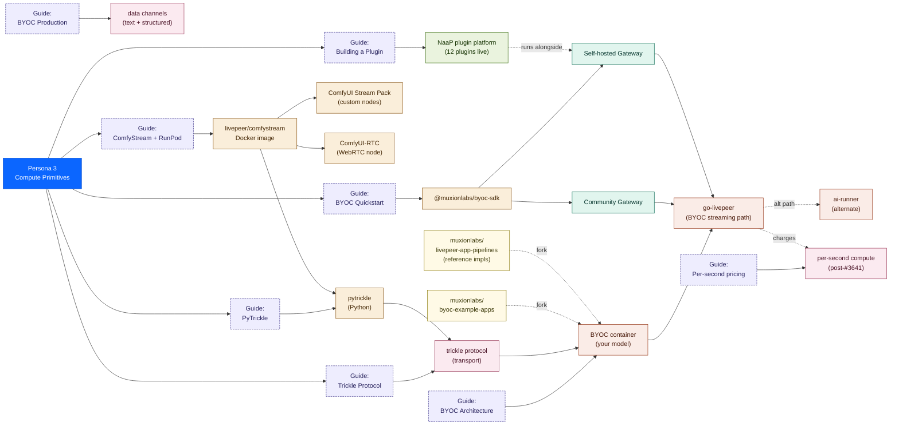

<CustomDivider />

## Persona 4 — Live-Video-First Persona ("real-time streaming backend")

Looking for ingest endpoints, ABR ladders, HLS/LL-HLS/DASH playback, codec choices, low-latency tuning, player SDK. Less concerned with VOD, webhooks, or recording — that's Persona 2's territory. Building Twitch-shaped live experiences, sports streaming, real-time events, gaming streams.

Activation: first live stream up with sub-second-to-three-second glass-to-glass latency and a working playback URL.

Boundary: build path uses a self-hosted live gateway or `frameworks.network`. Studio Streaming is acknowledged via routing only.

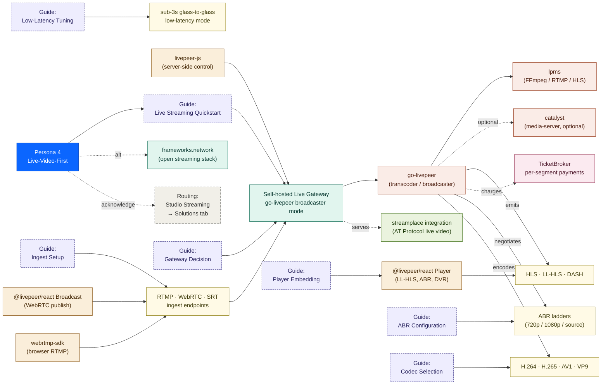

<CustomDivider />

## Persona 5 — Protocol Persona ("crypto network contributor")

Looking for architecture, LPT economics, contracts, payment flow, governance, node operator and delegator paths. Not building an app — extending or operating the network itself.

Activation: first merged PR to a Livepeer repo, first orchestrator node activated, first treasury proposal submitted, or first delegation made.

Boundary: this persona's content lives in the **About** and **Community** tabs, not in Developers. The Developers tab acknowledges them via routing pages and points out. They're shown here to make the boundary explicit — what Developers *doesn't* document — and to confirm no Developers infra is missing because of it.

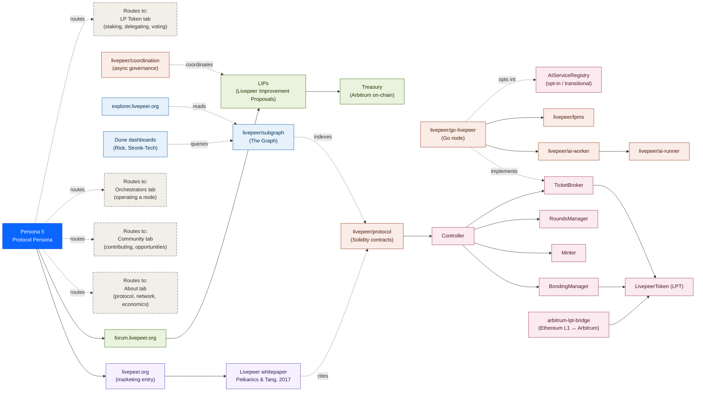

<CustomDivider />

## Cross-persona observations

**Persona 5 confirms the Developers-tab IA is correct as scoped.** Almost nothing in this map should live in Developers. Whitepaper, contracts, observability stack, and governance forum belong in About + Community + Orchestrators + LP Token. The Developers tab's `routing/protocol-extenders.mdx` is the only Developers-side touchpoint — and that page exists to send Persona 5 *out* of the tab.

**Personas 2 and 4 share enough infra that the Build section should NOT have duplicate pages.** Both touch self-hosted gateway, ingest endpoints, playback, codecs, lpms, TicketBroker. The distinction is intent (full Mux replacement vs. live-streaming engineer) and what they don't care about (Persona 4 skips VOD, recording, webhooks). Answer: `build/video/` covers both. Persona 2 reads VOD/recording pages, Persona 4 reads live/ABR/low-latency pages, `gateway-decision.mdx` is shared.

**Persona 3 is the densest map** because the modular pathway is genuinely the most surface-rich part of the developer story. Compute, transport, payments, plugins, gateways-as-developer all converge on this persona. The Build IA's job-shaped subgroups (compute, transport, payments, plugins-and-extensions, gateways-as-developer) are the direct answer to that density.

**Persona 1's path graduates to Persona 3.** A reader who arrives wanting OpenAI-shaped inference and stays often wants per-GPU-second pricing or BYOC eventually. The Developers IA should make that graduation visible — `gateway-decision.mdx` and `byoc/overview.mdx` both serve as graduation hand-offs.

# Infra Diagrams

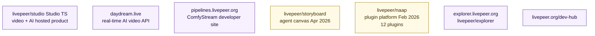

## 10
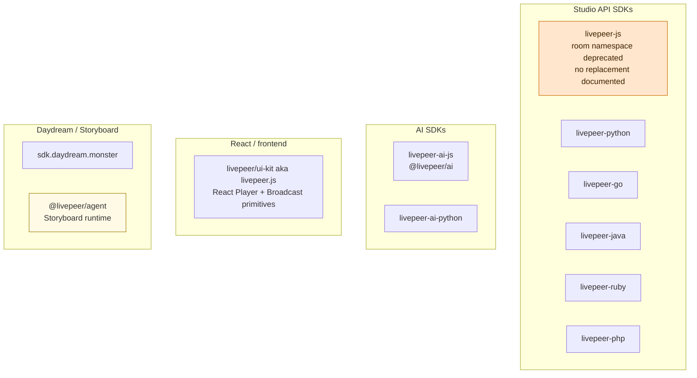

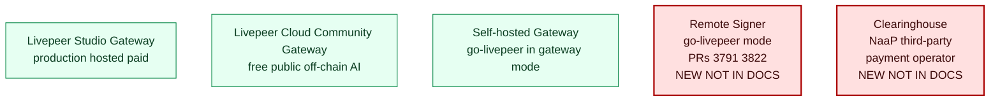

## 12
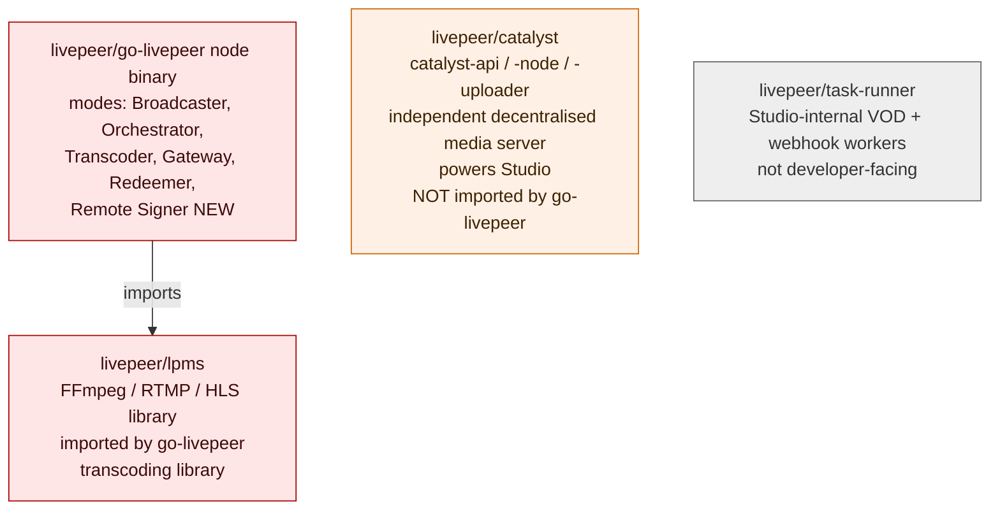

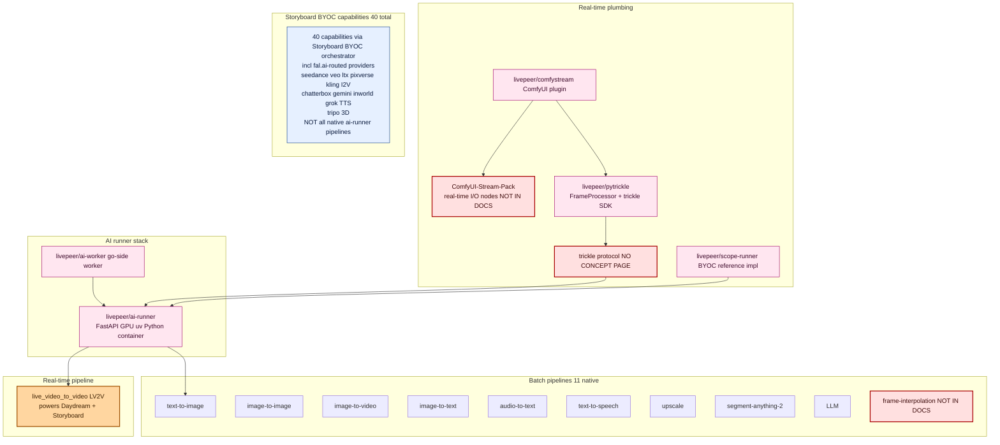

```mermaid
flowchart TB
  Ctrl["Controller 0xD8E8...606ee4"]:::chain
  subgraph staking["Staking and bonding"]
    BM["BondingManager Proxy<br/>0x35Bc...453e40"]:::chain
    BV["BondingVotes Proxy<br/>0x0B9C...8169A"]:::chain
    RM["RoundsManager Proxy<br/>0xdd6f...cc39f"]:::chain
  end
  subgraph payment["Payment"]
    TB["TicketBroker Proxy<br/>0xa8bB...e41B"]:::chain
  end
  subgraph token["Token"]
    LPT["LivepeerToken<br/>0x289b...A839"]:::chain
    Minter["Minter 0xc20D...27252"]:::chain
  end
  subgraph governance["Governance and treasury"]
    Gov["Governor 0xD9dE...736a6"]:::chain
    LGov["LivepeerGovernor Proxy<br/>0xcFE4...6aa0"]:::chain
    Treasury["Treasury 0xf82C...8E8C4"]:::chain
  end
  subgraph registry["Registry"]
    SR["ServiceRegistry Proxy<br/>0xC92d...7431"]:::chain
    AISR["AIServiceRegistry Target<br/>0x04C0...34C5<br/>Opt-in via cfg.AIServiceRegistry flag<br/>AI-subnet-specific transitional<br/>not in developer docs"]:::transitional
  end
  subgraph migration["L1 L2 migration"]
    L2M["L2Migrator Proxy<br/>0x148D...2085"]:::chain
    L2GW["L2LPTGateway 0x6D24...D318"]:::chain
  end
  Ctrl --> BM
  Ctrl --> BV
  Ctrl --> RM
  Ctrl --> TB
  Ctrl --> Minter
  Ctrl --> SR
  Ctrl --> AISR
  Ctrl --> L2M
  Ctrl --> L2GW
  Ctrl --> Gov
  Ctrl --> LGov
  Ctrl --> Treasury
  LPT --- Minter
  classDef chain fill:#f0e6ff,stroke:#6b00a0,color:#2a0a3d
  classDef transitional fill:#fff0e6,stroke:#cc6600,color:#3d2200,stroke-width:2px
```

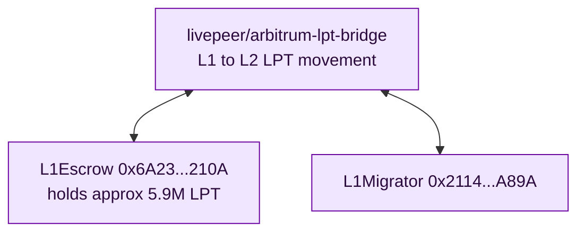

## 16
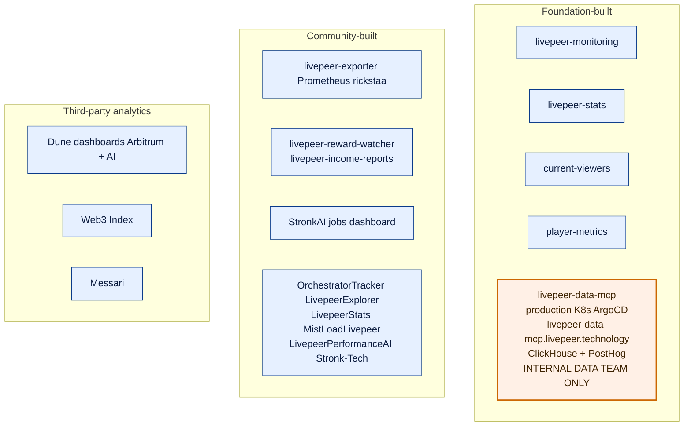

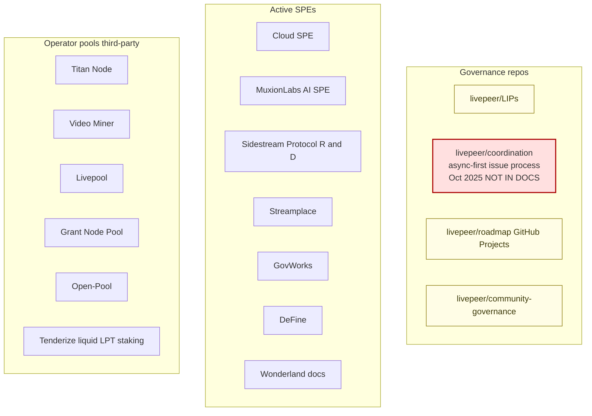

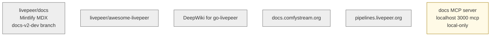

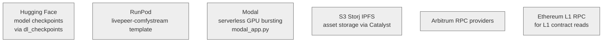

```mermaid
```

# Persona Diagrams

```mermaid
flowchart LR
  PA["Persona A<br/>Rapid Integrator"]:::persona
  Studio["Livepeer Studio<br/>livepeer.studio"]:::product
  Daydream["Daydream<br/>daydream.live"]:::product
  SDKjs["livepeer-js"]:::sdk
  SDKpy["livepeer-python"]:::sdk
  SDKgo["livepeer-go"]:::sdk
  SDKaijs["@livepeer/ai"]:::sdk
  UIKit["livepeer/ui-kit (React)"]:::sdk
  DSDK["sdk.daydream.monster"]:::sdk
  StudioGW["Studio Gateway (production)"]:::gateway
  GoLP["go-livepeer (Orchestrator)"]:::proto
  AIRunner["ai-runner (GPU container)"]:::proto
  PA --> Studio
  PA --> Daydream
  Studio --> SDKjs
  Studio --> SDKpy
  Studio --> SDKgo
  Studio --> UIKit
  Studio --> SDKaijs
  Daydream --> DSDK
  SDKjs --> StudioGW
  SDKaijs --> StudioGW
  DSDK --> StudioGW
  StudioGW --> GoLP
  GoLP --> AIRunner
  classDef persona fill:#0b66ff,stroke:#0a4cc6,color:#fff
  classDef product fill:#f6f0ff,stroke:#6b3fa0,color:#1a0a3d
  classDef sdk fill:#fff7e0,stroke:#a07a00,color:#3d2c00
  classDef gateway fill:#e6fff2,stroke:#0a8a4a,color:#0a3d20
  classDef proto fill:#ffe6e6,stroke:#a00,color:#3d0a0a
```

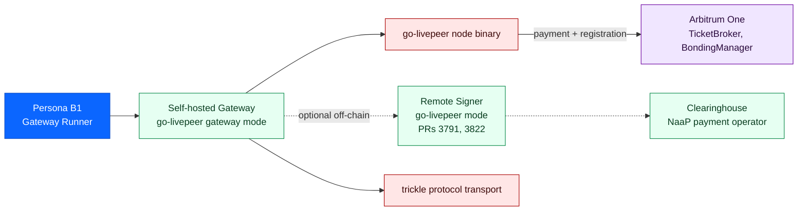

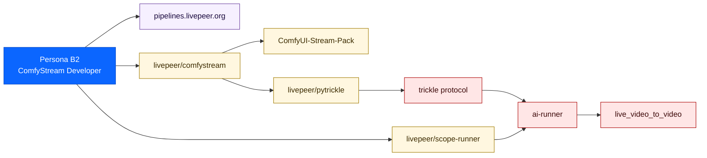

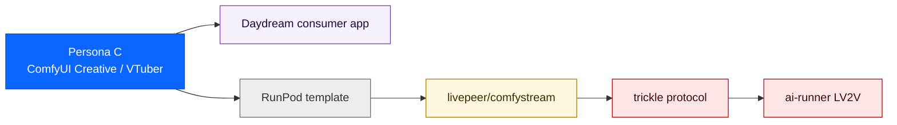

```mermaid
flowchart LR
  PD["Persona D<br/>OSS Core Builder"]:::persona
  GoLP["livepeer/go-livepeer<br/>node binary Go"]:::proto
  AIWorker["livepeer/ai-worker<br/>go-side worker"]:::proto
  AIRunner["livepeer/ai-runner<br/>Python FastAPI"]:::proto
  LPMS["livepeer/lpms<br/>media server"]:::proto
  ComfyStream["livepeer/comfystream"]:::proto
  StreamPack["ComfyUI-Stream-Pack"]:::proto
  PyTrickle["livepeer/pytrickle"]:::proto
  Protocol["livepeer/livepeer-protocol<br/>Solidity contracts"]:::chain
  PD --> GoLP
  PD --> AIWorker
  PD --> AIRunner
  PD --> LPMS
  PD --> ComfyStream
  PD --> StreamPack
  PD --> PyTrickle
  PD --> Protocol
  classDef persona fill:#0b66ff,stroke:#0a4cc6,color:#fff
  classDef proto fill:#ffe6e6,stroke:#a00,color:#3d0a0a
  classDef chain fill:#f0e6ff,stroke:#6b00a0,color:#2a0a3d
```

```mermaid
flowchart LR
  PE["Persona E<br/>SDK / Alt-Gateway Builder<br/>NO DOCS SURFACE"]:::missing
  RS["Remote Signer<br/>go-livepeer mode"]:::gateway
  PyTrickle["livepeer/pytrickle"]:::sdk
  Trickle["trickle protocol"]:::proto
  AltGW["Alternative Gateway<br/>Python / browser /<br/>mobile / embedded"]:::missing
  Orch["go-livepeer Orchestrator<br/>direct connection"]:::proto
  PE --> RS
  PE --> PyTrickle
  PE -->|builds| AltGW
  AltGW --> RS
  AltGW --> Trickle
  Trickle --> Orch
  RS -.->|payment signing| Orch
  classDef persona fill:#0b66ff,stroke:#0a4cc6,color:#fff
  classDef missing fill:#ffe0e0,stroke:#aa0000,color:#3d0a0a,stroke-width:2px
  classDef gateway fill:#e6fff2,stroke:#0a8a4a,color:#0a3d20
  classDef sdk fill:#fff7e0,stroke:#a07a00,color:#3d2c00
  classDef proto fill:#ffe6e6,stroke:#aa0000,color:#3d0a0a
```

```mermaid
flowchart LR
  PF["Persona F<br/>Agent-Runtime Developer<br/>NO DOCS SURFACE"]:::missing
  Storyboard["livepeer/storyboard<br/>agent canvas Apr 2026"]:::product
  NaaP["livepeer/naap<br/>plugin platform Feb 2026"]:::product
  AgentSDK["@livepeer/agent<br/>provider-agnostic runtime"]:::missing
  StudioGW["Studio Gateway<br/>Livepeer as provider"]:::gateway
  OtherProv["Other providers<br/>Gemini Claude OpenAI"]:::external
  PF --> Storyboard
  PF --> NaaP
  Storyboard --> AgentSDK
  AgentSDK -->|provider Livepeer| StudioGW
  AgentSDK -->|provider others| OtherProv
  classDef persona fill:#0b66ff,stroke:#0a4cc6,color:#fff
  classDef missing fill:#ffe0e0,stroke:#aa0000,color:#3d0a0a,stroke-width:2px
  classDef product fill:#f6f0ff,stroke:#6b3fa0,color:#1a0a3d
  classDef gateway fill:#e6fff2,stroke:#0a8a4a,color:#0a3d20
  classDef external fill:#eeeeee,stroke:#666666
```

```mermaid
flowchart LR
  PA["A · Rapid Integrator"]:::persona
  PB1["B1 · Gateway Runner"]:::persona
  PB2["B2 · ComfyStream Dev"]:::persona
  PC["C · ComfyUI Creative"]:::persona
  PD["D · OSS Core Builder"]:::persona
  PE["E · Alt-Gateway Builder"]:::persona
  PF["F · Agent-Runtime Dev"]:::persona
  StudioGW["Studio Gateway"]:::gateway
  CommunityGW["Cloud Community Gateway"]:::gateway
  SelfGW["Self-hosted Gateway"]:::gateway
  AltGW["Alternative Gateway<br/>remote-signer based"]:::gateway
  GoLP["go-livepeer Orchestrator"]:::proto
  AIRunner["ai-runner"]:::proto
  Arb["Arbitrum One"]:::chain
  PA --> StudioGW
  PB1 --> SelfGW
  PB2 --> StudioGW
  PB2 --> SelfGW
  PC --> StudioGW
  PD -->|contributes to| GoLP
  PE -->|builds| AltGW
  PF --> StudioGW
  StudioGW --> GoLP
  CommunityGW --> GoLP
  SelfGW --> GoLP
  AltGW --> GoLP
  GoLP --> AIRunner
  GoLP --> Arb
  classDef persona fill:#0b66ff,stroke:#0a4cc6,color:#fff
  classDef gateway fill:#e6fff2,stroke:#0a8a4a,color:#0a3d20
  classDef proto fill:#ffe6e6,stroke:#aa0000,color:#3d0a0a
  classDef chain fill:#f0e6ff,stroke:#6b00a0,color:#2a0a3d
```

# Routing

# Persona Routing × Infrastructure Map

**Project:** Livepeer docs-v2
**Branch:** `docs-v2-dev`
**Last updated:** 27 April 2026 — all eight verification items resolved against named sources.

This document maps every developer persona to the infrastructure they touch, inventories every Livepeer infrastructure component so nothing is orphaned, and identifies what is missing from the current docs surface.

<CustomDivider />

## Verification log (resolved)

Eight items previously flagged for verification. Each was checked against a named source — repo READMEs, source files, commit history, contract addresses on Arbiscan, the Storyboard README. All resolved.

| # | Item | Source checked | Finding |
|---|------|----------------|---------|
| 1 | `livepeer/sdk` active status | Repo README + `list_commits` | **Dead.** Last commit Feb 2022, references Rinkeby (sunset 2023), pre-Arbitrum migration. Removed from infra map. |
| 2 | `livepeer.js` vs `ui-kit` overlap | READMEs of both | **Same repo.** `livepeer.js` README is titled "Livepeer UI Kit"; discussion link points to `ui-kit/discussions`. Collapsed to single node. |
| 3 | `livepeer-data-mcp` status | Repo README | **Real and production-deployed, internal-only.** Live at `livepeer-data-mcp.livepeer.technology`, Kubernetes/ArgoCD via Vault. Connects to ClickHouse + PostHog. Last updated 2026-04-21. Marked internal, not developer-facing. |
| 4 | `AIServiceRegistry` usage | `cmd/livepeer/starter/starter.go` | **Live in production code, opt-in.** Boolean flag `*cfg.AIServiceRegistry` (default false). When set, overrides `ServiceRegistryAddr` to `0x04C0b249740175999E5BF5c9ac1dA92431EF34C5`. Code comment: *"For the time-being Livepeer AI Subnet uses its own ServiceRegistry"* — transitional separate registry. Annotated as opt-in/transitional. |
| 5 | Storyboard 40+ models | Storyboard README | **Verified.** README enumerates 40 models grouped: 7 Image, 2 Edit, 3 T2V, 6 I2V, 4 TTS, 3 3D, 7 Other. Routes via "BYOC Orchestrator — 40 capabilities · fal.ai adapter · payment tickets" + separate Scope LV2V pipeline. **Reconciles the 9/11/40 discrepancy:** 9-11 are native `ai-runner` pipelines, 40 are Storyboard BYOC capabilities including fal.ai-routed providers. |
| 6 | `room` namespace migration | `livepeer-js/src/sdk/room.ts` | **Deprecated, not removed.** All 9 methods carry `@deprecated method: This will be removed in a future release, please migrate away from it as soon as possible.` No migration target documented. The "Livepeer in 2026" report's "fully deprecated" framing was inaccurate. |
| 7 | Catalyst vs lpms relationship | `go-livepeer/go.mod` | **Sibling components, not stacked.** `go-livepeer` imports `lpms` directly (pinned to March 2026 commit). **No `catalyst` import.** lpms is the FFmpeg/RTMP/HLS library go-livepeer uses for transcoding; catalyst is an independent decentralised media-server product powering Studio. Both actively developed in 2026. |
| 8 | `task-runner` developer relevance | `livepeer/docs` code search | **Studio-internal.** One hit across entire docs repo, in `v1/self-hosting/how-to-contribute.mdx`. Zero hits in v2 webhook docs. Correctly excluded from developer-facing surfaces. |

<CustomDivider />

## Part 1 — Persona routing

Seven persona diagrams plus one convergence diagram. One per persona, all rendered separately for legibility.

### 1.1 Persona A — Rapid Integrator
Frontend or fullstack developer building with Studio or Daydream hosted APIs. Largest cohort.

```mermaid
flowchart LR
  PA["Persona A<br/>Rapid Integrator"]:::persona
  Studio["Livepeer Studio<br/>livepeer.studio"]:::product
  Daydream["Daydream<br/>daydream.live"]:::product
  SDKjs["livepeer-js"]:::sdk
  SDKpy["livepeer-python"]:::sdk
  SDKgo["livepeer-go"]:::sdk
  SDKaijs["@livepeer/ai"]:::sdk
  UIKit["livepeer/ui-kit (React)"]:::sdk
  DSDK["sdk.daydream.monster"]:::sdk
  StudioGW["Studio Gateway (production)"]:::gateway
  GoLP["go-livepeer (Orchestrator)"]:::proto
  AIRunner["ai-runner (GPU container)"]:::proto
  PA --> Studio
  PA --> Daydream
  Studio --> SDKjs
  Studio --> SDKpy
  Studio --> SDKgo
  Studio --> UIKit
  Studio --> SDKaijs
  Daydream --> DSDK
  SDKjs --> StudioGW
  SDKaijs --> StudioGW
  DSDK --> StudioGW
  StudioGW --> GoLP
  GoLP --> AIRunner
  classDef persona fill:#0b66ff,stroke:#0a4cc6,color:#fff
  classDef product fill:#f6f0ff,stroke:#6b3fa0,color:#1a0a3d
  classDef sdk fill:#fff7e0,stroke:#a07a00,color:#3d2c00
  classDef gateway fill:#e6fff2,stroke:#0a8a4a,color:#0a3d20
  classDef proto fill:#ffe6e6,stroke:#a00,color:#3d0a0a
```

**Activation moment:** first successful API call.
**Key disambiguation need:** Studio vs Daydream vs network API.

### 1.2 Persona B1 — Gateway Runner (graduated)
Persona A who scaled, now self-hosting a gateway for cost and control.

```mermaid
flowchart LR
  PB1["Persona B1<br/>Gateway Runner"]:::persona
  SelfGW["Self-hosted Gateway<br/>go-livepeer gateway mode"]:::gateway
  RS["Remote Signer<br/>go-livepeer mode<br/>PRs 3791, 3822"]:::gateway
  CH["Clearinghouse<br/>NaaP payment operator"]:::gateway
  GoLP["go-livepeer node binary"]:::proto
  Trickle["trickle protocol transport"]:::proto
  Arb["Arbitrum One<br/>TicketBroker, BondingManager"]:::chain
  PB1 --> SelfGW
  SelfGW --> GoLP
  SelfGW --> Trickle
  SelfGW -.->|optional off-chain| RS
  RS -.-> CH
  GoLP -->|payment + registration| Arb
  classDef persona fill:#0b66ff,stroke:#0a4cc6,color:#fff
  classDef gateway fill:#e6fff2,stroke:#0a8a4a,color:#0a3d20
  classDef proto fill:#ffe6e6,stroke:#a00,color:#3d0a0a
  classDef chain fill:#f0e6ff,stroke:#6b00a0,color:#2a0a3d
```

**Activation moment:** first job routed through their self-hosted gateway.
**Key decision:** "should I run a gateway?" — not "how" (that's the Gateways tab).

### 1.3 Persona B2 — ComfyStream / Pipeline Developer
ML or Python developer building real-time AI video pipelines.

```mermaid
flowchart LR
  PB2["Persona B2<br/>ComfyStream Developer"]:::persona
  Pipelines["pipelines.livepeer.org"]:::product
  ComfyStream["livepeer/comfystream"]:::sdk
  StreamPack["ComfyUI-Stream-Pack"]:::sdk
  PyTrickle["livepeer/pytrickle"]:::sdk
  Scope["livepeer/scope-runner"]:::sdk
  Trickle["trickle protocol"]:::proto
  AIRunner["ai-runner"]:::proto
  LV2V["live_video_to_video"]:::proto
  PB2 --> Pipelines
  PB2 --> ComfyStream
  PB2 --> Scope
  ComfyStream --> StreamPack
  ComfyStream --> PyTrickle
  PyTrickle --> Trickle
  Trickle --> AIRunner
  Scope --> AIRunner
  AIRunner --> LV2V
  classDef persona fill:#0b66ff,stroke:#0a4cc6,color:#fff
  classDef product fill:#f6f0ff,stroke:#6b3fa0,color:#1a0a3d
  classDef sdk fill:#fff7e0,stroke:#a07a00,color:#3d2c00
  classDef proto fill:#ffe6e6,stroke:#a00,color:#3d0a0a
```

**Activation moment:** first real-time pipeline running via ComfyStream.

### 1.4 Persona C — ComfyUI Creative / VTuber Builder
ComfyUI node-graph user. Often Windows. RunPod-native.

```mermaid
flowchart LR
  PC["Persona C<br/>ComfyUI Creative / VTuber"]:::persona
  Daydream["Daydream consumer app"]:::product
  RunPod["RunPod template"]:::external
  ComfyStream["livepeer/comfystream"]:::sdk
  Trickle["trickle protocol"]:::proto
  AIRunner["ai-runner LV2V"]:::proto
  PC --> Daydream
  PC --> RunPod
  RunPod --> ComfyStream
  ComfyStream --> Trickle
  Trickle --> AIRunner
  classDef persona fill:#0b66ff,stroke:#0a4cc6,color:#fff
  classDef product fill:#f6f0ff,stroke:#6b3fa0,color:#1a0a3d
  classDef sdk fill:#fff7e0,stroke:#a07a00,color:#3d2c00
  classDef proto fill:#ffe6e6,stroke:#a00,color:#3d0a0a
  classDef external fill:#eeeeee,stroke:#666666
```

**Activation moment:** first real-time AI effect on live video using their ComfyUI workflow.
**Documented gap:** no RunPod-first path in Livepeer docs.

### 1.5 Persona D — OSS Core Builder
Protocol or go-livepeer contributor.

```mermaid
flowchart LR
  PD["Persona D<br/>OSS Core Builder"]:::persona
  GoLP["livepeer/go-livepeer<br/>node binary Go"]:::proto
  AIWorker["livepeer/ai-worker<br/>go-side worker"]:::proto
  AIRunner["livepeer/ai-runner<br/>Python FastAPI"]:::proto
  LPMS["livepeer/lpms<br/>media server library"]:::proto
  ComfyStream["livepeer/comfystream"]:::proto
  StreamPack["ComfyUI-Stream-Pack"]:::proto
  PyTrickle["livepeer/pytrickle"]:::proto
  Protocol["livepeer/livepeer-protocol<br/>Solidity contracts"]:::chain
  PD --> GoLP
  PD --> AIWorker
  PD --> AIRunner
  PD --> LPMS
  PD --> ComfyStream
  PD --> StreamPack
  PD --> PyTrickle
  PD --> Protocol
  classDef persona fill:#0b66ff,stroke:#0a4cc6,color:#fff
  classDef proto fill:#ffe6e6,stroke:#a00,color:#3d0a0a
  classDef chain fill:#f0e6ff,stroke:#6b00a0,color:#2a0a3d
```

**Activation moment:** first merged PR or approved treasury proposal.

### 1.6 Persona E — SDK / Alt-Gateway Builder *(no docs surface)*
Active in `#local-gateways`. Building Python, browser, mobile, or embedded gateway implementations using the remote signer architecture.

```mermaid
flowchart LR
  PE["Persona E<br/>SDK / Alt-Gateway Builder<br/>NO DOCS SURFACE"]:::missing
  RS["Remote Signer<br/>go-livepeer mode"]:::gateway
  PyTrickle["livepeer/pytrickle"]:::sdk
  Trickle["trickle protocol"]:::proto
  AltGW["Alternative Gateway<br/>Python / browser /<br/>mobile / embedded"]:::missing
  Orch["go-livepeer Orchestrator<br/>direct connection"]:::proto
  PE --> RS
  PE --> PyTrickle
  PE -->|builds| AltGW
  AltGW --> RS
  AltGW --> Trickle
  Trickle --> Orch
  RS -.->|payment signing| Orch
  classDef persona fill:#0b66ff,stroke:#0a4cc6,color:#fff
  classDef missing fill:#ffe0e0,stroke:#aa0000,color:#3d0a0a,stroke-width:2px
  classDef gateway fill:#e6fff2,stroke:#0a8a4a,color:#0a3d20
  classDef sdk fill:#fff7e0,stroke:#a07a00,color:#3d2c00
  classDef proto fill:#ffe6e6,stroke:#aa0000,color:#3d0a0a
```

**Architectural rationale (verifiable in `Remote_signers.md`, line 25):** *"writing an implementation of a Livepeer gateway requires deep familiarity with the Livepeer probabilistic micropayments mechanism. Very few developers actually understand PM in enough detail to implement correctly, which is one reason that go-livepeer is the only extant gateway implementation."*

The remote signer architecture (PRs #3791 and #3822) was designed to enable this persona. The docs do not surface it.

### 1.7 Persona F — Agent-Runtime Developer *(emerging — no docs surface)*
Storyboard's `@livepeer/agent` runtime treats Livepeer as one of several swappable inference providers in an agent backend.

```mermaid
flowchart LR
  PF["Persona F<br/>Agent-Runtime Developer<br/>NO DOCS SURFACE"]:::missing
  Storyboard["livepeer/storyboard<br/>agent canvas Apr 2026"]:::product
  NaaP["livepeer/naap<br/>plugin platform Feb 2026"]:::product
  AgentSDK["@livepeer/agent<br/>provider-agnostic runtime"]:::missing
  StudioGW["Studio Gateway<br/>Livepeer as provider"]:::gateway
  OtherProv["Other providers<br/>Gemini Claude OpenAI"]:::external
  PF --> Storyboard
  PF --> NaaP
  Storyboard --> AgentSDK
  AgentSDK -->|provider Livepeer| StudioGW
  AgentSDK -->|provider others| OtherProv
  classDef persona fill:#0b66ff,stroke:#0a4cc6,color:#fff
  classDef missing fill:#ffe0e0,stroke:#aa0000,color:#3d0a0a,stroke-width:2px
  classDef product fill:#f6f0ff,stroke:#6b3fa0,color:#1a0a3d
  classDef gateway fill:#e6fff2,stroke:#0a8a4a,color:#0a3d20
  classDef external fill:#eeeeee,stroke:#666666
```

### 1.8 The convergence point — all paths lead to go-livepeer

```mermaid
flowchart LR
  PA["A · Rapid Integrator"]:::persona
  PB1["B1 · Gateway Runner"]:::persona
  PB2["B2 · ComfyStream Dev"]:::persona
  PC["C · ComfyUI Creative"]:::persona
  PD["D · OSS Core Builder"]:::persona
  PE["E · Alt-Gateway Builder"]:::persona
  PF["F · Agent-Runtime Dev"]:::persona
  StudioGW["Studio Gateway"]:::gateway
  CommunityGW["Cloud Community Gateway"]:::gateway
  SelfGW["Self-hosted Gateway"]:::gateway
  AltGW["Alternative Gateway<br/>remote-signer based"]:::gateway
  GoLP["go-livepeer Orchestrator"]:::proto
  AIRunner["ai-runner"]:::proto
  Arb["Arbitrum One"]:::chain
  PA --> StudioGW
  PB1 --> SelfGW
  PB2 --> StudioGW
  PB2 --> SelfGW
  PC --> StudioGW
  PD -->|contributes to| GoLP
  PE -->|builds| AltGW
  PF --> StudioGW
  StudioGW --> GoLP
  CommunityGW --> GoLP
  SelfGW --> GoLP
  AltGW --> GoLP
  GoLP --> AIRunner
  GoLP --> Arb
  classDef persona fill:#0b66ff,stroke:#0a4cc6,color:#fff
  classDef gateway fill:#e6fff2,stroke:#0a8a4a,color:#0a3d20
  classDef proto fill:#ffe6e6,stroke:#aa0000,color:#3d0a0a
  classDef chain fill:#f0e6ff,stroke:#6b00a0,color:#2a0a3d
```

<CustomDivider />

## Part 2 — Infrastructure inventory (no orphans)

Eleven layer diagrams, with verification findings folded in.

### 2.1 Hosted products & access surfaces

```mermaid
flowchart TB
  Studio["livepeer/studio Studio TS<br/>video + AI hosted product"]:::core
  Daydream["daydream.live<br/>real-time AI video API"]:::core
  Pipelines["pipelines.livepeer.org<br/>ComfyStream developer site"]:::core
  Storyboard["livepeer/storyboard<br/>agent canvas Apr 2026"]:::new
  NaaP["livepeer/naap<br/>plugin platform Feb 2026<br/>12 plugins"]:::new
  Explorer["explorer.livepeer.org<br/>livepeer/explorer"]:::core
  DevHub["livepeer.org/dev-hub"]:::core
  classDef core fill:#f6f0ff,stroke:#6b3fa0,color:#1a0a3d
  classDef new fill:#fffae6,stroke:#a07a00,color:#3d2c00
```

### 2.2 SDKs, libraries, frontends *(updated per items 1, 2, 6)*

`livepeer/sdk` removed (dead since Feb 2022). `livepeer.js` and `livepeer/ui-kit` collapsed (same repo). `room` namespace flagged as deprecated-but-callable.

```mermaid
flowchart TB
  subgraph studio_sdks["Studio API SDKs"]
    LJS["livepeer-js<br/>STATUS: room namespace<br/>deprecated, no replacement"]:::deprecated
    LPY["livepeer-python"]
    LGO["livepeer-go"]
    LJAVA["livepeer-java"]
    LRUBY["livepeer-ruby"]
    LPHP["livepeer-php"]
  end
  subgraph ai_sdks["AI SDKs"]
    AIJS["livepeer-ai-js<br/>@livepeer/ai"]
    AIPY["livepeer-ai-python"]
  end
  subgraph react_sdks["React / frontend"]
    UIKit["livepeer/ui-kit<br/>aka livepeer.js<br/>React Player + Broadcast primitives"]
  end
  subgraph daydream_storyboard["Daydream / Storyboard"]
    DSDK["sdk.daydream.monster"]
    AgentSDK["@livepeer/agent<br/>Storyboard runtime"]:::new
  end
  classDef new fill:#fffae6,stroke:#a07a00
  classDef deprecated fill:#ffe6cc,stroke:#cc6600,color:#3d2200
```

**Note:** `livepeer/sdk` (the protocol JS SDK) — last commit Feb 2022, references Rinkeby. **Dead.** Removed from this map. Do not surface in docs.

**Note on `room` namespace:** all 9 methods on the `Room` class in `livepeer-js` carry `@deprecated method: This will be removed in a future release, please migrate away from it as soon as possible.` No migration target documented. Multiparticipant livestreaming rooms still callable. Developers building on rooms today need a migration note.

### 2.3 Gateway layer

```mermaid
flowchart TB
  StudioGW["Livepeer Studio Gateway<br/>production hosted, paid"]:::stable
  CloudGW["Livepeer Cloud Community Gateway<br/>free, public, off-chain AI"]:::stable
  SelfGW["Self-hosted Gateway<br/>go-livepeer in gateway mode"]:::stable
  RS["Remote Signer<br/>go-livepeer mode<br/>PRs 3791 3822<br/>NEW NOT IN DOCS"]:::missing
  CH["Clearinghouse<br/>NaaP third-party<br/>payment operator<br/>NEW NOT IN DOCS"]:::missing
  classDef stable fill:#e6fff2,stroke:#0a8a4a,color:#0a3d20
  classDef missing fill:#ffe0e0,stroke:#aa0000,color:#3d0a0a,stroke-width:2px
```

### 2.4 Protocol & node runtime *(updated per item 7)*

lpms and catalyst were previously stacked in this map. They are siblings, not stacked. Verified via `go-livepeer/go.mod` — `go-livepeer` imports `lpms` directly and does not import `catalyst`.

```mermaid
flowchart TB
  GoLP["livepeer/go-livepeer node binary<br/>modes: Broadcaster, Orchestrator,<br/>Transcoder, Gateway, Redeemer,<br/>Remote Signer NEW"]:::core
  LPMS["livepeer/lpms<br/>FFmpeg / RTMP / HLS library<br/>imported by go-livepeer<br/>(transcoding library)"]:::core
  Catalyst["livepeer/catalyst<br/>+ catalyst-api / -node / -uploader<br/>independent decentralised media server<br/>powers Studio<br/>(separate application, not imported by go-livepeer)"]:::sibling
  TaskR["livepeer/task-runner<br/>Studio-internal VOD + webhook workers<br/>not developer-facing"]:::internal
  GoLP -->|imports| LPMS
  classDef core fill:#ffe6e6,stroke:#aa0000,color:#3d0a0a
  classDef sibling fill:#fff0e6,stroke:#cc6600,color:#3d2200
  classDef internal fill:#eeeeee,stroke:#666666,color:#333333
```

**Verification:** `go-livepeer/go.mod` declares `github.com/livepeer/lpms v0.0.0-20260310011836-c44af7253bc9`. There is no `livepeer/catalyst` import in go-livepeer's dependency tree. lpms is a *library* that go-livepeer uses for transcoding; catalyst is a *standalone media-server application* that powers Studio.

### 2.5 AI runtime & pipelines *(updated per item 5)*

Footnote added to reconcile the 9 vs 11 vs 40 pipeline-count discrepancy.

```mermaid
flowchart TB
  subgraph runner_layer["AI runner stack"]
    AIWorker["livepeer/ai-worker<br/>go-side worker"]:::gpu
    AIRunner["livepeer/ai-runner<br/>FastAPI GPU uv<br/>Python container"]:::gpu
  end
  subgraph batch["Batch pipelines (11 native)"]
    T2I["text-to-image"]
    I2I["image-to-image"]
    I2V["image-to-video"]
    I2T["image-to-text"]
    A2T["audio-to-text"]
    TTS["text-to-speech"]
    UP["upscale"]
    SAM["segment-anything-2"]
    LLM["LLM"]
    FI["frame-interpolation NOT IN DOCS"]:::missing
  end
  subgraph realtime["Real-time pipeline"]
    LV2V["live_video_to_video LV2V<br/>powers Daydream + Storyboard"]:::headline
  end
  subgraph plumbing["Real-time plumbing"]
    ComfyStream["livepeer/comfystream<br/>ComfyUI plugin"]:::gpu
    StreamPack["ComfyUI-Stream-Pack<br/>real-time I/O nodes<br/>NOT IN DOCS"]:::missing
    PyTrickle["livepeer/pytrickle<br/>FrameProcessor + trickle SDK"]:::gpu
    Trickle["trickle protocol<br/>NO CONCEPT PAGE"]:::missing
    Scope["livepeer/scope-runner<br/>BYOC reference impl"]:::gpu
  end
  subgraph storyboard_byoc["Storyboard BYOC capabilities (40 total)"]
    SBNote["40 capabilities exposed via<br/>Storyboard's BYOC orchestrator,<br/>including fal.ai-routed providers<br/>(I2V: seedance, veo, ltx, pixverse, kling)<br/>(TTS: chatterbox, gemini, inworld, grok)<br/>(3D: tripo)<br/>NOT all native ai-runner pipelines"]:::byoc
  end
  AIWorker --> AIRunner
  AIRunner --> T2I
  AIRunner --> LV2V
  ComfyStream --> StreamPack
  ComfyStream --> PyTrickle
  PyTrickle --> Trickle
  Trickle --> AIRunner
  Scope --> AIRunner
  classDef gpu fill:#ffe6f0,stroke:#a0006b,color:#3d0a2a
  classDef headline fill:#ffd6a0,stroke:#a05000,color:#3d2000,stroke-width:2px
  classDef missing fill:#ffe0e0,stroke:#aa0000,color:#3d0a0a,stroke-width:2px
  classDef byoc fill:#e6f0ff,stroke:#0a3a8a,color:#0a1a3d
```

**Pipeline count clarification:** the `ai-runner` repo has **11 native pipelines** (audio-to-text, image-to-image, image-to-text, image-to-video, LLM, segment-anything-2, text-to-image, text-to-speech, upscale, frame-interpolation, live_video_to_video). The Daydream API page implies 9. Storyboard's "40+ models" claim is **40 capabilities exposed via the Storyboard BYOC orchestrator** — including third-party providers like fal.ai routed through BYOC. These are not all native to ai-runner. The numbers reconcile when treated as separate categories.

### 2.6 On-chain — Arbitrum One *(updated per item 4)*

AIServiceRegistry annotated as opt-in/transitional rather than "NOT IN DOCS." It IS in production code; it is just not surfaced in the developer-facing docs.

```mermaid
flowchart TB
  Ctrl["Controller 0xD8E8...606ee4"]:::chain
  subgraph staking["Staking and bonding"]
    BM["BondingManager Proxy<br/>0x35Bc...453e40"]:::chain
    BV["BondingVotes Proxy<br/>0x0B9C...8169A"]:::chain
    RM["RoundsManager Proxy<br/>0xdd6f...cc39f"]:::chain
  end
  subgraph payment["Payment"]
    TB["TicketBroker Proxy<br/>0xa8bB...e41B"]:::chain
  end
  subgraph token["Token"]
    LPT["LivepeerToken<br/>0x289b...A839"]:::chain
    Minter["Minter 0xc20D...27252"]:::chain
  end
  subgraph governance["Governance and treasury"]
    Gov["Governor 0xD9dE...736a6"]:::chain
    LGov["LivepeerGovernor Proxy<br/>0xcFE4...6aa0"]:::chain
    Treasury["Treasury 0xf82C...8E8C4"]:::chain
  end
  subgraph registry["Registry"]
    SR["ServiceRegistry Proxy<br/>0xC92d...7431"]:::chain
    AISR["AIServiceRegistry Target<br/>0x04C0...34C5<br/>Opt-in via cfg.AIServiceRegistry flag<br/>AI-subnet-specific, transitional<br/>not in developer docs"]:::transitional
  end
  subgraph migration["L1 L2 migration"]
    L2M["L2Migrator Proxy<br/>0x148D...2085"]:::chain
    L2GW["L2LPTGateway 0x6D24...D318"]:::chain
  end
  Ctrl --> BM
  Ctrl --> BV
  Ctrl --> RM
  Ctrl --> TB
  Ctrl --> Minter
  Ctrl --> SR
  Ctrl --> AISR
  Ctrl --> L2M
  Ctrl --> L2GW
  Ctrl --> Gov
  Ctrl --> LGov
  Ctrl --> Treasury
  LPT --- Minter
  classDef chain fill:#f0e6ff,stroke:#6b00a0,color:#2a0a3d
  classDef transitional fill:#fff0e6,stroke:#cc6600,color:#3d2200,stroke-width:2px
```

**AIServiceRegistry verification (from `cmd/livepeer/starter/starter.go`):**

```go
if *cfg.AIServiceRegistry {
    // For the time-being Livepeer AI Subnet uses its own ServiceRegistry, so we define it here
    ethCfg.ServiceRegistryAddr = ethcommon.HexToAddress("0x04C0b249740175999E5BF5c9ac1dA92431EF34C5")
}
```

Opt-in flag (default false). When set, overrides the standard `ServiceRegistry` address with the AI-subnet-specific one. Code comment confirms transitional status — the AI subnet currently has its own registry separate from main protocol.

### 2.7 On-chain — Ethereum L1

```mermaid
flowchart TB
  L1M["L1Migrator 0x2114...A89A"]:::chain
  L1E["L1Escrow 0x6A23...210A<br/>holds approx 5.9M LPT"]:::chain
  Bridge["livepeer/arbitrum-lpt-bridge<br/>L1 to L2 LPT movement"]:::chain
  Bridge <--> L1E
  Bridge <--> L1M
  classDef chain fill:#f0e6ff,stroke:#6b00a0,color:#2a0a3d
```

### 2.8 Observability & data *(updated per item 3)*

`livepeer-data-mcp` flagged as production-deployed and internal-only; "status unconfirmed" caveat removed.

```mermaid
flowchart TB
  subgraph foundation["Foundation-built"]
    LMon["livepeer-monitoring"]:::obs
    LStats["livepeer-stats"]:::obs
    Viewers["current-viewers"]:::obs
    PMet["player-metrics"]:::obs
    LMCP["livepeer-data-mcp<br/>production K8s/ArgoCD<br/>livepeer-data-mcp.livepeer.technology<br/>ClickHouse + PostHog<br/>INTERNAL DATA TEAM ONLY"]:::internal
  end
  subgraph community["Community-built"]
    LExp["livepeer-exporter<br/>Prometheus rickstaa"]:::obs
    Income["livepeer-reward-watcher<br/>livepeer-income-reports"]:::obs
    StronkAI["StronkAI jobs dashboard"]:::obs
    StronkStack["OrchestratorTracker<br/>LivepeerExplorer LivepeerStats<br/>MistLoadLivepeer<br/>LivepeerPerformanceAI<br/>Stronk-Tech"]:::obs
  end
  subgraph thirdparty["Third-party analytics"]
    Dune["Dune dashboards<br/>Arbitrum + AI"]:::obs
    Web3Idx["Web3 Index"]:::obs
    Messari["Messari"]:::obs
  end
  classDef obs fill:#e6f0ff,stroke:#0a3a8a,color:#0a1a3d
  classDef internal fill:#fff0e6,stroke:#cc6600,color:#3d2200,stroke-width:2px
```

### 2.9 Governance, ops, community

```mermaid
flowchart TB
  subgraph gov_repos["Governance repos"]
    LIPs["livepeer/LIPs"]:::gov
    Coord["livepeer/coordination<br/>async-first issue process<br/>Oct 2025 NOT IN DOCS"]:::missing
    Roadmap["livepeer/roadmap GitHub Projects"]:::gov
    CG["livepeer/community-governance"]:::gov
  end
  subgraph spes["Active SPEs"]
    Cloud["Cloud SPE"]
    Mux["MuxionLabs AI SPE"]
    Side["Sidestream Protocol R and D"]
    Stream["Streamplace"]
    GW["GovWorks"]
    DeF["DeFine"]
    Wond["Wonderland docs"]
  end
  subgraph pools["Operator pools third-party"]
    Titan["Titan Node"]
    VM["Video Miner"]
    LPool["Livepool"]
    GNP["Grant Node Pool"]
    OP["Open-Pool"]
    Tend["Tenderize liquid LPT staking"]
  end
  classDef gov fill:#fffde6,stroke:#8a7a0a,color:#3d3a0a
  classDef missing fill:#ffe0e0,stroke:#aa0000,stroke-width:2px
```

### 2.10 Documentation surface

```mermaid
flowchart TB
  DocsRepo["livepeer/docs<br/>Mintlify MDX<br/>docs-v2-dev branch"]:::infra
  Awesome["livepeer/awesome-livepeer"]:::infra
  DeepW["DeepWiki for go-livepeer"]:::infra
  ComfyDocs["docs.comfystream.org"]:::infra
  PipelinesDocs["pipelines.livepeer.org"]:::infra
  classDef infra fill:#eeeeee,stroke:#666666
```

### 2.11 External infrastructure developers depend on

```mermaid
flowchart TB
  HF["Hugging Face<br/>model checkpoints<br/>via dl_checkpoints"]:::ext
  RP["RunPod<br/>livepeer-comfystream template"]:::ext
  Mod["Modal<br/>serverless GPU bursting<br/>modal_app.py"]:::ext
  Stor["S3 Storj IPFS<br/>asset storage via Catalyst"]:::ext
  Arb["Arbitrum RPC providers"]:::ext
  ETH["Ethereum L1 RPC<br/>for L1 contract reads"]:::ext
  classDef ext fill:#eeeeee,stroke:#666666
```

<CustomDivider />

## Part 3 — What is missing

Three categories: missing personas, missing or under-documented infrastructure, missing connective tissue.

### 3.1 Missing personas (no docs surface)

**Persona E — SDK / Alt-Gateway Builder.** Most active cohort in `#local-gateways`. The remote signer architecture (PRs #3791, #3822) was designed specifically to enable them. Verifiable in `Remote_signers.md`: *"writing an implementation of a Livepeer gateway requires deep familiarity with the Livepeer probabilistic micropayments mechanism. Very few developers actually understand PM in enough detail to implement correctly, which is one reason that go-livepeer is the only extant gateway implementation."*

**Persona F — Agent-Runtime Developer.** Storyboard's `@livepeer/agent` runtime treats Livepeer as one of several swappable inference providers. Pre-canonical-docs persona but the cohort the Foundation's Storyboard investment implies.

### 3.2 Missing or under-documented infrastructure

| Component | Status | Source |
|-----------|--------|--------|
| Trickle protocol | One-line mention in `oss-stack.mdx`. No concept page. | Transport between every real-time AI workload and `ai-runner`. |
| `pytrickle` | Reference page exists but no concept-level treatment. The `FrameProcessor` interface equivalence with ComfyStream is buried. | `oss-stack.mdx`, `pytrickle` README. |
| `ai-worker` vs `ai-runner` distinction | Conflated. `ai-worker` is the go-side worker; `ai-runner` is the Python container. | Repo READMEs. |
| `lpms` | Listed in `oss-stack.mdx` once. Used as transcoding library by go-livepeer. | `go-livepeer/go.mod`. |
| Catalyst stack | Not in any concept page. Independent decentralised media-server product. | `catalyst` README, `go.mod` showing no go-livepeer dependency. |
| `task-runner` | Not in any concept page. **Correctly excluded — Studio-internal only.** | Repo README, docs code search. |
| Remote Signer mode | Not in docs at all. | `Remote_signers.md`, PRs #3791, #3822. |
| Clearinghouse role | Defined in remote signer doc. Not in docs. | `Remote_signers.md`. |
| `livepeer/coordination` repo | Material change to network coordination. Not in docs. | Repo README. |
| `livepeer/scope-runner` | Reference for custom AI pipelines. Linked from one place. | `ai-runner.md`. |
| LV2V (`live_video_to_video.py`) | Biggest pipeline file. No dedicated treatment as a pipeline type. | `ai-runner` repo. |
| `AIServiceRegistry` contract | In production code (opt-in). Not mentioned in any developer-facing concept page. | `cmd/livepeer/starter/starter.go`. |
| `livepeer/sdk` (protocol JS SDK) | **Dead since Feb 2022. Removed from infra map.** Should not be referenced. | Repo README + commits. |
| Frame-interpolation pipeline | In `ai-runner` source. Not documented. | `ai-runner/runner/src/runner/pipelines/`. |
| `ComfyUI-Stream-Pack` | Real-time I/O nodes for ComfyUI. Not in any concept page. | Repo README. |
| `livepeer-data-mcp` | **Production-deployed but internal-only.** Not for developer surfacing. | Repo README. |
| Java/Ruby/PHP SDKs | Listed in references but absent from `navigator.mdx`. | Speakeasy SDK output. |
| `room` namespace deprecation | All 9 methods deprecated in `livepeer-js`. **No migration target documented.** Affected developers need a migration note. | `livepeer-js/src/sdk/room.ts`. |

### 3.3 Missing connective tissue

**The graduation path is in prose, not visual.** Heroku → AWS → own DC analogy in `running-a-gateway.mdx` and the Network Vision blog. No diagram showing the four stages with infrastructure exposure at each. The persona routing diagrams in Part 1 are a candidate.

**Studio API key conflation.** `guides/ai/authentication.mdx` treats the Studio API key as the AI API key. The Livepeer Cloud Community Gateway is documented in `developer-stack.mdx` as an alternative. The two pages contradict each other implicitly.

**Off-chain vs on-chain gateway distinction.** `running-a-gateway.mdx` covers it. Nothing else does.

**Persona ownership of repos.** `oss-stack.mdx` "Where to start contributing" maps repos to contribution intent. No equivalent for "which repos do I integrate against as Persona A vs Persona B2 vs Persona F."

**Operator pools, SPEs, third-party tooling absent from Developer view.** Stronk-Tech, livepeer-exporter, Dune dashboards. Treated as Operator concerns. They cross over for any production developer.

**Contract list not surfaced for developers.** Authoritative list in `v2/resources/references/contract-addresses.mdx`. No link from Developers concepts.

**The pipeline count discrepancy is now resolved** (item 5): 9-11 are native ai-runner pipelines, 40 are Storyboard BYOC capabilities including fal.ai-routed providers. **Action required:** state this reconciliation explicitly in the relevant concept pages so the docs stop contradicting themselves.

**The `room` namespace is deprecated but documentation pretends nothing changed.** Item 6 confirmed all 9 Room methods carry `@deprecated` JSDoc. **Action required:** migration note for affected developers, and a docs-side flag that the rooms feature is end-of-lifed without replacement.

### 3.4 Implications for the IA restructure

Three components need to be named in the persona model and IA before any page is written:

- Trickle protocol (concept page).
- Remote Signer + Clearinghouse (concept page).
- `ai-worker` / `ai-runner` distinction (explicit in `oss-stack.mdx` and any architecture diagram).

Personas E and F need to be added to the persona model with documented entry surfaces, navigator paths, and concept pages — or explicitly subsumed under existing personas with documented reasoning.

Once those are settled, the persona-routing diagrams in Part 1 become candidates for the developer-stack concept page, and the layered infrastructure diagrams in Part 2 become candidates for `oss-stack.mdx`.

<CustomDivider />

*All eight verification items resolved. Document updated 27 April 2026.*
