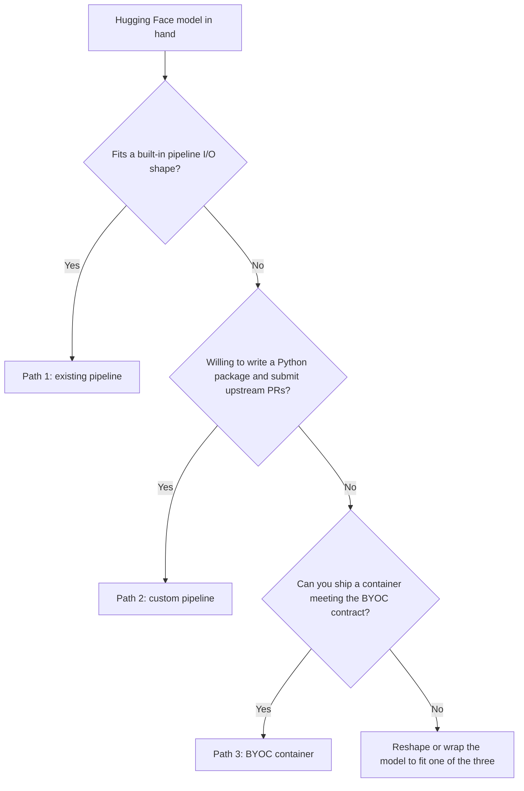

import { CustomDivider } from '/snippets/components/elements/spacing/Divider.jsx'
import { StyledTable, TableRow, TableCell } from '/snippets/components/displays/tables/Tables.jsx'

<Tip>
  You have a Hugging Face model and you want to serve it on the Livepeer network. There are three
  structurally distinct ways to do that, each with a different scope of work and a different verification
  path. This page tells you which one fits your model, then walks each path end-to-end.
</Tip>

---

Livepeer's AI inference layer is implemented as a set of pipeline runners
([`livepeer/ai-worker`](https://github.com/livepeer/ai-worker)) coordinated by the orchestrator process
([`livepeer/go-livepeer`](https://github.com/livepeer/go-livepeer)). Where your model fits in that layer
determines which path you take.

**What you will verify (whichever path you take):**
- Your model loads cleanly inside its runner or container
- Your orchestrator advertises the capability on `tools.livepeer.cloud/ai/network-capabilities`
- A request through your self-hosted gateway returns a successful inference result

None of the paths use Studio or Daydream. All verification runs through your own infrastructure plus public
dashboards.

<CustomDivider middleText="The three paths" />

## Path summary

<StyledTable variant="bordered">
  <thead>
    <TableRow header>
      <TableCell header>Path</TableCell>
      <TableCell header>Scope</TableCell>
      <TableCell header>Reach</TableCell>
    </TableRow>
  </thead>
  <tbody>
    <TableRow>
      <TableCell>**Path 1**: existing pipeline</TableCell>
      <TableCell>Configure an existing pipeline. Declare the model in `aiModels.json`, pre-download weights, restart the orchestrator. No code written.</TableCell>
      <TableCell>Any gateway calling Livepeer AI</TableCell>
    </TableRow>
    <TableRow>
      <TableCell>**Path 2**: custom pipeline</TableCell>
      <TableCell>Build a Python package extending `ai-runner[realtime]` or `ai-runner[batch]`, ship as a Docker image, submit upstream PRs to `livepeer/ai-worker` and `livepeer/go-livepeer`.</TableCell>
      <TableCell>Any gateway, after PRs land</TableCell>
    </TableRow>
    <TableRow>
      <TableCell>**Path 3**: BYOC</TableCell>
      <TableCell>Bring Your Own Container. Wrap the model in a container exposing the BYOC contract (`/health` plus your job endpoints). Orchestrator advertises it as an external capability.</TableCell>
      <TableCell>Only gateways implementing your capability</TableCell>
    </TableRow>
  </tbody>
</StyledTable>

<CustomDivider middleText="Decision flow" />

## Decision flow



### Built-in pipeline shapes (Question 1)

The built-in pipelines, readable from
[`livepeer/ai-worker/runner/src/runner/pipelines/`](https://github.com/livepeer/ai-worker/tree/main/runner/src/runner/pipelines):

<StyledTable variant="bordered">
  <thead>
    <TableRow header>
      <TableCell header>Pipeline</TableCell>
      <TableCell header>Input</TableCell>
      <TableCell header>Output</TableCell>
      <TableCell header>Typical model class</TableCell>
    </TableRow>
  </thead>
  <tbody>
    <TableRow>
      <TableCell>`text-to-image`</TableCell>
      <TableCell>Text prompt + sampling params</TableCell>
      <TableCell>Image</TableCell>
      <TableCell>SDXL, SD 1.5, Lightning variants</TableCell>
    </TableRow>
    <TableRow>
      <TableCell>`image-to-image`</TableCell>
      <TableCell>Image + prompt + params</TableCell>
      <TableCell>Image</TableCell>
      <TableCell>SDXL img2img, ControlNet wrappers</TableCell>
    </TableRow>
    <TableRow>
      <TableCell>`image-to-video`</TableCell>
      <TableCell>Image + params</TableCell>
      <TableCell>Short video</TableCell>
      <TableCell>Stable Video Diffusion class</TableCell>
    </TableRow>
    <TableRow>
      <TableCell>`image-to-text`</TableCell>
      <TableCell>Image</TableCell>
      <TableCell>Caption text</TableCell>
      <TableCell>BLIP, captioning VLMs</TableCell>
    </TableRow>
    <TableRow>
      <TableCell>`audio-to-text`</TableCell>
      <TableCell>Audio bytes</TableCell>
      <TableCell>Transcript text</TableCell>
      <TableCell>Whisper variants</TableCell>
    </TableRow>
    <TableRow>
      <TableCell>`text-to-speech`</TableCell>
      <TableCell>Text + voice params</TableCell>
      <TableCell>Audio bytes</TableCell>
      <TableCell>TTS models (text in, audio out)</TableCell>
    </TableRow>
    <TableRow>
      <TableCell>`upscale`</TableCell>
      <TableCell>Image</TableCell>
      <TableCell>Higher-resolution image</TableCell>
      <TableCell>Diffusion upscalers</TableCell>
    </TableRow>
    <TableRow>
      <TableCell>`segment-anything-2`</TableCell>
      <TableCell>Image + prompt mask</TableCell>
      <TableCell>Segmentation mask</TableCell>
      <TableCell>SAM2 variants</TableCell>
    </TableRow>
    <TableRow>
      <TableCell>`llm`</TableCell>
      <TableCell>Chat messages</TableCell>
      <TableCell>Completion</TableCell>
      <TableCell>Ollama-supported LLMs</TableCell>
    </TableRow>
    <TableRow>
      <TableCell>`live-video-to-video`</TableCell>
      <TableCell>WebRTC stream</TableCell>
      <TableCell>WebRTC stream</TableCell>
      <TableCell>Real-time pipelines via ComfyStream</TableCell>
    </TableRow>
  </tbody>
</StyledTable>

If your model is, say, an SDXL fine-tune, a BLIP variant, or a Whisper variant, the answer is yes. The
pipeline already handles your I/O. **Take Path 1.**

If your model is a diffusion model that needs custom preprocessing the built-in pipeline does not do (a novel
ControlNet, a non-standard scheduler, multi-stage inference), the answer is no. The I/O looks similar but the
runtime behaviour does not fit. **Continue to Question 2.**

If your model is something else entirely (a protein folder, an audio classifier, a multi-modal model with
three inputs), the answer is no. **Continue to Question 2.**

### Custom pipeline scope (Question 2)

Custom pipelines extend the
[`Pipeline` interface](https://github.com/livepeer/ai-worker/blob/main/runner/src/runner/live/pipelines/interface.py)
for real-time pipelines or the equivalent batch base class for batch pipelines. The package is a normal
Python project managed with [uv](https://docs.astral.sh/uv/), shipped as a Docker image extending
`livepeer/ai-runner:live-base`.

Two upstream PRs are required today, because the pipeline registry is not yet dynamic:

- one to `livepeer/ai-worker/runner/dl_checkpoints.sh`, adding your pipeline to the model preparation switch
- one to `livepeer/go-livepeer/ai/worker/docker.go`, adding your pipeline name to the `livePipelineToImage`
  map so the orchestrator knows which container to launch

Until those PRs land, no orchestrator other than yours can run your pipeline.

If you accept that scope, **take Path 2.** If not, or your model needs a different protocol than the runner's
FastAPI shape, **continue to Question 3.**

### BYOC container (Question 3)

The BYOC contract, defined in `livepeer/go-livepeer` and visible in the orchestrator's external-capability
handling code, requires:

- a `/health` endpoint that returns 200 when the container is ready
- one or more job-handling endpoints whose protocol is whatever you publish to gateways using your capability
- a stable container image and version

The orchestrator advertises the capability under a name you choose. Gateways that have implemented the
matching client side route work to it. There is no upstream PR required: BYOC is the path that exists
precisely so model providers can ship without modifying `livepeer/ai-worker` or `livepeer/go-livepeer`.

The trade-off: BYOC requires gateway-side implementation work for any gateway operator who wants to call your
capability. You are not just shipping a model; you are shipping a small protocol that gateways must adopt.

**Take Path 3** if your model needs a non-standard protocol and you are willing to coordinate with gateway
operators (or run your own gateway) to drive adoption.

<CustomDivider middleText="Common ground" />

## Shared prerequisites

These are identical regardless of path. They are prerequisites, not part of any individual path.

<StyledTable variant="bordered">
  <thead>
    <TableRow header>
      <TableCell header>Requirement</TableCell>
      <TableCell header>Notes</TableCell>
    </TableRow>
  </thead>
  <tbody>
    <TableRow>
      <TableCell>Active orchestrator on Arbitrum One</TableCell>
      <TableCell>In the active set on [`explorer.livepeer.org`](https://explorer.livepeer.org), with a reachable `serviceAddr`.</TableCell>
    </TableRow>
    <TableRow>
      <TableCell>NVIDIA GPU sized for your model</TableCell>
      <TableCell>See the model card for VRAM requirements. SDXL-class models need 24 GB minimum.</TableCell>
    </TableRow>
    <TableRow>
      <TableCell>Docker with NVIDIA Container Toolkit</TableCell>
      <TableCell>Verify: `docker run --rm --gpus all nvidia/cuda:12.0-base nvidia-smi`.</TableCell>
    </TableRow>
    <TableRow>
      <TableCell>`go-livepeer` build with AI worker mode</TableCell>
      <TableCell>Built from `master` or a release containing `-aiWorker`, `-aiModels`, `-aiModelsDir` flags.</TableCell>
    </TableRow>
    <TableRow>
      <TableCell>Verification surface</TableCell>
      <TableCell>[`tools.livepeer.cloud/ai/network-capabilities`](https://tools.livepeer.cloud/ai/network-capabilities) plus a self-hosted gateway test, ideally before any public traffic.</TableCell>
    </TableRow>
  </tbody>
</StyledTable>

<CustomDivider middleText="Path differences" />

## Path differences at a glance

<StyledTable variant="bordered">
  <thead>
    <TableRow header>
      <TableCell header>Aspect</TableCell>
      <TableCell header>Path 1</TableCell>
      <TableCell header>Path 2</TableCell>
      <TableCell header>Path 3</TableCell>
    </TableRow>
  </thead>
  <tbody>
    <TableRow>
      <TableCell>**Code written**</TableCell>
      <TableCell>None</TableCell>
      <TableCell>Python package + Dockerfile</TableCell>
      <TableCell>Container of any shape</TableCell>
    </TableRow>
    <TableRow>
      <TableCell>**Upstream PRs needed**</TableCell>
      <TableCell>None</TableCell>
      <TableCell>Two (`ai-worker`, `go-livepeer`)</TableCell>
      <TableCell>None</TableCell>
    </TableRow>
    <TableRow>
      <TableCell>**Time to verifiable on-network**</TableCell>
      <TableCell>Hours</TableCell>
      <TableCell>Weeks (gated on PR review)</TableCell>
      <TableCell>Days (gated on gateway-side adoption)</TableCell>
    </TableRow>
    <TableRow>
      <TableCell>**Reach**</TableCell>
      <TableCell>Any gateway calling Livepeer AI</TableCell>
      <TableCell>Any gateway, after PRs land</TableCell>
      <TableCell>Only gateways implementing your capability</TableCell>
    </TableRow>
    <TableRow>
      <TableCell>**Verification**</TableCell>
      <TableCell>Capabilities tool + gateway test</TableCell>
      <TableCell>Same, after PRs merge</TableCell>
      <TableCell>Capability listing + custom gateway test</TableCell>
    </TableRow>
  </tbody>
</StyledTable>

<CustomDivider middleText="Path 1: Existing pipeline" />

## Path 1: Configure an existing pipeline

By the end of Path 1, a Hugging Face model conforming to one of the built-in pipeline shapes is running on
your Livepeer orchestrator, advertised to the network, and callable through your self-hosted gateway. The
example is `SG161222/RealVisXL_V4.0_Lightning` on the `text-to-image` pipeline.

You are not writing code. You are declaring the model, pre-downloading weights, and restarting the
orchestrator with the AI flags. The runner does the rest.

### Step 1: Pick the model directory

```bash icon="terminal" title="export-model-dir.sh"
export LP_AI_MODELS_DIR=/data/livepeer-ai-models
mkdir -p "$LP_AI_MODELS_DIR"
```

This is the host path that mounts into the runner container at `/models`.

### Step 2: Write aiModels.json

```json icon="code" title="aiModels.json"
[
  {
    "pipeline": "text-to-image",
    "model_id": "SG161222/RealVisXL_V4.0_Lightning",
    "price_per_unit": 4768371,
    "pixels_per_unit": 1,
    "currency": "wei",
    "warm": true
  }
]
```

Field definitions:

- **`pipeline`**: the canonical pipeline name (hyphenated form). Source: keys in `livePipelineToImage` in
  [`livepeer/go-livepeer/ai/worker/docker.go`](https://github.com/livepeer/go-livepeer/blob/master/ai/worker/docker.go).
- **`model_id`**: the Hugging Face repository slug, exactly as it appears in `huggingface.co/<org>/<repo>`.
  Used by the runner as both the download target and the inference-routing key.
- **`price_per_unit`** and **`pixels_per_unit`**: together set the rate. For pixel-priced pipelines, the
  rate is `price_per_unit / pixels_per_unit` wei per pixel. The wei figure is illustrative; set yours by
  comparing live rates on `tools.livepeer.cloud/ai/network-capabilities`.
- **`currency`**: `"wei"` (Arbitrum-native ETH).
- **`warm`**: `true` keeps the model in VRAM continuously, eliminating cold-start latency on the first
  request. Required to compete on latency.

### Step 3: Pre-download weights

The canonical script is
[`livepeer/ai-worker/runner/dl_checkpoints.sh`](https://github.com/livepeer/ai-worker/blob/main/runner/dl_checkpoints.sh).
It uses `huggingface_hub.snapshot_download` to fetch model files into `$MODEL_DIR/<model_id>/`.

```bash icon="terminal" title="download-weights.sh"
git clone https://github.com/livepeer/ai-worker.git
cd ai-worker

docker run --rm \
  -v "$LP_AI_MODELS_DIR:/models" \
  -v "$(pwd)/runner:/runner" \
  -e MODEL_DIR=/models \
  -e PIPELINE=text-to-image \
  -e MODEL_ID=SG161222/RealVisXL_V4.0_Lightning \
  livepeer/ai-runner:latest \
  bash /runner/dl_checkpoints.sh
```

Verify the download:

```bash icon="terminal" title="verify-weights.sh"
ls -la "$LP_AI_MODELS_DIR/SG161222/RealVisXL_V4.0_Lightning/"
```

Expect SDXL's standard layout: `model_index.json`, `unet/`, `vae/`, `text_encoder/`, `text_encoder_2/`,
`tokenizer/`, `tokenizer_2/`, `scheduler/`. If empty or partial, re-run; `huggingface_hub` resumes partial
downloads.

### Step 4: Start go-livepeer with the AI flags

```bash icon="terminal" title="start-orchestrator.sh"
go-livepeer \
  -orchestrator \
  -transcoder \
  -nvidia all \
  -aiWorker \
  -aiModels /path/to/aiModels.json \
  -aiModelsDir "$LP_AI_MODELS_DIR" \
  -ethUrl <your-arbitrum-rpc> \
  -serviceAddr <your-public-host>:<port> \
  -pricePerUnit 0
```

The AI flags, defined in
[`livepeer/go-livepeer/cmd/livepeer/livepeer.go`](https://github.com/livepeer/go-livepeer/blob/master/cmd/livepeer/livepeer.go):

- `-aiWorker`: declare this node serves AI jobs. Without it, `aiModels.json` is ignored.
- `-aiModels`: path to your config file.
- `-aiModelsDir`: host directory with the weights. Mounts to `/models` inside the runner.
- `-nvidia`: GPU index (or `all`).

At startup, `go-livepeer` parses `aiModels.json`, pulls the runner image from `livePipelineToImage` for each
declared pipeline, mounts the models directory, starts the runner container, waits for `/health` to return
200, and begins advertising the capability.

### Step 5: Verify on the capabilities tool

[`tools.livepeer.cloud/ai/network-capabilities`](https://tools.livepeer.cloud/ai/network-capabilities) shows
live capability advertisements from active orchestrators.

Find your orchestrator address and check that `text-to-image` appears with
`SG161222/RealVisXL_V4.0_Lightning` under it.

If it does not appear:

<AccordionGroup>
  <Accordion title="Active set check" icon="circle-exclamation">
    Confirm your orchestrator is in the active set on [`explorer.livepeer.org`](https://explorer.livepeer.org).
  </Accordion>
  <Accordion title="Runner container check" icon="docker">
    Check `docker ps -a` for an exited runner container, then `docker logs <id>` for the cause. CUDA
    out-of-memory at warm load is the most common.
  </Accordion>
  <Accordion title="aiModels.json parse check" icon="code">
    Check `go-livepeer` logs for `aiModels.json` parse errors.
  </Accordion>
</AccordionGroup>

### Step 6: Test through your own gateway

#### Direct runner test

The runner is a FastAPI app. See
[`livepeer/ai-worker/runner/src/runner/main.py`](https://github.com/livepeer/ai-worker/blob/main/runner/src/runner/main.py).
It runs on a port the orchestrator prints at startup.

```bash icon="terminal" title="runner-direct.sh"
curl -X POST http://localhost:<runner-port>/text-to-image \
  -H "Content-Type: application/json" \
  -d '{
    "model_id": "SG161222/RealVisXL_V4.0_Lightning",
    "prompt": "a quiet harbour at dawn, photo realistic",
    "width": 1024,
    "height": 1024,
    "num_inference_steps": 4,
    "guidance_scale": 2.0
  }' \
  --output result.json
```

Four-step inference and guidance scale 2.0 follow the SDXL Lightning recommendation on the model card. This
confirms the model is loaded and inference works. It does not confirm network reachability.

#### Self-hosted gateway test

Run a second `go-livepeer` instance as a gateway pinned to your orchestrator:

```bash icon="terminal" title="start-gateway.sh"
go-livepeer \
  -gateway \
  -httpAddr 0.0.0.0:8935 \
  -orchAddr <your-orch-host>:<port> \
  -ethUrl <your-arbitrum-rpc>
```

`-orchAddr` removes the variability of network-wide selection, so the test is deterministic.

```bash icon="terminal" title="gateway-request.sh"
curl -X POST http://localhost:8935/text-to-image \
  -H "Content-Type: application/json" \
  -d '{
    "model_id": "SG161222/RealVisXL_V4.0_Lightning",
    "prompt": "a quiet harbour at dawn, photo realistic",
    "width": 1024,
    "height": 1024,
    "num_inference_steps": 4,
    "guidance_scale": 2.0
  }' \
  --output gateway-result.json
```

The response goes through full discovery, capability matching, and ticket-based payment. A successful result
means your model is reachable across the protocol layer.

### Path 1 done

You have completed Path 1 when:

1. The runner container is up and the model is in VRAM (`docker ps`, `nvidia-smi`)
2. The model appears on `tools.livepeer.cloud/ai/network-capabilities` under your orchestrator
3. A request through your self-hosted gateway returns a successful inference result

To swap models, change `model_id` in `aiModels.json` and `MODEL_ID` in the download command. The pipeline
name stays the same as long as the new model fits the same I/O shape.

<Note>
  **LLM variant.** LLM models follow the same flow but use the Cloud SPE-maintained
  `tztcloud/livepeer-ollama-runner` image
  ([Docker Hub](https://hub.docker.com/r/tztcloud/livepeer-ollama-runner)). The `aiModels.json` entry uses
  `pipeline: "llm"` and the Hugging Face `model_id` is the slug for documentation purposes; the actual model
  pull happens through Ollama's tag system. Reference: [Ollama tag library](https://ollama.com/library).
</Note>

<CustomDivider middleText="Path 2: Custom pipeline" />

## Path 2: Build a custom pipeline

By the end of Path 2, you have a Python package implementing the Livepeer AI runner `Pipeline` interface, a
Docker image built on top of `livepeer/ai-runner:live-base`, and the upstream PRs prepared against
`livepeer/ai-worker` and `livepeer/go-livepeer`. After those PRs merge, your pipeline runs on the network the
same way the built-in pipelines do.

The reference implementation throughout is
[`daydreamlive/scope-runner`](https://github.com/daydreamlive/scope-runner). When in doubt, read the
equivalent file in scope-runner.

<Warning>
  Path 2 gets you to a verifiable local state – a working container, a working pipeline, the upstream PRs
  filed. It does not get you to "advertised on the network capabilities tool" in a single sitting. That step
  requires the upstream PRs to merge and a new release of `livepeer/go-livepeer` to ship. If you need
  on-network verification on a short timeline and your model could be reshaped to fit a built-in pipeline,
  take Path 1 instead.
</Warning>

### Step 1: Initialise the project

The Livepeer AI runner uses [uv](https://docs.astral.sh/uv/) for dependency management. Source:
`pyproject.toml` and `uv.lock` in
[`livepeer/ai-worker/runner`](https://github.com/livepeer/ai-worker/tree/main/runner).

```bash icon="terminal" title="init-project.sh"
mkdir my-pipeline
cd my-pipeline
uv init --lib
```

Replace the generated `pyproject.toml` with:

```toml icon="code" title="pyproject.toml"
[project]
name = "my-pipeline"
version = "0.1.0"
requires-python = ">=3.10.12,<3.11"
dependencies = [
    "ai-runner[realtime]",
]

[project.scripts]
my-pipeline = "my_pipeline.main:main"

[tool.uv.sources]
ai-runner = { git = "https://github.com/livepeer/ai-worker.git", rev = "v0.14.0", subdirectory = "runner" }

[tool.uv]
package = true

[tool.setuptools.packages.find]
where = ["src"]
```

Pin the `ai-runner` revision to a tagged release for reproducibility. Use `ai-runner[batch]` instead of
`ai-runner[realtime]` for batch (request/response) pipelines.

Project layout:

```text icon="folder" title="project-layout"
my-pipeline/
├── pyproject.toml
├── Dockerfile
└── src/
    └── my_pipeline/
        ├── __init__.py
        ├── main.py
        └── pipeline/
            ├── __init__.py
            ├── pipeline.py
            └── params.py
```

### Step 2: Implement the Pipeline interface

The interface lives at
[`livepeer/ai-worker/runner/src/runner/live/pipelines/interface.py`](https://github.com/livepeer/ai-worker/blob/main/runner/src/runner/live/pipelines/interface.py).

#### Parameters

```python icon="code" title="src/my_pipeline/pipeline/params.py"
from runner.live.pipelines import BaseParams

class MyPipelineParams(BaseParams):
    prompt: str = "default prompt"
    # add fields your pipeline accepts at runtime
```

#### Pipeline class

```python icon="code" title="src/my_pipeline/pipeline/pipeline.py"
import asyncio
import logging
import os
from pathlib import Path

from runner.live.pipelines import Pipeline
from runner.live.trickle import VideoFrame, VideoOutput

from my_pipeline.pipeline.params import MyPipelineParams

class MyPipeline(Pipeline):
    name: str = "my-pipeline"

    def __init__(self):
        # initialise model state, load weights, set up CUDA streams
        ...

    @classmethod
    def prepare_models(cls):
        """Download and prepare model weights. Called when PREPARE_MODELS=1."""
        from huggingface_hub import snapshot_download

        models_dir = Path(os.environ.get("MODEL_DIR", "/models")) / "MyPipeline--models"
        models_dir.mkdir(parents=True, exist_ok=True)

        snapshot_download(
            "your-org/your-model",
            local_dir=models_dir / "your-model",
            local_dir_use_symlinks=False,
        )

    async def put_video_frame(self, frame: VideoFrame) -> None:
        # accept incoming frames, queue for inference
        ...

    async def get_processed_video_frame(self) -> VideoOutput:
        # return processed frames
        ...

    async def update_params(self, params: MyPipelineParams) -> None:
        # apply runtime parameter updates
        ...

    async def stop(self) -> None:
        # release GPU memory, close streams
        ...
```

The interface reference and required methods are documented in the source. The scope-runner
[`pipeline.py`](https://github.com/daydreamlive/scope-runner/blob/main/src/scope_runner/pipeline/pipeline.py)
is the working reference for how to wire `frame_queue`, `asyncio.to_thread`, and warm-load patterns.

<Note>
  **Keep `__init__.py` files minimal.** Do not export `Pipeline` or `Params` from `__init__.py`. The runner
  loader imports them by full path (`module.path:ClassName`); re-exporting triggers expensive imports (torch,
  transformers) when only the params class is needed.
</Note>

### Step 3: Application entrypoint

```python icon="code" title="src/my_pipeline/main.py"
from runner.app import start_app
from runner.live.pipelines import PipelineSpec

pipeline_spec = PipelineSpec(
    name="my-pipeline",  # MUST match the model_id used in go-livepeer
    pipeline_cls="my_pipeline.pipeline.pipeline:MyPipeline",
    params_cls="my_pipeline.pipeline.params:MyPipelineParams",
    initial_params={"prompt": "default prompt"},
)

def main():
    start_app(pipeline=pipeline_spec)

if __name__ == "__main__":
    main()
```

The `name` field is the wire identifier. It must match the entry you add to `livePipelineToImage` in Step 6.

### Step 4: Dockerfile

```dockerfile icon="docker" title="Dockerfile"
ARG BASE_IMAGE=livepeer/ai-runner:live-base-57efd92
FROM ${BASE_IMAGE}

WORKDIR /app

COPY pyproject.toml uv.lock ./
RUN mkdir -p src/my_pipeline/pipeline && \
    touch src/my_pipeline/__init__.py && \
    touch src/my_pipeline/pipeline/__init__.py
RUN uv sync --locked --no-install-project

COPY src/my_pipeline/ ./src/my_pipeline/
RUN uv sync --locked

ENV HF_HUB_OFFLINE=1

ARG GIT_SHA
ARG VERSION="undefined"
ENV GIT_SHA="${GIT_SHA}" \
    VERSION="${VERSION}"

CMD ["uv", "run", "--frozen", "my-pipeline"]
```

`HF_HUB_OFFLINE=1` blocks Hugging Face Hub access at runtime. Weights must be present from the prepare step.
`dl_checkpoints.sh` overrides this during model preparation.

### Step 5: Test locally

Build:

```bash icon="terminal" title="build-image.sh"
docker build -t my-org/my-pipeline:dev .
```

Prepare models:

```bash icon="terminal" title="prepare-models.sh"
mkdir -p ./models
docker run --rm --gpus all \
  -v "$(pwd)/models:/models" \
  -e MODEL_DIR=/models \
  -e PREPARE_MODELS=1 \
  my-org/my-pipeline:dev
```

Run:

```bash icon="terminal" title="run-pipeline.sh"
docker run --rm --gpus all \
  -p 8000:8000 \
  -v "$(pwd)/models:/models" \
  -e MODEL_DIR=/models \
  my-org/my-pipeline:dev
```

The runner exposes a FastAPI app on port 8000. Hit `/health`:

```bash icon="terminal" title="check-health.sh"
curl http://localhost:8000/health
```

A 200 response means the pipeline loaded and the runner is ready. The same endpoint is what `go-livepeer`
polls before declaring the capability available.

### Step 6: Upstream integration PRs

Two PRs are required because the pipeline registry is not yet dynamic.

#### PR 1: livepeer/ai-worker

Edit
[`runner/dl_checkpoints.sh`](https://github.com/livepeer/ai-worker/blob/main/runner/dl_checkpoints.sh).

Add your image variable near the top:

```bash icon="code" title="dl_checkpoints.sh (additions)"
AI_RUNNER_MY_PIPELINE_IMAGE=${AI_RUNNER_MY_PIPELINE_IMAGE:-my-org/my-pipeline}
```

Add your case to the live-pipeline switch:

```bash icon="code" title="dl_checkpoints.sh (case branch)"
function download_live_models() {
  case "$PIPELINE" in
  # existing cases...
  "my-pipeline")
    printf "\nPreparing my-pipeline models...\n"
    prepare_my_pipeline_models
    ;;
  "all")
    # existing code...
    prepare_my_pipeline_models
    ;;
  esac
}

function prepare_my_pipeline_models() {
  printf "\nPreparing my-pipeline models...\n"
  run_pipeline_prepare "my-pipeline" "$AI_RUNNER_MY_PIPELINE_IMAGE"
}
```

#### PR 2: livepeer/go-livepeer

Edit [`ai/worker/docker.go`](https://github.com/livepeer/go-livepeer/blob/master/ai/worker/docker.go) and add
your pipeline name to `livePipelineToImage`:

```go icon="code" title="ai/worker/docker.go"
var livePipelineToImage = map[string]string{
    // existing entries...
    "my-pipeline": "my-org/my-pipeline",
}
```

The string `"my-pipeline"` must match the `name` in your `PipelineSpec` and the value an orchestrator places
in `aiModels.json`.

### Step 7: Configure your orchestrator (after PRs merge)

Once both PRs merge and a new `go-livepeer` release is built, declare the pipeline in `aiModels.json`:

```json icon="code" title="aiModels.json"
[
  {
    "pipeline": "my-pipeline",
    "model_id": "your-org/your-model",
    "price_per_unit": 1,
    "pixels_per_unit": 1,
    "currency": "wei",
    "warm": true
  }
]
```

Restart `go-livepeer` with the AI flags as in Path 1, Step 4. From here the verification flow is identical to
Path 1: check `tools.livepeer.cloud/ai/network-capabilities`, then test through a self-hosted
`go-livepeer -gateway`.

### Path 2 done

You have completed the local part of Path 2 when:

1. `docker build` produces an image
2. `PREPARE_MODELS=1` populates the models directory with the expected weights
3. The container starts, `/health` returns 200, and your pipeline endpoints respond
4. Both upstream PRs are filed with reproducible test instructions

You have completed the on-network part when both PRs merge, your orchestrator advertises the pipeline on the
capabilities tool, and a self-hosted gateway request succeeds.

<CustomDivider middleText="Path 3: BYOC" />

## Path 3: Bring Your Own Container

By the end of Path 3, your Hugging Face model is wrapped in a container of your design, registered as a BYOC
external capability on your Livepeer orchestrator, and reachable through a gateway that has implemented the
matching client side.

BYOC is the path that does not require modifying `livepeer/ai-worker` or `livepeer/go-livepeer`. The
trade-off is that gateways must implement your capability's protocol on their side. You are coordinating with
gateway operators or running your own gateway.

### When BYOC fits

BYOC fits if at least one of the following is true:

- your model needs a non-FastAPI protocol (gRPC, WebSocket-only, custom binary)
- your model is part of a larger application stack you want to ship as a single container
- your inference shape does not fit any built-in pipeline AND you do not want to maintain a Python package
  against the `ai-runner` interface
- you are already running an inference service in production and want to expose it through Livepeer rather
  than re-implement it

If none of these apply and your model fits a built-in pipeline shape, take Path 1. If your model could fit a
custom Python pipeline cleanly, Path 2 has better reach because it gets advertised under the standard
pipeline schema.

### The BYOC contract

The orchestrator's BYOC integration requires:

<StyledTable variant="bordered">
  <thead>
    <TableRow header>
      <TableCell header>Requirement</TableCell>
      <TableCell header>Specification</TableCell>
    </TableRow>
  </thead>
  <tbody>
    <TableRow>
      <TableCell>`/health` endpoint</TableCell>
      <TableCell>Returns 200 when the container is ready to accept jobs. Orchestrator polls this before advertising the capability and uses it to detect failed containers. Do not advertise readiness before the model is actually loaded – this is the most common BYOC bug.</TableCell>
    </TableRow>
    <TableRow>
      <TableCell>Job-handling endpoints</TableCell>
      <TableCell>Paths, methods, request schemas, and response schemas are entirely up to you. They form a small protocol that gateways must implement on the client side.</TableCell>
    </TableRow>
    <TableRow>
      <TableCell>Capability name</TableCell>
      <TableCell>The string the orchestrator uses to advertise. Conventionally lowercase-with-hyphens. Pick something specific (`my-org-protein-folder` not `model`).</TableCell>
    </TableRow>
    <TableRow>
      <TableCell>Stable container image and version</TableCell>
      <TableCell>Pinned by digest in production.</TableCell>
    </TableRow>
  </tbody>
</StyledTable>

The orchestrator does not care what runs inside the container as long as `/health` and the job endpoints
behave.

### Step 1: Wrap your model in a container

The minimum viable wrapper is your model behind any HTTP server. A FastAPI example:

```python icon="code" title="server.py"
from fastapi import FastAPI
from pydantic import BaseModel
from huggingface_hub import snapshot_download
import os
from pathlib import Path

app = FastAPI()
model = None
model_loaded = False

class JobRequest(BaseModel):
    inputs: dict

class JobResponse(BaseModel):
    outputs: dict

def load_model():
    global model, model_loaded
    models_dir = Path(os.environ.get("MODEL_DIR", "/models"))
    models_dir.mkdir(parents=True, exist_ok=True)

    snapshot_download(
        "your-org/your-model",
        local_dir=models_dir / "your-model",
        local_dir_use_symlinks=False,
    )

    # actually load weights into VRAM
    model = ...  # your loaded model
    model_loaded = True

@app.on_event("startup")
async def startup():
    load_model()

@app.get("/health")
async def health():
    if not model_loaded:
        return {"status": "loading"}, 503
    return {"status": "ok"}

@app.post("/infer", response_model=JobResponse)
async def infer(request: JobRequest) -> JobResponse:
    outputs = model(request.inputs)
    return JobResponse(outputs=outputs)
```

Dockerfile:

```dockerfile icon="docker" title="Dockerfile"
FROM nvidia/cuda:12.1.0-cudnn8-runtime-ubuntu22.04

RUN apt-get update && apt-get install -y python3.10 python3-pip
WORKDIR /app
COPY requirements.txt .
RUN pip install --no-cache-dir -r requirements.txt
COPY server.py .

ENV PORT=8000
EXPOSE 8000

CMD ["uvicorn", "server:app", "--host", "0.0.0.0", "--port", "8000"]
```

Build:

```bash icon="terminal" title="build-byoc.sh"
docker build -t my-org/byoc-pipeline:dev .
```

Test locally before any Livepeer integration:

```bash icon="terminal" title="test-byoc-local.sh"
docker run --rm --gpus all -p 8000:8000 \
  -v "$(pwd)/models:/models" \
  my-org/byoc-pipeline:dev

# In another terminal:
curl http://localhost:8000/health
curl -X POST http://localhost:8000/infer \
  -H "Content-Type: application/json" \
  -d '{"inputs": {"your": "input"}}'
```

If `/health` returns 200 only after the model has loaded, and `/infer` returns sensible output, the container
itself is sound.

### Step 2: Run the container alongside your orchestrator

The orchestrator launches an external capability container or connects to an already-running one (depending
on your BYOC configuration). The container must be on the same host (or a private network reachable from the
orchestrator host) and addressable by hostname or IP.

A docker-compose example for orchestrator-side hosting:

```yaml icon="docker" title="docker-compose.yml"
services:
  byoc-pipeline:
    image: my-org/byoc-pipeline:dev
    deploy:
      resources:
        reservations:
          devices:
            - driver: nvidia
              count: 1
              capabilities: [gpu]
    volumes:
      - ./models:/models
    environment:
      - MODEL_DIR=/models
    ports:
      - "8000:8000"
    healthcheck:
      test: ["CMD", "curl", "-f", "http://localhost:8000/health"]
      interval: 30s
      timeout: 10s
      retries: 3
```

### Step 3: Register the capability with go-livepeer

Configure `go-livepeer` with the external capability. The exact flag and config-file shape is documented
inline in `livepeer/go-livepeer`. Search the repository for `ExternalCapability` and the BYOC capability
registration in the orchestrator startup path. The configuration declares:

- the capability name (your wire identifier)
- the URL where the orchestrator reaches your container (typically `http://localhost:8000` for same-host
  setups)
- the price (currency, units, rate)
- the URL fragment or path for `/health`

Restart `go-livepeer` with the BYOC flags. The orchestrator polls your container's `/health`, and once it
returns 200, advertises the capability.

### Step 4: Verify the capability is advertised

[`tools.livepeer.cloud/ai/network-capabilities`](https://tools.livepeer.cloud/ai/network-capabilities) shows
external capabilities alongside built-in pipelines for active orchestrators. Find your orchestrator and
confirm the capability name appears.

If it does not:

<AccordionGroup>
  <Accordion title="Active set status" icon="circle-exclamation">
    Confirm orchestrator active-set status on [`explorer.livepeer.org`](https://explorer.livepeer.org).
  </Accordion>
  <Accordion title="Health from orchestrator host" icon="heart-pulse">
    Confirm `/health` returns 200 from the orchestrator's perspective: `curl http://<container-host>:8000/health`
    from the orchestrator host.
  </Accordion>
  <Accordion title="Capability registration logs" icon="file-lines">
    Check `go-livepeer` startup logs for capability registration messages and errors.
  </Accordion>
</AccordionGroup>

### Step 5: Test through a self-hosted gateway

This is the step where BYOC differs most from Paths 1 and 2. The gateway must know how to call your
capability. There is no built-in gateway behaviour for unknown capabilities.

#### Run a self-hosted gateway

```bash icon="terminal" title="start-gateway.sh"
go-livepeer \
  -gateway \
  -httpAddr 0.0.0.0:8935 \
  -orchAddr <your-orch-host>:<port> \
  -ethUrl <your-arbitrum-rpc>
```

#### Implement the BYOC client

The gateway-side BYOC client is currently the active development surface. Reference: the SDK work at
[`j0sh/livepeer-python-gateway`](https://github.com/j0sh/livepeer-python-gateway) and the BYOC support PR at
[`livepeer/go-livepeer#3866`](https://github.com/livepeer/go-livepeer/pull/3866).

For initial verification, the simplest gateway-side test is to use `go-livepeer`'s BYOC API directly,
bypassing custom SDK selection logic. Send a job through the gateway's BYOC endpoint, naming your capability
and supplying the request body your container expects.

A working request through the gateway means:

- the gateway discovered your orchestrator's capability advertisement
- the gateway negotiated a payment ticket with your orchestrator
- the orchestrator routed the job to your container
- your container produced a response
- the response made it back through the gateway to the caller

### Path 3 done

You have completed Path 3 when:

1. The container starts cleanly with NVIDIA GPU access and `/health` only returns 200 after model load
2. `go-livepeer` advertises the capability and it appears on the network capabilities tool
3. A request through your self-hosted gateway, addressed to your capability name, returns the expected output
   from your container

<CustomDivider middleText="Operational notes" />

## Operational notes

<AccordionGroup>
  <Accordion title="Discovery and selection (BYOC)" icon="route">
    BYOC currently uses "first response wins" selection at the gateway. The start-stream request can include
    an allowlist or blocklist of orchestrators.
  </Accordion>
  <Accordion title="Reach (BYOC)" icon="signal">
    Your capability is callable only by gateways that have implemented your client-side protocol. Until other
    gateway operators adopt your capability, you are effectively running both ends – orchestrator and
    gateway – yourself. This is normal for BYOC during bootstrap.
  </Accordion>
  <Accordion title="Iterating on the protocol (BYOC)" icon="code-branch">
    You control the request and response schemas. Version them explicitly (path-prefix `/v1/infer`, etc.) so
    changes do not silently break gateway clients.
  </Accordion>
  <Accordion title="Pricing (all paths)" icon="coins">
    Setting price-per-pixel above the network median means your orchestrator receives no jobs. Compare
    against the rates visible on the network capabilities dashboard before going live.
  </Accordion>
  <Accordion title="Warm and cold trade-off (Paths 1 and 2)" icon="temperature-half">
    `warm: true` holds the model in VRAM continuously. SDXL-class models occupy roughly 12 GB; on a 24 GB
    card you can warm one SDXL plus a smaller pipeline. Cold models share VRAM via swap on first request;
    price them lower because the cold-start latency makes them less attractive to gateways.
  </Accordion>
</AccordionGroup>

<CustomDivider middleText="Out of scope" />

## What this guide omits

- **Studio.** Not used in any verification step. All inference verification runs through a self-hosted
  `go-livepeer -gateway`.
- **Daydream.** Not referenced as a runtime, a verification surface, or a recommended gateway. The
  custom-pipeline reference repo (`daydreamlive/scope-runner`) is cited as a code example, not as a runtime
  path the reader uses.
- **VRAM thresholds without a source.** Where a VRAM figure appears, it is grounded in the model card or the
  model architecture. Vague "minimum VRAM" claims that did not have a source were left out.
- **Pricing recommendations.** No specific wei value is recommended as competitive. The reader is sent to the
  live capabilities dashboard to compare. The wei figures shown in JSON examples are illustrative.

<CustomDivider middleText="Sources" />

## Sources

<AccordionGroup>
  <Accordion title="Path 1 sources" icon="github">
    - [`livepeer/ai-worker`](https://github.com/livepeer/ai-worker) – runner architecture, pipelines, `dl_checkpoints.sh`
    - [`livepeer/go-livepeer`](https://github.com/livepeer/go-livepeer) – orchestrator, gateway, AI worker flags
    - [`livepeer/go-livepeer/ai/worker/docker.go`](https://github.com/livepeer/go-livepeer/blob/master/ai/worker/docker.go) – pipeline-to-image map
    - [`livepeer/ai-worker/runner/src/runner/main.py`](https://github.com/livepeer/ai-worker/blob/main/runner/src/runner/main.py) – FastAPI app
    - [`huggingface.co/SG161222/RealVisXL_V4.0_Lightning`](https://huggingface.co/SG161222/RealVisXL_V4.0_Lightning) – model card, sampling params
  </Accordion>
  <Accordion title="Path 2 sources" icon="code">
    - [`livepeer/ai-worker/runner/src/runner/live/pipelines/interface.py`](https://github.com/livepeer/ai-worker/blob/main/runner/src/runner/live/pipelines/interface.py) – Pipeline interface
    - [`livepeer/ai-worker/runner/dl_checkpoints.sh`](https://github.com/livepeer/ai-worker/blob/main/runner/dl_checkpoints.sh) – model preparation switch
    - [`livepeer/go-livepeer/ai/worker/docker.go`](https://github.com/livepeer/go-livepeer/blob/master/ai/worker/docker.go) – pipeline-to-image map
    - [`daydreamlive/scope-runner`](https://github.com/daydreamlive/scope-runner) – reference custom pipeline implementation
    - [`huggingface_hub`](https://github.com/huggingface/huggingface_hub) – `snapshot_download` for model preparation
  </Accordion>
  <Accordion title="Path 3 sources" icon="cube">
    - [`livepeer/go-livepeer`](https://github.com/livepeer/go-livepeer) – orchestrator, gateway, external capability handling
    - [`livepeer/go-livepeer#3866`](https://github.com/livepeer/go-livepeer/pull/3866) – BYOC gateway support PR
    - [`j0sh/livepeer-python-gateway`](https://github.com/j0sh/livepeer-python-gateway) – Python gateway SDK including BYOC client work
    - `nvidia/cuda` Docker images – base layer for GPU containers
  </Accordion>
  <Accordion title="Common references" icon="link">
    - [`tools.livepeer.cloud/ai/network-capabilities`](https://tools.livepeer.cloud/ai/network-capabilities) – capability dashboard
    - [`explorer.livepeer.org`](https://explorer.livepeer.org) – active-set status
    - [`hub.docker.com/r/livepeer/ai-runner`](https://hub.docker.com/r/livepeer/ai-runner) – runner image, tags
    - [`hub.docker.com/r/tztcloud/livepeer-ollama-runner`](https://hub.docker.com/r/tztcloud/livepeer-ollama-runner) – Ollama-based LLM runner
  </Accordion>
</AccordionGroup>

<CustomDivider />

## Related pages

<CardGroup cols={2}>
  <Card title="HuggingFace basic path" icon="leaf" href="/v2/developers2/build/tutorials/huggingface-to-livepeer" arrow horizontal>
    The single canonical Path 1 walkthrough on its own page, without the multi-path scaffolding.
  </Card>
  <Card title="Full AI Pipeline Tutorial" icon="diagram-project" href="/v2/orchestrators/guides/tutorials/full-ai-pipeline-tutorial" arrow horizontal>
    Local end-to-end pipeline: gateway routes inference to orchestrator and the result returns through the full pipeline.
  </Card>
  <Card title="Realtime AI Tutorial" icon="video" href="/v2/orchestrators/guides/tutorials/realtime-ai-tutorial" arrow horizontal>
    Live video-to-video pipeline: continuous WebRTC stream in, transformed stream out.
  </Card>
  <Card title="BYOC CPU Tutorial" icon="microchip" href="/v2/orchestrators/guides/tutorials/byoc-cpu-tutorial" arrow horizontal>
    BYOC end-to-end on CPU: a focused BYOC walkthrough from the orchestrator side.
  </Card>
</CardGroup>
