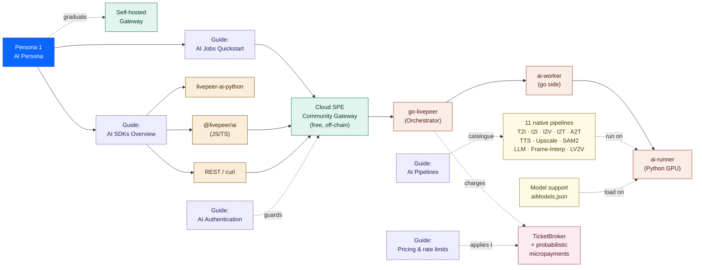
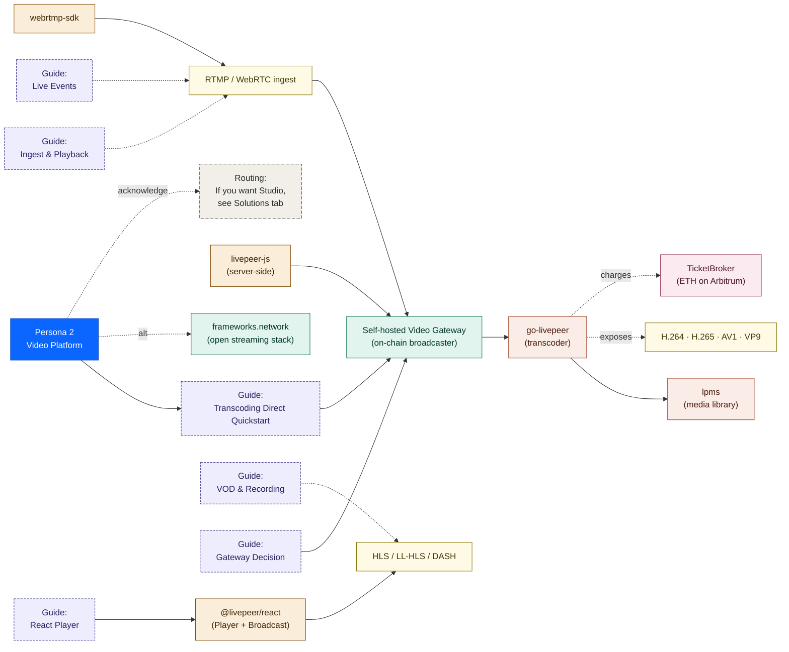
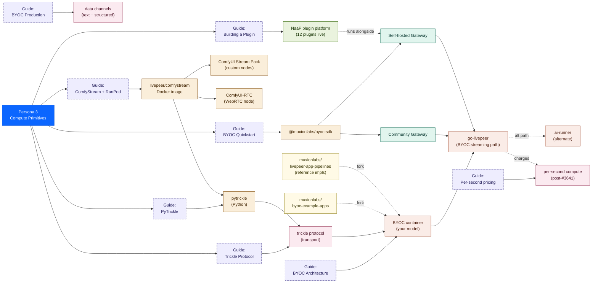
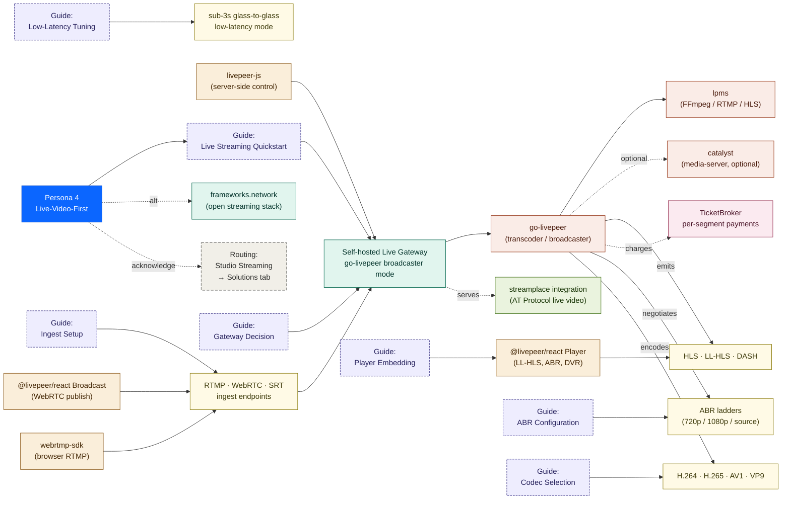
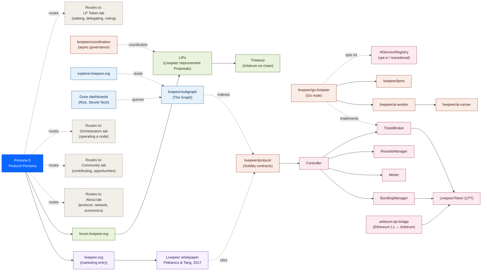

# Personas
# Persona infrastructure maps — Livepeer Developers tab

**Project:** Livepeer docs-v2
**Branch:** `docs-v2-dev`
**Purpose:** Map all available infrastructure and the guides needed for each of the five developer personas.

Five maps. Each shows what the persona touches (infra) and what docs they need to walk the path (guides).

## Colour convention (consistent across all five)

| Class | Meaning |
|-------|---------|
| `persona` | The persona node itself |
| `gw` | Gateways (community, self-hosted, alternative) |
| `sdk` | SDKs and client libraries |
| `trans` | Transport layer (ingest, playback, trickle, data channels) |
| `ref` | Reference material (pipeline lists, model files, codec lists) |
| `proto` | Protocol-layer code (go-livepeer, ai-runner, lpms) |
| `chain` | On-chain components (TicketBroker, contracts, payments) |
| `plugin` | Plugin platform (NaaP) |
| `ecosystem` | Ecosystem integrations (streamplace, frameworks) |
| `entry` | Entry points (livepeer.org, whitepaper, forum) |
| `repo` | Source repositories |
| `contract` | Specific Solidity contracts |
| `observ` | Observability (Explorer, Subgraph, Dune) |
| `gov` | Governance surfaces (LIPs, Treasury, forum) |
| `guide` | Documentation pages (lavender, dashed) |
| `routing` | Cross-tab routing (gray, dashed) |

---

## Persona 1 — AI Persona ("OpenAI for video AI")

Looking for an inference API. Endpoint, key, models, schema, SDK, pricing.
Activation: first successful API call.

---

## Persona 2 — Video Platform Persona ("Mux with AI bolted on")

Looking for ingest endpoints, transcoding presets, embeddable player, VOD, webhooks, recording.
Activation: first stream goes live with playback URL working.

Boundary: this persona arrives expecting Studio-shaped infra. The Developers-tab Build path does NOT use Studio. Direct-network options: self-hosted gateway with on-chain video transcoding, or Frameworks (open streaming stack). Studio acknowledged via routing only.

---

## Persona 3 — Compute Primitives Persona ("Modal/RunPod, but cheaper")

Looking for container runtime, GPU declarations, BYOC, per-GPU-second pricing, real-time vs batch.
Activation: first BYOC container running on the network with a request flowing through.

This persona has the densest infra map — they touch every modular surface: BYOC, ComfyStream, PyTrickle, trickle protocol, Stream Pack, NaaP plugins.

---

## Persona 4 — Live-Video-First Persona ("real-time streaming backend")

Looking for ingest endpoints, ABR ladders, HLS/LL-HLS/DASH playback, codec choices, low-latency tuning, player SDK. Less concerned with VOD, webhooks, or recording — that's Persona 2's territory. Building Twitch-shaped live experiences, sports streaming, real-time events, gaming streams.

Activation: first live stream up with sub-second-to-three-second glass-to-glass latency and a working playback URL.

Boundary: build path uses a self-hosted live gateway or `frameworks.network`. Studio Streaming is acknowledged via routing only.

---

## Persona 5 — Protocol Persona ("crypto network contributor")

Looking for architecture, LPT economics, contracts, payment flow, governance, node operator and delegator paths. Not building an app — extending or operating the network itself.

Activation: first merged PR to a Livepeer repo, first orchestrator node activated, first treasury proposal submitted, or first delegation made.

Boundary: this persona's content lives in the **About** and **Community** tabs, not in Developers. The Developers tab acknowledges them via routing pages and points out. They're shown here to make the boundary explicit — what Developers *doesn't* document — and to confirm no Developers infra is missing because of it.

---

## Cross-persona observations

**Persona 5 confirms the Developers-tab IA is correct as scoped.** Almost nothing in this map should live in Developers. Whitepaper, contracts, observability stack, and governance forum belong in About + Community + Orchestrators + LP Token. The Developers tab's `routing/protocol-extenders.mdx` is the only Developers-side touchpoint — and that page exists to send Persona 5 *out* of the tab.

**Personas 2 and 4 share enough infra that the Build section should NOT have duplicate pages.** Both touch self-hosted gateway, ingest endpoints, playback, codecs, lpms, TicketBroker. The distinction is intent (full Mux replacement vs. live-streaming engineer) and what they don't care about (Persona 4 skips VOD, recording, webhooks). Answer: `build/video/` covers both. Persona 2 reads VOD/recording pages, Persona 4 reads live/ABR/low-latency pages, `gateway-decision.mdx` is shared.

**Persona 3 is the densest map** because the modular pathway is genuinely the most surface-rich part of the developer story. Compute, transport, payments, plugins, gateways-as-developer all converge on this persona. The Build IA's job-shaped subgroups (compute, transport, payments, plugins-and-extensions, gateways-as-developer) are the direct answer to that density.

**Persona 1's path graduates to Persona 3.** A reader who arrives wanting OpenAI-shaped inference and stays often wants per-GPU-second pricing or BYOC eventually. The Developers IA should make that graduation visible — `gateway-decision.mdx` and `byoc/overview.mdx` both serve as graduation hand-offs.
