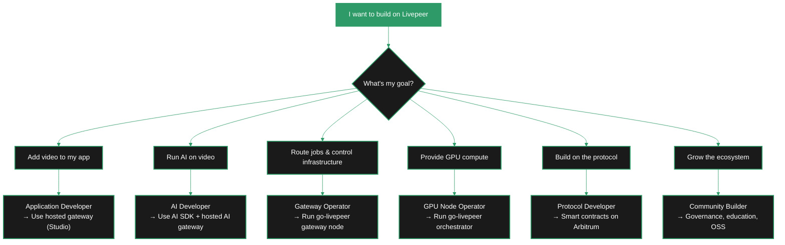

import { PreviewCallout } from '/snippets/components/domain/SHARED/previewCallouts.jsx'

<PreviewCallout />

Livepeer serves several distinct types of builders. The fastest path to your first success depends on what you're trying to build. Use this guide to find your lane.

---

## What do you want to build?

<Tabs>
  <Tab title="I want to add video to my app">
    **You are:** An application developer adding live streaming or video-on-demand to a product.

    **Your path:** Use a hosted gateway service. You do not need to run infrastructure.

    **Start here:**

    <CardGroup cols={2}>
      <Card title="Video Streaming Quickstart" icon="tower-broadcast" href="/v2/developers/quickstart/video/video-streaming" arrow>
        Create a livestream, get a stream key, and play back with the Livepeer Player in minutes.
      </Card>
      <Card title="Livepeer Studio" icon="video-arrow-up-right" href="/v2/platforms/livepeer-studio/overview" arrow>
        Hosted video gateway — REST API, SDKs, dashboard. Best for production video applications.
      </Card>
    </CardGroup>

    **What you'll use:** `livepeer` npm package, `@livepeer/react` Player and Broadcast components, RTMP ingest, HLS playback, Livepeer Studio dashboard.
  </Tab>

  <Tab title="I want to run AI on video">
    **You are:** A developer building AI-powered video experiences — style transfer, generative video, real-time effects, transcription, or custom AI pipelines.

    **Your path:** Use a hosted AI gateway (Studio, Daydream, or Cloud SPE) to start. If you need custom models or pipelines, consider BYOC or running your own gateway.

    **Start here:**

    <CardGroup cols={2}>
      <Card title="AI Inference Quickstart" icon="robot" href="/v2/developers/quickstart/ai/ai-pipelines" arrow>
        Run text-to-image and other AI pipelines in minutes using the Livepeer AI SDK.
      </Card>
      <Card title="AI Pipelines Overview" icon="circuit-board" href="/v2/developers/ai-pipelines/overview" arrow>
        Understand how Livepeer AI pipelines work, including ComfyStream and BYOC.
      </Card>
      <Card title="Daydream" icon="wand-magic-sparkles" href="/v2/platforms/daydream/overview" arrow>
        Real-time AI video — StreamDiffusion, style transfer, world models.
      </Card>
      <Card title="Available AI Pipelines" icon="list" href="/v2/gateways/references/api-reference/AI-API/text-to-image" arrow>
        Browse all available AI pipelines and their API reference.
      </Card>
    </CardGroup>

    **What you'll use:** `@livepeer/ai` SDK, `httpBearer` auth, gateway AI endpoints, and optionally ComfyStream for custom workflows.
  </Tab>

  <Tab title="I want to run a gateway">
    **You are:** Building a product or platform that routes Livepeer jobs as core infrastructure, or you need custom SLA and routing control.

    **Your path:** Run your own go-livepeer gateway node. This is the path taken by Livepeer Studio, Daydream, and Cloud SPE themselves.

    **Start here:**

    <CardGroup cols={2}>
      <Card title="Gateway Operator Opportunities" icon="briefcase" href="/v2/gateways/run-a-gateway/gateway-operator-opportunities" arrow>
        The business case for running your own gateway node.
      </Card>
      <Card title="Gateway Quickstart" icon="bolt-lightning" href="/v2/gateways/quickstart/gateway-setup" arrow>
        Get a gateway running in under 10 minutes.
      </Card>
      <Card title="Why Run a Gateway" icon="lightbulb" href="/v2/gateways/run-a-gateway/why-run-a-gateway" arrow>
        Technical and product reasons to operate your own node.
      </Card>
      <Card title="Gateway Requirements" icon="clipboard-check" href="/v2/gateways/run-a-gateway/requirements/setup" arrow>
        Hardware, OS, and network requirements.
      </Card>
    </CardGroup>

    **What you'll use:** go-livepeer, Docker or Linux binary, Arbitrum RPC, ETH wallet for on-chain mode.
  </Tab>

  <Tab title="I want to contribute GPU compute">
    **You are:** A GPU operator wanting to earn ETH fees and LPT rewards by running transcoding and AI inference for the Livepeer network.

    **Your path:** Set up a go-livepeer orchestrator node with GPU support.

    **Start here:**

    <CardGroup cols={2}>
      <Card title="Orchestrator Portal" icon="microchip" href="/v2/orchestrators/orchestrators-portal" arrow>
        Everything you need to set up and run an orchestrator node.
      </Card>
      <Card title="Orchestrator Setup" icon="server" href="/v2/orchestrators/setting-up-an-orchestrator/overview" arrow>
        Step-by-step orchestrator setup guide.
      </Card>
    </CardGroup>

    **What you'll use:** go-livepeer orchestrator mode, NVIDIA GPU with CUDA, Linux, Arbitrum wallet.
  </Tab>

  <Tab title="I want to extend the protocol">
    **You are:** A developer building on top of Livepeer's smart contracts — staking derivatives, custom governance tools, analytics infrastructure, or other protocol-level integrations.

    **Your path:** Start with the protocol documentation and contract addresses.

    <CardGroup cols={2}>
      <Card title="Protocol Overview" icon="scroll" href="/v2/about/livepeer-protocol/overview" arrow>
        How the Livepeer protocol works: staking, rewards, governance.
      </Card>
      <Card title="Contract Addresses" icon="file-contract" href="/v2/resources/references/contract-addresses" arrow>
        Livepeer smart contract addresses on Arbitrum One.
      </Card>
      <Card title="Protocol Economics" icon="chart-line" href="/v2/about/livepeer-protocol/economics" arrow>
        Token economics, inflation, and fee flows.
      </Card>
      <Card title="Technical Architecture" icon="sitemap" href="/v2/about/livepeer-network/technical-architecture" arrow>
        Full network architecture and component overview.
      </Card>
    </CardGroup>
  </Tab>
</Tabs>

---

## Builder Personas Map

If you're still not sure where you fit, here's the full map:

---

## Zero-to-Hero Progression

Each builder path has a clear progression from first action to ecosystem contribution:

| Stage | Application Dev | Gateway Operator | GPU Operator | AI Developer |
|---|---|---|---|---|
| **Start** | API key + first stream | Read requirements | Check GPU compat. | API key + first inference |
| **First Win** | Stream playing in app | Gateway running locally | Orchestrator registered | First AI result returned |
| **Production** | Live app with users | On-chain gateway routing jobs | Earning ETH + LPT | AI pipeline in product |
| **Hero** | Build tools for other devs | Run multi-region gateway product | Top-tier orchestrator | Ship novel AI pipeline |

---

## Not sure yet? Browse by use case

<CardGroup cols={3}>
  <Card title="Live Streaming" icon="tower-broadcast" href="/v2/developers/livepeer-real-time-video/video-streaming-on-livepeer/README" arrow>
    RTMP, WebRTC, HLS, OBS
  </Card>
  <Card title="Video on Demand" icon="video" href="/v2/platforms/livepeer-studio/video-on-demand/overview" arrow>
    Upload, transcode, play back
  </Card>
  <Card title="AI Image Generation" icon="image" href="/v2/gateways/references/api-reference/AI-API/text-to-image" arrow>
    Text-to-image, image-to-image
  </Card>
  <Card title="Real-Time AI Video" icon="wand-magic-sparkles" href="/v2/platforms/daydream/overview" arrow>
    Style transfer, StreamDiffusion
  </Card>
  <Card title="Custom AI Pipelines" icon="circuit-board" href="/v2/developers/ai-pipelines/overview" arrow>
    BYOC, ComfyStream, ComfyUI
  </Card>
  <Card title="Staking & Governance" icon="coins" href="/v2/lpt/delegation/overview" arrow>
    Delegate LPT, earn rewards
  </Card>
</CardGroup>
