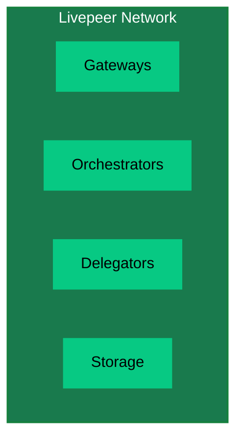
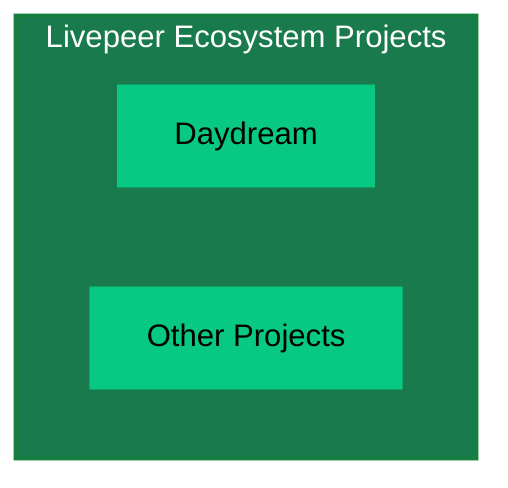
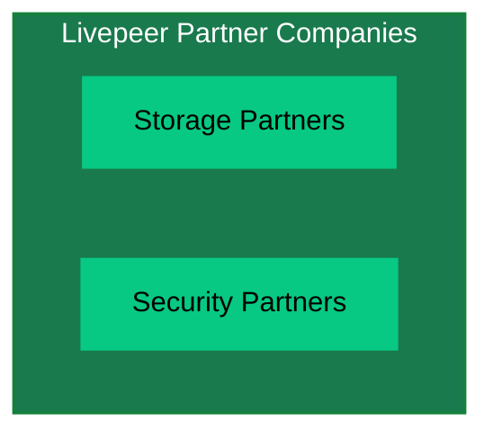
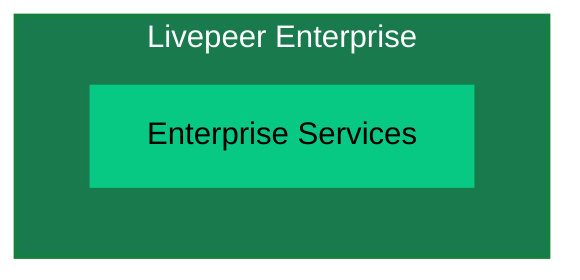

import { LinkArrow } from '/snippets/components/primitives/links.jsx'
import { FrameQuote } from '/snippets/components/content/quote.jsx'
import { CustomDivider } from '/snippets/components/primitives/divider.jsx'
import { QuadGrid } from '/snippets/components/layout/quadGrid.jsx'

{/* NEEDS A CTA HERE */}
{/* The Livepeer ecosystem and how it works */}

<CustomDivider margin="0" />

<div id="livepeer-values">
## Livepeer 价值观
</div>

Livepeer 一直由一组核心价值观驱动，这些价值观指导着其开发、运营和社区互动。

- **创新**：拥抱新思想和新技术，保持领先地位。
- **协作**：与社区共同构建，促进开放对话和共享所有权。
- **可及性**：让前沿的视频和 AI 工具对所有人开放，无论技术背景如何。
- **社区**：与社区共同构建，促进开放对话和共享所有权。

基于这一理念，Livepeer 不仅致力于开放、可及的架构，还致力于一种*贡献型组织结构*，为合适的人提供合适的激励，专注于正确的事情。

<div id="entities">
## 实体
</div>

Livepeer 的项目结构已经发展为在一个专注的核心团队与不断增长的社区治理模式之间取得平衡。
多个实体在 Livepeer 的生态系统中发挥着不同的角色：
{/* - Livepeer Inc.
- Livepeer Foundation
- Livepeer [DAO](https://en.wikipedia.org/wiki/Decentralized_autonomous_organization) (Decentralised Autonomous Organisation) (community governance)
- Special Purpose Entities (SPEs) */}

<QuadGrid icon="arrows-spin" iconSize={50}>
  <Card
    title="Livepeer Inc."
    icon="clapperboard-play"
    href="#livepeer-inc"
    arrow
  >
 Livepeer Inc is the original company behind the Livepeer protocol. Livepeer Inc built the core network infrastructure and continues to drive product development and demand generation.
  </Card>
  <Card
    title="Livepeer Foundation"
    icon="handshake-angle"
    href="#livepeer-foundation"
    arrow
  >
 The Livepeer Foundation is a non-profit organisation that stewards the long-term vision, ecosystem growth, and core development of the Livepeer network.
  </Card>
  <Card
    title="Livepeer DAO"
    icon="chart-network"
    href="#livepeer-dao"
    arrow
  >
 The Livepeer DAO is an unofficial term for the collective of LP tokenholders who decide on the direction of the network via on-chain proposals and an on-chain treasury.
  </Card>
  <Card
    title="Special Purpose Entities (SPEs)"
    icon="shapes"
    href="#special-purpose-entities-spes"
    arrow
  >
 Special Purpose Entities (SPEs) are mission-driven engineering or operational teams funded by the Livepeer ecosystem to deliver the DAO's accepted proposals.

  </Card>
</QuadGrid>

本节描述了每个实体及其相互关系，包括 Livepeer Studio 和 Daydream 等关键产品的所有权、
战略重点，以及团队成员对其协作的见解。

### Livepeer Inc.
Livepeer Inc 是 Livepeer 协议背后的原始创始公司。Livepeer Inc 构建了核心网络基础设施，并持续推动产品开发。

Livepeer Inc 当前的重点是在实时 AI 视频时代实现 Livepeer 网络的产品市场契合度 (PMF)。

<Accordion title="See more about Livepeer Inc.'s strategic focus" icon="camera-retro" >
 **Strategic Focus:**
  - Livepeer Inc is laser-focused on demand generation and utility for the network, particularly in the AI video domain. Doug Petkanics (CEO) outlined that Inc's core thesis is proving that builders will use Livepeer for AI-powered video applications because it's the best option.
  <FrameQuote source="-Doug Petkanics" frame={false} align="left">
 "The team is focused, funded, and running hard at the next major milestone: unlocking product-market fit… as the leading infrastructure for realtime AI video."
  </FrameQuote>

 **Role in Ecosystem:**
  - Livepeer Inc acts as a pioneer and catalyst. By running a focused product strategy, Inc provides "proof of utility" for the network.
  - Livepeer Inc. focuses on developing cutting-edge video products and core software to drive growth.

  <FrameQuote
    source="- Livepeer Inc. team"
    frame={false}
    align="left"
  >
 "Livepeer Inc's work is critical… by building products that generate direct demand for the network, Inc provides proof of utility, inspiration, and compounding network effects (more demand → more usage → more infrastructure → more contributors)"
  </FrameQuote>

 **Products:**
  - [Livepeer Studio](https://livepeer.studio) (commercial API platform for developers)
  - [Daydream](https://daydream.live) (real-time generative AI video app)
</Accordion>

### Livepeer Foundation
{/* The Livepeer Foundation is a non-profit organisation that stewards the long-term vision, ecosystem growth, and core development of the Livepeer network.
It is owned and governed by its members, who have the ability to vote on proposals and make decisions about the direction of the organisation. */}
<span>
 于 2025 年中期启动，{" "}
  <LinkArrow
    label="Livepeer Foundation (LF)"
    href="https://blog.livepeer.org/introducing-the-livepeer-foundation/"
    target="_blank"
    newline={false}
    />
 {" "} 是一个非营利实体，旨在"引领网络的长期愿景、生态系统增长和核心开发"，与 Livepeer Inc 的工作相辅相成。
</span>
<br/>
<br/>
{/* The Foundation represents a major step in Livepeer's progressive decentralization. */}
{/* > "The Foundation represents a major step in Livepeer's progressive decentralization, enabling broader participation and parallel progress to Livepeer Inc. By supporting and coordinating community-led projects, Livepeer's accelerates its growth." */}
<FrameQuote
  author="Rich O'Grady"
  source="Launching the Livepeer Foundation"
  href="https://forum.livepeer.org/t/launching-the-livepeer-foundation/2849"
  align="center"
  borderColor="var(--accent)"
>
 "The LF's role is to ensure that, over time, the Livepeer project builds a thriving ecosystem of founders, applications and gateways, and a highly-performant, secure network, truly accountable and governed by token holders." <br/>
</FrameQuote>
<br/>
 Livepeer Foundation 是 Livepeer 生态系统中的战略协调者，在以下领域做出决策：
  - 为 Livepeer 定义战略目标
  - 设计推动或引导进展朝目标方向的倡议
  - 利用可用资源，招募和协调任务团队以执行倡议
{/* <Icon icon="microphone" /> [Rich O'Grady](https://twitter.com/richogrady) - Livepeer Foundation Lead */}
{/* It does this through Advisory Boards are a mechanism to provide a clear pathway for ecosystem stakeholders to participate in strategy setting. They will try to ensure that the whole community has near-complete symmetry of information as it relates to opportunities within the ecosystem. */}
<br/>

<Accordion title="See more about the Livepeer Foundation's Stewardship role" icon="camera-retro" >
 **Leadership & Stewardship:**
  - The Livepeer Foundation - led by [Rich O'Grady](https://linkedin.com/in/rich-ogrady-3400042/), is owned and governed by its members, who have the ability to vote on proposals and make decisions about the direction of the organisation.
  - Strategy is shaped through multi-stakeholder Advisory Boards (network operators, builders, community members, Inc., and domain experts) across Protocol, Network, Governance, and Markets/Demand.
  - The Foundation synthesizes this input into a long-term [roadmap](https://roadmap.livepeer.org/roadmap), budget, and defined workstreams, which are proposed to the community for approval.
  - Livepeer stakeholders (tokenholders, node operators, developers, and community members) vote on budgets, programs, and the Foundation's board.
  - The Foundation then coordinates and executes on the approved strategy and workstreams with transparent, regular reporting back to its members.

  <div style={{ justifySelf: "center", width: "80%", alignContent: "center" }}>
    <Tip>
 You can join in the conversation on the
 {" "}<Icon icon="comment-pen" /> **[Livepeer Forum](https://forum.livepeer.org/c/foundation/14)**
 or weekly
 {" "}<Icon icon="tv-retro" /> **[Watercooler Chats](https://discord.com/events/423160867534929930/1394387788568203274)**
    </Tip>
  </div>

 **[Advisory Boards:](https://forum.livepeer.org/t/growth-advisory-board-candidacy/2877/14)**
  - Advisory Boards are small, domain-specific groups consisting of Livepeer core contributors, representing different parts of the Livepeer ecosystem.
  - Advisory Boards are formed every 6 months to build and update a coherent roadmap for the Livepeer project in conjunction with the broader community.
  - Advisory Boards do not make capital allocation decisions themselves. Token Holders still have to vote on each SPE when the team has been formed and the [proposal has been submitted onchain](https://explorer.livepeer.org/treasury).

 **Advisory Board Focus Areas:** <br/>
 Advisory Boards are focused on four key areas of the Livepeer project:
  - Protocol
  - Network
  - Governance
  - Demand & Markets

 **Workstreams:**
  - [Workstreams](https://forum.livepeer.org/t/introducing-workstreams-a-new-era-of-execution-for-the-livepeer-project/3030) are the day-to-day activities that the Foundation is responsible for.
  - The Foundation has a number of workstreams that are currently being executed, including:
    - Onboarding
    - Growth
    - Developer Experience
    - Treasury
    - Operations

 **Role in Ecosystem:**
  - The Foundation is responsible for the long-term health and decentralization of the Livepeer network.
  - The Foundation communitcates closely with the [Livepeer DAO](#livepeer-dao) for its initiatives to ensure it has its members' trust and support.
  - Funds and coordinates the work of [Special Purpose Entities](#special-purpose-entities) (SPEs) - focused teams delivering long-term infrastructure, open-source software, and public goods.
  - The Foundation is a critical partner in driving the long-term success of the Livepeer network.

 **Further Reading**

  <span>
 <Icon icon="github" />{" "}
    <LinkArrow
      label="Livepeer Foundation Role"
      href="https://github.com/shtukaresearch/livepeer-data-geography/blob/651a56e8/roles/foundation.md#L1-L14"
      target="_blank"
      newline={false}
    />
 {" "}_- Andrew Macpherson Research Report_
  </span>
</Accordion>

### Livepeer DAO
虽然没有正式称为 Livepeer DAO，但 Livepeer 协议由 Livpeer (LP) 代币持有者的集体治理，他们通过[链上提案](https://explorer.livepeer.org/voting)和[链上金库](https://explorer.livepeer.org/treasury)来决定网络的方向。

正如 Livepeer Foundation 负责人 Rich O'Grady 所解释的：
<FrameQuote
  source="Launching the Livepeer Foundation"
  href="https://forum.livepeer.org/t/launching-the-livepeer-foundation/2849"
  align="left"
>
 "The Livepeer community is the DAO. The Foundation is a critical partner in driving the long-term success of the Livepeer network, but it is the community that holds the final say in all matters via on-chain governance." <br/>
</FrameQuote>

DAO 成员是协议升级、网络增长提案和金库分配的最终集体决策者。

任何持有（并已委托）Livepeer 代币 (LPT) 的人都是 Livepeer DAO 的成员，可以参与投票和治理。


<Note> Even if you are not a tokenholder (or do not have a non-zero delegated stake), you can still participate in the Livepeer ecosystem by joining the community and influencing the direction of the network indirectly through [discussions](https://forum.livepeer.org/t/about-the-governance-category/1059) and collaboration. </Note>

<br/>
<Accordion title="See more about the Livepeer DAO" icon="camera-retro" >
 **Role in Ecosystem**
  - The Livepeer DAO members are the ultimate decision-makers on all matters related to funding, protocol changes and ultimate product direction of the Livepeer network.
  - While Livepeer Inc. and the Livepeer Foundation may self-fund their own projects, all protocol and network changes require approval by the DAO.
  - The DAO votes on whether to fund Foundation Roadmap items, SPEs, Request for Proposals [(RFPs)](https://en.wikipedia.org/wiki/Request_for_proposal), and protocol upgrades in Livepeer Improvement Proposals [(LIPs)](https://github.com/livepeer/LIPs).

 **On-Chain Treasury**
 {/* Formed in 2022, the on-chain treasury is issued with 10% of Livepeer block rewards to fund the long-term growth and sustainability of the network. */}
    - In 2022, Livepeer launched the [On-Chain Treasury](/v2/zh/lpt/treasury/overview) to fund the long-term growth and sustainability of the network.
    - This treasury accumulates a portion of protocol fees (often called block rewards on other chains and also known as 'inflation' within Livepeer).
    - Livepeer tokenholders (the DAO members) vote on how to allocate these funds via on-chain proposals.
 {/* The treasury has become a significant source of funding for Special Purpose Entities (SPEs) and other needed initiatives in the Livepeer ecosystem. */}

 **Governance**

  - The Livepeer community uses a [standardised governance framework](https://forum.livepeer.org/t/livepeer-governance-workstreams-govworks-whitepaper/3720) to ensure that all on-chain decisions are well-informed, transparent, and executed well.
  - Decisions are made by tokenholders via [on-chain proposals](https://explorer.livepeer.org/voting)
  - Any tokenholder can participate in governance by delegating their tokens to a delegator or running a delegate node themselves (see <LinkArrow label="Delegating LPT" href="/v2/zh/lpt/delegation/overview" target="_blank" newline={false} />).

 **DAO Members**

 Livepeer DAO members include:
    - Orchestrators who have LPT staked as collateral on the Livepeer network
    - Delegators who have staked their LPT to an orchestrator (with votes generally following the orchestrator's vote)
    - Developers & Other Node operators (gateways)
    - Community members holding LPT (even if not delegating or actively participating as an actor in the network)
    - Other Tokenholders such as those that may also be part of Livepeer Inc., the Livepeer Foundation, SPEs or other Ecosystem projects.

 **Notable Decisions**
    - Approval of the [Confluence upgrade](https://medium.com/livepeer-blog/the-confluence-upgrade-is-live-3b6b342ea71e) (migrating to Arbitrum) via [LIP-73](https://github.com/livepeer/LIPs/blob/main/LIPs/LIP-0073.md)
    - Funding of the [AI Video SPE](https://forum.livepeer.org/t/ai-video-spe-stage-3-pre-proposal/2693) (multiple stages funded by votes),
    - Grants to applications like [Lenstube](https://lenstube.com/) and [Dlive](https://dlive.tv/)
    -  The **Livepeer DAO was a driving factor in establishing the Foundation and advisory boards**, with members pushing for more strategic use of the treasury in 2024 and 2025.

      <FrameQuote
        author= "Rich O'Grady"
        source="Launching the Livepeer Foundation"
        href="https://forum.livepeer.org/t/launching-the-livepeer-foundation/2849"
        align="left"
      >
 "Token holders want to see the onchain treasury deployed more strategically to drive more utility and earning potential from the token"
      </FrameQuote>

</Accordion>

{/* It is responsible for making decisions about the direction of the protocol, including funding for development, infrastructure, and ecosystem growth. */}


### Special Purpose Entities (SPEs)

特殊目的实体 (SPEs) 是使命驱动的、由社区资助的团队，旨在为 Livepeer 网络执行特定项目。它们允许在特定需求上实现更快速、更专注的进展，由链上金库资助，并向代币持有者负责。

<FrameQuote
    source="Livepeer Blog"
    href="https://blog.livepeer.org/special-purpose-entities-a-new-model-for-livepeer-ecosystem-growth/"
    >
 "SPEs are typically mission-driven groups that operate independently to build infrastructure, applications, or tooling that expand and improve the Livepeer protocol. These teams are funded through proposals to the onchain treasury and are accountable to the community."
</FrameQuote>

这些团队为生态系统需求提供敏捷、响应迅速、负责任且专注的进展。
它们使 Livepeer 能够快速创新并迅速把握机遇。


{/* <iframe width="70%" height="auto" style={{margin: "0 -1rem"}} frameBorder="0" src="https://imgflip.com/embed/aidjmm"></iframe> */}
<iframe width="70%" height="auto" style={{border: "3px solid var(--accent)", borderRadius: "8px"}} frameBorder="0" src="https://imgflip.com/embed/aidl1c" title="Embedded content from imgflip.com"></iframe>


  <Accordion title="See more about SPEs" icon="shapes">


 **_Role in Ecosystem_**

    - SPEs execute on strategic initiatives voted on by the Livepeer DAO.
    - They are accountable to the community and must align with the long-term vision of the Livepeer network.
    - These teams provide agile, responsive, and accountable progress on ecosystem needs and allow Livepeer to _innovate fast_ and move quickly on opportunities.


 **_SPE Model_**
    - Funded by the Livepeer on-chain treasury via community votes
    - Accountable to the community and must align with the long-term vision of the Livepeer network
    - Provide agile, responsive, and accountable progress on ecosystem needs


 **_Governance_**
    - SPEs are formed by a [RFP](https://en.wikipedia.org/wiki/Request_for_proposal) process and have a [DAO](#livepeer-dao)-mandated budget.
    - The Livpeer Foundation coordinates and oversees the operational and technical execution of the SPEs.
    - The SPEs report to the DAO via the [Livepeer Forum](https://forum.livepeer.org/c/special-purpose-entities/15) and [ProductLane](https://productlane.com/livepeer).

<br/>
 **_SPE Focus Areas_**

    <Columns cols={2}>
    <div>
 SPEs may focus on:
    - Long-term infrastructure
    - Protocol development
    - Network-level capabilities
    - Ecosystem growth and adoption
    - Operational Leadership
    </div>
    <div>
    - Research and Development
    - Product Management
    - Education and Outreach
    - Advocacy and Policy
    - Community Management
    - Public Goods
    </div>
    </Columns>
 _... And any other area as identified by the Livepeer ecosystem, its strategic goals and opportunities._


 **_Notable SPEs_**

    - [AI Video SPE](https://livepeer-ai.productlane.com/changelog) - one of the first and most important SPEs
       - Strategic Focus: Build out AI-first video infrastructure. The AI SPE is crucial for Livepeer's goal to be _"the leading infrastructure for realtime AI video."_
       - Status: Active <Icon icon="circle-arrow-up-right" iconType="solid" size={18} color="var(--accent)" />
       - Impact:
          - Helped Livepeer pivot from solely transcoding into broader compute.
          - By Stage 2, the SPE reported successfully running new AI use cases on testnet, and
          - By Stage 3, built BYOC and comfystream to scale this work.

    - [Livepeer Cloud SPE](https://livepeer-cloud.productlane.com/changelog):
       - Strategic Focus: Build out cloud-native video infrastructure & address the issues of _"over-reliance on a few demand sources."_
       - Status: Active <Icon icon="circle-arrow-up-right" iconType="solid" size={18} color="var(--accent)" />
       - Impact: The Livepeer Cloud SPE built the [Community Gateway](https://livepeer.com/gateway) and also builds tooling and analytics for orchestrators.

    - [Streamplace SPE](https://livepeer-streamplace.productlane.com/changelog):
       - Strategic Focus: Build a public goods video layer for social networks and Web3 apps.
       - Status: Active <Icon icon="circle-arrow-up-right" iconType="solid" size={18} color="var(--accent)" />
       - Impact: The Streamplace SPE is building a video layer for social networks and Web3 apps.

  </Accordion>

{/* Move to governance section: ## Livepeer Protocol [LIPs]
The Livepeer Improvement Proposals (LIPs) document and propose changes to the Livepeer protocol. They are submitted by community members and voted on by the Livepeer community. */}

{/* This governance framework, often called a [DAO](https://en.wikipedia.org/wiki/Decentralized_autonomous_organization) (Decentralised Autonomous Organisation) in the web3 space, enables stakeholders to tangibly participate in the direction and future of Livepeer. */}

{/* It includes governance decisions on the direction of the protocol as well as funding mechanisms for founders & contributors (via the <LinkArrow label="Onchain Treasury" href="https://explorer.livepeer.org/treasury" target="_blank" newline={false} />) that will benefit the Livepeer Network and its users.onchain treasury) that will benefit the Livepeer Network and its users. */}


{/* ### Overview

This page serves as a guide to understanding Livepeer's Organisational Structure & Plans

- Livepeer Inc.
  - Core Teams & Function
- Livepeer Foundation
  - Core Teams & Function
- Livepeer Network
  - gateways, orchestrators, delegators
- Livepeer Ecosystem Projects
  - use livepeer: daydream etc.
- Livepeer Partner Companies
  - Do more with Livepeer with our partners -> storage, security etc.
- Livepeer Enterprise

<br /> */}

{/* ### Livepeer Ecosystem

<Note> Mermaid Embedded Fowchart Example Only </Note>
```mermaid flowchart TB A[Livepeer Inc.]:::main --> B[Livepeer Foundation]:::main
A --> C[Livepeer Network]:::main A --> D[Livepeer Ecosystem Projects]:::main A -->
E[Livepeer Partner Companies]:::main A --> F[Livepeer Enterprise]:::main

classDef main fill:#197a4d,stroke:#15803D,stroke-width:2px,color:#fff

````

### Livepeer Inc.

```mermaid
flowchart TD
  subgraph Inc["Livepeer Inc."]
    B1[AI SPE]
    B2[Cloud SPE]
  end
  style Inc fill:#197a4d,stroke:#15803D,stroke-width:2px,color:#fff
  style B1 fill:#07C983,stroke:#197a4d,color:#000
  style B2 fill:#07C983,stroke:#197a4d,color:#000
````

### Livepeer Foundation

```mermaid
flowchart TD
  subgraph Foundation["Livepeer Foundation"]
    C1[Strategic Objectives]
    C2[Initiatives]
    C3[Task Forces]
    C4[Operations]
  end
  style Foundation fill:#197a4d,stroke:#15803D,stroke-width:2px,color:#fff
  style C1 fill:#07C983,stroke:#197a4d,color:#000
  style C2 fill:#07C983,stroke:#197a4d,color:#000
  style C3 fill:#07C983,stroke:#197a4d,color:#000
  style C4 fill:#07C983,stroke:#197a4d,color:#000
```

### Livepeer Network



### Livepeer Ecosystem Projects



### Livepeer Partner Companies



### Livepeer Enterprise



### Livepeer Inc.

- AI SPE
- Cloud SPE

### Livepeer Foundation

The [Livepeer Foundation](https://forum.livepeer.org/t/launching-the-livepeer-foundation/2849) was launched in April 2025 with the mission:

> \[...] to steward the long-term vision, ecosystem growth, and core development of the network.

Broadly speaking, the Livepeer Foundation makes decisions in the following areas:

1. Define strategic objectives for Livepeer
2. Design initiatives to accelerate or steer progress towards objectives
3. Drawing on available resources, recruit and coordinate task forces to execute on initiatives
4. Foundation operations

### Livepeer Network

-
- Storage
-

<br />
### Livepeer Ecosystem Projects

<br />

### Livepeer Partner Companies

<br />

### Decentralising Livepeer

<br />

# Livepeer Ecosystem

<Note> Set up a github for self-registering as an ecosystem project </Note> */}
